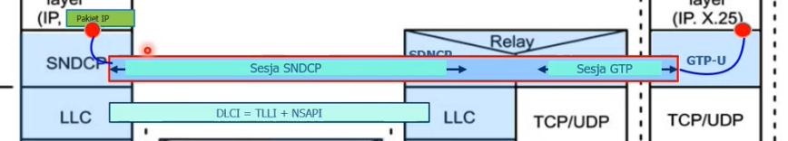
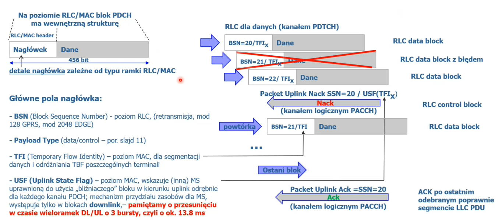
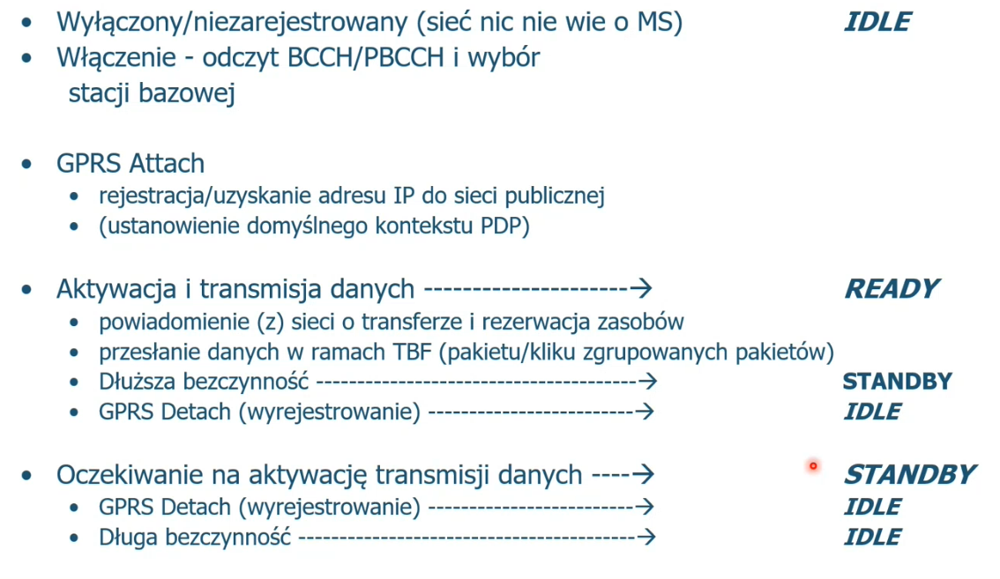
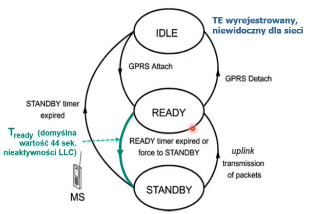

# GPRS

Zakres:

- Wstęp - motywacje i ogólna arch.
- Interfejs radiowy - struktura, procedury
- Zarządzanie zasobami radiowymi - warstwa RLC/MAC
- Obsługa mobilności GPRS
- Core Network - arch. szczegółowa
- Architektura protokołów GPRS
- EDGE (Symbolicznie)

## Wstęp

### Motywacje

W GSM dodano potem usługi pakietowe, ale było to słabe, więc postanowiono dostosować sieć do pakietówki.

Motywacje to poprawić to co było bardzo słabe w GSM:

 - przepływności i responsywność sieci (jak się coś rozłączyło, to znowu trzeba było się podłączać itd.)

Jednocześnie chciano uelastycznić system taryfikacji, bo płaciło się za połączenie rozmówne (jak przesłałem tylko 5 pakietów na krzyż, a trwało to godzinę, to płaciłem za godzinę). W pakietówce warto, żeby płacić za pakiet.

Uodpornienie na przerwy - ściągam coś ze strony webowej, czytam analizuje i dopiero klikam następny link, więc ten ruch jest taki przerywany (na to odporna jest pakietówka).

Skrócenie czasu zestawiania połączenia.

Sieć pakietowa charakteryzuje się tym, że mamy rwany charakter ruchu. Nie ciągłe wysyłanie pakietów non-stop. Tylko większe porcje w jakiś odstępach czasu. 

Dzięki pakietom jest też taki benefit, że zarządza się zasobami w krótkich skalach czasu wyznaczanych przez transfery pakietów. Sesyjki rezerwacji zasobów są krótkie (takie mikro xd)*. W kontraście do GSM, gdzie zasoby były zestawiane na rozmowę trwającą długo bardzo. Podejście pakietowe pozwala lepiej zarządzać zasobami. 

Np. taka rezerwacja może się rozciągać na 3 sekundy, potem jest przerwa w pakietach i koniec - terminal traci rezerwacje zasobów. Jak przychodzi od niego kolejna taka porcja pakietów, to dopiero znowu jest robiona rezerwacja.

Więc mamy takie zgęstki pakietów, które traktujemy jako takie krótkie połączenia, dla których następuje rezerwacja zasobów no i porównując do z punktu widzenia dynamiki z GSM, to potrzeba protokołów nowych.

Żeby robić to sprawnie to same protokoły muszą być wydajne, ale jednocześnie nad tym wszystkim musi wisieć jakiś kontekst, no bo rezerwacje są robione przecież dla kogoś. Dla kogoś - tzn. musimy znać jakieś identyfikatory. Nie możemy tych identyfikatorów generować odtwarzać za każdą małą zgęstką pakietów do przesłania, musimy je znać w pewnym sensie w dłuższej skali czasu (tu rodzi się pojęcie sesji). Sesja, trzyma w sobie wszelkie identyfikatory, które są potrzebne do rezerwacji itd, z których to identyfikatorów korzystają te protokoły niskiego poziomu, żeby te szybkie rezerwacje robić.

### Ogólna Architektura

To co znamy z GSM jest zaznaczone niebieskim:

I ta część z GSM oczywiście w 2.5G przetrwała (do usług głosowych i SMS). 

To co dochodzi w GRPRS zaznaczone jest kolorem pomarańczowym i jest takim mirrorem, odbiciem tylko, ze po pakietowemu tego co jest na górze.

**SGSN** - odpowiada MSC, centrali z GSM

**GGSN** - odpowiada G-MSC, centrali brzegowej z GSM

**Transport backbone** - środki transportowe bazujące na technikach pakietowych (pierwotnie to był ATM, teraz zmienione na IP).

Czyli, że MS ma dostęp do Internetu transparentny, że Internet traktuje go jakby był normalnie po kablu, może mieć adres dynamiczny lub stały itp.

> Taki adres IP publiczny MSowi nadaje GGSN oraz terminuje taki tunel między MS a GGSN, będąc dostępem MS do Internetu za pomocą sieci komórkowej.

Jednym z założeń było, żeby w obszarze sieci radiowej maksymalnie wykorzystać RAN z GSM, tak żeby tam nie robić rewolucji. No i GPRS do spodu wykorzystał z GSM to co się dało, w szczególności w 100% warstwę fizyczną (EDGE potem dodały inne modulacje, więc jakby zmienił trochę Physcial Layer, ale struktury ramek zostały nienaruszone od GSM, 8 slotów z tymi timingami itp.).

Przynajmniej na poziomie hardware'u chciano tak zrobić, no bo ciężko by było nagle całą sieć przebudować.

Więc zajmujemy się torem zaznaczonym na zielono, resztę już znamy z GSM.

Z tym mirrorem, to np. do BSC dodano PCU, które ma odsysać od niego rzeczy związanego z pakietówką, zastępować go w tej sprawie.

### Ogólna Architektura protokołów

Ta sesja, o której wcześniej była mowa, czyli taki kontekst logiczny, który wiąże rzeczy to **kontekst PDP**. Ale to jest twór logiczny.

Natomiast cała fizyka, rezerwacja zasobów odbywa się poniżej na zasadzie współpracy protokołów wedle zasad OSI, ale niezgodnie z protokołami OSI.

Chodzi o to, żeby między MS a GGSN utworzyć tunel (ten niebieskie prostokąt) na różnych technologiach. Mamy warstwę apki i ona coś wysyła do internetu i my chcemy, żeby jedną warstwę niżej niż sieciowa (czyli warstwa IP w TCP/IP) powstało połączenie, żeby terminal mógł dostać adres IP.

No i ten tunel między BSS i MS robiony technikami radiowymi idzie potem do SGSN innymi technikami, no a w sieci szkieletowej czyli tunel od SGSN przez kolejne węzły do GGSN już idzie technikami takimi jak TCP, IP, i jakimiś kablami, światłowodami czy coś. 

Tak żeby na koniec aplikacja mogła zanurzyć swój pakiet na swoim końcu tunelu i on się przez niego przedostał na koniec tunel po stornie GGSN.

Tunel polega na ustawieniu stanu urządzeń.

Przejście przez radiówkę czyli między MS a SGSN, to zrobienie niby zrobienie tylko tunelu między nimi, ale jest to bardzo skomplikowane i wymaga wielu protokołów (tych od LLC w dół).

To P na zielono na rysunku to chodzi o to, że LLC chcąc przesłać do LLC po drugiej stroniej pakiet jakiś, podaje RLC takie **Prymityw** i to RLC, wie, że ma to przesłać tu i tam ale nie interesuje się co to jest i wgl.

## Interfejs radiowy

### Ogólna charakterystyka

- GRPS przejmuje z GSM multipleksację FDMA/TDMA, system nośnych oraz 8-szczelinowe ramki

- Wprowadza nowe kanały fizyczne PDCH dla potrzeb GPRS
  - Packet Data Channel

Ten rysunek dzieje się dla jednej nośnej. Mamy 8 timeslotów - fizycznych ciągów burstów (takich specjalnych pakietów), okienek czasowych, w które można coś włożyć. Te 8 timeslotów tworzy ramkę, a ramki się powtarzają, co 4.67ms

GRPS przejmuje tą ramkę, ale jej środek organizuje na swoich zasadach. W GSM mówiliśmy o kanałach logicznych, gdzie ileś tam burstów z danego kanału tworzy jakiś pakiet/wiadomość tego kanału. **W tej części oznaczej jako GRPS te tworzenie jest nieco inne, no bo charakter transferu pakietowego jest nieco inny niż transferu głosowego**. No bo w GSM próbki głosu idą jedna za drugą, więc jest sens zarezerwować może nie wszystkie kolejne bursty timeslotu, ale większość. 

**No więc na potrzeby GPRS wydziela się niektóre timesloty i na nich nigdy nie pojawią się rozmowy**, bo to jest zarezerwowane na pakiety. Więc na PDCH pojawiają się tylko pakiety z danymi usera, sygnalizacją na rzecz GPRS. 

Czyli mamy wspólny zasób i część idzie na GSM, część na GPRS (głos odzielnie, pakiety odzielnie)

> W LTE już na przykład będzie inaczej, tam głos jest traktowany jako pakiety, więc bram wydzielonej przestrzeni w timeslotach LTE na głos. Tam wszystko jako pakietów idzie.

Więc fizycznie, nie ma żadnych zmian, po prostu mówimy, że pewnie timesloty przestają już być np. głosowe, tylko teraz należą do GPRS - jest tam kanał logiczny PDCH - **Packet Data Channel**

#### Kanał fizyczny PDCH

W kanale PDCH zawiera się sygnalizacja na rzecz pakietówki i sam ruch użytkowy-pakietowy. One są tam na pewnej zasadzie wymieszane i zaraz zobaczymy tę zasadę.

Pierwszą zasadą jest, że bursty grupujemy po 4. Czyli jedna taka grupa to 4x114 = 456 bitów.

> No bo jeden burst to 114 bitów.

No i teraz na tych 456 bitach niesiony jest ruch usera i sygnalizacja.

Taką grupę (te 456 bitów) nazywamy **blok PDCH** (lub *radio block*)

Te bloki mogą być przydzielane userom i są przydzielane dynamiczne, jeśli użytkownik potrzebuje więcej bloków, dostanie kolejne w przyznanym mu kanale fizycznym PDCH.

- terminal nasłuchuje na każdym bloku w przyznanym mu "downlink PDCH"
  - Czyli jak ma przyznany blok nr1, to wie, że od tej ms co `x`ms ma włączyć odbiornik na `y`ms na danej częstotliwości nośnej
  - w każdym bloku downlink mamy wskazanie "właściciela" kolejnego bloku w kierunku up-link w formie znacznika **USF** (Uplink State Flag)

Więcej bloków, to większa przepływność dla usera. 

User zawsze dostaje 4 bursty jako blok, ale czy on te 4 wypełni danymi to już inna sprawa.

> Wielkość bloku jest dobrana, tak żeby bloki nie były zbyt duże (wtedy wiadomo lepiej dla ruchu usera), ale bloki sygnalizacyjne by marnowały zasoby. Zaś zbyt małe bloki (idealne dla sygnalizacji), miały by w sobie procentowo zbyt dużo informacji sterującej.
>
> > No bo wiadomo każdy blok, musi mieć nagłówek sterujący i jakby blok to by były tylko dwa bursty to, aż połowa by była sterująca, a jakby z kolei blok był 8 burstów, to w blokach danych tylko 1/8 to by był bursty sterujące, ale w sygnalizacyjnych blokach 6/8 by było np. puste.

Należy też pamiętać, że w takim bloku to są nie tylko dane usera, ale też nagłówki protokołów MAC i RLC. No bo sam blok jest pakietem protokołu warstwy 2 (tej między MS a SGSN)

>  Jest jeszcze taka kwestia, że wieloramka GSM to 51 ramek, a wieloramka GPRS to 52 ramki i z racji tego w wieloramce GPRS pojawiają się co jakiś czas timesloty IDLE do odsłuchu kanału FCCH z TS0, bo to, żeby również dla usług pakietowych można było oceniać jakość transferu, mocy sygnału stacji bazowych. No i to działa tak, że w GPRS IDLE jest co 26 ramek, a w FCCH pomiar nośnej stacji, co 51 ramek i to tak sobie leci, ale w końcu z racji wspólnej wielokrotności 26 i 51 odsłuch FCCH i IDLE zdarzą się w jednej ósemce timeslotów i będzie to możliwe.

Ogólnie no to bloki de facto są warstwą fizyczną i w niej przesyła się bloki warstw RLC/MAC. Dlatego blok ma nagłówek i payload. I w tym payloadzie są kanały logiczne i wyższe warstwy między innymi (od pewnego momentu geo-przestrzennego w sieci) IP

#### Kanały logiczne GPRS

Taki blok na początku ma Header, potem payload a tym payloadem albo może być:

- Ruch usera
- Ruch sygnalizacyjny

A dokładniej może to być jeden z kanałów  logicznych

- PDTCH
- PACCH
- PTCCH
- BCCH

No i właśnie tak się realizuje kanały logiczne w obrębie kanałów fizycznych PDCH.

Te kanały logiczne mają podobne funkcje jak te znane z GSM.

Kanały logiczne definiują co w blokach jako payload jest przesyłane. 

##### PDTCH (Packet Data TCH)

- dwukierunkowy do przesyłu danych usera
- odpowiednik TCH w GSM
- przypisany do konkretnego MS
- jeden MS może używać kilku PDTCH naraz - dla zwiększenia przepływności
- w GSM odpowiednik tego kanału był dwukierunkowy, w GPRS jest on  jednokierunkowy, jak trzeba w dwóch kierunkach to sieć przyznaje terminalowi dostęp do tego kanału w uplink i downlink

##### PACCH (Packet Associated CCH)

- dwukierunkowy, zawsze skojarzony z PDTCH danego MS
- do przesyłu sygnalizacji dla danego MS
  - np. terminalowi z warstwy wyższej pojawił się pakiet do przesłania, no więc terminal musi zarezerwować zasób, i właśnie do tej rezerwacji jest ten kanał  
  - fizycznie ten kanał leży w tym samym kanale co ruch, ale kontekst jest inny - ja nie mam danych do przesłania, ale jest to miejsce, żeby powiedzieć, że chce przesłać dane

##### PTCCH (Packet Time Advance Control Channel)

- dwukierunkowy

- estymacja wyprzedzenia czasowego transmisji

- nie jest 4 burstowy, tylko **1-burstowy**

- > problem Timing Advance jest generyczny, nie zależy od technologi, można go różnie rozwiązywać ale dotyczy GSM, GPRS, 3G, 4G, 5G,6G,7G..
  >
  > bo zawsze terminal leży gdzie indziej niż stacja bazowa i zawsze terminal musi się wstrzelić w bazę czasową nadawania stacji (z jej zegarem)
  >
  > terminal widzi z opóźnieniem wszystko, więc musi wcześniej nadawać niż by się wydawało, no bo propaguje przez jakiś czas
  >
  > Więc stacja bazowa wylicza opóźnienie terminala i wysyła je terminalowi, żeby wiedział z jakim opóźnieniem ma pracować

##### BCCH

- jest to kanał logiczny należący do GSM

- zawiera dodatkowy parametr Sys Info 13 z opisem właściwości komórki w zakresie GPRS (tryb pracy sieci, dostępność GPRS, dostępność EDGE, położenie kanału PBCCH - o ile jest używany przez daną komórkę)
- jest wyjątkowy, bo nie znajduje się na kanale fizycznym PDCH, tylko na timeslocie-0
- służy do przesłania informacji systemowych terminalowi, są na to dwa sposoby:
  - można to dołożyć na kanale GSMowym (tam dołożono SI13, gdzie można to zrobić, i to jest na BCCH)
  - można zrobić dedykowany do tego kanał PBCCH zorganizowany na tych 4 timeslotach pakietowych.
  - operator wybiera jeden ze sposobów

Na kanale BCCH jest informacja czy jest PBCCH czy nie. Dlatego ten kanał jest obowiązkowy w GPRS, bo wskazuje terminalowi, gdzie jest informacja systemowa.

***

Te kanały wyżej są obowiązkowe dla GPRS, natomiast te kanały, których funkcje można pożyczyć z GSM, już nie są obowiązkowe.

Mamy tu wybór operatorski*, albo wszystkie te funkcje jak RACH czy paging dla GRPS są robione na kanałach należących do GSM, albo na kanałach GPRS omówionych niżej (są one tylko sygnalizacyjne):

***

##### PRACH (Packet RACH)

- opcjonalny kanał - te same funkcje może robić kanał z GSM

kanał dostępu do zasobów

##### PAGCH (Packet AGCH)

- opcjonalny kanał - te same funkcje może robić kanał z GSM

##### PPCH (Packet PCH)

- opcjonalny kanał - te same funkcje może robić kanał z GSM

paging

##### PBCCH (Packet BCCH)

- dedykowany dla GPRS kanał BCCH

> *np. Orange (więc i T-Mobile bo oni wspóldzielą sieć radiową i nią się zajmuje firma Networks) korzystają z kanałów GSM

### Odwzorowanie kanałów logicznych w fizyczne

Przykład kanał fizyczny PDCH (Packet Data Channel) typu **master**.

*master, bo zawiera w sobie kanał logiczny PBCCH (Packet BCCH, ten beacon)

Mamy timeslot i na nim pojawiają się takie bursty. Jak sobie zsumujemy te liczby na górze to wyjdzie 52 bursty. Widzimy, że przekłada się to na 12 bloków.

> W B4 mogą się pojawić informacje z kanałów 3 typów. Po polach nagłówka RLC/MAC można określić jaki to kanał.

Przykład kanał fizyczny PDCH (Packet Data Channel) typu **non-master**.

*non-master, bo nie ma PBCCH

Widzimy tutaj taki wyjątkowy jedno burstowy kanał PTCCH do przesyłania timing advance.

Rysunki przedstawiają po jednym kanale fizycznym z GRPS, oraz zorganizowane na nim kanały logiczne. W timesloty przypisane konkretnym kanałom logicznym o konkretnym czasie terminal i sieć mogą wkładać swoje bursty (a raczej bloki po 4 bursty) dotyczące wiadomości z danego kanału logicznego.

> Na kanale PTCCH wysyłany jest pusty burst i sterownik w stacji bazowej na podstawie jego położenia w czasie liczy opóźnienie terminala (timing advance)

Widać, że w kierunku uplink bloków na kanał logiczny PRACH jest dużo, więc terminal ma często szansę na rezerwacje zasobu.

I to jest tak, że taki jeden pakiet IP może zajmować 30 bloków i wtedy jest PRACH, który prosi o 30 bloków rezerwacje zasobów radiowych i po prześłaniu tych 30 traci zasoby, i jak znowu chce przesłać pakiet IP, to znowu prosi na PRACH.

Dlatego tych PRACHów jest tak dużo, no bo w GSM, to ja dzwonie max kilka razy dziennie tylko, a w pakietówce często domagam się o zasoby.

> taki pakiet 1500bitów zajmuje 1.5s około, no bo GPRS jest wolny no

Po rezerwacji sam pakiet IP z danymi leci w blokach B2, B4, B5, B8, B10, B11 bo tam jest kanał PDTCH, i co jakiś czas wleci tam kanał PACCH czyli sygnalizycjny związany z transferem tego pakietu.

## Warstwa RLC/MAC

RLC - Radio Link Control

MAC - Medium Access Control

Taka para protokołów

### Scenariusz z lotu ptaka

Terminal podłącza się do sieci z zamiarem transmitowania danych aplikacyjnych po sieci IP. Co się dzieje?

Tworzone jest coś co nazwaliśmy już **tunelem**.

Najpierw jego reprezentacja, co się nazywa **kontekstem PDP**, sam kontekst jest opisem tunelu, natomiast tunel powstaje przez rezerwacje zasobów w warstwie SNDCP między MS a SGSN, później jest przedłużany między ostatnim SGSN a GGSN w warstwie GTP-U. A między SGSN'ami po drodze jest jakaś inna technologia np. Relay.

Jak się pojawia pakiet, to te tunele są tworzone. Zostały nazwane na rysunku odpowiednio Sesja SNDCP i sesja GTP

Jednocześnie tej sesji pomiędzy MS a SGSN towarzyszy utworzenie połączenia warstwy drugiej LLC (Locigal Link Control).

No i teraz warstwa SNDCP odpowiada za aspekty, dopasowania wielkości pakietów do tego co jest poniżej, kompresje pakietów IP.

Natomiast w LLC są aspekty związane z odtwarzaniem po błędach, kontrolą przepływu, szyfrowaniem.

> Szyfrowanie w GPRS jest między MS a SGSN, nie jak w GSM gdzie szyfrowanie było tylko między MS a BTS. Tu sięga znacznie dalej.

To jest taki inicjalny stan, do którego doprowadzono warstwą sterowania, czyli na razie ustawiono tylko urządzenia. I od tego momentu temirnal może generować pakiety danych.

Co się teraz dzieje? Warstwa SNDCP dzieli na pakiety pakiet i przekazuje jako PDU do przesłania warstwie LLC

Warstwa LLC zaczyna współpracować z RLC/MAC, rezydującymi na styku radiowym, które dopiero bardzo konkretnie zaczynają uwzględniać charakter tego łącza radiowego. Więc warstwa LLC jak dostała pakiety od SNDCP to jest szyfruje, zabezpiecza, dodaje swoje nagłówki i takie pakiety LLC  przekazuje do RLC

Na poziomie LLC pakiety są duże, więc RLC sobie je szatkuje na te 4burstowe bloki.

RLC/MAC następnie te bloki przesyła za pomocą medium radiowego i pojawiają  się one po stronie BSS.

Potem BSS przez sieć stałą (czyli np. przez Relay) to przesyła.

Aż ostatecznie pojawi się to w SGSN na poziomie LLC, ona to deszyfruje, ewentualnie retransmisja może się zdarzyć.

Ostatecznie LLC w SGSN przekazuje to znowu do warstwy SNDCP, który to wydłubuje z pakietu LLC co trzeba i mamy znowu pakiet IP, kończąc tunel na poziomie sesji SNDCP.

Teraz ten pakiet zanurzamy w tunel GTP, żeby go przekazać do GGSN, a tam jest odpakowywany i idzie w świat jako pakiet IP.

**No i w tym rozdziale my się będziemy przyglądać co się dzieje, pomiędzy stykiem warstw LLC i RLC, a przesłaniem bloków MAC na drugą stronę czyli od MS do BSS.**

Po transferze takiego pakietu stan sesji, połączeń przyjmuje taką postać:

Te sesje zostają podtrzymane, na okoliczność transferu kolejnych pakietów tej aplikacji.

> No a sesji RLC/MAC nie podtrzymujemy, bo radiówka to ograniczone zasoby i nie możemy sobie na to pozwolić

> To ile tych tuneli powstaje dla usera, to konfiguruje operator. Czy jeden na apke, czy 5 apek to stawiamy kolejny, czy tylko jeden na usera

No i teraz kolejne transfery pakietów tej aplikacji korzystają z tych quazi-permanentnych sesji, a zestawiane są tylko radiowe zasoby. A to ile trwają te sesje SNDCP, DLCI i GTP, to już operator konfiguruje czy kilka minut, czy godzin.

> Np. Facebook co chwila sprawdza czy są jakieś nowe powiadomienia, więc jego sesja jest można powiedzieć non-stop.

### Zarządzanie zasobami

Ogólna zasada: **Dostępem do medium steruje PCU (czyli sieć), a dostęp realizuje MAC/MS**

Dla kierunku uplink:

MS deklaruje zapotrzebowanie. PCU przydziela terminalowi krateczki (bloki po 4 bursty) PDTCH i mówi mu w które bloki w wieloramce może wrzucić swoje dane.

Dla kierunku downlink:

PCU decyduje o tym, które bloki PDCH są dla kogo, czyli w które PDCH należy wpisać dane kierowane do danego MS.

> PCU ten scheduling realizuje na zasadzie jakichś swoich polityk od tego, fairness - czyli sprawiedliwie albo niektórych klientów może traktować z priorytetem albo niektóre protokoły.

Ta zasada jest realizowana dwu segmentowo:

- RLC - segmentuje LLC PDU (Protcol Data Unit) (LLC rozciąga się między MS a SGSN, a RLC między MS a BSS), retransmituje bloki jeśli trzeba. Natomiast warstwa RLC od dołu współpracuje z ...
- MAC - realizuje dostęp do kanałów fizycznych, czyli tu jest ten scheduling

> RLC/MAC wspólnie nazywane są warstwą GRR (GPRS Radio Resource Management), w GMS odpowiednik to warstwa RR

### MAC i przepływ TBF

MAC zapewniając dostęp do kanałów fizycznych (kto, co, gdzie i kiedy wysyła) operuje na bazie koncepcji **TBF** - **Temporary Block Flow** (*chwilowy przepływ blokowy*).

Czyli na poziomie RLC/MAC na potrzeby poszatkowanego transferu pakietu IP w 4 burstowych blokach jest tworzone flow. I taki jeden Block Flow może być na potrzeby jednego pakietu IP.

LLC ma jakiś pakiet IP, daje go RLC/MAC i tam kreowany jest TBF, jego relizacja to podzielenie pakietu IP na szeregu kawałeczków (bloków 4 burstowych) opatrywanych nagłówkami tej warstwy no i te kawałeczki idą sobie na drugą stronę w kanałach logicznych.

Na rzecz TBF musimy z osobna dokonać rezerwacji na styku radiowym. Czyli kolejny pakiet IP leci już w obrębie nowego TBF, z nowo zarezerwowanymi zasobami.

Czyli jeden TBF to jedno PDU warstwy LLC.

### Kanały logiczne GPRS w akcji

Ten TBF wyżej to taki jeden etap pod lupą, ale jak to wygląda w szerszym kontekście.

> Tu nie chodzi o to, żeby to znać na pamięć, ale mieć świadomość, że to nie jest takie proste. A żeby to zrozumieć, warto spojrzeć na detale.

#### Uplink

##### Dostęp do RACH

Żeby uzyskać dostęp do RACH, to muszę wiedzieć czy ten kanał jest wolny i wgl gdzie jest. W GSM było to losowe, czyli strzelaliśmy do bursta i jak się zakłóciliśmy to próbowaliśmy po jakimś losowym czasie licząc, że ten drugi wylosuje inny czas. Tu jest to nieco bardziej skomplikowane

Tu się to dzieje tak, że jak BSS wyśle w downlink do terminala flagę `USF=7` (7 jest przypisane do niego), to terminal wie, że w następnym bloku uplink, którym mogą iść bursty PRACH może wsadzić swoje bity kanału logicznego PRACH, bo jest wolny. I terminal wybiera losowo jeden z 4 burstów tego bloku i tam wrzuca. Jeżeli inny terminal by też chciał, no to jest szansa duża, że wrzuci w inny burst.

^No więc wrzuciliśmy w PRACH wiadomość **Packet Channel Request**. 

Sieć jeśli teraz uzna, że mogę próbować ubiegać się o przydział zasobów, to odsyła mi na kanale PAGCH odpowiedź **Packet Uplink Assignment**, w której jednym z parametrów jest cały ten pakiet Packet Channel Request, cały ten string terminal sprawdza czy zgadza się z jego wartością, jeśli jest równa to jest to moja odpowiedź, dla mnie. Jakby nie był równy to znaczy, że to jest odpowiedź dla innego terminala. Dodatkowo w Packet Uplink Assignment sieć mówi "ok, ale dostajesz tylko jeden blok RLC/MAC" i dosyła jeszcze dwa paramsy TFI i USF, i mówi "ten przyznany blok RLC/MAC nadasz jako przepływ o identyfikatorze `TFI`, natomiast będzie mógł to nadać kiedy ja Ci powiem wysyłając określoną wartość `USF`". 

Terminal w końcu wysyła żądanie **Packet Resource Request** dopiero tutaj określając ile on naprawdę chce tych zasobów np. "chce zasobów na 50 bloków" albo "chce na czas nieograniczony, a w trakcie transmisji powiem kiedy moje zapotrzebowanie się zakończy" oraz mówi, że chodzi tutaj o transakcję o numerze `TFI - Temporary Flow Identifier`, więc to TFI ciągnie ten wątek.

Reasumując my jako terminal mając pakiet do transmisji czekamy na wolny kanał RACH, kanałem mówimy "chce coś zrobić", dostajemy "do dobra, powiedz co Ty chcesz zrobić ale masz na to jeden blok RLC/MAC" i w tym jednym bloku mówimy dokładnie co my chcemy.

No i ostatecznie sieć wysyła terminalowi przyzwolenie **Packet Uplink Assignment** na to co poprosił terminal. Terminal to przyzwolenie potwierdza **Packet Control Acknowledgement** i po potwierdzeniu rozpoczyna transmisję danych i wartstwa RLC/MAC poszatkowawszy sobie pakiet IP na bloki wysyła go w kolejnych momentach czasowych. Jak te momenty czasowe przyznawane są terminalowi to później.

Ale zwróćmy uwagę na to, że czasami mogą pojawić się błędy i wtedy terminal na kanale zwrotnym sygnalizacyjnym PACCH dostanie, że trzeba retransmitować. Jeżeli szczęśliwe zakończy transmisję wszystkich już bloków to w ostatnim bloku mówi, że oto jest ostantni blok a sieć wtedy na PACCH wyśle **Final Packet UL ACK  ** jako potwierdzenie otrzymania tego ostatniego bloku, terminal wyśle ACK tego czyli **Packet Control ACK** (czyli takie 3-way handshake).

No i to wszystko dotyczyło wysłania pojedynczego pakietu, jak jest kolejny do wysłania, to łubudu to wszystko od początku.

#### Dowlink

W tym scenariuszu terminal jest w stanie **Standby**, czyli nie transmitował nic od np. 45 sekund. I sieć zakłada, że nie zna dokładnego położenia terminala

Najpierw sieć paginguje terminal **(Packet) Paging Request**

> Packet jest w nawiasie, bo albo jest to na kanale PPCH, albo na GSMowym PCH

Terminal się zgłasza wysłając od razu Location Update, żeby sieć wiedziała, w której komórce on przebywa.

No i sieć jak już wie, w której komórce jest terminal to mu przekazuje mu informacje **Packet Downlink Assignment**, że jest strumień danych kierowanych do niego i mówi mu jak ten strumień identyfikować "hej, masz dane do odebrania, będziesz je odbierał na ts 4 i 5 i nasłuchuj dane TFI, ono będzie określało Twój block flow"

Terminal potwierdza to **Packet Control ACK**

No i sieć przesyła mu potem te bloki RLC/MAC opatrzone identyfikatorem TFI, który wcześniej powiedziała do terminala

No i podczas tej transmisji terminal czasem prześle na PACCH, że trzeba retransmisje.

#### Transmisja w PDTCH

Tutaj mamy opis samego obszaru transmisji.

Tutaj widzimy blok RLC/MAC, który już jest jednym z poszatkowanych bloczków składających się na pakiet IP.

W warstwie RLC w nagłówku jest pole BSN, który jest po prostu numerem sekwencyjnym, jeżeli jakiś blok zostanie przekłamany lub nieodebrany, co jest stwierdzone odebraniem bloku `n+2` od razu po `n`. Wtedy w kanale sygnalizacyjnym PACCH odsyłane jest **NACK** i wtedy wiadomo, że blok `n+1` trzeba powtórzyć.

Przesłanie ostatniego bloku rozpoznawane jest przez sieć na dwa sposoby:

- sieć powiedziała terminalowi "masz np. 4 bloki do przesłania" i sieć wtedy wie
- jak terminal nie wie ile ma bloków do przesłania, to wtedy na ostatnich blokach na polu Countdown zaczyna odliczać od 11 do ostatniego bloku

Jak już sieć stwierdza, że przesłano wszystkie bloki RLC/MAC w ramach jednego TBF

No i na końcu są już te potwierdzenie na PACCH.

>  To że sieć wskazuje dokładnie w który blok terminal może wpisywać swoje dane (chodzi tu o ten USF), to się ciągnie aż do 5G.

## Obsługa mobilność i sieć rdzeniowa

Nasz obszar zainteresowania.

SGSN terminuje zakończenia warsty LLC, między MS a SGSN, a jednocześnie tworzy tunele GTP z węzłem GGSN. 

### SGSN, GGSN

#### SGSN

- przesyła pakiet do/z MS w jego obszarze usługowym
- funkcje attach/detach
- uwierzytelnienie MS
- zarządzanie kanałami logicznymi na zasobie radiowym
- **location register** węzła SGSN przechowuje:
  -  info lokalizacyjne (aktualna komórka, aktualny VLR) terminala
  - profile zarejestrowanych userów w GPRS (np. IMSI, przyznany adres w sieci pakietowej)

#### GGSN

- styk do zewnętrznych sieci pakietowych (np. Internet)
- w ramach procedury *Attach* nadaje terminalowi publiczny adres IP
- dekapsulacja tuneli GTP z SGSN do formatu IP i wysłanie pakietów IP do sieci publicznej
  - w kierunku downlink na odwrót

### Kluczowe aspekty sieci rdzeniowej

### Mobilność

#### Routing Area 

W GSM był koncept obszaru przywołań (Location Area), który był zbiorem komórek. Terminal rejestrował swoją obecność w danym obszarze i sieć mogła go szybko znaleźć jak ktoś dzwonił.

W pakietówce takich przywołań termianala, żeby zarezerwować dla niego zasoby, bo ma coś do pobrania z sieci jest dużo więcej niż w głosówce.

> Dzwoni ktoś do Ciebie max kilka razy dziennie, a takie apki internetowe, to co chwila coś przychodzi.

Więc ruch sygnalizacyjny, pagingowy byłby strasznie duży w GPRS i to mogłoby zatkać całą sygnalizację, więc w GPRS postanowiono zmniejszyć obszary przywołań do obszaru **Routing Area (RA)**. I teraz terminal każdorazowo rejestruje zmiany RA.

> Optymalniej jest wtedy po prostu wyszukiwać terminal pagingiem nie na wiele komórek (jak to było w LA), tylko na kilka (jak to jest w RA). Nawet jeśli odbywa się to kosztem nieco częstszego updatowania przez terminal swojego położenia.

#### Cell reselection

Pamiętamy, że rezerwacji zasobów w pakietówce dokonuje się na każdy pakiet aplikacyjny osobno, więc jest ich mnóstwo. I gdyby każda rezerwacja downlink miała by się odbywać za pomocą pagingu, no to tego ruchu sygnalizacyjnego byłoby niemożliwe dużo. Więc w GPRS, zdefiniowano coś takiego jak **aktywna reselekcja komórki.**

> W GSM terminal nic nie robiąc (monitorując, czekając na połączenie rozmówne czy SMS), no i sprawdza czy komórka, która teraz mu służy, czy nadal sygnał jest git, i jak jakoś spadła i jest jakaś inna, lepsza, termianl mówi do siebie, "gdyby teraz do mnie dzwoniono, to ja się pagingiem odezwę teraz na tej, a nie na tamtej" i to jest **Pasywna reselekcja komórki**.

Natomiast w GPRS do tego mówienia sobie "ok, teraz po pagingu będe się zgłaszał poprzez tę nową komórkę" dodano jeszcze, że podczas transmisji, aktywnym (czyli nie w czasie czekania) oprócz do siebie, to mówi to jeszcze do sieci.

Zwykłe GSMowe pasywne cell reselection sygnalizacji nie zawierało, terminal monitorował FCCH i stwierdzał sobie sam, że zmienia. Natomiast tu już jest sygnalizacja **Cell Update**, bo terminal mówi do sieci o zmianie komórki.

> Cell reselection to bodajże główna (choć nie jedyna) przyczyna wpowadzenia "drugiej L2" w postaci LLC

> btw. w LTE (a właściwie już od 3G) nie ma terminalowych cell reselection/update - o zmianach decyduje sieć, terminal tylko śle informacje monitoringowe i to sieć decyduje, że trzeba przepiąć dany terminal, czyli następuje powrót do GSMowego handoveru (tylko w GPRS terminal inicjuje przepięcie).

#### Cykl życia terminala

Terminal może znajdować się w 3 stanach:

- IDLE
- READY
- STANDBY

I w każdym jest inny zestaw akcji dozwolonych i niedozwolonych.

IDLE

Terminal jest wyłączony/nie ma sim (sieć nie wie, że takowy istnieje). Jak się włączy telefon, to on sobie odczytuje FCCH, potem BCCH/PBCCH i wybiera stacje bazową. Po pewnym czasie może zdecydować się podłączyć do sieci pakietowej (czyli jak my klikniemy, żeby się włączył "transfer danych"), wtedy terminal wykona **GPRS Attach** (dostanie IP i wgl), no ale jak coś to po samym Attach terminal nie ma żadnych zasobów zarezerwowanych na transfer. Jak odpalimy jakąś apkę, która będzie chciała przesłać pakiet (lub sieć nam będzie chciała przesłać pakiet), to dokona się rezerwacja zasobów (potworzą się te tunele, czyli kontekst PDP) i telefon jest w stanie READY. W tym stanie następuje też samo przesyłanie danych (Temporary Block Flow'ów). Natomiast jak ustanie transmisja pakietów na 44 sekundy to telefon przechodzi w stan STANDBY, kontekst PDP jest kasowany. Jak znowu coś będzie do przesłania to, znowu READY, jak nie to STANDBY i tak w kółko, aż user kliknie na terminalu wyłączenie transferu danych (lub STANDBY będzie trwało zbyt długo) i telefon zrobi **GPRS detach** wyrejestrowując się z sieci publicznej pakietowej i terminal przyjdzie w IDLE.

^Na rysunku po GPRS Attach jest od razu przejście w stan READY, bo to jest w praktyce tak, że jak podłączymy, się do sieci publicznej, to apki zaczną coś wysyłać, więc stan IDLE po GPRS Attach jest bardzo krótki.

#### Stany terminala, a mobilność

Stan IDLE, to nudy. Stan READY i STANDBY są ciekawe i różnią się w szczególności tym w jaki sposób sieć obsługuje terminal w razie ruchu przychodzącego.  Jeśli terminal jest w stanie:

- READY, czyli prowadzi transmisje (up czy down), więc co chwila są tworzone TBFy, więc wymagana jest płynność, więc jeśli w tym stanie terminal dokonuje zmiany komórki **Cell Update**, to on na szybko wstrzeliwuje się z dodatkową sygnalizacją i notifuje sieć, że zmienił komórkę na nową. Sieć wie, że teraz terminal nasłuchuje na nowej komórce i teraz kolejny pakiet z sieci do terminala, to od razu te dane idą w trybie RLC/MAC do nowej komórki, nie trzeba terminala wyszukiwać (brak pagingu). To upłynnia transfer pakietów do terminala.
- STANDBY, terminal dłuższy czas z siecią milczał, to wtedy się zakłada, że on mógł się przemieścić i sieć zakłada, ze jego lokalizacja przestaje być znana. Terminal w tym stanie, przestaje wykonywać procedurę **Cell Update** (bo po co marnować zasoby sygnalizacyjne). Więc nie można do niego od razu przysłać pakietów na znaną komórkę pakietów. Dlatego wykonywany jest przed transmisją downlink paging.

### Kontekst PDP

Od MS do GGSN jest sesja PDP (tunel i potem GGSN odpakowuje pakiet IP).

**Kontekst PDP** - to jest opis tych tuneli (od MS do GGSN). Znajduje się on w MS, SGSN i GGSN i zawiera następujące atrybuty:

> Terminal adres otrzymuje dopiero w czasie tworzenia kontekstu PDP, nie ma na stałe przypisane od operatora.

TLLI + NSAPI to identyfikator, który rozróżnia terminalowi tunele. Terminal może mieć kilka tuneli, co wynika z tego, ze tunelowi są przypisane pewne paramsy dotyczące jakości usług. Jeśli terminal ma apki, które wymagają usług w różnych klasach QoS, no to z automatu jest kilka tuneli.

#### GPRS Attach

Terminal po Attach dostaje TLLI  + NSAPI primary, czyli takie id domyślnego kontekstu PDP jaki może sobie utworzyć. Po zakończeniu Attach od razu (zazwyczaj tak terminale są skonfigurowane) tworzony jest taki domyślny kontekst PDP, który służy terminalowi do takiej bazowej komunikacji. Dopiero jak na terminalu działają jakieś wymyślne apki (multimedialne, głos, wideo itp.) i są te różne QoS'y, no to wtedy poza tym kontekstem domyślnym można tworzyć konkteksty dodatkowe.

**NSAPI** - identyfikator punktu dostępowego do usługi sieciowej, wystawiany przez warstwę SNDCP (czyli znajduje się w SGSN). Jest to id apki na terminalu.

> Tak akurat zrobiono, że technologia tunelowania między MS a SGSN to SNDCP, a między SGSN a GGSN to GTP. Bo SNDCP ma jakieś kompresje nagłówków (bo w radiu zakłócenia), GTP nie musi robić takich kompresji

 

#### Aktywacja kontekstu PDP

Kontekst - opis tuneli, a nie same tunele* (tunel to stan urządzeń). Kontekst PDP nie jest tworem protokołu SNDCP. SNDCP tworzy sesje, która jest tworzona na bazie informacji definiowanych przez kontekst.

> *Zauważ że zawsze mamy parę tuneli. Tunel SNDCP między MS-SGSN oraz tunel GRP między SGSN-GGSN.

**Aktywny kontekst** - inaczej - terminal jest "widoczny" na zewnątrz sieci mobilnej, może się łączyć z innymi uczestnikami Internetu.

Odwzorowanie adresu wewnętrznego sieci rdzeniowej obsługującej na adres PDP to zadanie SGSN/GGSN

- Adres PDP dynamiczny (przyznawany w momencie tworzenia kontekstu, przez operatora)
- Adres PDP statyczny (MS uzyskuje go na stałe od swojego operatora)

Aktywacja kontekstu (czyli opisu tuneli), to ustawienie stanu urządzeń (czyli stworzenie tuneli).

- MS ma jakiś kontekst i chce go uaktywnić, więc wysyła **Activate PDP Context Request** do SGSN określając swoje wymagania co do tuneli, jaki typ (jedno czy dwukierunkowy), Adres PDP, jaki QoS, i terminal też wie, do jakiego Access Pointa chce się dołączyć

- SGSN robi uwierzytelnianie, CAC i przedłuża do GGSN wiadomość **Create PDP Context Request**
- GGSN gdy wszystko git, to zwraca **Create PDP Context Response**, i tunel między GGSN a SGSN jest przygotowywany
- SGSN teraz przedłuża odpowiedzi **Activate PDP Context  Accept** i tunel między MS a SGSN jest przygotowywany (czyli tworzone jest połączenie LLC, żeby mogło ono wesprzeć transfer TBF'ów na rzecz sesji SNDCP).

Identyfikatory kontekstu, to id tuneli.

- Na styku SGSN-GGSN identyfikatorem tunelu jest IMSI+NSAPI

- Na stuku MS-SGSN  identyfikatorem tunelu jest TLLI+NSAPI

Oczywiście zestawienie tuneli  jest takie jak opisaliśmy w rozdziale "Warstwa RLC/MAC". No i te 4 wiadomości, też muszą mieć zarezerwowane zasoby w RLC/MAC, żeby zostały przesłane (jakimiś tam logicznymi kanałami sygnalizacji).

#### Session Management

Podsumowanie zarządzania sesją.

### Architektura protokołów GPRS

To że SNDCP nie obsługuje GMM/SM, to chodzi o to, że SNDCP nie trudnie się przekazywaniem pakietów warstw sterujących poziomu zarządzania mobilnością i poziomu zarządzania sesją. Ona służy do obsługi ruchu aplikacyjnego. 

Za to LLC już oprócz obsługi SNDCP zajmuje się też przekazywaniem informacji warstw sterujących poziomu zarządzania mobilnością i poziomu zarządzania sesją.

SNDCP - zajmuje się samą sesją aplikacji

LLC - wybór komórki, szyfrowanie transmisji między MS-SGSN

RLC/MAC - przesył informacji przez łącze radiowe.

BSSGP - to taka wewnętrzna warstwa sieci GPRS, trudni się transportem z prymitywów LLC z BSS do SGSN, ale też QoS ona robi, no bo jest w sieci szkieletowej. Protokół nigdzie indziej niespotykany, nie ma się co go uczyć.

GTP-U warstwa tuneli między SGSN a GGSN.

GGSN'ów może być wiele np. każdy jeden dedykowany innemu APN'owi - innemu charakterowi usług. Jeden do zwykłego WWW, drugi do video, trzeci do multimediów opartych o IMS.

**SM - Session Management** - warstwa sterowania zarządzania sesją

**GMM - Generic Mobility Management** - warstwa sterowania zarządzania mobilnością

Warstwa sterownia z warstwy LLC korzysta w trybie **UnACK mode**, czyli nie oczekuje na jakieś tam potwierdzenia (do korekcji, retransmisji itp.), no bo to nie są dane użytkowe, chodzi tylko o przesyłanie na bieżąco info sterujące.

^Kto z kim przez kogo się komunikuje.

Jak już jest kontekst to apka generuje pakiet i przez jakiś SAP podaje go do SNDCP, a SNDP podaje go do LLC mówiąc jaką klasę QoS zastosować i LLC patrząc na numer klasy przekazuje warstwie RLC/MAC odpowiednie parametry do przesłania tego pakietu

Czerwony scenariusz  to, gdy sieć chce coś przesłać do terminala i musi go zpagingować najpierw. Warstwa LLC ma TBF do wysłania i sprawdza przez GMM czy przypadkiem nie trzeba wykonać pagingu w stronę terminala, bo trzeba pobudzić terminal (nie jest on w stanie READY), nie chcemy wysłać pakietu w starą komórkę terminala, tylko w aktualną.

## EDGE

Technologia czyniąca 2.5G trochę wydajniejszą technologią do transferu pakietów.

W GSM przepływność (wykorzystując kilka kanałów fizycznych na TCH) wynosiła do `kikudziesięciu kb/s`. W EDGE mamy do `300 kb/s` ale to też tak na maxa, panu Bursztynowskiemu nigdy nie udało się powyżej 200 wejść.

Osiągnięto to na kilka sposobów:

- modulacja 8-PSK (W GSM/GPRS było GMSK)
- wprowadzono kilka klas kodów nadmiarowych (w zależność od szumów jakie są w propagacji stosowane są inne kody nadmiarowe)
- jak RLC/MAC jak stworzy swój blok do wysłania, to okazuje się, że można z niego wyjąć parę bitów i przetransmitować taki wybrakowany blok, a po drugiej stronie dzięki kodowi nadmiarowemu zostaną one wyliczone. Nazywa się to **puncturing**.

## Egzamin

