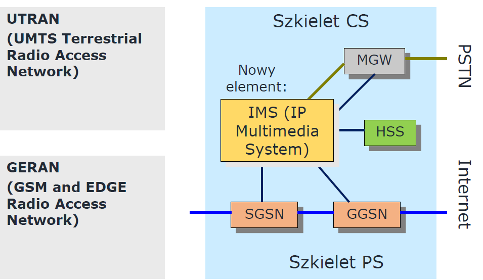
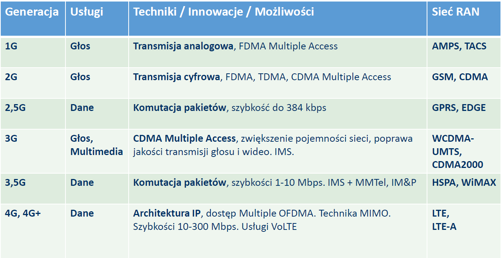
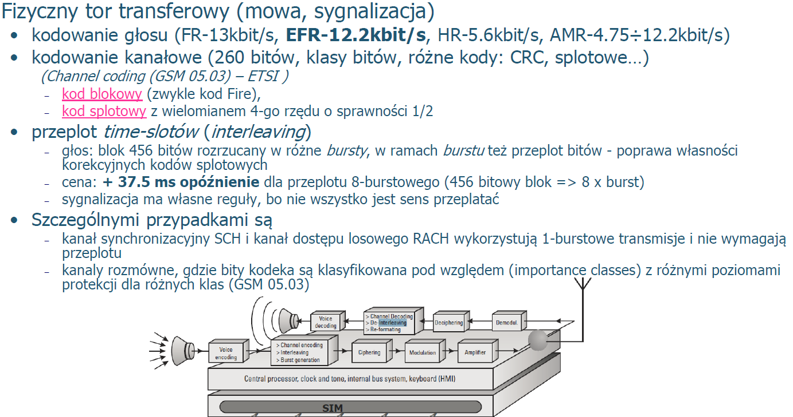

# Sieci Mobilne i Sieci Internetu Rzeczy

B - Blok

C - Część

> 5G to będzie rewolucja w telekomie, bo każda fabryka będzie chciała swoją sieć 5G, która jest superszybka (minimalne opóźnienia), żeby powstawały inteligentne fabryki.

# B0 Sieci komórkowe - wstęp

### Ewolucja od 2G do 5G - Timeline

Każde R, to kolejny Release. Aktualnie trwają pracę nad R17, ale to na papierze tylko.

#### 2G - GSM

W Polsce trochę później niż 1990. Ofc wcześniej były inne technologie np. w USA, ale o tym się już nie mówi.

W GSM można było usługi pakietowe, ale to było mega wolne wiele niedogonodności.

Poźniej weszło GPRS i EDGE, gdzie pakietowa usługa została podniesiona do rangi architektonicznego komponentu. Bo w GSM, robiło się transmiję pakietową w kanale rozmównym, więc to nie mogło być szybkie (kilkanaście kb/s). Natomiast w 2.5G (GPRS i EDGE), gdzie podniesiono usługę pakietową do rangi architektury i wytworzyło strukturę sieci rdzeniowej, która de facto jak przyjżeć się klockom pomijając szczegółowe nazwy i inne protokoły jakie są używane, to tak naprawdę przetrwała ona do 4G na pewno, a może i jak się trochę poumawiamy to 5G.

#### 3G - UMTS

Inny sposób kodowania.

Zwiększono przepływność usług pakietowych o rząd wielkości co do 2.5G. Później dorabiano kolejne ficzery, powiększano pasmo. 

Potem zrobiono HSPA, czyli zwiększenie przepływności, ale architektoniczne na tej samej sieci.

#### 4G - LTE

Koniec 2008 pierwsza wersja LTE, czyli to czego używamy dzisiaj. OFDM. - zmiana modulacji, bo w tej wcześniejszej nie dało się nic zrobić (pod Shannona podeszli  i trzeba było inaczej to wymyśleć).

Potem kolejne ficzery agregacja nośnych - czyli LTE4Dvanced. 

Gdzieś R12,R13 pojawiły się standardy *narrow band IoT* i *LTE-M* do obsługi sieci Internetu rzeczy. Niewiele tego wzdrożono (zwłaszcza w Polsce).

> Orange oferuje narrow band IoT, a Plus LTE-M. Ale świadczą takie usługi tylko firmom i to dużym.

#### 5G

5G kolejna instancja. To nie jest tak, że powstało to z niczego i zupełnie przerwało tradycję, historię tego wszystkiego. Po prostu to są kolejne ficzery, które swoją skalą i znaczeniem spowodowały, że nazwano to zupełnie inaczej - 5G (bo pewną masę krytyczną tych ficzerów przekroczono). 

Zmniejszono opóźnienia w radiówce do rzędu 1ms (zmiana procedur obsługi ruchu).

Małe stacje bazowe, wysokie pasma częstotliwościowe.

#### Technologie i ich obszary

**IMS** - **IP Multimedia Subsystem** - baza dla obecnej rzeczy jaką jest VoiceOverIP, czyli usługi głosowe na LTE. 
Operator większość z nas usługi głosowe nie wrzuca już na UMTS tylko na VoIP.

### Architektury

W ogólności sieć mobilna zawsze ma dwie sekcje

- Radiowa sieć dostępowa
  - **RAN** - Radio Access Network
  - jest po to, żeby przez łącze radiowe przenieść odpowiednie sygnały (niezawodnie itd. itd.)
  - nie zajmuje się usługami *per se*
  - taka niska wartstwa (tylko przesyła a usgługami to się endpointy zajmują -  z jednej strony terminale, z drugiej sieć szkieletowa)
- Sieć szkieletowa
  - **Core** - Core Netowork
  - ona zajmuje się realizacją usług pod kątem użytkownika
- No i są jeszcze terminale (urządzeni końcowe, te w rękach klienta)

Taki podział obowiązuje przez wszystkie generacje zmieniają się tylko bloczki w środku.

#### 2G - GSM

MS - Mobile Station (czyli terminal)

BTS - Base Transceiver Station - odpowiada za *wireless* komunikację pomiędzy MS, a siecią - potocznie mówiąc "komórka"

BSC - Base Station Subsystem - odpowiada  za *handling traffic* i sygnalizację pomiędzy terminalem i *network switching subsystem'em*, to taka szafa, którą mają operatorzy

#### 3G - UMTS

  

**Release 99**

Zmiany w RAN:

- UE - User Equipment (czyli terminal)

- Nowy interfejs radiowy opary o WCDMA

- BSC (Base Station Controller) przechodzi w RNC (Radio Network Controller)

Zmiany W CORE:

- MSC -> 3G MSC (MSC - Mobile Switching Centre)

- SGSN -> 3g SGSN (SGSN - Serving GPRS Support Node)

- GMSC i GGSN bez zmian (GMSC - Gateway Mobile Switching Centre, GGSN - GPRS Gateway Service Node)

  - > Sieć pakietową (czyli taką na jakiej działa internet wprowadza GRPS, daltego gateway'em do Internetu jest GGSN)

- AuC zmodernizowany (większe bezpieczeństwo)

**Release 4**

O ile bloki są podobne w RAN, to już sygnalizacja w nich jest inna, bo w UMTS inne kodowanie weszło.

Pierwsze releas'y UMTS pracowały z ISDN, potem trzeba bylo przejść na ATM i IP, więc kolejne releas'y dodawały swoje 5 groszy w tym temacie. Siecią transportową przestawała być stara SDN, tylko pakietówki. I właśnie jak świat zaczął przechodzić na pakietówki, to pomyślano, że sieć komórkową też na pakietówkę hyc, ale jak to zrobić? Pakiet to zupełnie co innego niż stały kanał o stałej przepływności PCM-kowy i okazało się, że dół węzłów trzeba zmodyfikować i okazało się, że nawet architektonicznie można to inaczej zrobić, a nawet warto.

**Release 5**

Pojawisło się **3G HSPA** (**H**igh **S**peed **P**acket **A**ccess). Nowa technologia do zwiększania przepływności bitowej (znacznie!!), którą sprzężono z sieciami Wi-Fi. Ale na tej samej strukturze co 3G, więc bez żadnej tam rewolucji.

Ile ta technologia dała przepływności?

|                        | Downlink  |    Uplink    |
| :--------------------: | :-------: | :----------: |
|     Release 5 UMTS     | 14.4 Mb/s |  5.76 Mb/s   |
|    Release 7 HSPA+     |  28 Mb/s  |  11.5 Mb/s   |
|     Release 8 LTE      |  42 Mb/s  | 23 Mb/s (R9) |
| Release 10 LTE4dvanced | 168 Mb/s  |      -       |
|    Release 11 MIMO     | 336 Mb/s  |   70 Mb/s    |

#### 4G -  LTE

UTMS Release 8 to jest LTE/EPC

### Różne tematy

#### Ewolucja UMTS ku SDN/NFV

**Data Plane** - moja mowa, dane użutkownika (**Dane pakietowe**)

**Control Plane** - protokoły do wysterowania  Data Plane (przygotowanie węzłów po drodze do przekazania danych) (**Sygnalizacja/Sterowanie**)

Widać jak na początku szło to przez jedne urządzenia, a potem zaczęły one się specjalizować np. w LTE wydzelono MME (Mobilty Management Element) osobny serwer, przez który dane głosowe nie przechodzą wgl., a on czuwa nad obsługą mobilności userów (hand-overy realizuje).

A w 5G zupełnie oddzielono Data i Control Plane. Niebieskie to rutery, a zółte to serwery. W dzisiejszych czasach w 5G, te serwery zaczynają być zwirtualizowane, to jest realizowane w chmurze. Sterowanie jest ez zwirtualizować, router już nie, bo tam lecą miliony danych.

#### Komutacja kanałów jako rezerwa, Dane - LTE, ugługi głosowe - w trybie CS

To nie jest tak, że jak operator wprowadzał nową technologie (nowe G), to kasował poprzednią. W Twoim telefonie działa 2G, 3G, 4G. 

I naprzykład sieć GSM backapuje inne, wyższe technologie w zakresie usług głosowych. A są obszary (małe ale są, bieszczady czy coś), gdzie działa tylko 2G np.

#### IMS- scentralizowany model usług

Warto zwrócić uwagę, na to że VoLTE jest na IMS.  IMS to skomplikowanty podsystem, który wspiera działanie usług głównie głosowych. 

Większość ludzi ma głos po VoLTE i za sygnalizację odpowiada tam IMS (jakieś tam serwery, w chmurze, które służą do zestawiania naszych sesji głosowych). IMS to framework architektoniczny do dostarczania usług multimedialnych na IP.

#### 4G LTE - kluczowe techniki

#### Ewolucja LTE - szybkośc transmisji

LTE to czas gdzie zaczęto wprowadzać wielo-antenowe rozwiązania tzw. **MIMO** - Multiple Input Multiple Output.

LTE zaczęło się od 150Mb/s i ciągłego pasma 20MHZ. a w 2017 układy scalone w terminalach przystosowane są do 1Gb/s i wykorzystania pasma 80-100MHz w kierunku od sieci do usera.

| Rok      | 2012                | 2013                  | 2014                  | 2015             | 2016       | 2017                    |
| -------- | ------------------- | --------------------- | --------------------- | ---------------- | ---------- | ----------------------- |
| Szybkość | 150 Mb/s            | 150 Mb/s              | 300 Mb/s              | 450 Mb/s         | 600 Mb/s   | 1 Gb/s                  |
| Pasmo    | 20 MHz 2x2MIMO | 10+10MHz 2x2MIMO | 20+20MHz 2x2MIMO | 3CA 2x2MIMO | 3CA 256QAM | 3-5CA Mhz  4x4MIMO |

xCA - Carrier Aggregation x- number of aggregated carriers

MIMO - Multiple Input Multiple Output.

xQAM - Quadrature Amplitude Modulation x - number of combinations

### Ewolucja od 1G do 4G

*Nie ma możliwość, żeby wszyscy userzy w komórce mieli `Max. Szybkość DownLink`, bo pasma nie wystarczy.

Dla nas opóźnienia rzędy 1ms w domu w 5G nic nie znaczą, ale w przemyśle, gdzie opóźnienia muszą być mega niska, to ma znaczenie, czy w Virtual Reality

 

### Shannon

Rozwój sieci mobilnych jest niezmiennie związany z Shannonem.

Cała zabawa rozwoju sieci mobilnej, to się odbywa wokół tego wzoru, bo:

- zeby zwiększać szybkość
  - Zacznamy z pasmem
  - jak pasma brakuje dajemy więcej anten
  - a potem SNR zmniejszamy (walczymy)

Rysunek na przykładzie LTE.

# B1 Sieci GSM (2G)

NSS - Network SubSystem. Później (jak się pojawiły sieci pakietowe) zaczęto to nazywać Core Network. 

Z GSM pod postacią GRPS pojawiły się pierwsze w sieciach mobilnych usługi pakietowe.

**GRPS** - General Packet Radio Service

Potem powstał EDGE, taki poprawiony GPRS (lepsze przepustowości). 

Później pojawił się standard UMTS, tam HSPA to już w ogóle wywindowało przepustowość.

## Pierwotna idea GSM

Mieliśmy wtedy dobrze rozwiniętą sieć telefoniczną PSTN/ISDN. Były tam usługi pakietowe po kablu telefonicznym. No i wymyślono sobie:

> A jakby tak dołączyć do takiej sieci publicznej abonentów mobilnych, bezprzewodowych?

Chodziło tylko o to, żeby do sieci, któa już jest dokleić tylko dostęp radiowy. Okazało się ile z tym jazdy, że aż ten "dostęp" rozwinął się w osobną sieć. Także w praktyce okazało się, że trzeba zrobić odrębne sieci komórkowe. I dopiero coś co nazywa się Gateway MSC ma styki z siecią publiczną i ostatecznie się wykrystalizowali operatorzy mobilny.

Sieć ISDN była bardzo dobrze rozwnięta, zestandaryzowana i chciało się z tego skorzystać, żeby się nie narobić a dołączyć do niej. Budować tylko to co jest niezbędne.

Dlatego wzięto ISDN jako klasa bazowa i chciano ją zmodyfikować i stworzyć sieć radiową, żeby dało się tym dołączyć do prawdziwej ISDN.

Czyli widać, że trzeba się zająć dostępem do sieci (bo jest bezprzewodowy i abonenci się poruszają) oraz sterowaniem zgłoszeniami, a cała reszta mogła zostać i być bardzo podobna jak to było w ISDN.

> I to widać w architekturze jak sieć mobilna wykorzystuje system sygnalizacji nr 7, tak głęboko jak się tylko da. Natomiast to co trzeba było dobudować, co wynikało z mobilności, to dorobiono.

## Generyczne aspekty sieci mobilnych

Nie tylko GSM.

#### Zasoby radiowe

To jest coś co trzeba dzielić. To jest cenne dobro, więc nie może być tak, że ktoś je weźmie na stałe. Ubiegamy się o licencje, operatorzy mają je podzielone itd. No i jak ktoś już ma jakieś pasmo, to nie jest tak, że na stałe da abonentowi 100kb/s np.

Jak ktoś ma potrzebe to dostaje ten zasób, a jak nie ma potrzeby to mu się odbiera zasób i zwalnia go dla kogoś innego.  

==> Więc cały czas trzeba patrzeć kto co ma i zabierać oddawać itp.  Bo chcemy mieć jakoś usług (a to miała być sieć publiczna, więc niezawodność musiała być 99%), wszystko musi być pod ścisłą kontrolą. (nie to co w Wi-fi).

#### Mobilność

Po to mamy ten dostęp radiowy, żeby można było łazić czy jeździć. Przy wi-fi też jest jakaś mobilność, ale ograniczona (to tak jak przywiąże kogoś do drzewa i powiem, no jesteś mobilny w jakimś tam zakresie (zasięg sznurka)). Tu chodzi oto, żeby tego sznurka nie było. 
Mobilności są dwie:

- **twarda** - w trakcie połączenia
- **nomadyczna** - teraz jestem tu, potem pojadę do domu, a cały czas chcę być dostępny dla sieci. Sieć musi mniej-więcej wiedzieć, gdzie jestem, żeby do mnie zadzwonić

#### Usługi końcowe

W sieci telefonicznej był sam głos, a sieci mobilnego wprowadziły wiadomości SMS (Kiedyś to było używane do informowania od operatora, potem dopiero komercjalizacja poszła a dzisiaj to głównie alerty RCB.)	

### Poziomy/bloki sterowania

Z powyższych trzech aspektów wynikają 3 generyczne bloki sterowania:

- Zarządzanie **zasobami radiowymi**
  - blok funkcjonalny, który jest odpowiedzialny za zorganizowanie sposobu udzielania dostępu klientom do zasobu radiowego i pamiętajmy, to musi być w dwóch aspektach rozpatrywane - płaszczyzny danych i płaszczyzny sterowania. Żebym ja mógł przesyłać dane, to muszę najpierw sieci to powiedzieć, i to powiedzenie odbywa się na tych samych zasobach radiowych. I na zasoby na data i na control plane idzie jakaś rywalizacja i sieć musi to jakoś rozwiązać.
- Zarządzanie **mobilnością**
  - w aspekcie nomadycznym (od czasu do czasu terminal jak się gdzieś przemieści, to się rejestruje gdzie jest, żeby sieć wiedziała)
  - aspekt twardy (jak mam połączenie zarezerwowane, to może one zostać poddane tzw "handover'owi")
- Sterowanie **zgłoszeniami**
  - to bardziej realizacja usług użytkownika (czyli user robi coś z siecią core za pomocą sieci radiowej np. transfer pakietów (np. VoIP))
    - W 2G, 3G transfer pakietów to było coś kompletnie innego niż transfer głosu. Od 4G to jest to samo bo VoIP over LTE. LTE jest siecią pakietową a usługa głosowa to jest realizowana na tych pakietach właśnie. Sieć LTE nie widzi głosu tylko pakiety o parametrach do przesłania.

## Podstawowe koncepcje

### Komórka

Organizacja zasobów w sieciach mobilnych odbywa się na zasadzie komórek. Obszarów relatywnie małych, które są pokryte poprzez stacje bazowe. De facto stacje bazowe to anteny. Przedstawiamy komórki jako hexagonalne obszarki, ale one nigdy nie są hexagonalne, nie ma takiej możliwości. One są kompletnie nieregularne to zależy od ukształtowania terenu, i wielu rzeczy jakie tylko sobie możemy wyobrazić. One zachodzą na siebie (jak nie zachodzą to mamy dziury (tak jak w tych moich Bieszczadach)). 

>  Jak jest antena sektorowa, to ona jest w narożniku i jej "dzieci" wysyłaja do niej, a może być antena dookólna i jest na środku komórki

Teminal cały czasz mierzy co się dzieje dookoła (jaki zasięg skąd) i jak wykryje ze jest w zasięgu lepszej stacji (zasięg lepszy) to się zamelduje w niej. Sieć nie wie, gdzie jest terminal - póki terminal jest w obszarze (liczącym kilka komórek), to on tylko pilnuje czy jest w tym obszarze, czy  przypadkiem nie przeszedł do innego obszaru (wtedy nie widzi żadnej z stacji bazowych obszaru), więc wtedy przerejestruje się mówicą sieci "jestem już nie w tej piaskownicy tylko innej". Żeby sieć mniej więcej widziała (z dokładnością do obszaru), gdzie jest terminal.
Natomiast jak terminal prowadzi rozmowę, to cały czas śle komunikaty pomiary z tego co widzi na około. Terminal jak zaczyna połączenie to dostaje od sieci listę stacji bazowych, które ma monitorować pod kątem jakości sygnału i raporty wysyłać do sterownika. A sieć wie co się dzieje w kontekście innych stacji obok i sama decyduje czy nie przełączyć w końcu jakiegoś terminala na inną stację bazową. Np. jestem bliżej i mam lepszy zasięg ([dB]) z jakiejś stacji, ale nie ma tam zasobów, to sieć mnie przerzuca (**handover**) do innej stacji bez uzgadniania z terminalem.

Czyli sieć robi handovery i to się nazywa **centralny arbitraż zasobów**. 

**W sieciach pakietowych**, terminal może sam zainicjować handover, ale w pakietówce opóźnienia 0.5 sekundy są spoko, ale w głosówce już nie. A nasza sieć ma mieć niezawodność 99.9% (bo jest publiczna)

### Mobilność nomadyczna

Załóżmy, że klienci sobie biegają, komórki są niezbyt duże i teraz mamy ich przepinać między komórkami, bo chcemy ich tak precyzyjnie mieć. (Cały czas nawet jak ktoś nie gada, to żeby go non-stop mieć). No i wtedy tak. Ktoś się porusza i zawsze jak zasięg jest lepszy w jakimś miejscu to przełączamy komórkę. Za każdym razem np. Ileż to tej sygnalizacji by było walone na darmo.

> To tak jakby mam pilnowała dziecka w piaskownicy każąć mu mówić co chwila przy którym kamyku on jest.
>
> To bez sensu. Chodzi o to, czy on jest w tej piaskownicy czy już w innej, wtedy groźnie. 

Obszary przywołań to są nasze piaskownice i póki dziecko chodzi w niej po kamykach to jest git. Ale jak przejdzie do innego obszaru, to chcemy od niego to usłyszeć. I to jest właśnie **nomadyzm** obszary przywołań wysyłają  info (parametry, nazwy, co umie, jakie usługi itd.), żeby terminal wiedział gdzie jest, dostaje od obszaru listę stacji bazowych i pamięta. I nagle terminal nie widzi (słaby zasięg) żadnej stacji z listy, wtedy mówi "o kurczę przeszedłem między obszarami, muszę się przerejestrować". Odbiera od sieci nowy obszar i mówi do niej "teraz jestem tutaj, jak coś do mnie to tu szukajcie".  

> Jak dużo komórek to obszar, jak szybko się przełącza, jak często terminal dostaje info -  to wszystko sobie wylicza operator i on to wie na podstawie pomiarów, statystyk itp.  
>
> Operator robi kompromis, żeby sygnalizacji nie było za dużo, ale żeby też było łatwo znaleźć klienta, gdy przychodzi do niego połączenie.

Jak ktoś dzwoni do klienta, to sieć wie, w którym jest obszarze i wtedy okólnik z każdej stacji bazowej (broadcast) jest tam wysyłany  "ej, gościu ktoś do Ciebie, zgłoś się". I terminal wtedy odpowiada na tej, na której ma najlepszą moc. I terminal mówi do niej "dajcie mi kanał sygnalizacyjny, bo zdaje się to o mnie chodzi".

W *mobilności twardej* mamy zestawiony kanał i jego trzeba błyskawicznie przełączać przy poruszaniu się, żeby nic nie uciekło. I to jest realizowane według paradygmatu *make before break*, póki terminal się nie przełączy do nowego zarezerwowanego dla niego zasobu w innej stacji bazowej, to cały czas korzysta z tej starej.

### Obszar przywołań

Zbiór kilku komórek w których spodziewamy się danego abonenta. Chodzi o to, żeby sieć wiedziała od razu gdzie go szukać, a nie szukała go po całym świecie. Z drugiej strony jest to kilka komórek, żeby abonent nie musiał się co chwila przerejestrowywać.

## Usługi końcowe

Usługi końcowe w GSM to były

- rozmówne
- wywiedzione z rozmównych
  - np. fax

Usługą z poziomu użytkownika była **Transparentność usługi względem mobilności**
A jej realizacją **zmiany wymuszone mobilnością** ( w tym *roamingiem*)

SSP jak user zaczynał być mobilny sygnalizowały to SCP, które były warstwą sterowania i jak kazały mu się przełączyć, to SSP wysyłał do STP a tamten do odpowiednigo SSP wiadomość, że zaraz tu się dołączymy. No i następny SSP sygnalizował znowy do STP, że następny węzeł to kolejny SSP i tak aż do SSP, z którem połączony jest user, do którego dzwonimy. Czyli widzimy już tu rozdzielenie płaszczyzny sterowania od danych.

***

Chcemy, żeby sieć była **transparentna** dla usługi. Co nas obchodzi czy tam jest jakaś mobilność czy nie, dostęp radiowy czy jakiś inny).

> Czyli, że user ma widzieć usługę tak samo bez względu na to czy korzysta z niej z urządzenia stacjonarnego czy mobilnego, czy korzysta z kabla czy z fal radiowych.

 **Więc trzeba zapewnić wsparcie dla transparentności**

> I to się nie da zrobić, bo każda sieć na świecie musiałaby mieć ten sam profil usługowy (zestaw usług) co moja sieć macierzysta, a wiadomo nie wszędzie na świecie jest tak samo. Znaczy takie podstawy jak rozmowy to i tak są wszędzie, ale jakieś bardziej pro rzeczy już nie, więc profil mój macierzysty nie wszędzie był honorowany, często gdzieniegdzie był okrojony.

## Standaryzacja GSM

GSM standaryzwało szereg ciał. Na początku GSM - ETSI, potem 3GPP się z tego wykrystalizowało od czasu R99 i do dzisiaj sprawuje piecze nad tym. Ważny dla GSM system sygnalizacji SS7 standaryzuje głównie ITU-T. Dodatkowo dla GSM z transportem IP następujące instytucje biorą udział:

- IETF - stos SIGTRAN
- ITU-T - protokół sterowanie zgłoszeniami BICC
- IETF/ITU-T - Megaco/H.248 (protokół sterowania bramami medialnymi)

## Punkt wyjścia dla GSM - PSTN, ISDN i SS7

To są dwa rysunki dla sieci PSTN/ISDN/SS7

Mamy sieć stałą (między CA/MSC a drugim CA/MSC) i mamy dostęp radiowy do niej (obszar pomarańczowy)). W sieci komórkowej mamy zmiany w obszarach pomarańczowych. 

Więc w GSM:

Więc w GSM zmieniono (w stosunku do sieci telefonicznego kablowej) tylko dół (czerwona pętla), bo zmieniło się medium transmisyjne (drut na radiowe fale). W sieci stałej to się wtykamy kablem i jest, a tu trzeba zrobić radiowy dostęp do drutu.

Wstawka o sygnalizacji

### Sieć ISDN

ISDN - Integrated Services Digital Network - system sieciowy z komutacją łączy dla telefonów. Transmitował dane oraz głos poprzez drut.

PSTN - Public Switched Telephony Network - sieci telefoniczna, pozwalała na dołączanie się telefonów stacjonarnych. Jest od początku telefonii.

W niej działały protokoły:

- DSS1 -Digital Subscriber System No. 1 - system sygnalizacji w sieciach ISDN
- SS7 - Signallig System no. 7 - używany w sieciach PSTN

#### Architektura sieci ISDN

**TE** - Terminal Equipment, **CA** - centrala abonencka, **CT** - centrala tranzytowa, **STP** - Signalling Transfer Point (punkt transferowy sygnalizacji) SS7.

**SP** - Signalling Point (punkt końcowy sygnalizacji) SS7.

> W ogólności jest tak, że jest jakaś sieć i trzeba nią zarządzać, żeby abonencki w ramach potrzeby dostawali z niej zasoby. Inaczej się zarządza siecią pakietową, a inaczej w sieci z komutacją łączy (ISDN lub ATM). Zawsze istnieje blok funkcjonalny "Sterowanie zgłoszeniami" - Call Controll.

^Na rysunku to co odpowiada danym usera, to jest zielone (są to kanały rozmówne), są dwa bo kanały zestawiamy "w te i nazat".

**I jak do tego dochodzi, że są te zielone kreski?** Na początek ich nie ma, należą one do puli wspólnej a trzeba je zarezerwować dla jakiejś pary userów, którzy chcą gadać.

1. Po wklepaniu numery i naciśnięciu słuchawki TE wysyła wiadomość *SETUP* zdefiniowaną przez protokół **DSS1** (**Digital Subscriber System no. 1**), która oznacza "chcę się połączyć z jakimś abonentem (o podanym numerze)" (btw. DSS1 jest wykorzystywany w GSM i 2.5G i również w 3G w ramach toru rozmównego).
2. CA dostaje SETUP robi autoryzacje itp (CAC) i przedłuża (patrzy jak to trzeba skomutować najpierw) wysyłająć do CT wiadomość *IAM (Initial Adress Message)* z protokołu **ISUP (ISDN User Part Protocol)** i na jej podstawie (tam jest nr docelowy) jest komutacja i IAM jest przkazywany do następnych CT na podstawie jakiegoś tam routingu w tych CT.
3. Aż na koniec IAM trafi do CA (zauważmy, że w ciemno po drodze zarezerwowano zasoby, bo zakładamy, że user2 odbierze, bo co jak user2 odbierze, a okaże się, że nie ma zasobów w sieci? musimy mieć pewność, że są, więc od razu, w ciemno rezerwujemy).
4. CA wysyła do TE usera2 *SETUP* i wtedy telefon usera2 zaczyna dzwonić, a żeby poinformować sieć, że user2 został znaleziony i jest u niego odgrywany dzwonek TE wysyła wiadomość *ALERTING*
5. CA dostaje wiadomość *ALERTING* i przekazuje fakt znalezeinie i dzwonienia telefonu u usera2 dalej wysyłając do CT wiadomość *ACM (Address Complete Message)*, którą CT przekazują wcześniej ustalonym szlakiem aż do CA przy user1
6. CA przy user1 wysyła do TE user1 wiadomość *ALERTING* i wtedy w telefonie user1 odgrywany jest ton*, który informuje, że połączono się z user2 i czekamy aż odbierze.
   *tak naprawdę to CA, gdy obierze ALERTING sama po gotowym już torze rozmównym wysyła ton, że jest dzwonione u user2. (btw. to u user1 kierunek *up-link* jest zablokowany (co symbolizuje że nie jest pokolorowane na czarno prawa część kółeczka na rysunku w CA usera1))
7. Gdy user2 podniesie słuchawkę to jego TE wysyła wiadomość *CONN (Connect)* do CA i wtedy CA zestawia tor rozmówny między nim a TE usera2. Potem wysyła do CT wiadomość *ANM (Answer Message)*, która powoduje, że tor wcześniej zestawiony jest "udrażniany" (up i down-link działają wszędzie). I na koniec CA wysyła do TE usera2 wiadomość *CONACK (Connection Acknowledgement)*
8. Jak CA otrzyma *ANM*, to wysyła *CONN* do TE usera1 co informuje, że drugi user odebrał i, że zestawiono już połączenie. 
9. TE usera1 po odebraniu *CONN* wysyła tylko potwierdzenie odebrania w postaci *CONNACK*

Tak to działało w sieci kablowej telefonicznej.

#### Łącze między TE a CA od strony fizycznej

W ISDN TE z CA było połączone:

- dwoma **kanałami B**, które były kanałem rozmównym
  - Miały one przepływność `64kbit/s`
- jednym **kanałem D**, służącym do sygnalizacji (czyli przez niego przepływały wiadomości protokołu DSS1)
  - Miał on przepływność `16kbit/s`

I to wszystko było w jednym drucie telefonicznym. W warstwie elektrycznej podział na kanały realizował strumień bitów ramkowanych i w nim były ramki, które nam wydzielały ramki dla 2 kanałów B i ramki od kanału D.

Z racji, że mamy dwa kanały B, to można naraz prowadzić 2 rozmowy, ale ktoś powie jak to dwie rozmowy na jednym telefonie?

Tak naprawdę to za tym TE były dopiero telefony i one były podłączone do TE i mogło być ich wiele i dwa naraz mogły gadać. Jakby trzeci chciał to by został odrzucony (ale cała procedura odbyła by się z CT, bo kanał D byłby wolny).

**Więc generalnie** wymiana sygnalizacyjna strukturalnie jest odrębna od przestrzeni przeznaczonej na rozmowę. Czyli w bitach były zdefiniowane ramki o długości ileś bitów, gdzie pewne sekwencje (pozycje) bitów mogły być zajmowane tylko przez informacje sygnalizacyjne, a inne sekwencje przez informacje rozmówną.

#### Po co STP?

Z pośród CT wydzielało się takie duże centrale i przy nich organizowało takie Punkty Transferu Sygnalizacji (takie jakby routery wiadomości sygnalizacyjnych), po to żeby ta sieć sygnalizacyjna, była nieco bardziej zagregowana (ofc nie screntralizowana), bo łatwiej tym zarządzać.

No i ostatecznie sygnalizacja sieciowa (^na rys. czerwona) docierała między centralami pośrednio przez STP (czyli jak CA/CT chciało coś wysłać do innego CA/CT, to to szło przez STP).

Sieć systemu sygnalizacji była realizowana w SS7 przez **MTP - Message Transfer Part** (usługa relatywnie podobna do IP). MTP to taka pseudo sieć pakietowa na potrzeby sygnalizacji.

#### Protokoły sygnalizacyjne ISDN

Ten rysunek zakłada, że od sygnalizacji i danych jest jedno łączę.

Jak czytać ten rysunek?

Wiadomość ISUP wymieniame między CA i CT nie lecą przecież sobie po powietrzu tylko zasuwają sobie właśnie przez wartwę:

- sieciową (protokoł MTPlayer3) 
  - komutacja się tu odbywa
- łącza danych (MTPlayer2)
  - zabezpieczenie przed błędami itp
- fizyczną (MTP1)
  - przesłanie bajtów

Wiadomości DSS1 między TE i CA są przesyłane przez:

- **LAPD (Link Access Protocol D-channel)** czyli protokół wartwy drugiej
  - od razu druga warstwa bo przecież nie potrzebujemy tu żadnej komutacji (TE i CA są na stałe połączone kablem)
- w warstwie fizycznej mamy wcześniej wspomniany kanał D (ten 16 kbit/s)

#### Pojęcia z tego rozdziału.

#### Podsumowanie

Wymiana sygnalizacji i danych użytkownika wymagają zasobów, które w ogólności* są "wspólne" i trzeba nimi zarządzać w czasie rzeczywistym.

> *oprócz przypadku, że między TE i CA mamy BRA, gdzie jest dedykowany kanał D tylko na signalling.

***

Tak wygląda to w ISDN i teraz chodzi o to, żeby jak najwięcej z tych pomysłów wykorzystać w sieci GSM. Sieć mobilna trudni się tym jak zorganizować łącze między TE i CA.

***

### Sygnalizacja a sterowanie

**Sterowanie** to są czynności, które robią urządzenia z Control Plane, a **sygnalizacja** to komunikacja, wymienianie informacji między urządzeniami z Control Plane.

"Data Plane" jest nazywany też "User Plane".

## Signalling System no. 7 (SS7)

Pojawia się pytanie jak system ISDN należy zmienić, jeśli chcemy opatrzeć go w mobilność. 

Więc w jakich obszarach pojawiły się zmiany?

### Zmiany w usługach inteligentnych

Mamy tu pojęcia z ISDN, i teraz jak to pozmieniać na rzecz GSM

**SCP - Service Control Point** - punkt sterowania usługami, który jest serwerem (dostaje zapytania co robić ze zgłoszeniami o usługę i odpowiada)

**SSP - Service Switching Point** - podrasowane centrale, które umieją takie zapytanie "co zrobić z danym zgłoszeniem, które jest w danej fazie z takimi paramsami" wysłać do SCP.

> SCP może odpowiedzieć np. "obsługuj to zgłoszenie jakby nic się nie stało" lub "obsługuj to zgłoszenie, ale zmień nr docelowy na taki jaki ja Ci tu podstawiam"

SCP służyła do sygnalizacji takich bardziej zaawansowanych usług jak przekierowanie numerów itp. natomiast w sieci GSM przyjęła ona formę takiej platformy **CAMEL - Customized Applications for Mobile networks Enchanced Logic**, która służyła wsparciu usług rozmównych i innych z uwzględnieniem roamingu abonentów (bo trzeba obiecane userowi usługi realizować też gdy jest za granicą). CAMEL działa tak, żeby jakiś rekord usługowy usera przewędrował z sieci macierzystej usera do miejsca, gdzie on jest za granicą.

## Co doszło w 2G do ISDN/SS7

Patrząc od dołu - doszło łącze radiowe z zarządzanym dostępem do zasobów, obsługą różnych apsketów mobliności i realizacją nowych usług końcowych (użytkowych) np. SMS.

Z punktu widzenia sterowania zgłoszeniami nic nowego się nie dzieje. (ofc wprowadzenie SMS, ale to korzysta tak jak z kanału rozmównego i tyle). 

Dopiero w warstwach niżej zaczyna się coś dziać, no bo trzeba zamiast druta zrobić fale radiowe.

Wcześniej (w ISND) Call Control (protokół DSS1) chodził bezpośrednio na data linku (na jakimś fizycznym łączu). Teraz sprawa się komplikuje i sporo doszło ze względu na dostęp radiowy i mobilność w niższych warstwach. 

> Są to dość trudne aspekty i sprzężone ze sobą dają dość skomplikowane rozwiązania (i tak ogólnie jest, że pierwsze podejście do problemu nie zawsze jest najprostsze, z czasem ludzie lepiej go rozumieją i upraszczają sieć (architektury i protokoły), ale wraz z postępem G dochodzą nowe wymagania na usługi, więc to nie jest tak, że każde kolejne G jest coraz prostsze. Ogólnie jest, ale są nowe usługi itp i to robi systemy bardziej złożonymi).

# B1C1 GSM - Architektura  

Mamy część radiową **BSS** - **Base Station Subsystem** (teraz to się RAN nazywa w LTE i GERAN w UMTS) i sieć stała(kablowa), która się nazywa **NSS - Network SubSystem** (w GSM i GPRS, a w wyższych standardach CORE Network, a w 5G "5G Core").  

Część radiowa to zrobienie medium transmisyjnego, a cześć stała to pilnowanie tego medium i doniesieniem usług z perwspektywy klienta na styk sieci komórkowej, po to zeby ruch mógł wyjść "w świat". No bo sieć komórkowa robi dostęp do siecie publicznej, czy to Internet czy rozmówna publiczna. 

NSS robi autentykacje, uwierzytelnienie.

! Terminal a Użytkownik to są dwie różne rzeczy. Czym innym jest terminal, a czym innym SIM i człowiek. Mogę przełożyć SIM do innego terminala i still będzie działać. 

Dodatkowo sieć stała zapewnia dostępność usług w wymiarze ogólnoświatowym. Jak jadę do Francji, to chciałbym mieć roaming (tego nie zrobi lokalna sieć radiowa, to trzeba poziom wyżej, czyli sieć stała to robi)

> Jak się do mnie dzwoni z Chin a jestem we Francji, no to połączenie idzie do mojej sieci macierzystej, czyli do Polski, no bo skąd sieć Chińska ma wiedzieć, że we Francji jestem.  Dopiero mój operator w Polsce ma bazę danych z informacją, gdzie ja jestem i wtedy zależnie od technologii jakoś tam do tego połączenia ze mną dochodzi.

# B1C2 GSM -  Podsystem Sieciowy NSS

## Elementy i Styki

W PSTN były centrale, no to my też sobie wymyślimy jakieś.... ->:

**MSC - Mobile Switching Center** - centrum komutacyjne dla usług mobilnych, które jest taką upgradowaną centralą ISDN połaczeń głosowych. Upgrade polega np. na realizacji handoverów.

**HLR - Home Location Register** - rejestr macierzysty, rejestr gdzie na stałe są trzymane wszystkie dane o abonencie (nie personalne tylko te sieciowe - id karty, dane o sim'ie, klucze do szyfrowania, bieżąca lokalizacja z dokładnościa do obszaru MSC, gdzie on jest. Cokolwiek ja chce jako klient, to najpierw zawsze jest weryfikacja w HLR, czy user ma dostęp do usługi.

**VLR - Visitor Location Register** - rejestr lokalny, hierarchicznie niżej niż HLR. 

> np. Orange w jeden centralny HLR w Wawie. A ja jestem we Wrocku, tam już inne MSC funkcjonuje i z tamtym MSC jest skojarzone lokalne VLR i w tym VLR jest lokalne info o mnie gdzie jestem z dokładnościa do obszaru przywołań, której HLR już nie widzi. Ale HRL wie, do którego VLR uderzać, gdyby trzeba było mnie znaleźć.
>
> Jak ktoś z centrali G-MSC chce do mnie, to zagląda do HLR i kieruje się już do MSC skojarzonym z wpisanym tam VLR

VLR to informacje o wsystki abonentach, którzy akurat wpadli w obszar obłsugowy danego MSC. W tym sensie wpadli, ze znajdują się w podsystemach radiowych, które są dopięte do tego MSC. Jeśli klient przemieści się w obszar innego MSC, to odpowiedni VLR wysyła do tego drugiego VLR całe jego info.

**AuC - Authentication Center** - tu są klucze uwierzytelniające klientów.

**EIR - Equipment Identity Register** - rejestr terminali. Nie wszystkich, ale tych które są jakoś specjalne, np. kradziony jest na zastrzeżonej liście albo z jakimś innym statusem i na tej podstawie pewne rzeczy można z nim zrobić a pewnych nie. Nie z Sim'em tylko z terminalem. Generalnie to żeby kradzione wrzucać na black list. Sieć sprawdza czy jest kradziony i jak jest to żadnej usługi nie wykona.

**G-MSC - Gateway MSC** - taki MSC na brzegu z sieciami innymi niż ta operatorska (albo publiczna albo operatorska innego operatora (roaming))

> I taki schemat zachował się w kolejnych standardach. Jak rozumiemy to, to łatwiej nam ogarnąć te nowe G. Zmiany są głównie niskopoziomowe w radiu, bo inaczej się zasobami zarządza (inne częstotliwości, modulacje itp.) oraz sama pakietówka dużo zmian narobiła.

## Jak przebiega połączenie

Spójrzmy jeszcze raz na ten rysunek

**Um** - urządzenie mobilne.

^Na czerwono sygnalizacja, a zielono kanały rozmówne.

1. Um najpierw próbuje zarezerwować sobie kanał syngalizacyjny między nim a MSC.
2. Następuje CAC (czyli komunikacja z HLR) jak wszystko ok, to międz Um a MSC jest kanał sygnalizacyjny (protokół DSS1). Tu jest CAC, ale też ustalenie szyfrowania dla danej rozmowy.
3. Między Um a MSC powstaje kanał rozmówny.
4. Teraz MSC zestawia połączenie przez sieć aż do ostatniego MSC (tego gdzie jest drugie Um)
5. Teraz podobne procedury CAC (nie takie same lecz symetryczne) jak w 2. są wykonywane dla Um2
6. Gdy 5. OK, to zestawiamy kanały między MSC a Um2

! Note that: krok 2. i 5. to abstrakcja, bo HLR jest przecież hierarhicznie rozproszone jako VLR.

## Elementy

### MSC

**Mobile Switching Center** - centrala abonencka sieci GSM.

- Ma swój obszar obsługowy ograniczony zbiorem przypisanych BSS (Base Station Subsystem) stacji bazowych. Jedna BSS podlega zawsze jednemu MSC. Ale jedno MSC ma np. kilka obszarów przywołań, a co za tym idzie wiele BSS.

- Użytkownicy pozostający w zasięgu MSC (podpięci do jednego z jego BSS) są zarejestrowani w VLR związanym z danym MSC

**Główne funkcje**

- Na poziomie usług

  - Obsługa wywołań (gdy ktoś do mnie dzwoni, lub ja do kogoś - usługi głosowe (w tym też przekierowania itp.)
  - Przekazywanie wiadomości SMS

- Zarządzanie moblinością (Mobility Management)

  - uwierzytelnienie abonentów podcas inicjonowania procedur sygnalizacyjnych (krok 2. z rodziału wyżej) we współpracy z innymi urządzeniami
  - obsługa rejestracji terminala (po jego włączeniu) w sieci i obsługa wyrejestrowania (ofc znowu we współpracy z innymi urządzeniami)
    - zanim chipset wyłączy prąd u siebie to powie sieci "elo, ja znikam"
  - udział w aktualizacji położenia (location update)
    - też ofc nie samo, ale to MSC rozdaje tu karty

- Zarządzanie zasobami radiowymi

  - > MSC jest dość głęboko w sieci. Pomiędzy terminalem a MSC jest cały podsystem radiowy przecież.

  - więc -> wysokopoziomowe sterowanie zasobami w seici radiowej

    - np. polecenie przydzielenia kanału sygnalizacyjnego MS
      - terminal się zgłasza i podstawowe decyzje podejmuje MSC (nie zajmuje się wszystkimi detalami dostępu radiowego )
    - np. polecenie przydzielenia kanału rozmównego MS po poprwanym CAC (moment między krokami 2. i 3.)
      - MSC nie musi wskazać, który dokładnie na jakiej częstotliwości (bo tym zajmuje się sterownik częsci radiowej), ale decyzja czy przynać czy nie

  - sterowanie przełączeniem połączenia (**handover**)

    - ale nie na każdym poziomie ofc (zależy jak bardzo ten handover jest głęboki) 
      - intra-MSC
        - czyli terminal przemieszcza się w ramach jednego MSC, ale pomiędzy sąsiednimi BSC - taki handover musi explicite wykonac MSC
      - inter-MSC 
        - tu biorą udział dwa MSC - te między którymi terminal się przemieścił.

- Biling połączeń

### HRL 

**Home Location Register** - baza danych o abonentach - cała informacja o terminalu, jego uprawnienia itp.

Na sieć operatorską jest co najmniej jeden rejestr HLR/AuC

W tej bazie danych każdy abonent ma następujące wpisy (#Numery abonenta):

- **MSISDN - Mobile Subscriber ISDN Number**

  - zwykły numer abonencki, który ja daje kolegom
    - jego format to CC + NDC + SN
      - **CC** - Country Code, **NDC** - National Destination Code (kod sieci operatora), **SN** - Subsriber Number
  - jest on publiczny, możliwy do zmiany
  - inny niż numer sieciowy IMSI (ale podobny z wyglądu)

- **IMSI - Internaional Mobile Subscriber Identity**

  - międzynarodowy numer abonenta 
  - max 15 cyfr
  - unkiatowy globalnie na całym świecie
  - przypisany na sztywno do karty SIM, karta SIM nigdy innego nie będzie miała
  - jest możliwie super tajny (chyba, że ktoś specjalnie sobie jakimś urządzeniem karte SIM przejrzy)
  - IMSI jest wykorzystywany przez protokoły sygnalizacyjne, a MSISDN to tylko taki ruting globalny
  - format:
    - MCC + MNC + MSIN
      - **MCC** - Mobile Country Code (3cyfry), **MNC** - Mobile Network Code (2-3cyfry), **MSIN** - Mobile Subscriber Identification Number (10cyfr) - unikatowy w sieci danego operatora

- **TMSI  - Temporary Mobile Subscriber Identity**

  - Chwilowy/ przejściowy identyfikator subskrybenta ruchomego
  - ten występuje w sygnalizacji bardzo często (IMSI występuje tak rzadko jak tylko można), zwłaszcza na styku radiowym to ten jest wykorzystywany IMSI tylko gdy nie da się inaczej.
  - on jest losowany, może być zmieniany co chwilę przy każdej kolejnej sekwencji sygnalizacyjnej. Chodzi o to, że jak ktoś podsłucha ten numer to co mu z tego jak za minutę czy dwie on się zmieni 
  - jest zarządzany przez akutalny VLR

- **MSRN - **Mobile Subscriber Roaming Number

  - >  żeby to wyjaśnić spójrzmy na strukturę adresu IP. On ma maski, tak, ale po co? żeby adresy były hierarchinczne, ale po co? Żeby tablice routingu były w miarę małe  (mieszczą się w zakresach ogarnialnych przez urządzenia). Jakbyśmy mieli płaski adressing (tak jak w ETH), to ile adresów, tyle wpisów w tablicy (5 mld telefonów to 5mld wpisów), to jest nie do ogarnięcia.

  - I to jest właśnie numer (znowu o podonym wyglądzie do IMSI), który służy do hierarchicznego rutingu w sieci ISDN.

    - Jak to działa

      - > Jak sieć dostanie zgłoszenie to po numerze MSISDN kieruje je do sieci macierzystej tego numeru i G-MSC odpytuje HLR tego numeru "weź mi podaj TMSI". Wtedy HLR po `aktualnym VLR`  odptyje o TMSI i odsyła to do G-MSC. Wtedy G-MSC rutuje połączenie pod numer MSRN. To jest chwilowy numer abonenta
        >
        > Czyli nie rutujemy po MSISDN (to jest jak FQDN - Full Quallified Domain Name w internecie, po nim się nie rutuje tylko za pomocą DNS zamienia na adres IP), tylko po MSRN.

      - Po MSRN dochodzimy do MSC, do którego jest połączenie przychodzące 

- **Aktualny VLR** - VLR powiązany z MSC, w którym to obszarze usługowym jest user

- **Lista usług** - lista usług dostępnych dla danego abonenta (te za które płaci i może ich oczekiwać)
  
  - Są w tym usługi podstawowe (basic services):
    - telefon
    - SMS
    - Fax
  - Ale i dodatkowe (supplementary services)
    - przekierowanie bezwarunkowe
    - przekierowanie w przypadku zajętości
    - call waiting
    - call hold
    - ...

### AuC

**Authentication Center** - Centrum uwierzytelnień.

Chodzi o to, żeby szyfrować transmisję na styku radiowym jak tylko się da dla:

- sygnalizacji
- mowy i  SMS

Jak uwierzytelnimy terminal to on sobie tam wylicza na podstawie pewnych algorytmów i kluczy swój klucz szyfrujący  i szyfruje transmisję. Sieć przeprowadza analogiczne, odpowiednie obliczenia i wie jakie są klucze szyfrujące i potrafią się dogadać szyfrując transmisję na styku radiowym 

AuC przechowuje indywidualne klucze **Ki** dla abonentów

- symetryczne - ten sam klucz Ki jest zapisany na karcie SIM (i żyją te klucze tylko tam)
- Ki nigdy nie jest wymieniany, nie pojawia się w sieci

Wszelki klucze do szyfrowania są wyliczane na podstawie kluczy Ki i jakiś zrandomizowanych wartości, które co chwila się zmieniają.

Uwierzytelenie:

- dla większości operacji wymaga się uwierzytelnienia karty SIM
- np. zawsze przy zestawianiu kanału sygnalizacyjnego do sieci

Szyfrowanie:

- klucze Kc dla indywidualnych transmisji na styku radiowym są wywodzone z Ki oraz lakiś zrandomizowanych wartości (ma to krótki żywot i nawet zhackowanie klucza Kc daje mi dostęp tylko przez chwilę)

Ki jest na SIMIE i w AuC. 

1. No i w początkowej fazie gdy terminal mówi do MSC, to wymieniany jest plain text (zero szyfrowania), ale tam korzystane jest z numerów TMSI, więc to info nie jest ważne dla hackerów. 
2. Teraz MSC odwołuje się do Auc o odesłanie takie trojki liczb (**auth tiplets**), które potem posłużą do wdrożenia szyfrowania na styku radiowym.
3. Auc wylicza auth trplests, czyli -  **{RAND, SRES, Kc}**. Czyli jakaś liczba losowa, SRES - wyliczona na podstawie Ki i liczby losowej i Kc - klucz Kc (bo BTS musi tego używać a jest za głupi, żeby sobie to wyliczyć)
4. MSC wysyła do termiana *auth triplets*
5. Terminal teraz wykonuje podobne obliczenia jak Auc i wysyła swoje obliczone SRES oznaczone jako SRES*
6. Jeśli SRESy się zgadzają to jest git.
7. BTS dostaje Kc i używa go do szyfrowania na styku radiowym.
8. Terminal sam sobie liczy Kc

### VLR

**Visitor Location Register** - rejestr wizytantów

Blok zawsze skojarzony z MSC relacją @OneToOne. Implementacyjnie jest to kawałek MSC (w tym sam węźle po prostu)

- Przechowuje rekordy abonentów znajdujacych się aktualnie w obszarze obsługi danego MSC
  - Rekordy są kopiami danych zapisanych w HLR
    - ważne: dostępne usługi są wszędzie takie same (tj. jak w sieci macierzystej)
    - Czyli są tu:
      - numery: IMSI, MSISDN, TMSI*, MSRN*
      - LA (**obszar przywołań - Location Area**) te piaskownice z wcześniej
        - w VLR jest identyfikator LA
      - klucz Kc

*tak btw to TMSI i MSRN jest zarządzany przez VLR

### EIR

**Equipment Identity Register**

> Chodzi o to, ze rodzielamy. Czym innym jest sprzęt(terminal) od karty SIM. Karta SIM może być ok, ale wsadzona do kradzionego terminala nie zadziała. Terminal może nie kradziony, ale zła karta SIM (nie uprawniona) nie zadziała.

Rozdzielenie identyfikatora abonenta (SIM/IMSI) od identyfikatora terminala IMEI

 **IMEI - International Mobile Equipment Identity**:

- format: numer seryjny + typ terminala
- unikalny światowo

EIR to baza danych, która:

- jest odpytywana za pomocą SS7/MAP
- Zawiera listy
  - **biała** - dozwolone w danej sieci TYPY terminali
  - **czarna** - IMEI terminali niedozwolonych (kradzione lub zablokowane z innych powodów)
  - **szara** - IMEI terminali, dla których dozwolone jest śledzenie lokalizacji

Zapytania do EIR są dozwolone w dowolnych momentach podczas akutalizacji położenia (location update) i przy nawiązywaniu połączeń.

## Usługa SMS

Założono, że SMS to 160 oktetów, więc zastanowiono się czy potrzebny jest w ogóle zestawianie kanału, dojdzięto do wniosku, nie ma co tego prowadzić kanałem rozmównym i dlatego:

SMS w sieci radiowej jest przekazywany kanałem sygnalizacyjnym, a nie kanałem rozmównym. W ISDN nie było SMS'ów.

Więc SMS jest tak jakby usługą Call Control, ale tylko dlatego że przechodzi sygnalizacją.

SMS zawiera:

- nr MSISDN docelowego abonenta
- adres właściwego **SMSC - SMS Center** odczytany z karty SIM
  - dokładniej: nagłówek globalny SMSC wg SS7/SCCP
- tekst wiadomości

Struktura jest taka, że jest centrum SMSowe sieci macierzystej, czyli SMSC, które współpracuje z HLR, żeby wydobywać lokalizację terminala B

## Protokoły sieci stałej

### Protokoły w sieci stałej ISDN/PTSN/SS7 porównane z znanym dobrze stosem

### Stos protokołów SS7 dla GSM + aspekty sterowania (CC, MM, RR)

CC - **Call Controll**, MM - **Mobility Management**, RR - **Radio Resoruce Management**

# B1C3 GSM - Podsystem radiowy BSS

Tera będzie to:

## Agenda omówienia BSS

## Ogólna organizacja podsystemu

### BSS - widok ogólny

Skupmy się interfejsie radiowym tzw. **Air-interface**

- Spróbujmy zidentyfikować jego główne zadania

 ### Jak można zorganizować łączaność w sieci mobilnej? - pytania naprowadzające

Komórki są po to, żeby dobrze zarządzać pasmem radiowym! To pasmo radiowe my dzielimy sobie na "fragmenty" tzw. **nośne** lub **kanały**. W sieci GSM te kanały mają szerokość 200kHz

Skoro mamy podział na "**komórki**", to jak zwielokrotnić i dzielić między nie pasmo radiowe, jakimi "kwantami pasma" operujemy?

- **PYT:** ile potrzeba komórek, jak duży geograficznie obszar mogą one objąć, jak rozdzielić między nie dostępne pasmo radiowe?

  - pytanie pomocnicze: na ilu użytkowników może wystarczyć kanał np. 200kHz (skoro GSM to "głos")

    - > **Zróbmy obliczenia:**
      >
      > Efektywność modulacji w GSM była 1 do 1, czyli 1Hz przekładał się na 1 bit, więc taki kanał 200kHz ma przepływność 200kb/s.
      >
      > Przepływność kanału rozmówego (czyli dla jednego usera) jest rzędu kilku-kikunastu kb/s (takie były ówczesne kodeki). Przyjmijmy 10kb/s. W takim razie współbieżnie można prowadzić 20 rozmów.  
      >
      > Teraz jest pytanie jaka jest aktywność userów. W tamtych czasach przyjmowało się 50mili Erlangów*, 
      >
      > > *Erlang - jednostka natężenia ruchu telekomunikacyjnego. Dla danego systemu telekomunikacyjnego składającego się z 1 linii, i czasu obserwacji równego 1 godzinie (60 minut), jeśli linia ta zajęta jest cały czas przez pełną godzinę, to natężenie ruchu wynosi 1 erlang; odpowiednio, jeśli linia ta zajęta jest przez 30 minut, natężenie to wynosi 0,5 erlanga.
      >
      > Czyli, średnio user rozmawia przez 2/100 jego czasu, czyli 1/50
      >
      > Dlatego skoro możemy prowadzić 20 rozmów na raz, każdy poświęca na rozmowy statystycznie 1/50, to wychodzi nam, że możemy obłużyć **1000** abonentów jedną komórką.
      >
      > Ofc. to jest bardzo zgrubne obliczenie, typowe stacje w obszarach pośrednich (miasto-wieś) mają np. po 3 kanały, co by oznaczało, że są w stanie obsłużyć 3000 abonentów. W rzeczywistości nie - bo te 10kb/s to jest goły kodek, a przecież trzeba to zabezpieczyć, a efektywność ówczesnych zabezpieczeń to 50%, więc na 1bit kodek są 2bity przesłane, więc z 3000 spada nam do 1500 + trzeba zrobić jakieś rezerwy na sygnalizacje, więc ostatecznie wychodzi nieco mniej.

- **ODP:** Komórki dzielimy na obszary geograficzne tak po mniej więcej 1000-1300 userów. Każda komórka dysponuje dedykowanymi jej kanałami **FDM - Frequency Division Multiplexing - multipleks z podziałem częstotliwości**. Czyli ogólnie mówimy, że:

  *w sieci GSM, technika FDM służy zwielokrotnieniu w dostępie radiowym na poziomie sieci* - czyli zwykłe dzielenie się częstotliwością

  

- **PYT:** Jak zorganizować dwukierunkowość? (no bo przecież jak jest rozmowa, to mamy uplink i downlink)

- **ODP:** Używany jest **FDD - Frequency Division Duplex**

  - W nowszych systemach jest TDD - TIme Division Duplex

    

- **PYT:** Jak na tym kanale 200kHz, wymieszać rozmowy (w liczbie ok. 20) i inne usługi, oraz syganlizacje. Czyli jak wymieszać różne strumienie informacyjne w ramach wspólnego kanału częstotliwościowego?

- **ODP:** Definiujemy następujące strumienie informacji:

  - usługi (głos, SMS, fax)
  - sygnalizacja zarządzania zasobami na styku
  - sygnalizacja mobilności
  - sygnalizacja poziomu usługowego (DSS1)

  Dla każdego strumienia definiujemy adekwatną część kanału.

- **PYT**: W jaki sposób zwielokrotnić (czyli dać dostęp wielu i go rozróżniać, słówko jest dlatego z*wielo*krotnić, bo nie jeden tylko wiele robimy) różne strumienie informacji?
- **ODP:** można zrobić to na dwa sposoby FDM lub TDM
  - W GSM używa się **TDM - Time Division Multiplexing**

Czyli kanały (należące do komórek) odzielane są między sobą za pomocą FDM, a rózne strumienie w ramach jednego kanału za pomocą TDM.

### Air-Interface

Z poprzedniego rozdziału wiemy, że mamy podział na kanały 200kHz i że duplex (uplink, downlink) jest realizowany za pomocą FDM. Spójrzmy na rysunek poniżej pasmo dla systemu GSM900 (900, bo obszar częstotliwości dla uplink oscyluje wokół 900Mhz)

Kanały rozmówne (te 200kHz) widzimy jako te garby (ofc ich jest więcej niż na rysunku), które są obok siebie wiadomo z jakimś marginesem, żeby nie było zakłóceń

> btw. to też jest sztuka dla operatora rozmieścić max licznę kanałów (na wykupionym paśmie) bez zakłóceń między nimi.

Mamy 124 nośne(inaczej kanały), ale to nie znaczy, że cały GSM mógł tylko tyle rozmów obsłużyć, po prostu komórki, które dostawały takie same pasma kanałów były daleko od siebie. To też jest zagadnienie do rozwiązania kombinatoryczne. Żeby pasma komórek sąsiednich nie nachodziły na siebie

W miarę rozwoju systemu użyto większego zbioru pasm:

No więc mamy 124 nośne/kanały o szerokości 200kHz. I pytani jest jak to zorganizować, żeby mieć dostęp w domenie cyfrowej.

Wyobraźmy sobie fragment pasma z trzema kanałami każdy 200kHz, które należą do jednej komórki. I dostęp do tych pasm ma max 8 userów naraz.

> Czyli mamy komórkę, która ma takie 3 kanały i zakłada obsługę masymalnie 24 userów w jednym czasie

**Podział nośnej (zasobu częstotliwościowego) )pomiędzy abonentów nie odbywa się w domenie częstotliwościowej tylko w domenie czasowej!**

Produkuje się sygnał cyfrowy (strumień bitów), któremu nadaje się strukturę ramkową i w ramach tej struktury zaczynamy przyznawać terminalom odpowiednie fragmenty tej ramki, jakieś tam kawałeczki czasu. W ramach to których terminal może prowadzić transmisję, terminal prowadzi trasmisję w stronę sieci a na innych kawałeczkach sieć w stronę terminala.

W GSM organizujemy szczeliny czasowe - każda o długości 577mikrosekundy. W te szczeliny wsadzane są pakiety tzw. **bursty** i te szczeliny organizujemy w takie ramki, które idą jedna za drugą i taka ramka trwa 5.615ms

> Zwracamy uwagę na to, że to nie jest struktura sztywnych pakietów bitów, tylko to jest struktura abstakcyjna czasowa - tak sobie wyobrażamy miejsca w które termianl czy stacja bazowa (BSS) może wkładać swoje bity. Czyli to jest taka rama czasowa, która nas obowiązuje i w którą możemy wsadzać swoje informacje.

Transmisja dla danego usera, to jest złożenie szczelin czasowych z kolejnych ramek. Na rysunku mamy zaznaczone szczeliny w kolejnych ramkach, które składają się dla transmisji usera 2, czyli na tzw. **time slot - kanalł fizyczny** o numerze 2.

#### 2.1 Włączenie terminala moblinego

Skoro już wiemy jak wygląda transmisja na poziomie fizycznym, to co musi nastąpić, żeby terminal podłączył się do sieci.

1. Terminalowi włącza się zasilanie, on się budzi i nic nie wie. Może być tam gdzie był albo być w miejscu zupełnie nowym.
2. Więc musi posłuchać co się dzieje na około. Czyli skanuje częstotliwości (bo zna nośne na których pracuje GSM).
3. Wybiera silne stacje bazowe (dużo Wat) np. 10
4. Próbuje się zsychronizować z tymi stacjami, żeby odczytać informacje, które nadają, żeby dowiedzieć się kim stacja jest, poznać ich własności
   1. Zsynchronizować - umieć odczytać co ta stacja nadaje (stacje w kanałach rozsiewczych wysyłają informacje systemowe, które je opisują i terminal decyduje czy on chce się podłączyć do sieci, którą ta stacja reprezentuje)
5. Gdy terminal pozna własności (operator, usługi itp.) każdej ze stacji, to jakiś algorytm z chipsetu wybiera jedną z nich.
6. Terminal rejestruje się w danej stacji i jest w stanie spoczynku
   1. W stanie spoczynku najlepiej, aby nie zajmował żadnych zasobów radiowych.
7. Teraz mogą zadziać się dwie rzeczy

- Terminal ma możliwość "pobudzenia" sieci (np. gdy chcemy zadzwonić / wysłać SMS)

  - wywołuje sieć w celu zainicjowania procesu zajmowania zasobów "od zera", trzeba rozwiązywać konflikty z innymi userami

    - > W wifi np. to jest losowane, ale w sieci globalnej mobilnej powodowałoby to słabe wykorzystanie pasma. Dlatego w GSM pasmem zarządza sieć w modelu scentralizowanym.

  - niezbędna jest wymiana sygnlizacji usługowej po już częściowo np. zajętych zasobach sygnalizacyjnych

  - wymagane jest przyznanie terminalowi zasobów rozmównych na transfer głosu

- Sieć ma możliwość "pobudzenia" terminala (np. gdy ktoś do nas dzwoni / przyszedł SMS)

  - wymagania analogiczne do tej co wyżej

Opiszemy to później, na razie tylko mówimy jakie akcje są podejmowane.

***

Btw co widzi termianl w kroku 2.

**Co dalej - na potrzeby obsługi mobilności?**

- Sterowanie mocą i wyprzedzeniem transmisji terminala przez BSS
  - Chcemy optymalizować moc sygnału u terminala i stacji bazowej. Jak za duża to marnujemy energię i pasmo, a jak za mało to błędy mogą być 
  - **wyprzedzenie transmisji terminala**, co to?
    -  Chodzi o to, że już przy tak małych częstotliwościach odległość terminala od stacji bazowej ma znaczenie i pojawia się pytanie czy pakieciki wysłane przez terminal zmieszczą się w szczelinie czasowej spodziewanej po stronie stacji. Czyli trzeba ogarnąć, żeby się szczelinki czasowej nie rozkraczyły i pakiety nie pomieszały
- "czytanie" pobliskich stacji bazowych i informowanie własnego BSS o nich na okolczności zmiany stacji bazowej (BSS - stacja bazowa)
- obsługa zmiany obszaru przywołań 
  - mobilność podczas nieaktywności terminala 
  - **handover** - mobilność podczas aktywności terminala

***

Stąd uogólniając radiowe zasoby transmisyjne:

- służą celom obłsugi mobilności nomadycznej i twardej (czyli podczas rozmowy)-  tzw. handover (w 3GPP - **mobility management**)
- służą celom usługowym ofc. czyli SMS, głos, fax, przekierowanie połączenia*
- służą celom sygnalizacyjnym usług użytkowych (w 3GPP - **call management** (call control))
- same podczas realizacji 3 powyższych wymagają skoordynowanego zarządzania nimi ( w 3GPP - **radio resource management**)

*przekierowanie połączenia, to jak szef ma zajęte i połączenie do niego są przekierowywane do jego sekretarki 

#### Typy kanałów / Strumienie informacji

Z racji, że wemy co mają zasoby radiowe robić, to moze sobie ustalić jakie są kanały logiczne.

Te kanały możemy sobie podzielić na takie 3 podstawowe grupy:

- rozgłoszeniowe (**broadcast channels - BCH**)
- wpólne (**common channels - CCH**)
- dedykowane (**dedicated control channels - DCCH**)

Na każdym kanale jest komunikacja w celu realizacji jakiś zadań. Te wiadomości muszą przyjąć formę jakiegoś protokołu. Każdy z kanałów ma inne wymagania na przepływność kanał TCH np. 10kb/s, a taki PCH to tylko kilka szybkich wiadomości i elo.

##### Kanały rozgłoszneniowe - BCH

Czyli grupa kanałów, że terminal zorientował się co się dzieje wokół niego.

|                Kanał logiczny                |                       Funkcje zadania                        |
| :------------------------------------------: | :----------------------------------------------------------: |
|   **FCCH** - Frequency Correcntion Channel   | **rozgłaszanie obecności** BTS (stacji bazowych) i wykrywanie BTS - identyfikowanie istnienia BTS i nośnej ARF z info o BTS |
|      **SCH** - Synchronisation Channel       | **synchronizacja terminala z wykrytymi stacjami** - krok 4 z rodziału 2.1 |
| **BCCH** - Broadcast Common Controll Channel | **informacja o stacjach bazowych** - szczegółowy opis BTS/BSS niezbędny terminalowi do przeprowadzenia komunikacji |

##### Kanały wspólne - CCH

Terminal w stanie spoczyku tylko słucha tych kanałów, jak chce sam coś zadzownić to musi sieć poprosić o zasoby.

|          Kanał logiczny          |                       Funkcje zadania                        |
| :------------------------------: | :----------------------------------------------------------: |
|     **PCH** - Paging Channel     | informowanie terminala o **konieczności podjęcia komunikacji**, gdy przyczyna leży po stronie **sieci** (ktoś do nas dzwoni), a terminal jest w spoczynku i nie jeszcze przyznanych zasobów radiowych |
| **RACH** - Random Access Channel | informowanie sieci przez terminal o **konieczności podjęcia komunikacji**, gdy przyczyna leży po stronie **terminala** (my do kogoś dzwonimy), a terminal jest w spoczynku i nie ma jeszcze przyznanych zasobów radiowych |
| **AGCH** - Access Grant Channel  | **info o przyznanym terminalowi kanale sygnalizacyjnym** - wyodrębnienie zasobu sygnalizacyjnego na wyłączny użytek terminala, autoryzowane i koordynowane centralnie |

Po otrzymaniu zasobów terminal z siecią komunikuje się za pomocą następnej grupy kanałów logicznych - kanały dedykowane

##### Kanały dedykowane - DCCH

|                  Kanał logiczny                  |                       Funkcje zadania                        |
| :----------------------------------------------: | :----------------------------------------------------------: |
| **SDCCH** - Standalone Dedicated Control Channel | właściwe procedury dotyczące **obłsugi zgłoszeń i mobilności** - sygnalizacja wymagajacy wymiany szeregu wiadomości, tolerująca umiarkowane opóźnienia |
|   **SACCH** - Slow Assocaited Control Channel    | wymiana informacji o jakości transmisji sąsiednich stacji i parametrów adaptacji transmisji (moc, wyprzedzenie) - **kontrola jakości** podczas korzystania z kanałów dedykowanych -SI w stanie aktywności |
|   **FACCH** - Fast Assocaited Control Channel    | przełączenie BTS w trakcie trwania komunikacji (**handover**) - wymóg: szybka reakcja, przełączenie niezauważalne dla usera |
|            **TCH** - Traffic Channel             | strumienie głosowe lub strumienie danych userów - **transfer danych głosowych** lub transmisji danych (poza SMS) - ten co zajmuje nawięcej pasma - to po to tak naprawdę to wszystko jest |

> Jedne kanały są większe inne mniejsze. Z niektórych korzystamy krótko .a niektóre pochłaniają dużo szczelin czasowych. To ile miejsca w strumieniu szczelinowym przeznaczymy na kanały  zależy od tego jaki jest profil ruchu (ile jest sygnalizacji, ile rozmów), te parametry pływają (constant changes) i później zobaczymy, że kanały logiczne można realizować fizycznie na wiele sposobów w zależności ile danego kanału logicznego w tej chwili potrzeba. Ofc. nie ma dowolki, są jakieś wzorce ile co na co przyjmować itp.

#### Kanały rozgłoszeniowe

Reszta kanałów zobaczymy potem na wykładzie podczas omawiania sygnalizacji oraz na labkach.

##### FCCH - Frequency Correction Channel

W GSM transmisja fizyczna jest realizowana modulają **GMS-K (Gaussian Minimal Shift-Keying)**, która tym się cechuje, że w tym kanale przesyłane są same zera, symbolizowane przez czystą sinusoidę, na częstotliwości przesuniętej o 67.7kHz względem częstotliwości nośnej.

W domenie czasowej mamy taki wzorzec, że co 4.6ms pojawia się przez 575us sinusoida o f=nośna + 67.7, co przekłada się na to, że terminal widzi taki peak w mocy sygnału 

Jak ten peak jest stabilny (to jest analogowe, więc łatwo wykryć), to terminal odejmuje od tego 67.6kHz i jak wynik mieści się w szeregu nośnych jakie standard przewiduje, to wie że znalazł kanał FCCH i z niego będzie mógł odczytywać dalsze parametry tej stacji bazowej.

No i terminal sprawdza sobie takie peaky i na tej podstawie łapie listę stacji bazowych. 

##### SCH - Synchronization Channel

Jak terminal znajdzie częstotliwość (FCCH-67.7kHz) to próbuje na tej częstotliwości na innym już kanale niż FCCH, otóz na SCH przeprowadzić tzw. synchronizację. Ten kanał już jest cyfrowy. Synchronizowanie na nim pozwala już terminalowi odróżniać te szczelinki.

Terminal wie, że kanał FCCH jest na kratce 0, i że za ileś kratek znajdzie kanał SCH i tam dostanie informacje jaka jest struktura/numeracja tych ramek w takich strukturach wieloramkowych. 

> Bo potem zobaczymy, że ten strumień jest organizowany nie tylko w takie ramki po 7 szczelin, ale też w wieloramki liczące 51 takich ramek, a te wieloramki w takie multiramki, które liczą już tam tysiące ramek. Dlatego, że transmije dla różnych kanałów są zdefiniowane już w scopie wieloramek. Czyli np. ramki nr od 10-22 to jakiś tam kanał na szczelinach wszystkich oprócz 0 i 2.
>
> Analogia: mamy godziny robocze, ale one składają się na tydzień roboczy, tygodnie robocze składają się na miesiące robocze itd. 
> i teraz pewne zadania wykonujemy raz na dzień, inne raz na tydzień inne 2 razy w miesiącu itp.
> (a pamiętamy, że kanały powstały w celu relizacji szczególnych zadań)
>
> więc musimy znać numeracje tych dni, tygodni, miesięcy w skali roku I OD TEGO JEST KANAŁ SCH
>

Zawiera on:

- identyfikator BTS (BSIC - BTS Identity Code, info ważna dla L3) 
- numer ramki (po to żeby się zsynchronizować z numeracją wieloramek)
  - bitowa sekwencja trenująca (synchronizacja bitowa)

W FCCH była info analogowa, tu już jest binarna.

##### BCCH - Broadcast Common Control Channel

>  Struktura wieloramki odzwierciedla rytm udostępnianych przez stację bazową informacji i w szczególności są tam informacje systemowe, które są rozsiewane na BCCH
> i w tym kanale są informacje niektóre rozsyłane w trybie tygodniowym, niektóre miesięcznym a inne rocznym
> są to tak zwane **bloki informacyjne (System Information)**

Inaczej ten kanał nazywamy **Beacon Channel**

Ten kanał transmitowany jest zawsze na jednej nośnej należące dla danej komórki:

- tej z najniższym numerem w danym BTS
- tej samej gdzie FCCH i SCH
- zawsze z max mocą
- **ARFCN (Absolute Radio Frequency Channel Number)** zawierający BCCH nazywany jest beacon channel

Kanał ten zawiera szereg informacji o stacji bazowej:

- elemnty informacyjne (IE - Information Element) grupowane są w bloki SI (System Information)
- najważniejsze bloki to 2, 3 i 4

**Cell identity** - lokalnie unikatowy identyfikator komórki (Global CI = CI + LAI)

**Location Area Id** - MCC + MNC + LAC

**Channel Description** - opis struktury kanałów sterujących (żeby wiedzieć, gdzie je znajdować)

**RACH Control Param** - info jak jest udostępniany kanał RACH, jak wygląda *Random Access Channel*, jak się do niego dostać (no bo to jest punkt wejściowy do usługi), jakie ma parametry itp.

**Neighbor Cells Des** - opis sąsiednich komórek, pojawia się on w blokach często, bo jak user gada, to musimy mu mówić jakie komórki on powinien dookoła nasłuchiwać i przesyłać do stacji bazowej raporty o nich na potrzeby handover'u. Tę informację należy rozsiewać tym terminalom, które gadają

> ta metoda, że sieć podpowiada terminalowi kogo powinien monitorować jest stosowana we każdej G.

## Organizacja wymiany danych na styku radiowym

### Odwzorowanie kanałów logicznych w ramkach TDM

#### Pojęcia

**Kanał częstotliwościowy** - nośna o szerkosoći 200kHz, w którym zorganizowana jest trasmisja okienek ("slotów") o długości 577us

**Kanał fizyczny TDMA (Time Slot (TS))** - tworzony przez cykliczny ciąg (modulo 7) okienek przypisanych temu kanałowi, przeplecionych z innymi okienkami czasowymi. Czyli na przykład mamy Time Slot tworzony z okienek o numerze 4,

**Kanał logiczny** - przepływ informacji określonego typu w ramach Time Slotu

- realizowany z użyciem określonego podzbioru okienek kanały fizycznego

- określony przez zarezerwowanie określonych okienek (lub sekwencji okienek grupowanych po kilka) w ramach danego Time Slotu

- sekwencja (pozycje) okienek tworzących kanał logiczny musi być znana perz terminal i BTS; może być predefiniowana lub ustalona dynamicznie wg reguł

  - > bo opisano ileś standardów pakowania kanałów logicznych w fizyczne i stacja może powiedzieć do terminala "ej, stosujemy układ nr 7" i terminal wie jakie kanały logiczne jak idą po sobie na jakich kanałach fizycznych

- > np. my mówimy, że grupa czterech kolejnych okienek o numerze 2 powtarzająca się co 20 to jest nasz kanał logiczny, on będzie miał jakąś przepływność tam, co prawda będzie taki szarpany ale to nic

**Paczka(burst)** - ciąg bitów o ustalonej strukturze

- > W te okienka/sloty trwające 577us możemy wpisywać bursty

- fizyczna zawartość okienka ("burst" mieści się w okienku)
- konkretna paczka przenosi informację jednego kanału logicznego
  - no bo różne kanały potrzebują innej formy pakietów
- zróżnicowane wymogi typów kanałów logicznych ==. różne typy (formaty paczek)

#### 3.4 Graficzna reprezentacja kanałów logicznych

 Tu mamy taką strukturę czasową, która narzuca nam pewne ramy czasowe w które my możemy wrzucać nasze (należące do danego kanału) pakiety.

> W kratkę o współrzędnych `(i, TS-)` nikt (w szczególności stacja bazowa) nie wpisze informacji innej (np. rozmowy) niż zdefiniowane dla kanału SCH bity

#### Burst

To są tak naprawdę pakiety, które niosą faktyczne bity, które są wpisywane w okienka.

Jedna paczka przenosi informacje jednego typu (określonego kanału logicznego), czyli że mamy kilka typów burstów.

Typy burstów są wymienone na rysunku poniżej.

Zauważmy. że bursty są nieco krótsze niż czas okienka. Ten nieużywany okres to tzw. **guard period**, żeby mieć pewność że okienka na siebie nie nachodzą (to nawiązuje do tzw. *wyprzedzenia terminala*)

*Na rysunku długości burstów są podane w bitach, więc przeliczamy sobie, że jeden bit to trwa ileś tam sekundy

**training sequence** - to jest wzorzec znany terminalowi i stacji bazowej. I te urządzenia rozpoznają jak ta sekwencja została zniekształcona i po tym potrafi sobie skorygować odbiornik,  żeby zmniejszyć p-stwo błędów w odbiorze.

W **Frequency Correction Burst**, czyli tej analogowej dla kanału FCCH mamy przesyłane same zera (148 zer)

**Dummy burst** wykorzystywane na kanałach FCCH i tych systemowych, w celu następującym: wtedy kiedy kanał nie ma nic do wysłania i by była cisza w eterze, to wrzuca się te dummy bursty, żeby podbić moc tego peaka

**Access Burst** jest bardzo krótki, bo tam terminal mówi tylko "Hej, dajcie mi dostęp do jakiejś sekwencji okienek, żebym sobie mógł pogadać z kimś". Przerwa jest dlatego taka długa, żeby nie zakłócić innych stacji bazowych (nie wyleźć poza swój czas). Tak długi *guard time*, daje gwarancje, ze terminal znajdują się teoretycznie w odległości `37.8km`, to to okienko dotrze na czas i nie zakłóci transmisji innego terminala.

>  Z tego wynika wymóg na komórki, że nie powinny one mieć większego promienia niż 37.8 km (ustaliło się, że podręcznikowo 35km to jest granica).

#### Kanały razem

FCCH, SCH i BCCH zawsze występują razem, na tej nośnej gdzie jest peak. Czyli na zielonej na rysunku. Na żółtej i niebieskiej wgl nie występują te kanały. Wtedy po protu na zółtej i niebieskiej okienka normalnie zajmowane przez FCCH, SCH i BCCH są kanałami rozmównymi (TCH).

#### Realne odwzorowanie kanałów logicznych

Ten rysunek z rodziału 3.4 był tylko poglądowy jak to działa i nie musiał pokazywać, które kanały tak na prawdę, są w których okienkach.

Tranmisję mamy prowadzoną w dwóch kierunkach:

- up-link - od terminala do sieci
- down-link - od sieci do terminala

I te kierunki są asymetryczne, bo np. kanał FCCH jest tylko down-link. Tak samo kanał RACH jest tylko up-link. Z kolei PCH też jest tylko down-link. Kanały TCH są symetryczne. Kanał SACH w kierunku up-link są przesyłane pomiary (te prowadzeone przez terminal o stacjach naookoło), a down-link sieć przesyła wartość wyprzedzenie transmisji i moc z jaką terminal ma działać.

**Omówienie rysunku**

**^Downlink TS 0**

Na TS 0 i 1 mogą być kanały sygnalizacyjne. Mogą być kanały rozmówne, ale gdy nie ma kanałów sygnalizacyjnych. 6 pierwszych ramek w wieloramce TS 0 zajmują kanał FCH, SCH i 4x BCCH. **Wieloramka** - to 51 ramek. BCCH powtarza się co wieloramke, a FCCH i SCH powtarzają się co 10 ramek.

Na TS-0 pojawiają się również kanały SDCCH. Jak terminal dostanie możliwość prowadzenia sygnalizacji na potrzeby usługi, to na własność dostaje taki jeden umowny slot (np. na rysunku te 4x `SDCCH 0`) jakoś tam powtarzalny w kolejnych wieloramkach. 

Jest też dla slotów kanału SDCCH dla danego terminala skojarzony slot kanału SACCH, który moniture kanał SDCCH, na potrzeby ewentualnego handover'u.

> Czyli jak widać nie tylko rozmowy można handoverować.
> Czy handovery kanału sygnalizacyjnego są często? Raczej nie, ale no sygnalizacja trochę trwa podczas zestawiania połączenia przez sieć (kilka czy kilkanaście sekund czasami), no więc ja jadąc samochodem, to możliwe, że zmienię komórkę.

**^Downlink TS 1**

On zawiera tylko dedykowane kanały sygnalizacyjnego dla jakiś tam terminali. Zwykle w komórce wystąpi jedna nośna, która me takie właśnie sygnalizacyjne TS'y i to powinno wystarczyć na sygnalizacje na terenie całej komórki, no bo jak klient potrzebuje zestawić połączenie to to trwa parę sekund, potem zwalnia te zasoby i następny może.

> Jeżeli kanał nie wyrabia, to po prostu dostawimy drugą stację bazową, ona może być na tym samym maszcie, tylko na innych częstotliwościach, zrobimy kierunkową antenę, zmniejszymy liczbę klientów przypadającą na te kanały.

**^Uplink/Downlink TS 2**

Tutaj jak widać leci transjimsja głosowa i co jakiś czas kanał od monitorowania (SACCH)

**^Uplink TS-0**

Kompletnie inaczej wygląda, no bo terminal nie musi słać tych info co stacja bazowa, ale ma sloty na RACH, bo w te kanały terminal moze wrzucać swoje żadania dostępu do usługi (np. rozmowa)

> W wi-fi jak dwa urządzenia wrzucą w ten sam kanał swój pakiet, to on się zakłóci i nie wyśle i aplikacje jakoś się skapną i wyślą go powtórnie, ale dopiero po jakimś czasie lokalnie wylosowanym, które to czasy prawdopodobnie będą różne i już do kolizji nie dojdzie.
> W GSM zasada jest analogiczna, tylko zrzutowana na taki skwantowany czas ,bo terminale wrzucają to tylko w RACH.

### Odwzorowanie kanałów po obu stronach 

Strony: Mobile i Land Network

Odworowanie kanałów musi być jednakowe!!!

# B1C4 GMS - Sygnalizacja (Control Plane)

## Warstwy sterowania w 2G

- **Radio Resource Management - RR**
  - głównie w relacji MS <==> BSC (jednak przyczyny/skutki często na styku BSC <==> MSC)
  - zarządzanie na poziomie kanałów logicznych (przydział zasobów/kanałów strumieniom informacji, handover)

- **Mobility Management - MM**
  - zasadniczo w relacji MS <==> MSC
  - zarządzanie położeniem MS, rejestracja terminala, uwierzytelnienie usera
  
- **Call Control - CC** / **Call Management - CM**
  - wyłączenie MS <==> MSC (oprócz *classmark*)
  - zarządzenie procedurami usługowymi (właściwe usługi telekomunikacyjne)

### Architektura funkcjonalna sterowania z perspektyty terminala

**Usługi aplikacyjne** - to na przykład aplikacja od SMS'ów, która zajmuje się również wyświetlaczem, odbieraniem danych od usera, ubiera jakoś tego SMS'a i kieruje się do **Call mgmnt** - trudni się wysłaniem SMS'a bez wnikania w to dlaczego akurat w tym momencie mamy to zrobić.

**CC** i **MM** to takie warstwy wysokiego poziomu. Poniżej nich są warstwy im służebne - **RR** i **Dm** (Data Link Layer), które mają zorganizować im zasoby no i wreszcie warstwa **Physical Layer**. Każda warstwa dla każdej innej to black box.

**RR** decyduje **co my przesyłamy**, jakiego typu sygnalizacje przesyłamy i ze względu na typ sygnalizacji (czy to będzie CC czy MM, bo RR ma świadomość jakiego typu payload dostaje na styku, łatwo rozpoznać stukturę ramek (nie ma jakiejś super enkapsulacji)). Potem **RR** mówi do **Data Link Layer** **jak należy to przesłać**.

Następnie **Data Link Layer** określa **którędy (jakie kanały) przesyłamy**.

### Radio Resource Management - RR

^ w "grupy procedur" pogrubionym drukiem mamy nazwy grupy, a w nawiasie jakaś konkretna procedura stamtąd.

**Immediate assignemt** - wysyła to BSC do MS (fizycznie przechodzi przez BTS)

**Handover** - 

> tak właściwie na handoverze opiera się clue sieci mobilnych, bo bez tego nie było by mobilności

**Paging** - to grupa procedur do wywołania terminala

**System information** - wysyłamy to kanałem BCCH

### Mobility Management - MM

Śledzenie terminala w obszarach przywołań.  Żeby terminal był widoczny/podpięty do sieci to się musi zarejestrować (nie zawsze w tym samym obszarze, dlatego są to kompetencje MM).

### Call Control - CC

**Call estalishment** - sprawienie by połączenie zaistniało

**Call clearing** - zerwanie połączenia

**Call information phase** - modyfikacja paramsów połączenia podczas jego trwania

### Rozproszenie warstw pomiędzy węzły

Różne funkcje należące do warstw sterowania 2G są nie zawsze realizowane tylko w jednym węźle.

## Struktura sesji sygnalizacyjnych

> Sygnalizacja to często złożony proces i wyglądający inaczej dla różnych use-casów. Ale czy da się zrobić taką w miarę ogólną strukturę? 
> Okazuje się, że tak. Następne kilka slajdów o tym mówi

Po prawej stronie wypisano dominującą (w sensie ile robie wted) warstwę sterowania dla każdej fazy (w dziedzienie czasu) i jak widać układają się one od niskopoziomych do wysoko.

**Faza 1:**

Terminal prosi o  kanał SDCCH, a sieć mu takowy przydziela. Na tym kanale będzie się odbywała sygnalizacja dotycząca tej zasadniczej cześći usługowej.

**Faza 2:**

Dochodzi do ustanowienia łącza L2 między terminalem a siecią (Data Link).  Czyli od tego momentu terminal i sieć mogą przeprowadzić komunikację, która jest niezawodna, zabezpieczona przed błędami itd. zgodnie z paradygmatem L2.

**Faza 3 i Faza 4:**

uwierzytelnienie i jak git to aktywujemy szyfrowanie (bo zaraz będzie rozmowa).

**Faza 5:**

Faza usługowa. Został użyty termin *transakcji*, żeby nie skupiać się tylko i wyłącznie na rozmowach tel., ale też SMS, location update itp.

No bo niezależnie jaka to będzie usługa (czy SMS, czy rozmowa, czy location update) kroki przez są generyczne i takie same

**Faza 6:**

Zwolnienie kanałów loginczych, po to żeby inne terminale mogły z nich korzystać

***

**Teraz po wstępie wprowadzimy nieco uszczegółowień**

***

Bardzo szczegółowy rysunek, ale operacje still opisywane są werbalnie. Nie mówimy o konkretnych wiadomościach.

**Faza 1:**

Pagin jest taką linią przerywaną ^, bo to krok opcjonalny. Sieć nas wywołuje i dopiero terminal żąda SDCCH, a jak terminal sam chce zadzwonić to od razu żąda SDCCH.

**Faza 2:**

Tutaj używamy tworu nazwanego **Layer 3 Service Request** - przenosi info jaki rodzaj usługi terminal chce przeprowadzić w ramach tej transakcji.

- CM SERVICE REQUEST - realizacja usługi związanej z Call Control
- LOCATION UPDATING REQUEST - akutalizacja położenia
- IMSI DETACH - odłączenie od sieci (czyli terminal idzie spać) Terminal wysyła to, gdy user wyłączy tel albo włączy tryb samolotowy
- PAGING RESPONSE -  odpowiedź na wywołanie
- CM REESTABLISHEMENT REQUEST - nie wiem
- other....

**Faza 3:**

Tu jest komunikacja z VLR HLR i EIR

**Faza 4:**

Tutaj losowany jest TMSI

**Faza 5:**

Właściwa faza usługi.

> SMS'y przesyłane są kanałami sygnalizacyjnymi (bo nie ma sensu ustanawiać kanału rozmównego dla tak mało danych), więc jest to realizowane tutaj.

Tu też następuja zmiana kanału sygnalizacyjnego z SDCCH (bo on jest wspólny dla terminali z całej komórki), na kanał FACCH (zorganizowany na zasobach przydzielonych do rozmowy), no bo skoro mamy już kanał rozmówny to stamtąd podbierajmy na sygnalizacje, zamiast korzystać z tego ogólnodostępnego SDCCH. 
I na kanale FACCH jest dokończona sygnalizacja protokołem DSS1, ofc dużo tam nie zostało, ale to tutaj dopiero strony uznają, że są połączone.

Łącze rozmówne zestawiane jest w sieci stałej, w obu sieciach radiowych i jazdunia.

Obok rozmowy następuje wymiana wiadomości w kontekście sygnalizacji:

- na kanale SACCH terminal raportuje jakość transmisji do sieci (UPLINK)
- sieć na kanale SACCH wysyła stacje bazowe do monitorowania oraz info o wyprzedzeniu czasowym (DOWNLINK)
- na kanale FCCH ewentualny handover

Więc na kanale logicznym TCH, które jest rozmówny podkradamy zasoby i organizujemy też kanały SACCH i FCCH.

***

**Teraz wprowadzimy nawet i nazwy wiadomości i kanały logiczne na których one są**

***

^ Wcześniej opisaliśmy *L3 Service Request* i jednym z jego typów był *L3 Service Request* - tu na rysnuku po prawej mamy wartości jakie może przyjmować ten typ

***

**Tu mamy wykorzystanie kanałów w dziedzinie czasowej w ramach realizacji konkretnych usług**

***

Usługi:

- a) location update
  - RACH, żeby dostać kanał sygnalziacyny
  - AGCH, gdzie dostajemy informacje o przyznanym kanale sygnalizacyjnym
  - SDCCH, to jest nasz dostanięty kanał sygnalizacyjny i znim skojarzony SACCH i prowadzimy tą aktualizację położenia, jak skończymy procedura location update to kanały zostają zwolnione
- b) połączenie telefocznie (inicjalizowane przez terminal)
  - początek jak w a)
  - potem wykorzystujemy 1 strumień, czyli TCH, a na nim podkradkiem zorganizowane jeszcze FACCH, i SACCH.
- c) może być tak, że między terminalem a siecią istnieje kanał TCH (z racji jakiś tam specjalnych usług nie został rozłączony) i terminal chce połączenie tel.
  - więc dostajemy sygnalizację od razu na kanale FACCH
- d) połacznie telefoniczne (inicjalizowane przez sieć)
  - identycznie jak w b), tylko że poprzedzone fazą pagingową (wywołanie terminala przez sieć).

#### Pełny stos protokołów sygnalizacyjnych w GSM

to dla dociekliwych

## Przykłady procedur sygnalizacyjnych

### Nawiązywanie połączenie sygnalizacyjnego

1)

Terminal w kanale losowym RACH (bo terminal losuje który dokładnie RACH wykorzysta(jest ich kilkanaście)) wysysał wiadomość **Channel Request**.

W wiadomości **Channel request** jest przekazywany identyfikator terminala, po to że jak sieć na kanale AGCH (Access Granted Channel) przyznając danego terminalowi kanał SDCCH, to z racji, że AGCH jest kanałem wspólnym, to odbierze to każdy terminal i będzie się zastanawiał czy to jest do mnie, więc trzeba te odpowiedzi jakoś identyfikować. 

2)

BTS wysyła wiadomości **Channel Request Demand** do sterownika czyli BSC i on podejmuje decyzję czy dać jakiś kanał czy nie. Jeśli tak to odbywa się to w dwóch krokach:

- najpierw sterownik wysterowuje BTS (stację bazową) mówiąc mu "zarezerwuj ten kanał mordo" w wiadomości **Channel activation (SDCCH #x)**, a BTS potwierdza wykonane zadanie wysyłając **Channel Activation ACK**
- No i wtedy CBS  wysyła do BCS wiadomość **Immediate assignemnt**
  - w niej jednym z parametrów jest **TA - timing advance** - czyli wyprzedzenie czasowe z jakim terminal powinien nadawać. 
    - Ten parametr wylicza się tak, że BTS widzi wedługo swojego wzorca czasowego ta wiadomość (czy ona jest przesunięta w fazie czy nie) i raportuje to opóźnienie jakie widzi do BSC. No i BSC jeśli to opóźnienie wyliczy, ze wynosi 3 bity, to wysyła wartość 3 bity w TA, żeby terminal wiedział jak wysyłać względem tego co wysłał wcześniej.

^ po prawej stronie na rysunku mamy strukturę bursta wiadomości **Channel request**. Establishment cause może wskazywać priorytet obsługi np. Emergency call jest ważny i nie chcemy, zeby został przez sieć odrzucony (i zobacz, że nie musisz płacić za emergency call), więc od początku chcemy wiedzieć jaki to typ.

**Timing Advance - wyprzedzenie czasowe**

Po prostu jeśli nam się kończy ten okres ochronny w burst, to stacja bazowa mówi do terminala o ile on musi zmienić swoją trasmisję względem tego co teraz robi. TA podaje się w bitach, ale my wiemy, że w GSM bit to ileś nano sekund, więc nie ma problemu dla nadajnika, żeby on sobie TA przeliczył na opóźnienie/ przyspieszenie z jakim ma wysyłać. Czyli TA jest wysyłane w dwóch przypadkach:

- w trakcie zestawiania połączenia rozmównego w wiadomości *Immediate assignment* na kanale AGCH
- podczs rozmowy na kanale  SACCH 

### Zestawienie kanału rozmównego

To niejako kontynuacja poprzednego przypadku. Mamy już kanał sygnalizacyjny i chcemy zestawić kanał rozmówny TCH.

### Handover

Ten przypadek dotyczy handover'u między dwiem stacjami bazowymi, czyli nowy sterownik BSC, ale odbywa się w ramach wspólnego MSC.

Handover zawsze (niezależnie od zasięgu)

**0)** 

Najpierw mamy fazę prowadzenia rozmowy czy tam innej transakcji i terminal prowadzi pomiary stacji okolicznych BTS (tych które dostał na SACCH od sieci w fazie 5).

Jak BSC na postawie pomiarów jakie dostaje od MS stwierdzi, że należy zrobić handover to wysyła do MSC **HREQ - Handover Request** podsyłając listę najlepszych kandydatów.

**1)**

MSC podejmuje decyzję na kogo przepiąć i informuje  nowe BSC wiadomością **HREQ** informując, ze trzeba przeprowadzić handover i identyfikując to jakoś (**HO ref.**) - czyli przygotowuje nowe BSC (a co za tym idzie nowego BTS) do rezerwacji zasobów od strony sieci radiowej.

Jak ta faza została zakończona to nowe BTS wysyła ACK do nowego BSC, a ono wysyła ACK do MSC.

**2)**

No i teraz MSC za pośrednictwem aktualnego BSC wysyła do MS wiadomość **HCMD - ?Handover Command?**, żeby terminal się przełączył do innego BTS. Faktyczne przepięcie. Ta procedura jest złożona i wiadomości jest duża. Tutaj wysyłam ten *HO ref.*, żeby było wiadomo do której BTS i jaki handover, bo naraz w sieci może być wiele handoverów

> Jak jedzie pociąg to nagle wszyscy userowie się przełączają mamy taki zbiorowy handover.

Potem MS jak handover się zakończy to wysła, to do MSC, żeby ten powiedział do starego BSC. żeby zwolnił zasoby na startm BTS.

**Make before break** - najpierw robimy wszystko, a potem wywalamy niepotrzebne. Czyli przez pewien moment mamy podwójnie zasoby zarezerwowane, ale dzięki temu mamy ciągłość przełączenia.

> W GPRS z racji, że są pakietówki (bardziej odporne na zakł.) i widocznie ta sygnalizacja znacznie komplikuje sprawy mniej staramy się o super-idealny handover.

### Classmark

Slajd dodatkowy

**Classmark** to takie 4 bity, które mają informacje o terminalu. Między innymi jego moc z jaką może pracować, i jak wiemy to, to możemy zarządzać lepiej handover'em, bo jak mamy w tych paramsach większą moc, to można później go zrobić.

### Pomiary podczas aktywnego połączenie tel.

Slajd dodatkowy

## Inne aspekty GSM

Taki rozdział na koniec opowiastki o GSM.

Takie mamy używane kodeki w GSM

| Kodek            | FR       | EFR (najlepszy) | HR        | AMR             |
| ---------------- | -------- | --------------- | --------- | --------------- |
| **Przepływność** | 13kbit/s | 12.2kbit/s      | 5.6kbit/s | 4.75-12.2kbit/s |

**Kodowanie kanałowe** - czyli te zabezpieczające przed błędami. W sieciach komórkowych powszechnie stostuje się kody korekcyjne. Niestety w radiówcę są błędy dość częste i dlatego, aż dwa razy więcej się wysyła czasem bitów w celu kodowania. Trzeba sobie z tym radzić.

**Przeplot time-slotów**

Okazuje się, że błędy w radiówce statystycznie występują jakoś tam wg. wzorca i można ich trochę pounikać robiąc **interleaving**, czyli, że bierzemy 8 burstów, mieszamy ich kolejność oraz ich zawartość wewnętrznie i cyk, błędy są mniejsze.

Ceną za takie coś jest wprowadzane opóźnienie (no bo burst, który miał iść pierwszy to go cofniemy na koniec). Wychodzi ono 37.5ms (Burszti nie pamięta czy w jedną czy w obie strony).

**Modulacja GMS-K** 

Prosta ale sprytna. Ta do wkrywania kanałów FCCH.

Brak AM => mała wartość peak/min ratio co się przekłada, że łatwo wzmacniacze się robi, czyli ez realizacja sprzętowa co do dziś jest ważne, ale wtedy to już wgl.

**Frequency hopping**

Skakanie po częstotliwościach stosuje się w sieciach komórkowych.

Kanały radiowe są podatne na zakłócenia i te podatności bardzo się różnią w zależności od zakresu częstotliwości. I może być tak, że w pewnym zakresie terminale i stacje bazowe mają słabe warunki (bo akurat atmosferycznie jest jakieś zakłócenie w tym czasie na ten zakres) , więc dana stacja na pewnych kanałach widzi lepszy sygnał na innych gorzej.

Więc chodzi o to, żeby dana stacja raz pracowała na jednym zestawie nośnych raz na innym, a stacja sąsiednia na odwrót, a jeszcze inna jeszcze inaczej. Ale żeby generalnie nie wchodziły na siebie, że zawsze dana częstotwliwość była dobrze wykorzstana (bo na tamtej stacji jest słabo ale 3 obok już jest gitem). A jak mamy słabą jakąś częstotliwość na dużym terenie, to żeby raz ją miała jedna stacja, raz druga. Żeby nie było tak, że jedna BTS dostanie to słabą i przez cały dzień ma pod górkę.

> Realizuje się to tak, że sieć wymyśla rytm w jakim to trzeba zmieniać i po prostu BTS idą według tego wzorca.

**Frequency reuse**

Podczas planowania sieci ważny aspekt, trzeba dobrze zaplanować nośne na stacje itp.

**Współpraca SIM z telefonem i jego apkami**

**SIM** to taki mały komputerek, który ma interfejs zewnętrzny dla aplikacji wykonywanych na telefonie. Są do tego jakieś interfejsy zdefiniowane itd. 

Slajdy do tego działu.

### Multipleksacja w GSM

Są aż 4:

- przestrzenna
- uplink , downlink
- nośne z jednego BTS
- czasowa kanałów fizycznych

**Przestrzenna** w skali kraju, bo tych samych zasobów (częstotliwości) można użyć w wielu miejsca, by były odpowiednio daleko od siebie te komórki

**Uplink , downlink** - inne pasma częstotliwości są używane w transmiji od terminala, a inne do terminala. 

**Nośne z jednego BTS** - z kolej te pasma w ramach jednego BTS są podzielone np. na 3 nośne z jakimś odstępem

**Czasowa kanałów fizycznych** - no i na końcu na tych nośnych robione są timesloty, które organizowane są w ramki, i dany time slot to kanał fizyczny, a jakaś struktura wieloramki, to kanał logiczny i w te timesloty można wkładać bursty
