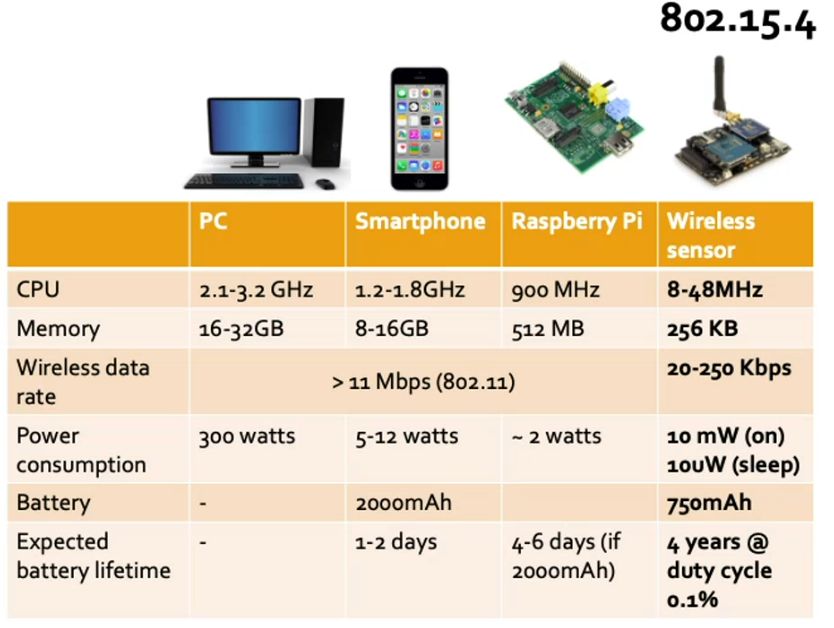
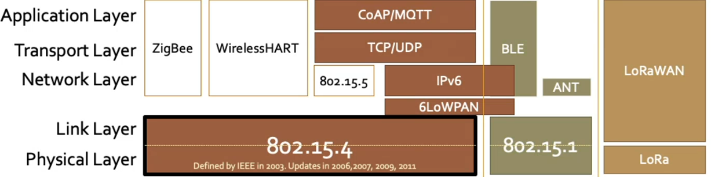
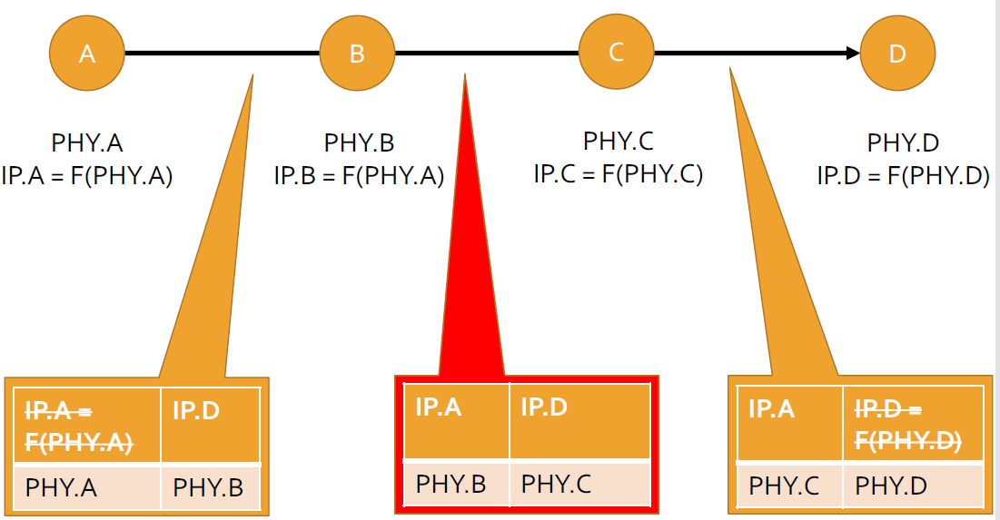

# Low-Rate Wireless Personal Area Networks

## Wstęp

### System nawadniania

Jesteśmy rolnikiem i chcemy mierzyć wilgotność oraz nawadniać pole w inteligentny sposób (nie, że codziennie o 10:00 i 18:00 tylko tak, żeby wilgotność cały czas była na optymalnym poziomie).

#### Raspberry Pi

Na rozwiązanie naszego problemu jest kilka sposobów i najprostsze by było raspberry PI, programujemy piny czujników wilgotności i piny od zaworów wody. Pomiary mogą być wysyłane np. za pomocą GSM, wi-fi. Będzie to działało, ale nie tak skutecznie.  Pierwszy problem do podłączenie raspberry PI do prądu. Możemy dołączyć akumulatory, ale trzeba będzie co jakiś czas ładować. Ogólnie pobór prądu naszego rozwiązania będzie zbyt duży do skali tego co my tak naprawdę chcemy zrobić

Jakie ma zużycie prądu takie raspberry PI?

Jak korzysta z Wi-FI to nawet 2 waty

Jakby te nasze akumulatory miały 20k mAh to, trzeba je ładować co 4-6 dni, no i jak mamy takich węzłów na polu, to jest to trochę kłopotliwe.

##### Co tak naprawdę jest problemem?

###### Wi-fi

Czy my na pewno do wysyłania pomiarków potrzebujemy aż taką prędkość?

Przecież wi-fi jest zrobione do przesyłania np. filmów HD w domu na fona.

Dodatkowo moduł wifi potrzebuje dużo energii, mimo, że my pomiary robimy np. co godzinę.

Tak na doczepkę, to jeszcze dodamy, że wifi to złożony protokół i ramki jego mają duże nagłówki w porównaniu do rozmiaru danych jakie będziemy wysyłać. 

Będziemy tu tak jakby marnować technologię. Przyniesiemy miecz i zbroję na walkę na pięści.

###### OS

Na raspberry Pi jest linux. Może wyłączajmy go na czas nierobienia pomiarów, i włączajmy na  czas pomiarów. Wtedy zaoszczędzimy energię. Ale, żeby to zrobić trzeba się znać na linuxie.

###### Hardware

Czy na pewno potrzebujemy aż tak mocnego procka jaki jest na raspberry Pi?

### Podejście IoT

W dziedzinie IoT zawsze musimy dobrze wybrać technologie do skali problemu i żeby zminimalizować zużycie energii. Np. są płytki o takie:

Bardzo małe zasoby i dzięki temu tanio oraz małe zużycie prądu.

Radio tutaj pozwala wysyłać na krótką odległość ramki, które mają nie więcej niż 128 bajtów.

## IoT Node

### IEEE 802.15.4

Zamiast wi-fi, do naszego rolnik lepiej pasować będzie technologia **IEEE 802.15.4**

Więc jak widać wybór odpowiedniej technologii zminimalizuje koszty, zużycie prądu i "pierdolenie się z tymi akumulatorami co 4-6 dni"

No i mamy kilka tych technologii IoT. Pierwszą jaką omówimy to Low-Rate Wireless Personal Area Networks LR-WPAN

## Low-Rate Wireless Personal Area Networks

Czyli bezprzewodowe sieci osobiste o niskiej przepustowości. Opisane w standardzie 802.15.4

802.15.4 to nie jedyny standard. Na rysunku mamy pokazaną taką mapkę dla IoT.

I np. 802.15.1 jest warstwą radiową i łącza dla protokołu **Bluetooth Low Energy**.

Kolejny standard to LoRa, która jest protokołem fizycznym dla całego stosu LoRaWAN.

Nad 802.15.4 możemy mieć wiele protokołów. 

ZigBee jest bardzo stary i teraz raczej idzie się w stronę CoAp/TCP/IPv6/6LoWPAN. Ale still warstwa radiowa jest ta sama, więc fajno. Ten nowy stos jest lepszy, bo wspiera IPv6, więc każdy węzeł jest w stanie podłączyć się bezpośrednio do Internetu. W ZigBee potrzeba jakiegoś gateway'a, który będzie robił transalcję pomiędzy ZigBee a IPv6.

### Wymagania na 802.15.4

- Ogólnie w IoT mamy dużo, małych węzłów. Więc chcemy po pierwsze, żeby było to tanie. Sama aplikacja nie będzie jakimś czymś mega, bo tylko monitoruje, więc userzy nie będą chcieli inwestować tak dużo pieniędzy.
- Koszt utrzymania powinien też być niski na jedno urządzenie, no bo będziemy mieć ich bardzo dużo. Czas życia baterii też chcemy długi, żeby nie pierdolić się z akumulatorami co 4-6dni. 
- Apki mają robić proste rzeczy, no więc niech same będą mega izi, do zrozumienia i zaprojektowania. Danych nie będzie też wysyłanych jakoś dużo, więc nie potrzeba jakiś wymyślnych nadajników/odbiorników

To wszystko sprowadza się do tego, że apka oraz urządzenie, nie działa non-stop (jak np. serwer) tylko od czasu do czasu. To się nazywa **niski cykl pracy**. Czyli od czasu do czasu apka coś zrobi, a potem urządzenie zmienia tryb na spanko.

#### Jak 802.15.4 je spełnia?

Standard od razu zakłada, że wspiera tylko takie apki, które działają nie więcej niż 1% czasu.

Zakłada modulacje tylko do przesyłania danych cyfrowych. Dodatkowo radio nie marnuje zasobów na robienie QoS. Dzięki tym krokom urządzenia są mega tanie.

### Typy urządzeń

Standard definiuje dwa typy urządzeń:

- **Reduced Function Device** (RFD)
- **Fully Function Device** (FFD)

FFD mogą też przekazywać wiadomości sąsiadów.

### Komponenty Sieci 802.15.4

Są 3 role w sieci PAN:

- **PAN Coordinator**
  - Koordynator sieci osobistej
  - Tylko jeden w całej sieci
- **Coordinator**
  - Zwykły koordynator
  - 0 lub wiele
  - proxy dla koordynatora PAN do devic'ów gdzie PAN Coordinator nie ma zasiegu
- **Device / Node**
  - Urządzenie
  - Ich może być wiele,
  - one posiadają czujniki 

Typ RFD może zostać tylko Device'em, nie może być koordynatorem.

### Topologie

Są tylko dwa rodzaje.

Oczywiście mówimy tu tylko o drugiej warstwie, jeżeli na urządzeniach będzie IPv6, no to warstwie sieciowe możemy mieć taki full-mesh (każdy z każdym połączony).

### Kontrola błędów

W ramach prostoty no to mamy tylko 2 mechanizmy:

- Simple Full Handshake
  - Potwierdzenie otrzymania ramki
- CRC
  - Suma kontrolna zawierająca tylko 16 bitów

> Nie jest tak złożone jak Wi-Fi, że ma kilka modulacji, czy coś.

## Typy systemow

Różnia się tym jak zasilane są FFD (Fully Functional Device), czyli naprzykład koordynator. Z racji różnic jakie z tego wynikają, to protokół ma dwie wersje.

- Non-beacone enabled
  - Gdy FFD mają stałe zasilanie

- Beacon-enabled
  - Gdy FFD są zasialne na baterię

### Non-beacon Enabled

Urządzenia mają zasilanie stałe i wtedy zalecane jest korzystać z tej wersji protokołu.

Device jest RFD, więc co jakiś czas będzie chciał iść na spanko, ale co jakiś czas obudzi się, żeby wysłać. No, ale że PAN Corrdinator jest non stop zasialny, to jest włączony cały czas i cały czas nasłuchuje.

Natomiast w drugą stronę jest problem.

Koordynator może mieć ramkę do wysłania dla device'a, ale nie wie, czy on jest uśpiony czy w trybie pracy. 

> A pamiętajmy, że śpi 99% czasu.

Jeżeli koordynator wyśle ramkę do śpiącego urządzenia no to nie zostanie ona odebrana ofc.

Jak to rozwiązać?

#### Indirect Data Transfer

Urządzenie jak się obudzi, to wysyła do koordynatora "ej mordo jestem awake". A raczej nie tak mu powie, tylko zapyta "są do mnie jakieś ramki od Ciebie?".

Urządzenie jak dostanie coś z czujnika, to się budzi i wysyła dane. Device może poprosić o ACK przy wysyłaniu i dostanie potem ACK. Taka sytuacja wystąpiła na rysunku.

No i urządzenie poszło znowu spać. Teraz jak się budzi to wysyła ramkę **Data request** pytającą, czy w kolejce koordynatora są jakieś ramki dla niego. Koordynator wysyła ACK, że dostał tę ramkę, a potem wysyła ramki dla tego urządzenia. No i na końcu device wysyła ACK.

**Indirect Data Transfer** - Pośredni Transfer danych.

#### Problemy

- Pierwszy to taki, że jest duże opóźnienie. Urządzenie nie dostaje danych od koordynatora od razu. 

- Dodatkowo Device często traci energię na Data Request, który idzie na marne, bo kolejka koordynatora dla niego jest pusta.

- Kolejny to taki, że kolejka koordynatora jest skończona i może się zapchać, i 

### Beacon Enabled

W tym przypadku koordynator też jest na baterię, więc też od czasu do czasu śpi.

**Beacon** to jest wiadomość sygnalizacyjna, wysyłana przez koordynator do wszystkich urządzeń, żeby cała sieć wiedziała to samo info (np. czas). 

Dzieki beaconowi można synchronizować nadawanie i odbieranie w całej sieci, czyli, żeby device'y budziły się w tym samym czasie co koorydnator, następuje wtedy wymiana wiadomości i znowu spanko. No i jeśli mamy synchronizowany czas w całej sieci to jest to mega łatwe.

#### Superframe

Format ramki Beacon wygląda tak:

Beacon jest wysyłany co ***beacon internval*** [s].

Jak widać w sieci mamy timesloty w których mogą wysyłać koordynator a potem urządzenia.

> Chodzi o to, żeby się wzajemnie nie zakłócać.

Więc wygląda to tak, że sieć sobie śpi jakiś czas, potem się budzi jest wysyłanie i potem znowu idzie spać.

To wysyłanie jest robione w sposób zorganizowany i ta organizacja tych slotów czasów kiedy ktoś może wysyłać to **Superframe**:

- Na pierwszym timeslocie superramki jest wysyłany beacon.

- Potem szary ciemny okres to **okres rywalizacji o dostęp do medium**
- Potem szary jasny okres czyli **okres bez rywalizacji**

Po upłynięciu timeslotów superramki znowu mamy czas bezaktywnośc całej sieci.

##### Beacon 

Zawiera info:

- jak często transmitowany jest ten beacon
- Jak długi są okresy **awake** oraz **sleep**
- Jakie są już zarezerwowane timesloty
- Czy są jakieś dane do odebrania przez device'y

##### Contention Access Period

Tu korzystane jest z protokołu CSMA/CS - Carrier Sense Multiple Access with Collission Avoidance.

Tu urządzenia mogą coś wysyłać.

##### Contention Free Period

To trwa tylko 8 timeslotów i w nich mogą nadać tylko te urządzenia, które mają skonfigurowane, żeby w nich nadawać (guaranteed time- slots)

#### Warianty

W zależności jak często wymieniane są dane mamy 3 warianty:

- Non-synchronized
  - bo by była nadmiarowa, ale beacon zostawiamy
- Synchronized
- Guaranteed Time Slots

No i w zależności od apki wybiera się jeden z wariantów.

##### Non-synchornized

Brak synchronizacji polega na tym, ze urzędzania nie mają nakazane budzić się wtedy co transmisja superramki. Nie muszą w ogóle synchronizować swojego zegara z tym co zostało wysłane w Beacon'ie.

Czyli device jest w uśpieniu i dopiero jak będzie chciał coś wysłać (czujnik wyśle pomiar, będzie napięcie na pinie), to wstaje i pozostaje awake aż doczeka się wieloramki. 

Podczas tego czekania nic nie wysyłają itp.

> Względem Non-Beacon Enabled to jest dobre, bo koordynatory też mogą chodzić spać i oszczędzać energię.

**Jeżeli są dane od koordynatora do urządzenia:**

No to po prostu używa okresu **Contention Access Period**, żeby wysłać do urzędzania.

> Nie wiem skąd koordynator ma wiedzieć czy device jest wtedy awake czy śpi.

##### Synchornized

Taki klasyczny Beacon-Enabled, czy czas urządzeń jest zsynchornizwany z czasem koordynatora.

Wieć urządzenia budzą się na czas kiedy ma być nadany beacon.

Nawet jak nie mają nic do wysłania, to się budzą na początek superramki, żeby zsynchronizować czas.

Na rysunku mamy dwie takie pętle, ale w następnej superramce okazuje się, że device ma coś do wysłania, albo coordinator ma coś dla device'a tak czy inaczej urządzenie nie idzie wtedy spać (wie, żeby tego nie zrobić, bo albo wie, że ma coś wysłać, albo odczytało z beacona, że koordynator ma coś dla niego) i korzystane jest z okresu Contention Access Period.

##### Guaranteed Time Slots

Tutaj korzystane jest z okresu Contention Free Period. Każdy device ma po prostu swój slot i tyle. Ale takich slotów wspierane jest tylko 8.

> Zauważ, że można mieszać ten wariant z jednym z tamtych w jednej sieci.

### Posumowanie transmitowania danych

W Non-beacon mamy problem z ogarniczoną kolejką w koordynatorze. Więc fajnie by było jakby apka w device co jakiś czas pilnowała, żeby odpytać koordynator. No ale wtedy musimy budzić urządzenie co jakiś czas więc mamy tu taki kompromis między albo zużywamy więcej energii w RFD, albo więcej pamięci w FFD.

W Beacon-enabled mamy oszczędzanie energii, bo koordynator może iść spać, ale z racji, że musi wysyłać te beacony, no to i tak nie jest tak super xd

## Adresowanie i format ramki

Koniec z warstwą dostępu do medium omówmy adresację!

Adresy 802.15.4 mogą być krótkie albo długie.

Długie są dłuższe niż aders MAC z warstwy ETH.

A te krótkie są przydzielane przez koordynatory po dodaniu urządzeń do sieci. Koordynator przydzieli i od tego momentu urzędzenia mogą korzystać z tych adresów. 

**Dlaczego są dwa rodzaje adresów?**

W każdej ramce mamy 128 bajtów. Nagłówki z warstwy aplikacji, nagłówki 802.15.4 i pomiary muszą się zmieścić w 128 bajtach. Ramki nie mogą być dłuższe.

Oczywiście nagłówki 802.15.4 muszą mieć i src address jak i destination address, więc na wstępie tracimy 16 bajtów na same adresy.

16 bajtów przy 128 to jest więcej niż 10% na same adresy ==> wprowadzono te krótkie adresy

Jedyna komplikacja jaka jest wprowadzana to mapowanie jakie musi mieć koordynator. Urządzenia nie potrzebują mapowania, no bo gadają tylko i wyłącznie z koordynatorem. Jak chcą wysyłać dalej, no to to już jest robione przez wyższe warstwy.

### Sieć domowa + WPAN

Załóżmy, że mamy taką małą sieć, że zawiera tylko jeden koordynator i jedno urządzenie i po drugiej stronie chcemy mieć apke na fonie, która odbiera ramki od urządzenia. No i jeśli chodzi o protokoły to tak to  wygląda. 

Koordynator musi posiadać dwa interfejsy fizyczne, że umieć porozmawiać z jednej stronie w ETH a z drugiej po 802.15.4. Musi poszatkować ramki ETH i upchać je w te mniejsze ramki 802.15.4.

Jak mamy w każdym urządzeniu obsługe IPv6, no to możemy jego użyć do adresacji.

Zauważmy, że Application Protocols mamy tylko w fonie i urządzeniu końcowym. Apka w fonie wyświetla jakiś pstryczek ON/OFF, a apka w devic'ie to tylko taka, która jak dostanie wiadomość protokołu apki "Wyłącz światło", to robi coś, żeby podać napięcie na pinie do kontaktu. Koordynator nie musi w ogóle mieć nic z tych apke, on tyle przekazuje pakiety.

> ZigBee np. to ma własny jeden protokół na wszystkie warstwy, więc router by nie musiał robić takiego mapowania ale ZigBee nie obłsuguje IPv6, więc  między fonem a koordynatorem musiałby być mapowanie.

#### Sprawność ramki

Mamy tu nagłówek protokołu IPv6.

Jak widać sam nagłówek IPv6 ma 16 bajtów  ( amaksymalna długość ramki 802.15.4 to 128 bajtów).

No to teraz umieszczając taki nagłówek mielibyśmy taką sytuację:

^To na końcu to korekcyjne 16 bitów CRC.

Czyli nagłówki by zajęły 57% ramki 802.15.4, więc mamy słabe wykorzystanie ramki, mała sprawność. Po co robić wszystko takie oszczędne jak potem używamy mniej niż połowa tego XD

> A załóżmy, np. że pomiar z żarówki to tylko 2 bajty, wtedy nasze prawdziwe dane to 1.5% ramki, nagłówki 57% więc XDv2

Co zostało zaproponowane?

6LoWPAN

### 6LoWPAN

Technologia która siedzi pomiędzy IPv6, a 802.15.4. 

Pozwala, żeby IPv6 (no bo to jego header jest największy) pracowało skutecznie w tej naszej małej ramce z 802.15.4

#### Kompresja nagłówków

6LoWPAn po prostu kompresuje nagłówki, ale jak?

Trzeba sobie przypomnieć jak adresy IPv6 są przydzielone w sieci.

SLAAC generuje takie defaultowe adresy IPv6 na podstawie adresów fizycznych - MACów.

Jak działa to zależy od technologi w L2. W przypadku ETH MAC ma 6 bajtów, wieć SLAAC dodaje na środek dwa bajtu (U i M na rysunku), żeby było 8 bajtów i ma końcówkę adresu IPv6. Początówka to prefix taki sam dla całej sieci.

No a w przypadku 802.15.4 to te adresy długie mają już 8 bajtów więc nie trzeba im nic dodawać. Dodajemy na początek tylko prefix sieci i już mamy adres IPv6. 

No i co mówi "Teoria kompresji danych"? Że co jest redundantne - trzeba skasować.

Skoro wszystkie urządzenia i koordynatory mają ten sam prefix, bo należą do tej samej sieci, no to możemy ten prefix wywalić, bo w każdej ramce te 64 bity są takie same.

Prefix załatwiony a co z sufixem?

No one się biorą przecież z adresu fizycznego MAC urządzenia, więc jeśli mamy je już wpisane w nagłówku 802.15.4, to po co znowu w IPv6?

Dodatkowo wyrzucamy *Traffic Class*, no bo to jest od QoS, a w 802.15.4 nie ma QoS. Tak samo *Flow Label*

*Payload Length* też nie trzeba. Więc Zostają tylko 3 pola IPv6, które powinniśmy kodować i nagłówek ma tylko 40 bitów już :happy:

#### Ale nie zawsze można 6LoWPAN

Jak mamy wiadomość L3 z A do B, to używając L2 do jej wysłania możemy po prostu zmapować adresy L3 na L2 (na rysunku F() to właśnie funkcja mapowania). No i wtedy możemy wykasować adresy warstwy sieciowej z nagłówka IPv6.

Ale zauważmy, że jak mam 3 węzły to już 6LoWPAN nie może zostać w pełni wykorzystane.

Mamy wiadomość L3 gdzie `src=A, dst=C`. 

To teraz wysyłać ją przez L2 nie możemy skasować adresu dst z L3, bo jest on inny niż adres odbiorcy w L2, bo wysłamy pośrednio przez węzeł B.

Możemy za to tworząc ramkę w wężle A skasować z nagłówka L3 jego adres, bo i tak będzie w L2. Tak samo tworząc ramkę w węźle B widzimy że adres odbiory L3 i L2 jest taki sam*, więc też wytniemy go z nagłówka IPv6.

> *Nie taki sam, ale na podstawie tego z L2 można zrobić ten z L3.

Przy dwóch węzłach pośrednich już w ogóle nie jesteśmy w stanie skorzystać z 6LoWPAN w jednej z  ramek.

##### Wniosek

Wniosek jest taki, że 6LoWPAN najlepiej działa  w sieci gdzie między Edge Routerem (który jest zazwyczaj głównym koordynatorem), nie ma żadnych węzłów pośredniczących. Czyli sieć jest mała geoprzestrzennie, skoro koordynator sięga do każdego device'a.

#### Max możliwości

Jak warunki sprzyjają, to procent nagłówków w ramce mocno spada.

GTS - Granted Time Slots - jak używamy tego, to nie musimy nawet używać żadnych adresów w ramkach, bo można zrobić mapowanie time-slotów na adresy. 

Minimalny nagłówek 802.15.4 wynosi 11 bajtów!
