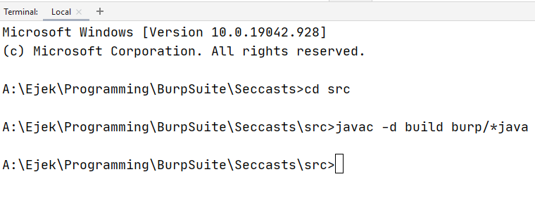

# Jak stworzyć wtyczkę do Burp Suite w Intellij Idea

Poradnik to taki follow tych dwóch źródeł:

- https://www.youtube.com/watch?v=wR1ENja0lI0
- https://portswigger.net/burp/extender/writing-your-first-burp-suite-extension#top

## 1. Stwórz nowy projekt w Intellij Idea

### 1.1 Czysta Java


### 1.2 Bez żadnego template'u


### 1.3 Finish


## 2 Przekopiuj pliki interfejsów z BurpExtender

### 2.1 Przekopiuj pliki

Wejdź to BurpSuite. W zakładki widoczne na obrazku.


Zapisz te pliki do folderu `src` stworzone w `1` projektu.

Powinno się pojawić coś takiego w Intellij


## 3 Plik `BurpExtender.java`

Teraz w paczce `burp` trzeba stworzyć klasę o nazwie `BurpExtender`.


I skopiuj tam następujący [kod](https://portswigger.net/burp/extender/writing-your-first-burp-suite-extension#top):

```java
package burp;
public class BurpExtender implements IBurpExtender
{
	public void registerExtenderCallbacks (IBurpExtenderCallbacks callbacks)
	{	
		// your extension code here
	}
}
```

Chcemy mieć taki plik:


## 4 Build

Wejdź w folder `src`

Aby zbudować paczkę `burp` używamy takiego polecenia:

`javac -d build burp/*.java`



Na rysunku nie ma kropki. Też działa, ale lepiej, żeby była.

Omówienie komendy:

- `javac` - to kompilacja. Czyli zrobienie z plików `.java`, pliki `.class`.

- `-d build` - opcja `-d` służy do podania *directory* gdzie mają zostać umieszczone pliki `.class`

- `burp/*.java` - to podanie plików jakie mają zostać skompilowane. U nas są one w folderze `burp`, co zaznaczyliśmy przez `burp/`, chodzi nam o wszystkie plik z tego folderu z rozszerzeniem `.java`, co zaznaczyliśmy przez `*.java` (`*` oznacza, że wszystkie).

## 5 Stworzenie pliku .jar

Używamy komendy

`jar cf seccasts.jar -C build burp`


Omówienie komendy:

- `jar` - to komenda do tworzenia plików `.jar`
- `cf` -  "create file"
- `seccasts.jar` - nazwa tworzonego pliku

- `-C` - [opis tu](https://docs.oracle.com/javase/7/docs/technotes/tools/windows/jar.html)

Powinien się pojawić plik `nazwa_wtyczki.jar`


## 6 Import stworzonego jara do BurpExtendera

Wejdź tu, kliknij Add


Wybierz plik jaki trzeba za pomocą `Select file ...`

Kliknij `Next`.


Powinno się pojawić okno naszej wtyczki.

Z racji, że ona nic nie robi, jest ono nieco biedne.


