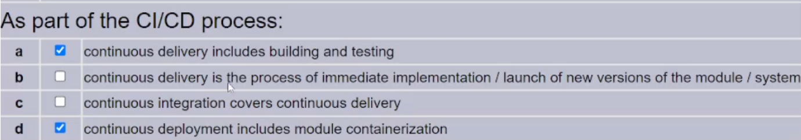
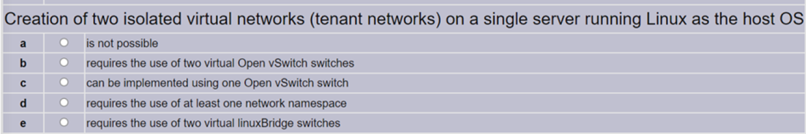

## SDN


SDN protocol is the OpenFlow for example.

What implementation models exist?


And why?


1. Vendor has a product already on the market. He want to add the OpenFlow to it. But suddnely it occurs that the previous technology puts some contraints on the OpenFlow implementations
2. Vendor wants to deploy OpenFlow in the MNO network, but MNO has some legacy technologies, and cant just deploy brand new technology in the PURE form


d - no definicja control plane i controllera

b - to jest potrzebne zeby zrobić `d`

c - jak juz masz topo to to staje sie clue


Tak jest ugułem w telco przecież.

## Openstack


HEAT/HOT to orkiestracja na poziomie infrastruktury


OpenStack jest IaaS (ten najniższy level chmury)


nowy template (mimo iż wypełniony starym contentem) to nowy stack

tu jest ze np zrobimy tak:

```yaml
host:
 OS: linux 2.3.1
 RAM: 4GB
```

no i zbudowaliśmy taki stack, a teraz cyk modyfikujemy template na taki

```yaml
host:
 OS: linux 2.8.1
 RAM: 2GB
```

I robimy apply na stack, to stack sie zmienia

no, ale my jednak ten pierwszy template skopiowaliśmy sobie i teraz do tego stacka mówimy ze ma być zrobiony wg. tego template:

no to stack znowu jest taki:

```yaml
host:
 OS: linux 2.3.1
 RAM: 4GB
```


a - no to prawda chyba wtf

b - no to nie, tu tylko infra masz

c - tenant nie definiuje tego

d - a czyli 'a' jest złe, bo na IaaS robimy cały STACK, a nie tylko VM. 

## self-service/tenant network


## iptables - p3


W EINES taktyka jest taka:

szukaj odpowiedzi które nie pasują, bo jedne są dobre, a inne są TOTALNIE Z DUPY

## REST


REST jest właśnie fasadą dla jakiejś bazy danych. Ale tu chodzi o kod apki

Bez sensu to pytanie


## dnsmasq


dnsmasq is free software providing:

- DNS caching, a 
- DHCP server, 
- router advertisement and network boot features,

intended for small computer networks.


No i Myco pokazał jak można użyć go, żeby zrobić DHCP dla różnych network namespaces

## Devops


Devops to automatyzacja wszystkiego co jest po commicie.


No i też daje to że jest Developemtn and Operations team w jednym. Znają cały system na bakier od a do z. Ale ten system to bardzo malutki wycinek software, dlatego idealnie się to nadaje do microservisów.


a) - tak, bo to jest idealne dla małych systemików, bo cały tim zajmuje od specki do eksplo, wiec duzy zakres obowiazkow, ale dzieki temu szybko przepływa wiedza między etapami, a systemy są małe więc nie są takie complexy i sobie poradzą z tym chłopaki

b) - akurat automatyzacja jest nie na specyfikowaniu i pisaniu kodu, tylko na tym co sie dzieje po commicie

c) - tak, ludzi w timie są zarówno programista ale tez i musza sie znac na deployu, tez na specyfikacji i wgl

d) gdyby tylko testing przenieś na tę drugą stronę to by było idealnie. Ale no separacja polega na tym, że to co po commicie dzieje sie automatycznie wszystko


a - nie, to jest do microservices

b - tak, to co po commicie to jest kurna automatyzowane

c - tak, tez wszystkie fazy są zintegrowane, wręcz się przenikają, dzieją się króciótko, np. całość w 2 tygodnie

d - nie, tak było w waterfall, teraz jest zero formalizacji, luźna gadka w timie



**Continuous Integration** - Developers practicing continuous integration merge their changes back to the main branch as often as possible. The developer's changes are validated by creating a build and running automated tests against the build.

**Continuous delivery** is an extension of continuous integration since it automatically deploys all code changes to a testing and/or production environment after the build stage. Czyli oprócz testów na repo, idzie to na test env lub prod env i tam juz sa testy manualne.

**Continuous deployment** goes one step further than continuous delivery. With this practice, every change that passes all stages of your production pipeline is released to your customers. There's no human intervention, and only a failed test will prevent a new change to be deployed to production. Czyli już totalnie wszystko idzie aż na produkcje. Ale wiesz że nie odwali się lipa na prodzie, bo te checki wszystkie wcześniej są gitem.

**integration to oznacza ze programisci integrują swój kod, delivery, to że ten kod od razu jest zamieniany na apke i trafia na środowisko dla testerów manualnych, deployment to ze po prostu automatycznie software leci non-stop do klientów aż**

## OpenFlow


Mamy dwa opposite tryby:

- reaktywny - zaczynam dbac o zdrowie gdy jest lipa
- proaktywny - zaczynam dbac o zdrowie duzo wczesniej zeby nigdy lipy nie było

W openflow to się przekłada tak:


Reactive - controller reaguje na PACKET_IN od switcha

Proactive - contoller instaluje jakieś już flow entry do switcha zanim ten wgl cokolwiek dostanie, a skąd ma controller wiedzieć co mu wysłać za konfig? To już my ludzie wiemy, wiemy będzie to na Northbound interface w arch. poniżej:


Coś przyszło do switcha, no to on cyk odpowiada, to jest REACTIVE


Coś przyszło do switcha, to on może tak, albo ma flow entry, to robi forward na odpowiedni port, albo ma zapisane, w action, żeby zrobić drop, albo nie zna tego pakietu i musi do wysłać do Controllera w PacketIn.


## Orchestration 


Subset

no i wiadomo automatyzacja czyli eliminacja ludzi


Czyli tylko mówisz intenty a wszystko samo sie robi i naprawia


## VNF


Computing power virtualization - czyli wirtualiacja RAM&CPU

a - to jest nieprawda

b - tak, kiedyś właśnie problemem było to, że serwery były zwymiarowane na max load, wiec averagae byly obciążone np. na 20%

c - z powyższego teraz zamiast 5 serwerów mozna mieć jeden

d - no teraz jeden serwer jest mocniej uzywany wiec tak

## Cloud deployment models


d - pasuje jak ulał


## Cloud usage architectures


## microservices vs monolith


a - kiedys był software po prostu robiony na zwykły komp, zwykłą wirtualke, nie ma tu żadnej różnicy

b - mikroserwisy totalnie łatwiej się skalują

c - tigher - nie, małe komponenty, to jest luźno połączone

d - testy jednostkowe są mega izi


a - małe rzeczy potem łączysz więc izi development

b - 

c - małe komponenty luźno połączone

d - Poszczególne funkcje jest izi przetestować bo są mikroserwisami.

## VLAN - networking


a - moze tez być w WAN

b - tak, bo po prostu zrobimy sobie boradcast domain i nie bedzie az tyle tych ramek 

c - prawda, dodajemy ten Vlan Tag i mozna miec izolowanie na jego podstawie

d - i wlasnie ten VLAN Tag w DC jest stosowaned


## Linux Bridge


c - ma najwiecej sensu


Switch się uczy to znaczy zapisuje sobie na jakich portach jakie mu się adresy MAC odezwały.

Pytanie jest formułowane w czasue gdy przyszedł pakiet stąd confusion.


## declarative vs imperative


a - źle

b - nie pasuje -> źle

c - to je dobre, yaml nie musisz znac specyfiki tego co piszesz skrypt i taki yaml mozesz wykorzystac wiele razy jak vendor ma odpowiednie api skryptowe popisane

d - każe zaznaczać all odpowiedzi, a przecież a i b jest źle

## openvswitch




## Gitlab


a - jest managed bo to tu jest skrypt Ci/CD i to Gitlab jest od tego

b - no te moduły skompilowane to już są na jakiej innej maszynie deydkowanej do tego

c - tu jest centrum zarządzania, ale te akcje wykonywane są gdzie indziej,  na innych maszynach

d - no toć git jest od tego wlasnie primarly 