# KRI kolos2

# MPLS

Obecnie jest bardzo popularną techniką stosowaną w szkieletowych sieciach operatorów ISP

- Wirtualizacja i zarządzanie zasobami i usługami w sieci
- Inżynieria ruchu, QOS
- Ochrona sieci przed skutkami awarii

Rozszerzenia:

- GMPLS w kierunku domeny optycznej
- Seamless MPLS - w kierunku sieci dostępowej

## Switching vs routing


Kluczowe jest tu to, że router jak dostanie pakiet to podmienia nagłówek L2 (np. ETH), no bo fizycznie ten pakiet, będzie miał już inną destynacje. Switch z kolei to taki smart skrzyżowanie kabli. On nie modyfikuje pakietu, tylko odczytuje do którego urządzenia to ma iść.


Router wymyśla trase, switch ją odczytuje.

## Routing IP vs Routing MPLS


Jak widać MPLS nie ma fazy IP lookup która jest długa.

Ta Data to może być pakiet IP ofc.

## FEC

**FEC - (Forwarding Equivalence Class)**

Router brzegowy MPLS na podstawie FEC przypisuje path do pakietu.

LER - Laber Edge Router

LSR - Label Swtiching Router


LIB - Label Information Base, element control plane, uruchamiany gdy trzeba wymyśleć etykiete dla przychodzącego pakietu w LER, lub gdy L(E/S)R muszą się dogadać na etykiety (np. w RSVP).

LFIB - to jak już tunele są zestawione to tu jest info jak na ich podstawie kierować. Czyli tu jest czwróka {in_port, in_label, out_port, out_label}.


P Router - Provider router, one są MPLS::LSR

PE Router - Provider Edge Router, one są MPLS::LER

I to co ważne to że **FEC lookup** jest tylko w LER/iLER (i od ingress), a w IP, IP lookup jest w KAŻDYM węźle.

## Tunele


Pakiet ubierany jest w stos etykiet. Na tych etykietach organizujemy tunele.

Ruter jak przetwarza ten pakiet to idzie od dołu obrazka. Najpierw zdejmuje L2 Header, potem patrzy że jest tu MPLS header, więc uruchamia kod MPLS_Handler i ten handler, już patrzy w LFIB, czy ma podmienić etykietę, czy zrobić POP i patrzeć na następną itd.


Tu na przykłądzie jak przyjdzie klasa FEC::C to musimy ją dać w etykietę 200 i przekazać do R2, inne FEC olewamy (MPLSowo olewamy). Router R2 patrzy ze jak przyszła etykieta 200 to ma zrobić MPLS::SWAP na label 100 i dać do R3. R3 jak przyjdzie label 100 to ma zdjąć etykiety (usunąć header MPLS) i rozpatywać pakiet jako IP packet.


Routery P są tylko i wyłącznie w domenie OSPF operatora. 

Router PE oprócz tego są w sesji BGP z siecią klienta. 

No i z racji, że OSPF rozgłasza jakie ma prefixy dostępne, to jak przyjdzie pakiet do PE, to PE wie gdzie go kierować, więc jako router MPLS::LER nadaje etykietę temu pakietowi i  tworzy tunel aż do tamtego adresu (jak tworzy się ten tunel to potem - protkoly LSDP/RSVP).

**Zestawianie tuneli**

Wymaga:

- informacji o osiągalności poszczególnych prefixów (FEC) = protokół OSPF dystrybucji prefixów
-  informacji o etykietach między routerami (LDP, RSVP-TE)

## LDP oraz RSVP


//TODO obczaj ocb z tym Downstream Unsolicited, Downstream on Demand

LDP:

- automatycznie tworzy tuenel w oparciu o FEC.
- brak TE
- oparty o protokół IGP

RSVP-TE

- ma TE
- nie jest powiązany z niczym (especially IGP)

### LDP


Spójrz na LFIB, ona mówi że jak przyjdzie label 17 od 3.3.3.3 to etykiete podmieniasz na 21 i wychodzisz interfejsem F0/0.

### RSVP-TE

RSVP-TE generally allows the establishment of [Multiprotocol Label Switching](https://en.wikipedia.org/wiki/Multiprotocol_Label_Switching) (MPLS) [label-switched paths](https://en.wikipedia.org/wiki/Label-switched_path) (LSPs), taking into consideration network constraint parameters such as available bandwidth and explicit [hops](https://en.wikipedia.org/wiki/Hop_(networking)).[[1\]](https://en.wikipedia.org/wiki/RSVP-TE#cite_note-rfc3209-1)

TE - Traffic Engineering


LSP - Label Switching path

RSVP jest lepszy od LDP, bo:

- jest niezależny od IGP

- automatycznie oblicza sciezki

- ochrania tunele przed skutkami awarii

  


Najpierw idzie wiadomość PATH, na rezerwacje etykiety, na tym łączu, no to potem R2 znowu PATH do R3, R3 wysyła PATH do R4. R4 patrzy ze u niego tunel ma się skonczyć, więc wysyła RESV i mówi jaką z jaką etykietą słać do niego pakiety w ramach tego tunelu, R3 to dostaje, więc wysyła RESV do R2 i też mówi jaka etykieta dla tego tunelu i tak aż do R1, który po otrzymaniu RESV mówi "ok, tunel zestawiony."


#### TE - APC/CSPF

APC - Advanced Path Calcutlation

CSPF - Contrained Shortest Path First


### TE - wymuszenie przebiegu tunelu


ero - **explicit** route object - The ERO is a list of LSRs – specified by IP addresses – through which the path must pass.

#### TE - skąd router źródłowy zna stan zmiennych TE? 


#### TE - priorytety i wywłaszczanie


#### TE - bandwidth reservation styles


## Mapowanie strumieni IP na ścieżki MPLS


## Ochrona przed awariami

### Secondary LSP


### Fast Reroute


Secondary LSP to info o PATH ERROR musi dotrzeć aż do source, czyli LER. A w Fast Reroute już pierwszy LSR na któym sie zepsuje link podejmuje akcje.

## Point-to-Multipoint


## DiffServ TE

DiffServ TE - DiffServ Aware Traffic Engineering.


### Max Allocation Model


### Russian Doll Model


### Rozszerzenie i aplikacje


### Pytania z kolosa


Odpowiedz na te pytania ze zrozumieniem.

# BGP

## Intro

BGP jest protokołem typu Distance Path Vector.

> With distance vector routes are advertised based upon the following **characteristics**:
>
> - **Distance** - How far the destination network is based upon a metric such as hop count.
> - **Vector** - The direction (next-hop router) required to get to the destination.
>
> This routing information is **exchanged between directly connected neighbours**. Therefore when a node receives a routing update, it has no knowledge of where the neighbour learned it from. In other words, the **node has no visibility of the network past its own neighbour**.

> In **Link State routing**  each node is advertising/**flooding** the **state** of their **links** to every node within the link state domain. This results in each node building a complete map of the network (**shortest path tree**), with itself as the root using the shortest path first algorithm, also known as the Dijkstra algorithm.


## Sesje i-BGP

BGP speaker dostanie ścieżke od jakiegoś sąsiada z innego AS w sesji e-BGP. To więc, żeby inne rutery też umiały trafić do tego prefixu musi on rozesłać to do każdego rutera w swoim AS (dlatego potrzebujemy **full mesh** w sesjach i-BGP). To jest podstawowa funkcja!


Dodatkowo zauważ, że jak jakiś ruter na drugim końcu AS dostanie to rozgłoszenie, to on też z kimś jest w sesji e-BGP i podzieli się  tą ścieżką z innym AS. Dlatego drugą funkcja jest:


## Split Horizon


Spójrzmy na przykład Router A dostał od innego AS lub swojej sieci lokalnej jakiś prefix. Rozgłasza go więc do swoich BGP neighbor czyli B i F. Oni rozgłaszają na wszystkie inne interfejsy, ale nie te skąd dostały. Rozważmy naprzykład router E. On w t=3 dostał od B i F prefix, rozgłosi go więc tylko na interfejs do D. D z kolei nigdzie nie rozgłosi, bo dostał już ten prefix na każdym swoim interfejsie.

## BGP free core


Dzięki temu w Core nie potrzeba sesji i-BGP hop-by-hop każdy router a tylko routery brzegowe.

## Wiadomości i bazy danych


Najważniejsza dla nas jest wiadomość UPDATE. Przypominka, że jak Distance Path Vector wysyła ścieżkę, to podaje Distance i Vector. W BGP ścieżka jest identyfikowana jako **NLRI (prefix)**, Vector to atrybut **next-hop** (jeden z BGPAttributes) a Distance to reszta **BGP Attributes**. 

## BGP Attributes


### well-known mandatory

#### AS PATH


**Path Prepending**


Czyli sterujemy ruchem wchodzącym, rozgłaszamy nasz prefix, ale dla różnych ścieżek dajemy różną liczbę naszego ASN w AS PATH

**Path poisoning** - warto tu wspomnieć o takiej sztuczce, że jak dopiszemy do AS-Path ASN jakiegoś AS'a  (np. teściowej), to routery z tego AS'a będą odrzucać to rozgłoszenie (ze względu na mechanizm, które nienawidzą pętle routingowe).

**Agregacja adresów i AS_PATH**


#### Next-hop


#### Origin

Info o tym skąd pochodzi prefix.

- IGP - pochodzi z sieci lokalnej do której router jest podłączon
- EGP - pochodzi on innego AS
- Incomplete - inne przypadki niebezpośrednich metod rozłaszania prefixów za pośrednictwem BGP -> 

### well-known discretionary

#### local preference


Czyli jak router C dostanie dwa rozgłoszenia tego samego prefixu to wybierze next-hop ten router, który przy rozgłoszeniu dał WIĘKSZY local-preference.

Jest to narzędzie do ruchu wychodzącego

### optional non-transitive

#### MED


Parametr MED sugeruje sąsiedniemu AS'owi, którym naszym routerem ma wchodzić do nas ruch o danym prefixie. (ofc. bez wcześniejszych ustaleń biznesowych zostanie to zignorowane).

Jest to inżynieria ruchu wchodzącego

## Narzędzia do Inbound i Outbound Traffic

Outbound Traffic:

- Local Preference

Inbound Traffic:

- MED
- Path Prepending

Outbound traffic jest mega prosty do wysterowania, bo to my nim sterujemy, więc tu wystarczy local preference i elo.

Ruch wchodzący Tutaj już jest trudno, musimy skłonić świat, aby działał wg. naszego widzimisie. 

## Redukcja sesji i-BGP


### BGP Confederations


Wydzielenie sub-ASów w ASie.

### Route Reflector


Otrzymując ścieżke od non-client rozgłsza ją do swoich clients (bo nimi się opiekuje) do eBGP, ale nie do non-client, bo nim opiekuje sie jakis inny RR


## BGP Community

BGP Community jest to atrybut optional transitive. 

Jest to 32 bitowy tag, który wykorzystywany jest przez ISP do tworzenia reguł rutingu.


Więc ISP sobie sam wymyśla je, ale mamy:


## BGP Capabilities


# VPRN

#VPRN, #Layer 3 VPN, #RT, #RD, #MP-BGL #VPN Label #as_override, #allowas

Virtual Private Routed Network to coś innego niż VPN. 

Routed - oznacza że na niższej warstwie niż tunele tworzące tę sieć prywatną jest rutowanie normalnie. 

## Intro

### The problem


Czyli było dużo wpisów dla każdego klienta w każdym routerze. No generalnie to rozwiązuje po prostu MPLS - zmniejsza tablice routingu.

Sieć prywatna klienta ma najczęściej adresy 192.0.0.0/8 więc nakłada się na adresy innych klientów.

### The solution


CE - Cusotmer Edge Router

PE - Provider Edge Router

P - Provider Router

Tutaj każdy CE należy do jednego klienta. Provider provideuje usługę połączenia tych CE właśnie.

Z punktu widzenia klienta ważne są tylko routery PE i ich połączenia między sobą, robi się więc tunele między każdą parą routerów PE i jest git. 

### VRF

Ale jak to zrobić że na jednym ruterze jest zorganizowanych kilka sieci prywatnych?

**Virtual routing and forwarding** (VRF) is a technology included in Internet Protocol (IP) network routers that enables multiple instances of a routing table to exist in a virtual router and work simultaneously.


Router PE na rysunku wyżej ma dwa vrf'y jeden green drugi blue. Pakiety od B1 i B2 rutowane są według vrf blue, a pakiety od G1,G2 wg. vrf green.


Zróbmy teraz tak, że routery zielone zestawią ze sobą sesje OSPF i rozgłoszą swoje networki.


Dodajmy też router PE do tego OSPF area


Ale zrobiliśmy to w ramach vrf green


I teraaz jak spojrzymy na ip route vrf'a green dla OSPF to mamy


## BGP/MPLS Layer 3 VPN

To co nazywamy BGP/MPLS layer 3 VPN to zorganizowanie na infra providera sieci prywatnych za pomocą MPLS i BGP. 

- Przyłączenie CE do PE odbywa się w warstwie 3 (in contrary to L2).
- Wymiana info rutingowego między klientem a operatorem dzieje się za pośrednictwem sesji e-BGP
- do organizacji tuneli wykorzystany zostanie MPLS
- żeby info routingowe każdego z klientów było odseparowane od sb to tworzymy dla każdego klienta oddzielny VRF


### Separacja

Ale ta separacja zrobiona na każdym urządzenia to zlekka słaby pomysł, bo mega słabo to się skaluje, dlatego VRF'y robione są tylko na routerach PE a core/backbone (routery P) nieświadome niczego przełączają tylko tunele na podstawie etykiet MPLS.

Routery PE są ze sobą w sesji iBGP, żeby wiedziały o prefiksach rozgłaszanych przez ich klientów.


## MultiProtocol BGP (MP-BGP)

Pamiętaj też, że wszystkie routery P i PE są w jakieś sesji routingu IGP np. OSPF.

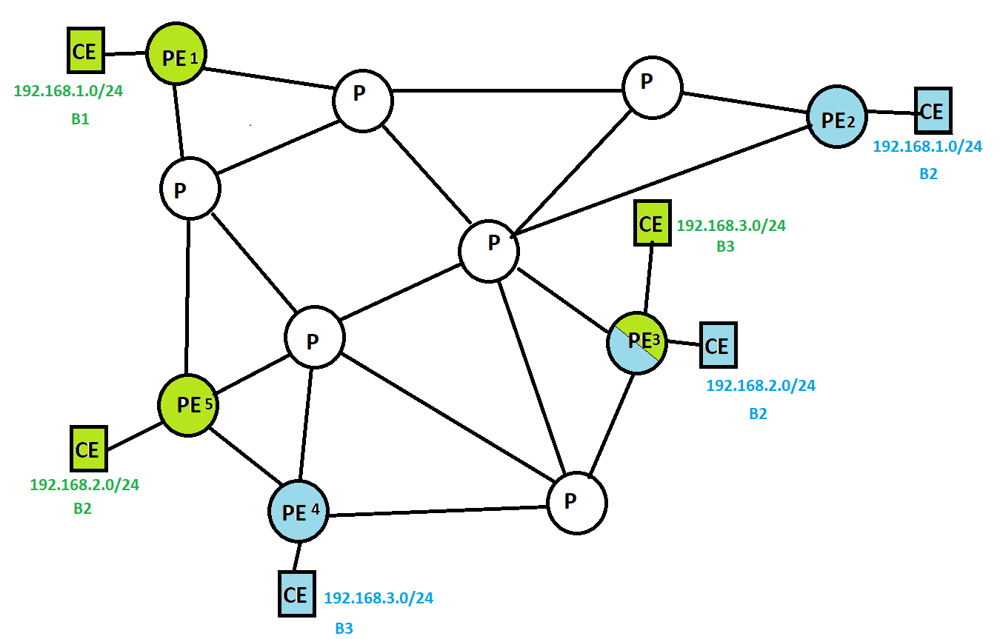

No dobra, ale jak teraz zrobić, że jak np. CE::B3 rozgłosi swoją podsieć to żeby PE4 rozgłosiło to tylko do tych PE które mają VRF niebieski.

### Route Target

Po prostu PE4 doklei do rozgłoszenia atrybut **RT (Route Target)** o wartości `blue`.

No i routery które nie mają odpalonego VRF blue to po prostu odrzucą to rozgłoszenie. 

### Route Distinguisher

No dobra, ok ale np. taki PE3 jak dostanie rozgłoszenie, to od CE to skąd ma wiedzieć, który RT mu nadać? Ma podłączone dwa CE. Otóż tu kwestia ma się tak, że CE też umieją gadać tym MP-BGP i robimy też taki koncept jak to że ok, sieci klientów mogą używać tych samych przestrzeni adresowych ,ale my ISP, musimy mieć to unikalne.


### Ale zaraz

Ale zaraz przecież w BGP nie ma żadnego Route Target i Route Distinguisher? No to właśnie te dwa atrybuty dodaje rozszerzenie MP-BGP.

RD jest rozgłaszane w atrybucie MP-REACH (MP Reachable NLRI)


A RT ma taki sam format i przekazywany jest w atrybucie extended community

### RT vs RD

RT definiuje topologię sieci VPN klienta, RD nie. 

RD tylko sprawia że rozgłszane adresy IP są unikalne w sieci ISP (w corze MPLS)


RD jest potrzebne, żeby w MPLS Core dało się rozróżnić ruch różnych klientów.

RT zaś potrzebujemy ponieważ chcemy aby , żeby VRFy jednego klienta różnych PE się ze sobą komunikowały, lub nawet VRF'y na jednym PE się ze sobą komunikowały. No bo może być tak, że klient A powie "Ja chce się komunikować przez MPLS/BGP VPN z klientem B". RT umożliwia komunikację między różnymi VRF (czy to w obrębie jednego PE czy dwóch różnych PE)

#### **Konfiguracja**

Zarówno RT jak i RD konfiguruje się na ruterze (PE) wchodząc w VRF odpowiedniego klienta.

##### RD

adres VPNv4 = RD + adres IP

Jako RD często daje się numer AS ISP i jakiś nr sekwencyjny, który definiuje pojedynczy site klienta

No i teraz jak sieć klienta w e-BGP rozgłosi jakąś sieć, to to w rzuterze PE trafi do VRF tego klienta (po jakim id to ja nie wiem, chyba na podstawie tego, że dany neighbor ma być obsługiwany przez dany VRF), który dalej (do MPLS core) rozgłosi ten adres, ale doczepi do niego RD na początek.

Przykładowo AS 10 jest klientem routera PE2, który jest w AS 6000. To wtedy w VRF tego klienta (powiedzmy ze jest to VRF green) zapiszemy, że RD=`6000:10`, gdyż taka jest konwencja. Nasz AS a potem jakieś id site'u klienta.

```
PE2 > 
PE2 > config router vrf green
PE2/conf/vrf/green> RD 6000:10
```

No i teraz jak AS 10 w sesji e-BGP do routera PE-2 rozgłosi prefix np. `10.0.0.2/24` to on rozgłosi go w MPLS Core jako `6000:10::10.0.0.2/24`

##### RT

Jak już w sieci MPLS Core latają te rozłgoszenia w postaci adresu VPNv4 (czyli mają RD), to my jako proces VRF na ruterze PE musimy zdecydować, które zgłoszenia mamy:

- importować z sieci i rozgłaszać dla naszego klienta
- eksportować od klienta i rozłaszać do sieci

Zauważ, że RD identyfikuje jeden site jednego klienta. Na całą sieć VPN klienta składa się wszystkie site'y, więc my (my jako instancja VRF klienta)

- importowac będziemy to co należy do tego klienta ale jest w innych site'ach
- exportować będziemy to co należy do naszego site'a

Przykład:

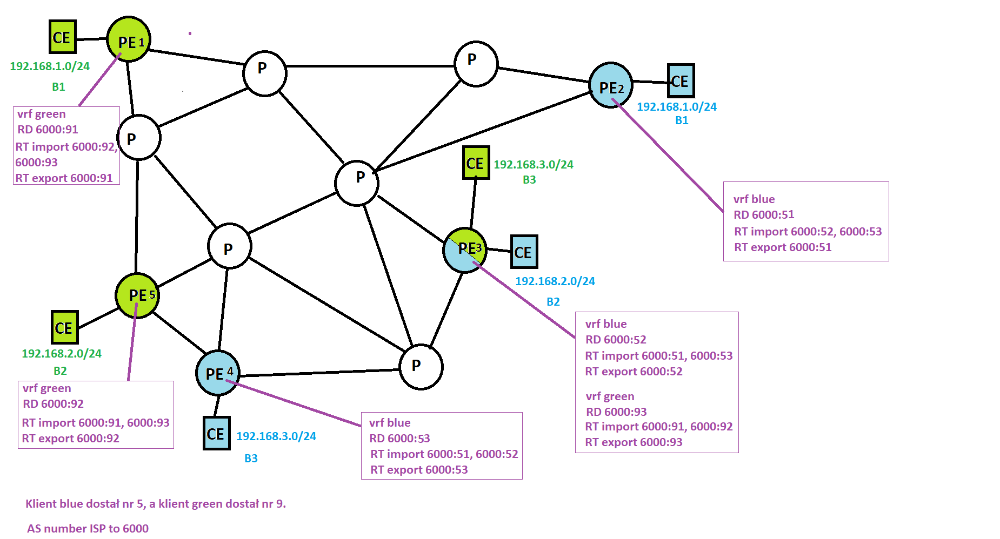

### VPN Label

No dobra znamy już mechanizm, które usprawniają wysyłanie rozgłoszeń BGP do odpowiednich VRF'ów, czyli RT.

Oraz znamy też mechanizm, żeby już potem jak klienci coś wysyłają na rozgłoszone prefixy, to żeby MPLS Core nie dostał małpiego rozumu i nie pomylił klientów, czyli RD.

Jest jeszcze jedna kwestia. Ruter PE1 rozgłosił w MPLS core i do innych PE prefix 192.168.1.1. Rozgłosił czyli powiedział "Jestem podłączony do sieci, która ma dostęp do prefixu 192.168.1.1, więc jak coś macie do niego, to via me". 

No więc klient A z site'u 1 wysyła coś na adres 192.168.1.1 PE1 pakuje to w tunel MPLS i jest jazda. W ostatnim ruterze tunelu dochodzi do zdjęcia ostatniej etykiety MPLS i zostaje goły pakiet IP. Dostaje go PE2. Całe szczęście pakiet IP ma dst_addr więc zrutujemy go no właśnie, gdzie? Przecież klient jest totalnie nieświadomy takich rzeczy jak ten cały VPRN, MPLS a w szczególności RD. Dla niego ta nasza cała zabawa to kabel, który łączy jego dwa LANy za pomocą e-BGP. Klient wysyła nam goły pakiet IT z dst_addr bez RD. Dlatego góły pakiet IP klienta zawiera adres wewnętrzny, który może się pokrywać z przestrzenią adresową innego klienta. Nie ma tam RD, bo klient nie wie co to RD.


Jak możemy wykminić, żeby jednak powiązać ten pakiet z danym VPNem klienta. Ten pakiet idzie przez tunel MPLS. Więc możemy zrobić tak, że podczas rozgłaszania tego prefixu, powiem jaki ma być MPLS::Label na samym dole, żeby ostatni router po jego zdjęciu mógł poznać 


Czyli razem z parametrem RT, rozgłaszamy label. Mówimy "Jak coś to via me dostępny jest 198.3.97.0/24, jak będzie mieć do niego jakiś pakiet IP to wsadzając go w tunel dajcie na samym dole etykietę 17, to ja sobie zapisze że  jak dostanę pakiet MPLS z ostatnią etykietą 17, to  to kierować do klienta co ma RT `blue-intranet`".

## Wielki przykład

Pamiętaj, że router PE1,...,PE5 wszystkie mają do siebie nawzajem tunel MPLS. 

A dzięki temu tunelowi każdy z nich jest ze sobą w sesji i-BGP -> są bgp neighbors, ich AS number to 6000.

### **Stan początkowy**

Routery kliencike CE każdy jest w sesji e-BGP ze swoim PE. Każdy ma też podłączone do siebie sieci prywatne o zagregowanym prefixie widocznym pod każdym CE.  Narazie jeszcze nikt nie rozgłosił żadnego prefixu. Jesteśmy na etapie, że VRFy dla klientów są skonfigurowane ale co dopierku skonfigurowano sesje e-BPG między PE2 a CE w site'cie B2. 

### Rozgłoszenie ścieżki do prefixu w site B1

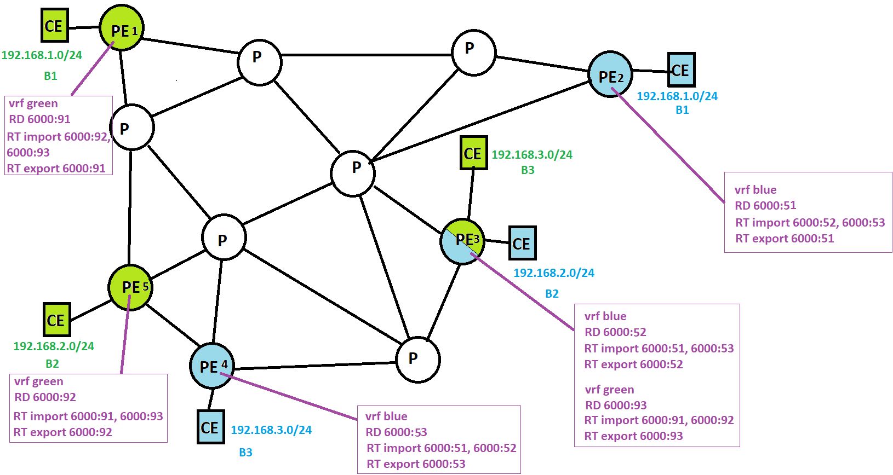

No i teraz się zaczyna jazda.

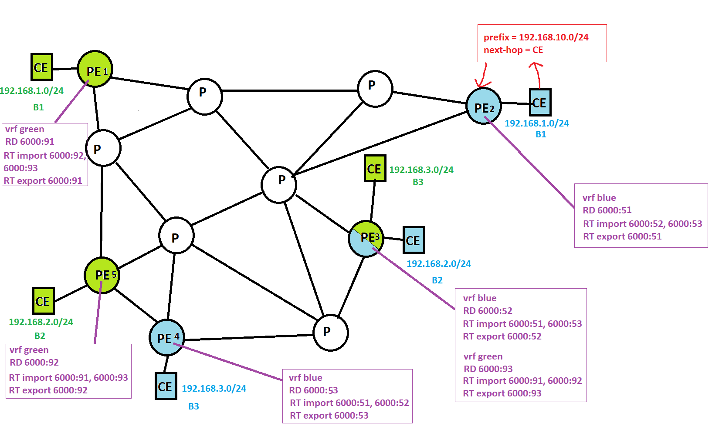

CE wysłał w sesji e-BGP rozgłoszenie prefixu. 

PE2 dostał to na takim interfejsie, ze wie, że musi uruchomić proces vrf blue.

Uruchamia, więc patrzy jakie ma skonfigurowane RD czyli czym zappendować rozgłaszany prefix, oraz patrzy z jakim RT wyeksportować to rozgłoszenie do reszty, oraz wymyśla jakąś VPN Label, dzięki której potem zidentyfikuje do kogo forwardować ruch.


PE2 wysyła UPDATE do swoich wszystkich BGP neighbors.

Teraz każdy z nich w pętli uruchamia swoje VRFy które patrzą, czy mają przyjąć dany pakiet MP-BGP. Sprawdzenie polega na porównaniu RT, które VRF ma importować z tym które przyszło.

PE1::vrf green patrzy, że ma importować `RT={6000:92, 6000:93}`, przyszło `6000:51`, więc odrzuca ten pakiet MP-BGP.

PE3::vrf blue patrzy, że ma importować `RT={6000:51, 6000:53}` przyszło `6000:51`, więc przyjmuje ten pakiet.

PE3::vrf green patrzy, że ma importować `RT={6000:91, 6000:92}`, przyszło `6000:51`, więc odrzuca ten pakiet MP-BGP.

PE4::vrf blue patrzy, że ma importować `RT={6000:51, 6000:52}`, przyszło `6000:51`, więc przyjmuje ten pakiet.

PE5::vrf green patrzy, że ma importować `RT={6000:91, 6000:93}`, przyszło `6000:51`, więc odrzuca ten pakiet MP-BGP.

Jak widać niektóre VRF odrzuciły niektóre, przyjęły to rozgłoszenie. Te które przyjęły dokonały odpowiedni wpis w tablicy rutingu.

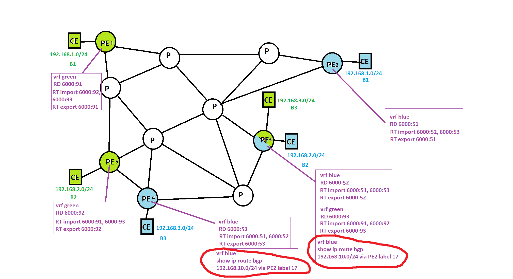

No i instancja vrf blue na PE4 oraz PE3 mają wpisany odpowiedni routing. 

Widać, że jest tam zwykły adres IPv4 a nie adres VPNv4. Jak widać mechanizmy RD i RT były po to żeby odpowiednio rozgłosić, do data plane już nic nie mają. 

### Ruch do site'u B1

No dobra, to teraz tak o. 

Jakiś komputer w site B3 chce coś wysłać do komputera B1. Załóżmy, że `192.168.3.15` chce coś wysłać do `192.168.1.16` są oni w końcu razem w sieci prywatnej z ich punktu widzenia.

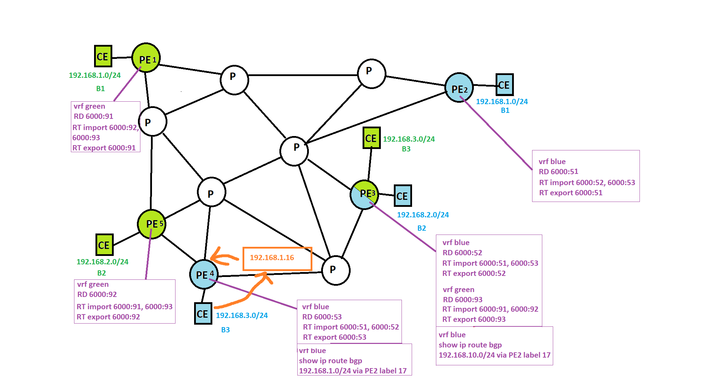

PE4 dostaje ten pakiet. Patrzy na tablice rutingu, że ma next-hopem do tego jest PE2. Tworzy więc pakiet MPLS, robi na nim PUSH 17. i wysyła do pierwszego routera P. To tam idzie przez odpowiedni tunel MPLS aż dojdzie do PE2. PE2 patrzy że dostał pakiet MPLS z jedną etykietą. Robi POP, patrzy że to numer 17, a uprzednio sobie zapisał, że label 17, to CE blue, więc tam forwarduje ten pakiet. No i tak to.

## AS_PATH problem

Do tej pory w swoich rozważaniach nie braliśmy w ogóle pod uwagę jakie AS number mają sieci klienckie. 

Otóż może się okazać, że mają ten sam ASN i jest z tym związany pewien problem zaraz zobaczymy jaki.


Mamy taką sieć. ISP ma AS 100. Klient ma dwa site, ale oba site'y mają ASN = 10.

Ten rysunek to jakiś mały wycinek sytuacji z wielki przykład.


Konfiguracja wygląda tak:

- PE1 i PE2 są ze sobą w sesji i-BGP
- PE1 jest w sesji e-BGP z CE1 oraz PE2 jest w sesji e-BGP z CE2

PE1 nie rozgłasza do CE1 prefiksów pochodzących od CE2, dlaczego?

**Bo BGP::Update, który przychodzi do CE1 już ma w AS_PATH ten sam AS number -> mechanizm wykrywania pętli więc go odrzuca**

Jak rozwiązać ten problem?


Pierwszy sposób to powiedzieć CE1, żeby od sąsiada 10.0.12.2 przyjmował BGP-Update'y nawet jak mają ten sam AS number w AS_PATH co CE1.


Drugi sposób to powiedzieć do routera PE1, żeby jak będzie wysyłał do sąsiada 10.0.12.1 (którym jest CE1), to żeby pierwszy (originating więc) ASN z AS_PATH podmienił na swój.


## Topologies

### Hub and spoke

Wybieramy jeden PE jako hub.

I wszystkie BGP-Update/rozgłoszenia idą najpierw do niego i dopiero potem on rozgłasza dalej.

https://www.youtube.com/watch?v=Zyou3VMhEuY


### Full mesh


Każde rozgłoszenie trafia do każdego PE.

### Route Reflectors

# Architektury w Data Center

## Stara Architektura


Posiada ona **3 poziomy hierarchi**:

- Edge Access (switche, każdy jeden opiekuje się jednym rack server)
- Aggregation (routery, 2 routery opiekują kilkoma switchami edge access)
- Core (router, kilka routerów, opiekuje się wszystkimi Aggregation routerami)

Ta architektura jest **zoptymalizowana dla ruchu N-S** (North-South). Kiedyś w DC aplikacje były monolityczne (in contrary to microservices) i taka architektura jest optymalna dla przypadku, że przychodzi pakiet z Internetu, szukamy gdzie ma trafić do którego rack servera i potem wraca. Czyli ruch jedynie góra-dół (N-S).

**Aggregation Layer**, to warstwa która agreguje ruch ze switchy, **jest granicą między L2, a L3**.

Separacja aplikacji w warstwie **edge** jest robiona poprzez VLAN.

> VLAN - any broadcast domain that is partitioned and isolated in a computer network at the data link layer (OSI layer 2), czyli jest to mechanizm protokołu ETH. Zaimplementowane poprzez VLAN Tag.

Ogólnie każdy węzęł warstwy N, jest połączony z każdym węzłem warstwy N+1, który się nim opiekuje. Jak uniknięto pętli rutingowych? Zastosowano STP.

> STP - Spanning Tree Protocol
>
> The **Spanning Tree Protocol** (**STP**) is a [network protocol](https://en.wikipedia.org/wiki/Network_protocol) that builds a loop-free [logical topology](https://en.wikipedia.org/wiki/Logical_topology) for [Ethernet networks](https://en.wikipedia.org/wiki/Ethernet_network).
>
> **Tree** - In [graph theory](https://en.wikipedia.org/wiki/Graph_theory), a **tree** is 
>
> - an [undirected graph](https://en.wikipedia.org/wiki/Undirected_graph) in which any two [vertices](https://en.wikipedia.org/wiki/Vertex_(graph_theory)) are connected by *exactly one* [path](https://en.wikipedia.org/wiki/Path_(graph_theory)), 
> - or equivalently a [connected](https://en.wikipedia.org/wiki/Connected_graph) [acyclic](https://en.wikipedia.org/wiki/Cycle_(graph_theory)) undirected graph.
>
> Spanning Tree - to po prostu takie Tree, które zawiera każdy vertex grafu, czyli rozpina się na cały graf

## Leaf-Spine


Tu już brak switchy L2. Przy Rack serwerach też są routery.

**Każdy leaf, jest połączony z każdym spine**. Nie tylko tak, że te które się opiekują (brak aggregation). Przez co jest dużo więcej kabli, więc zwiększa się capacity.

**Niepotrzebny tu jest STP**.

Bardziej **dostosowana do ruchu E-W** (East-West), czyli takiego jakie generują apki skonteneryzowane.

## IP fabric

Rozszerzony leaf-spine


Oparta całkowicie na L3.

Tutaj już te sieci są naprawdę wielkie, to też czasem IGP staje się nieefektywne i **wykorzystuje się BGP** (bo BGP jest skalowalny)

Dodatkowo IP fabric też:

- jest **skalowalny**
- **umożliwa Traffic Engineering** (np. atrybuty ścieżki)

# VPLS

#PW, #AToM #AC, #VC Label, #QinQ, 

VPRN to było tak, że łączyliśmy kilka site'ów klienta i oni wysyłali do siebie ruch IP. Teraz opowiemy o tym jak site'y klienta mogą się wymieniać ruchem Ethernet.

**Any** **Transport Over MPLS (AToM)** *transports layer 2 frames like Ethernet or Frame-Relay over the MPLS Backbone*.

AToM jest uznawany za usgłuę point-to-point typu **VPWS (Virtual Private Wire Service)** lub inaczej tzw. **PW (Private Wire)**. Obie te nazwą mówią o tym, że klient od ISP dostaje swój prywatny wire (kabel), ale ISP robi go virtual bo tak naprawdę jest oparty na MPLS backbone.

Ta technologia zastąpiła kopanie kabli pomiędzy siteami klientów. VPRN nic nie zastąpił, tylko zapronował klientom prywatne tunele w sieci ISP.


Terminologia architektury:

- CE - Customer Edge Router
- PE - Provider Edge Router
- AC - Access Circuit - czyli łącze którym CE jest połączone do PE
- PW - Private Wire
- LSP - MPLS::LabelSwitchedPath
- Pseudowire to jest usługa, zaimplementowana jako LSP
- Usługa ("L2 over L3") - no tak naprawdę  od strony klienta to już to co wysyła CE to jest usługa, bo wysyła on ramke ETH.

## AToM

No i to jest tak, ze jak przchodzi klient i mówi, że chce mieć PW między CE_green_1 a CE_green_2. To operator ISP konfiguruje mu ten ten PW o tak, że:

- na routerach PE robi powiązanie `VC <-> AC` czyli wiąże Virtual Circuit (to jest PW klienta w MPLS core) z Access Circuit - łączem z klientem którego jest to PW


Czyli od klienta przchodzi ramka ETHERNET (Layer-2 PDU). Router PE wie, którym AC to przyszło, więc wie który VC jest tego klienta. Tworzy więc pakiet MPLS, na dół daje etykietę o numerze VC, a na górze daje etykietę powiązaną z adresem loopback egress routera PE (drugiego gdzie jest AC tego klienta). Zna ten adres stąd, że routery PE są w sesji protokołu IGP.

No i PE wysyła taki pakiet w MPLS Core. Ten Core sobie tę górną etykiete switchuje itp, ale tunele są tak skonfigorowane, że zacznając od TEJ etykiety od TEGO routera PE, dojdziemy do TEGO routera PE.

Potem jak już router egress PE dostanie ten pakiet, to ma on tylko jedną etykietę. Zdejmuje ją, tam jest VC Label, patrzy na odwzorowanie `VC<->AC` i mówi "Acha ten PW jest tego klienta" i forwarduje na odpowiedni Access Circuit.


### EoMPLS

No dobra, co klient daje jako ten Layer-2 PDU? Otóż ramki ETH, teraz trochę o nim.


## QinQ

No dobra, jak klient wsadza do nas pakiety ETH, to bardzo możliwe, że ma on porobione w tej swojej dużej sieci ETHERNET LAN porobione VLANy ETH. 

Mechanizm VLAN ETH polega na tym, że ramka ETH ma dodatkowe pole określające do którego VLAN należy (to pole to VLAN Tag).

> **Mechanizm VLAN**
>
> IEEE 802.1Q, often referred to as Dot1q, is the networking standard that supports virtual local area networking (VLANs) on an IEEE 802.3 Ethernet network

A co to jest QinQ?

802.1Q-in-802.1Q (QinQ), defined by IEEE 802.1ad, expands [VLAN](https://info.support.huawei.com/info-finder/encyclopedia/en/VLAN.html) space by adding an additional 802.1Q tag to 802.1Q-tagged packets. It is also called VLAN [stacking](https://info.support.huawei.com/info-finder/encyclopedia/en/Stacking.html) or double VLAN.

Dzięki temu operator może u siebie też tworzyć VLANy ETH.


No i wtedy wygląda to tak:


Ale tutaj mamy case, gdy ISP dostarcza L2 network. U nas tak nie jest. U nas operator ma MPLS network, więc wyglądto tak.


## VPLS

No dobra, AToM umożliwia stworzenie łączy Point-to-Point, a co jakbyśmy chcieli połączyć ze sobą kilka site'ów klienta?


> In computer networking, **split-horizon route advertisement** is a method of preventing routing loops in distance-vector routing protocols by prohibiting a router from advertising a route back onto the interface from which it was learned.

To co stworzyliśmy poprzez stworzenie wielu VPWS/PW (Virtual Private Wire Service / Private Wire), to **Virtual Private LAN Service**, czyli **usługą** tutaj jest **prywatna** na sieci ISP sieć **LAN**, którą ISP implementuje u sb **wirtualnie**.

### BGP w VPLS


# VxLAN

#VxLAN, #Data Centers, #VTEP, #L2 overlay, #VNI ID

VPLS jest do łączenia site'ów, VxLAN do chmury. LAN SERVICE - usługą jest sieć LAN; x - extensible

**Virtual Extensible LAN (VXLAN)** is a network virtualization technology that <u>attempts to address the scalability problems associated with large cloud computing deployments</u>. It uses a VLAN-like encapsulation technique to **encapsulate OSI layer 2 Ethernet frames within layer 4 UDP datagrams**,] VXLAN endpoints, which terminate VXLAN tunnels and may be either virtual or physical switch ports, are known as **VXLAN tunnel endpoints** (VTEPs).

VXLAN is an evolution of efforts to standardize on an overlay encapsulation protocol. Compared to VLAN (czyli po prostu te tagi) which provides limited number of layer-2 VLANs (typically using 12-bit VLAN ID), VXLAN increases scalability up to 16 million logical networks (with 24-bit VNID) and allows for layer-2 adjacency across IP networks.


VLAN jest chyba słabo nadający się do Data Center, więc w DC używa się VxLAN.


W ETERNET jest coś takiego jak **domena broadcastowa**

> In terms of current popular technologies, any computer connected to the same Ethernet repeater or switch is a member of the same broadcast domain. Further, **any computer connected to the same set of interconnected switches/repeaters is a member of the same broadcast domain.** 
>
> **Routers** and other higher-layer devices form boundaries between broadcast domains.


Proces przesyłania ramki ETH:

1. Ramka ETH przychodzi z hosta na port switcha
2. Switch patrzy w MAC address table i orientuje się, gdzie ramka ma być przesłana (czy do czegoś podłączone locally, czy przez VxLAN) 
3. dla ramek przesyłanych przez VxLAN switch ma powiązanie VLAN Tag z VNI ID i dodaje do ramki nagłówek VxLAN (czyli ten VNI ID)
4. Potem VTEP (bo tak się nazywa switch który obsługuje VxLAN) enkapsuluje ramkę VxLAN w pakiet UDP/IP
5. No i leci to przez IP backbone
6. switch docelowy odbiera pakiet IP
7. VTEP dekapsuluje ramkę L2 z zachowanym VLAN Tagiem
8. switch przesyła ramkę ETH na port wyjściowy na podstawie swojej tablicy MAC adresów

## VxLAN enkapsulacja


! Zauważ, że tu nie ma żadnych tuneli MPLS VxLAN wysyła po prostu pakiet IP (ofc na jakimś innym levelu może być tunel MPLS).

## Ruch użytkowy

Stan początkowy jest taki. 

Switch A pełniący tu rolę VTEP ma skonfigurowane, że host A należy do VxLAN o VNID równym 10. To samo ma powiedziane switch B.

Też już jesteśmy po procesie odpytywania ARP itd. Switche swoje MAC Address Table mają już wypełnione.

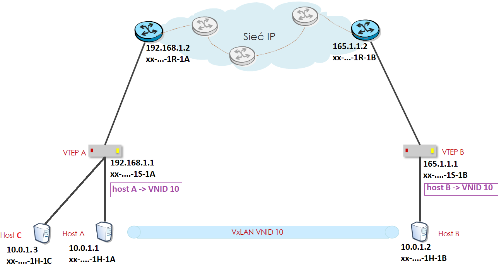


Host A wysyła pakiet do switcha A.

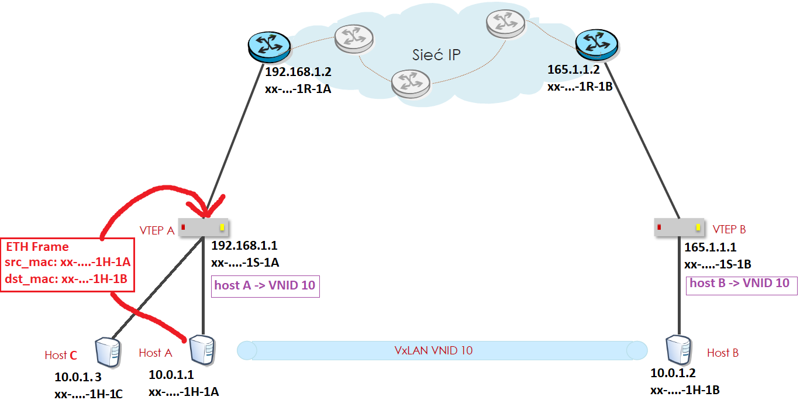

Switch patrzy po MAC table, że to jest do hosta, który nie jest w physical Ethernet Broadcast. Więc przekazuje ten pakiet do procesu VTEP. 

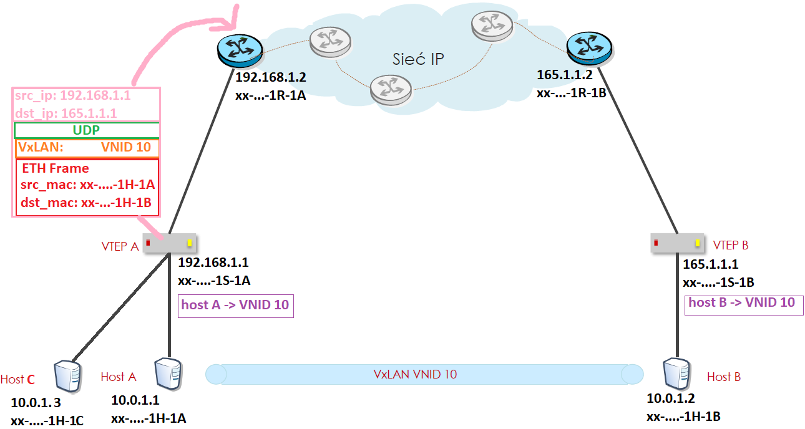

VTEP robi enkapsulacje tej ramki ETH i wysyła ją do IP Core.

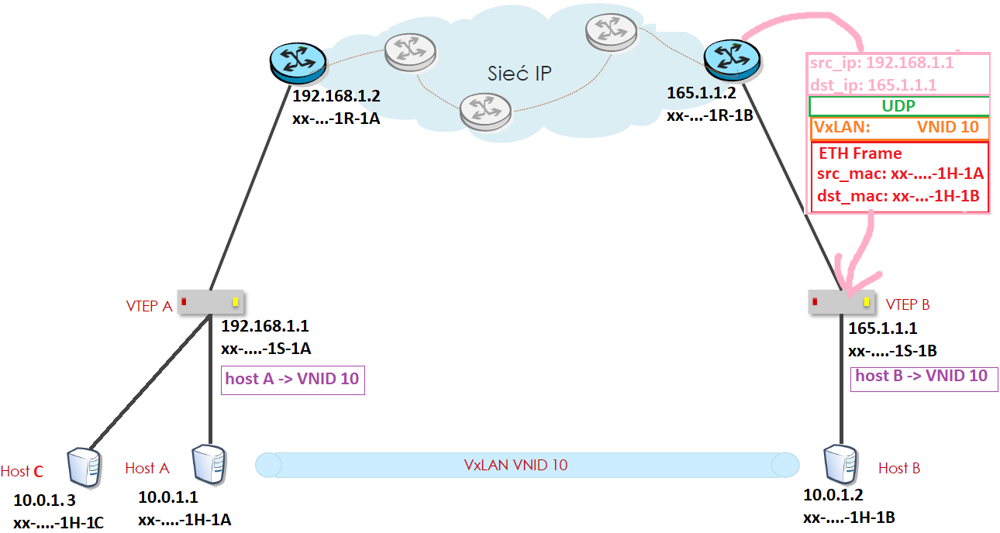

Ta VxLAN frame, w końcu trafia do switcha VTEP (to on ma logikę VxLAN, więc to on dopiero moze to zdekapsulować). 

VTEP B odbiera ramkę VxLAN, patrzy że on sam jest dst_ip, więc dekapsuluje ją. 

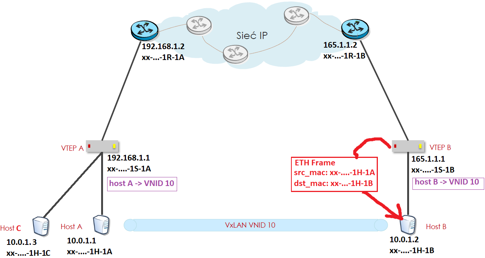

Patrzy na MAC address i przekazuje ramkę wg. MAC address table.

Zauważ, że ten cały proces z punktu widzenia hostów wyglądał tak:

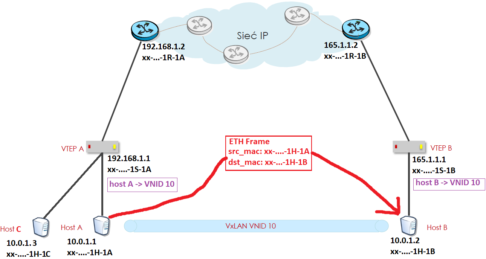

## Obsługa ramek BUM

Co to ramki BUM?

Jak znasz adres docelowy  i chesz wysłać tylko do jednego hosta to wysyłasz ramkę unicast.

In contrary to unicast jest broadcast - wysłanie do wszystkich w sieci np. ARP "Who has 10.0.34.43?"

Albo Multicast - czyli do kilku zdefiniowanych. Albo Unknown Multicast - czyli nie wiem co, ale nie musze wiedzieć

No to właśnie takie ramki z wieloma nadawami nazywamy **BUM (Broadcast, Unknown unicast, Multicast)**


### Flood & Learn


Flood & Learn to jest ta technika, że host wysyła ARP request, czyli "Who has 10.0.1.2 --> Which MAC address has IP 10.0.1.2" i switch najpierw jest pusty.

Jak dostanie ten pakiet to sobie zapisze: "na tym interfejsie mam MAC A", a potem weźmie ten ARP Request i roześle na każdy interfejs jaki ma. Hosty mu odpowiedzą na to poprzez ARP Response, a w pakiecie ARP będzie zawart src-MAC, więc switch sobie zapisze "na tym interfejsie mam host MAC B, C, D itd..".

Czyli switch najpierw zalał sieć pakietami ARP, ale dzięki temu się nauczył. Flood & Learn.

#### Przykład

Nikt jeszcze w sieci nie zna nic. 


Host A wysyła `ARP Request 10.0.1.2`. Switch dostaje to i sobie po pierwsze zapisze, że na tym interfejsie ma taki MAC (Hosta A), a że patrzy że DST-MAC w tym pakiecie jest #ffffff (broadcast), to wyśle to wszędzie, gdzie się da czyli oprócz łącz lokalnych to jeszcze do VxLAN, do których należy Host A. Enkapsuluje więc te ramkę ARP i wysyła cyk.


Ramka VxLAN została wysłana i trafia do IP Core.

W końcu trafia do końcowych ruterów i w końcu do docelowych VTEP'ów.


VTEP C oraz VTEP B wykonają sobie teraz wpis, że adres MAC xx-xx-xx-xx-1A-F1 czyli należący do hosta A jest osiągalny pod adresem IP 192.168.1.1. To zostanie zapisane w logice VxLAN dla VNID 10.

> Po to że potem jak dostanie ramke ETH dla tego adresu MAC to wie jaki dst_ip wsadzić przy enkapsulacji tej ramki w ramke VxLAN.


Na sam koniec hosty dostały zdekapsulowane zapytania ARP. Host na górze 10.0.1.3 odrzucił po prostu ten pakiet, bo nie dotyczył jego. a Host B pomyślał "O, pytają o mnie" i odesłał ARP RESPonse dając swój adres MAC.


No i ten odesłany ARP request trafia do VTEP B.

dst_mac jest takie jak mac hosta A, dla którego akurat VTEP B przed chwilą zrobił mapowanie. 

Dlatego więc ramka jest ekapsulowana z adresem docelowym IP z tego mapowania.

Jak widać logika VxLAN podczas Flood&Learn też się uczy --> jak mapować ETH::dst_mac na IP::dst_ip.


No i na koniec wiadomka Host A jak gdyby nigdy nic dostaje ARP Response w czystej postaci.

## Leaf & Spine

Jak wygląda VxLAN w leaf&spine?


## Segment routing

Jutro note z BGP i ew. na koniec dnia jak będzie czas to ten Segment Routing ale to tak dodatkowo. 
