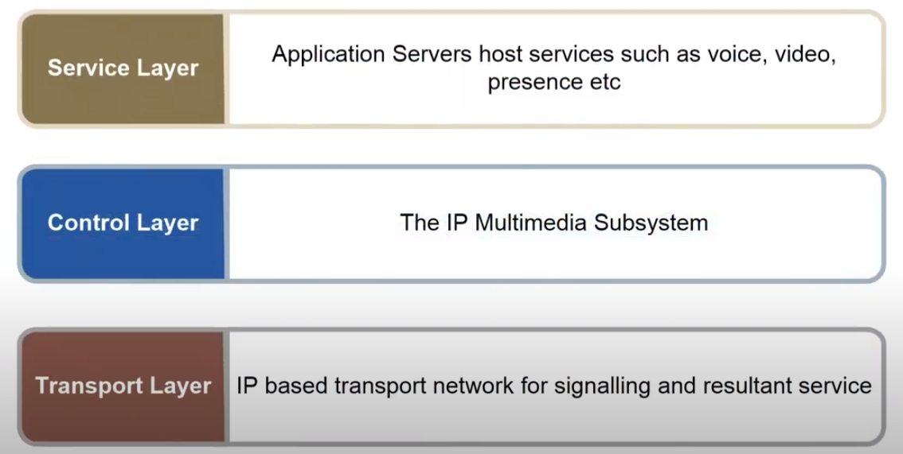
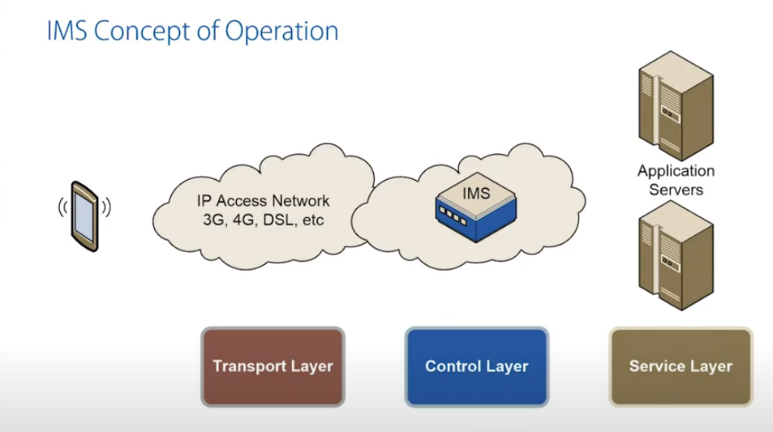
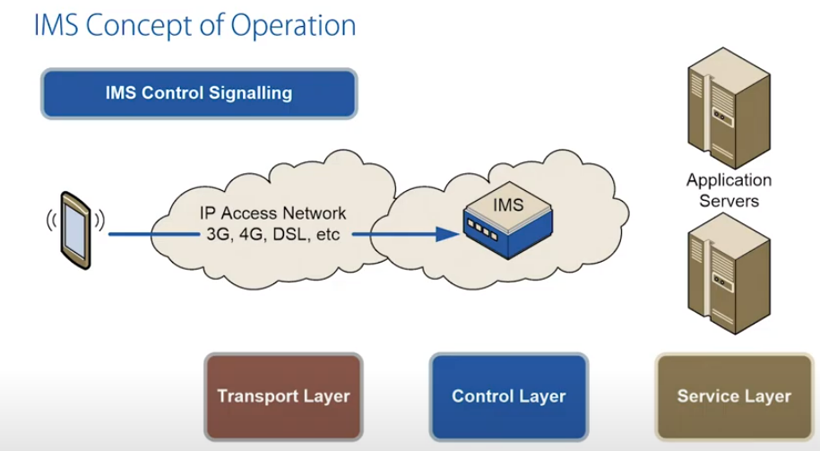
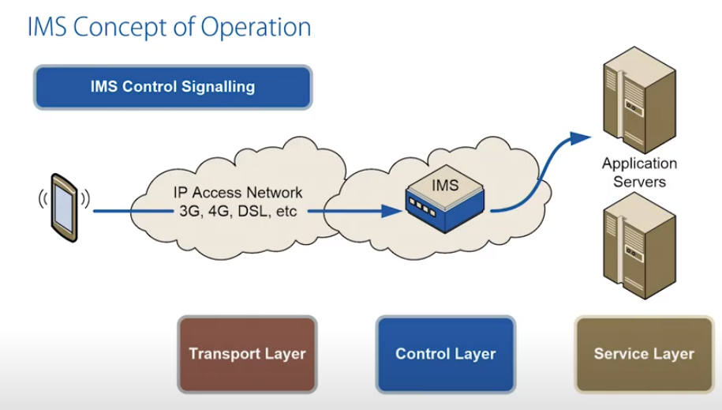
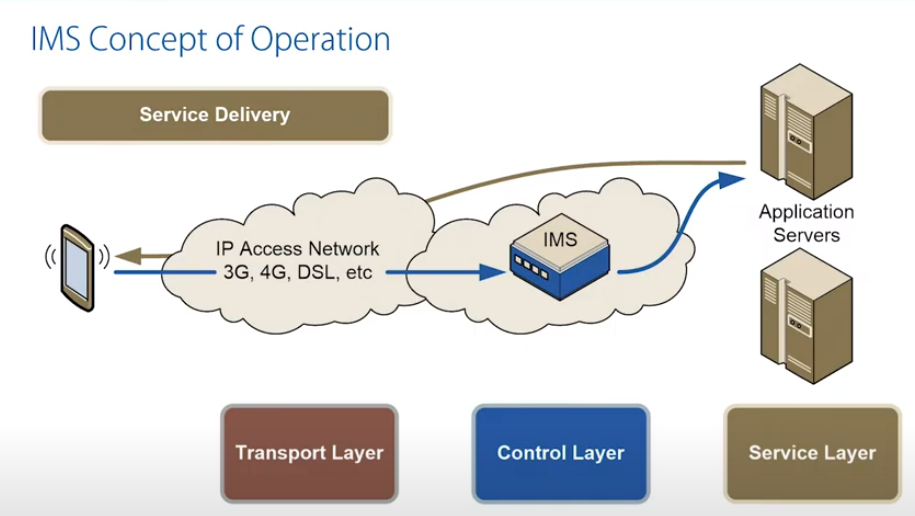
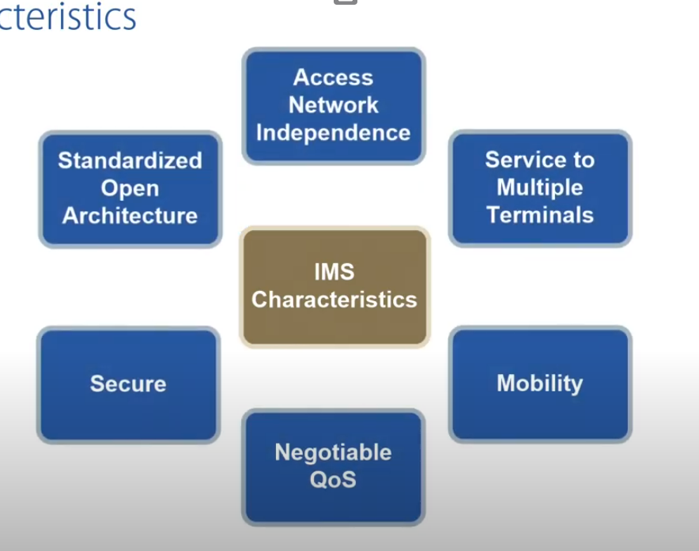
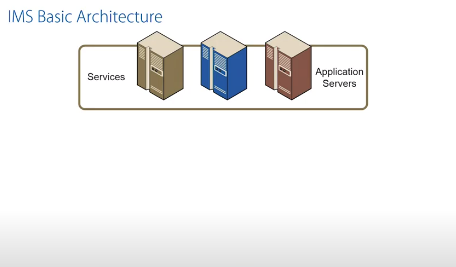
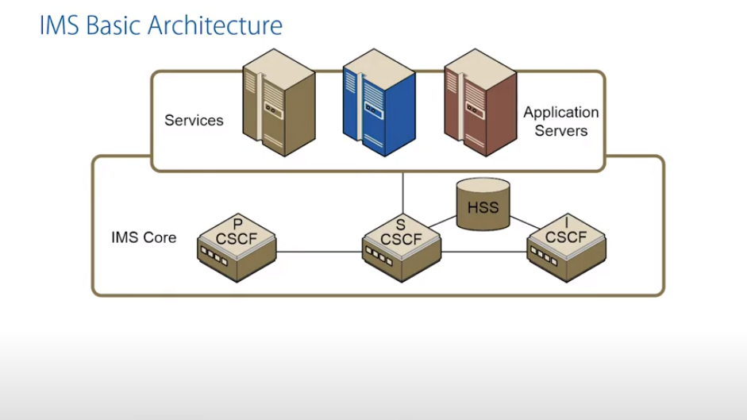
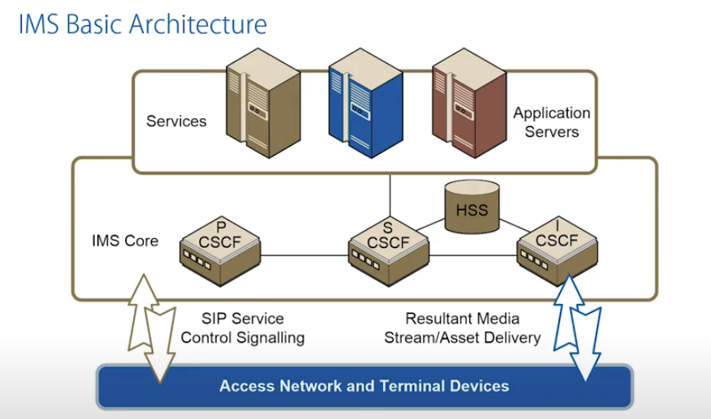
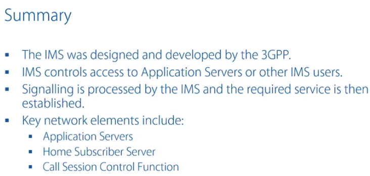

## What is IMS

IMS - Service Management Framework/Architecture developed by 3GPP.

IMS has 3 conceptual layers.

In the middle IMS itself. IMS is responsible for allowing terminals to send the propriate signaling to ultimately services hosted by Application Servers. So the IMS is the control layer between the terminal and Services themselves.

## Concept of operation

IMS in itself does not actually provides any services. It just provides access to services. It can be access to Application Servers or it could be communication between two IMS users.

IMS signaling is based on the **SIP - Session Initiation Protocol**. we use the transport layer to carry that signalling across the access network (3G, 4G etc.).

IMS is IP CAN agnostic. CAN - Connectivity Access Network.

So when the signalling hits up to the IMS, it up to the IMS to decide where that signalling should be going and it largely depends on what our terminal wants to set up in terms of the service. So the IMS will decide to appriopriate Application Server to use...

...and ultimately a service is delivered to that subscriber. 

Notice that the brown arrow is not necessarily going through the IMS. Our resultant media stream does NOT HAVE to traverse IMS (it could do in certain scenarios, but it doesn't have to).

## IMS characteristics

Standardized Open Architecture - SIP and Diameter are open. Vendors from lots of different areas can provide to equipment service providers.

Access Network Independence - it could be on 2G, 3G, 4G, DSL. IMS just considers these access network as an IP Bearer

Service to Multiple Terminals - we can have several terminals in use at any given time as a user of the IMS

Secure - all the IMS signalling sent between IMS and terminal device is secured. It can be encrypted if the Service Provider wants to, subscriber can be also authenticated if the SP sees it fit.

Negotiable QoS - before IMS session established, before a session related to a service gets established IMS ensures that Access Network has bearers with appriopriate QoS ready to carry out that resulting media stream.

Mobility - **Seamless Mobility** - concept of being able to switch from one AN to another whilst maintaining the current ongoing session.

> Seamless - (of a fabric or surface) smooth and without seams or obvious joins BEZSZWOWY

## Basic Architecture

Residing at the top are **Application Servers**. The 3GPP does not standardize them.

The 3GPP standardize the IMS Core.

CSCF - Call Session Control Function

P - proxy

S - Serving

I - Interogating

CSCF are essentially a SIP routers. They get IMS signalling from the terminals or other IMS nodes and ensure the signalling gets on the best next hop in the system ultimately getting that service to the customer

HSS - Home Subscriber Server - central repository of subscriber info telling CSCFs exactly which services our subriber has signed up for

lower down we got the AN and the terminals.

All of the traffic between the AN and IMS Core is based on SIP control signaling and the resulting  media stream could be based on a variety of different protocols, it depends on what service has been delivered

## Summary

