## Data Network Name

DNN - performs the same functions as APN (Access Point Name) in 2G/3G/4G.

An **Access Point Name** (**APN**) is the name of a [gateway](https://en.wikipedia.org/wiki/Gateway_(telecommunications))[[1\]](https://en.wikipedia.org/wiki/Access_Point_Name#cite_note-1) between a [GSM](https://en.wikipedia.org/wiki/Global_System_for_Mobile_Communications), [GPRS](https://en.wikipedia.org/wiki/General_Packet_Radio_Service), [3G](https://en.wikipedia.org/wiki/3G) and [4G](https://en.wikipedia.org/wiki/4G) [mobile network](https://en.wikipedia.org/wiki/Cellular_network) and another [computer network](https://en.wikipedia.org/wiki/Computer_network), frequently the public [Internet](https://en.wikipedia.org/wiki/Internet).

APN może przyjąć postać adresu IP bramy lub nazwy tekstowej, która jest zamieniana przez serwer DNS na numer IP.

**Structure of APN**

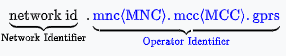

- *Network Identifier*: Defines the external network to which the [Gateway GPRS Support Node](https://en.wikipedia.org/wiki/GPRS_core_network#GPRS_support_nodes_(GSN)) (GGSN) is connected. Optionally, it may also include the service requested by the user. This part of the APN is mandatory
- *Operator Identifier*: Defines the specific operator's packet domain network in which the [GGSN](https://en.wikipedia.org/wiki/GPRS_core_network#GPRS_support_nodes_(GSN)) is located. This part of the APN is optional. The MCC is the [mobile country code](https://en.wikipedia.org/wiki/Mobile_country_code) and the MNC is the [mobile network code](https://en.wikipedia.org/wiki/Mobile_network_code) which together uniquely identify a mobile network operator.

Examples of APN are:

- `three.co.uk` (Note: This example APN uses a [domain name](https://en.wikipedia.org/wiki/Domain_name) from the [DNS](https://en.wikipedia.org/wiki/DNS) which belongs to the operator)
- `internet.t-mobile`
- `internet.mnc012.mcc345.gprs`
- `rcomnet.mnc015.mcc405.gprs`
- `internet` (Note: This APN example does not contain an operator)
- `NXTGENPHONE` (Note: Does not contain an operator, however in practice it is [AT&T Mobility](https://en.wikipedia.org/wiki/AT%26T_Mobility)'s [LTE](https://en.wikipedia.org/wiki/LTE_(telecommunication)) APN)
- `VZWINTERNET` (Note: No operator, but the APN name clearly identifies [Verizon Wireless](https://en.wikipedia.org/wiki/Verizon_Wireless))
- `mobitel` (Note: APN name clearly identifies operator [Mobitel](https://en.wikipedia.org/wiki/Mobitel_(Sri_Lanka)))
- `jionet` (Note: APN name clearly identifies operator [Jio](https://en.wikipedia.org/wiki/Jio))

## Packet Data Unit Session

PDU session is set up to carry data between UE and UPF. All the control plane nodes in 5G are used to set up, manage, and tear up this connection.

> In 5G only UE, GNB and UPF are nodes that are in the data plane.

There are 3 types of PDU sessions in 5G:

- IP Type 4
  - Used for the normal IPv4 traffic to and from UE to the Data Network.
- IP Type 6
  - Used for the normal IPv6 traffic to and from UE to the Data Network.
- Ethernet
  - In this mode Ethernet frames are sent between UE-UPF. This is to enable the UE to have layer 2 connectivity.
  - Use case: 5G UE is a part of LAN. UE IP address would be most likely allocated by DHCP server within the LAN. This is classic enterprise use-case.
  - In 5G one of the key principles is that it is *access agnostic*, hence (w związku z tym) UPF woulb be able to terminate traffic from non-3GPP wired or wireless access.
- Unstructured
  - In this type PDU formats are completely unknown to the 5G system. 5G system would not even know the payload boundaries etc. The UPF will serve only as a "pipe" for packet transfer.
  - Use case: mostly IoT devices

**How PDU session is established**

It is initiated by UE when its powred on or wants to add another session to a different DNN. It could also be trigerred by the network in case of emergency call with mobility registration.

1. First UE will initiate a Radio Resource Control (RRC) connection requst to gNodeB with a PDU session establishment request. The UE includes its preffered network slice, the DNN or DN it wants a connection to, a PDU session ID (self-generated), a 5GSM capability that desribes the UE session management capabilities, and PCO options (similiar to 4G).

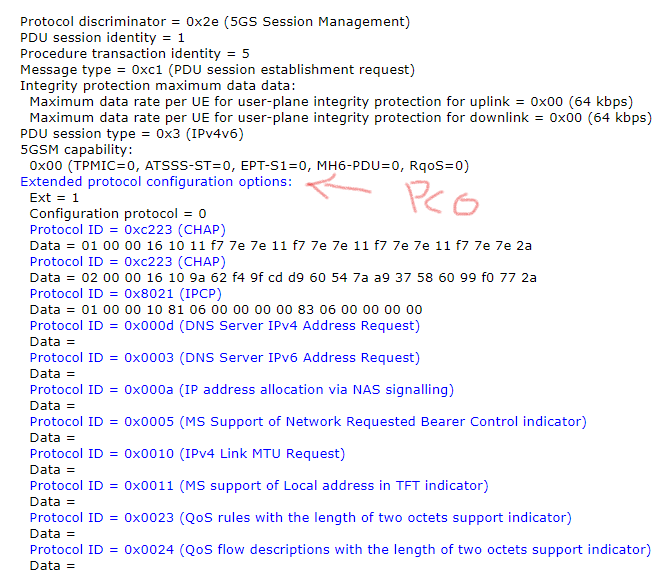

2. The request is processed by AMF, and then sent to SMF
3. SMF interacts with UDM for subscription details of the user, PCF for policy details, CHF for charging.
4. Then SMF via N4 interacts with UPF to discuss the TEID (Tunnel Endpoint Identifier).
5. After that SMF responds to AMG with success, which is forwarded to the UE by gNodeB.

## SUPI

https://www.techplayon.com/5g-identifiers-supi-and-suci/

Subscription Permanent Identifier

All subscribers within the 5G Core are allocated a globally unique 5G **su**bscriber **p**ermanent **i**dentifier.

Service provider allocates this to each SIM card that is inserted into the UE.

### Security

SUPI is never sent in clear text across the RAN, becasue if intercepted by rogue elements, the UE can be spoofed or DoS attacked.

> Rather the UE is assigned a GUTI, which is used to temporarily identify the UE over the radio link.

### Form

SUPI is in the form of traditional **International Mobile Subscriber Identity (IMSI)** or **Network Access Identifier (NAI)**.

IMSI was used in previous generations, so utilizing it ensures various roaming and interworking scenarios.

NAI is used for non-SIM devices.

### Format

Format for IMSI used as SUPI.

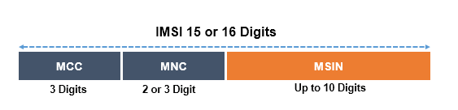

MCC - **Mobile Country Code** - 

MNC - **Mobile Network Code** - identifying the network operator

MSIN - **Mobile Subscriber Identification Number** -  represent the individual user of that particular operator

A combination of MCC and MNC can identify a mobile network across the globe.

## GUTI

Globally Unique Temporary Identifier

GUTI is used to keep SUPI confidential. 

During the network registration AMF allocates GUTI for the UE.

GUTI will be used to identify the UE over RAN to prevent snooping of SUPI. GUTI is changed frequently, hence the name "temporary".

#### Format

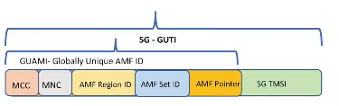

MCC - Mobile Country Code - 

MNC - Mobile Network Code - identifying the network operator

AMF Region ID - identifies the AMF Region

AMF Set ID - identifies a specific AMF Set in the region

AMF pointer - uniquely identifies the AMF within the AMF Set

## QoS Model in 5G Core

The QoS model in 5G is flow-based.

PDU session is comprised(złożona) of various **QoS Flow**s, and each of these flow are identified by a **QFI -  QoS flow identifier** value 

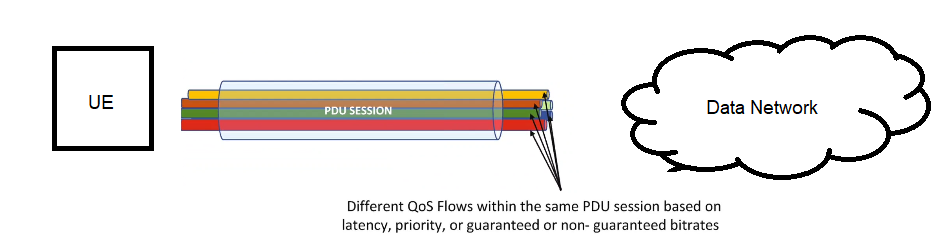

When UE esablishes a PDU session a non-guaranted bit rate QoS flow is set up.

Then the UE or Application Function can thereon (na tym) create any additional guaranteed or non-guaranteed flows via **PDU modification procedure.**

In 5G the same PDU session can be modified to add or remove flows. UE can initiate a PDU modification procedure to create a GBR (Guaranted Bit Rate) flow needed for video or voice. 

SMF allocates the QFI based on the QoS value.

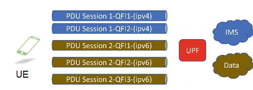

The same UE can have two different PDU sessions - e.g. one for IMS to connect to IMS slice with different set of AMF/SMF/UPF and another for accessing data from the internet from another slice.

The UE is reponsible to assigning PDU session IDs. 

In PDU session 1, we have two flows (QFI1 and QFI2) one is for IMS signalling and another is GBR for voice. 

In PDU session 2, we have 3 flows. In this case PDU session of type IPv6 has different flows for different QoS classes*. Additional IPv6 traffic would be added as the next flow to this PDU session. But if user tries to access some service from DN, that uses IPv4 - the next PDU session will be established.

So what ditinguish PDU sessions is:

- Type (Ipv4 or Ipv6 in this case)
- DNN (IMS server or Data Network in this case)

Another notable point is that within PDU session the QFI values must be unique, but for the same UE two different PDU session can have same QFI value.

> *So the same PDU session is able to accommodate various QoS flows. In cotrary to 4G when a bearer was set up with different tunnel endpoint for each type of QoS class.

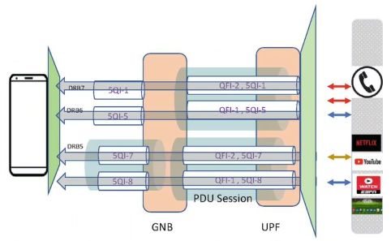

In 5G the GTP tunnel* for the PDU sessions is between gNodeB and the N3** interface on UPF.

On the Radio side (Uu interface) the gNodeB is reponsible for mapping these tunnels to **Data Radio Bearers (DRBs)**. gNodeB may decide to map one or more *QoS Flows* into the same bearer. 

Since only one GTP-U Tunnel is formed for all flows in PDU session how is the gNodeB able to differentiate among different flows? This is done by the new extension header of GTPU for QFI values. 

To summarize all QoS flows of one PDU session are sent via N3 in a single GTPU tunnel that is differentiated in the GTP header by the QFI field.

> *Protocols stack in User Plane in 5G
>
> 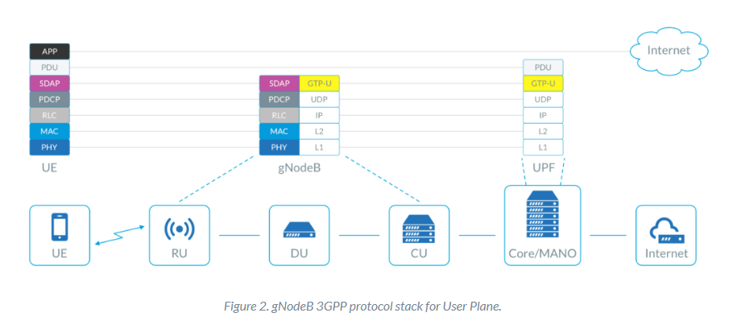
>
> **interfaces in 5G
>
> 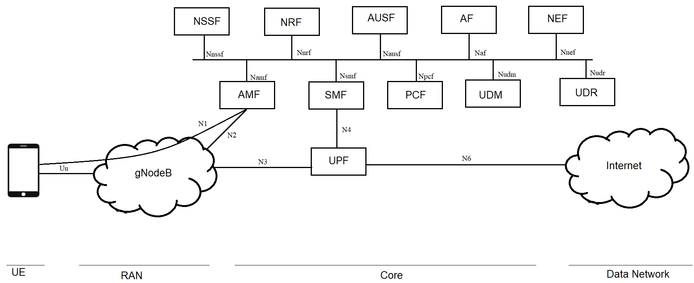

There are some more notable additions on the N4 interface regarding QoS management.

The SMF provides instructions to the UPF via the **Packet Forwarding Control Protocol** (**PFCP**) messages. PFCP messages intructs the UPF about UE traffic classifications, queing, scheduling, and marking/remarking.

### PFCP messages sent from SMF to UPF

- **Packet Detection Rule**
  - It helps UPF to detect downlink coming packets. It is done by using 5 typle (src IP addr, src port, dst IP addr, dst port, and the protocol in use). UPF using this tuple classifies the packet and map it to a QoS flow.
  - Similarly Uplink Packet Detection Rule is used to verify UE SDF? to QoS mapping before the UPF forwards uplink traffic to the Data Network.
  - PDR also collects pointers to the next rules discussed below
- **Forwarding Action Rule**
  - This way AMF informs UPF if to forward the packet or duplicate the packet. Duplicate to forward in to **Lawful intercept**).
  - Also it helps in QoS to DSCP mapping. **DSCP - Differentiated Services CodePoint**. These marking helps classify traffic that requires higher bandwith or higher priority or is likely to drop packets. It works by using its header that can be used to request high priority or best effort delivery.
- **QoS Enforcement Rule**
  - This is used to enforce bandwidth and latency for GBR or non-GBR flows. Throttling and rate limiting is applied with the help of this.
- **Usage Report Rule**
  - AMF tell UPF to trigger usage reports (time, volume etc.). Report contains the actual data usage by the UE and then SMF sends it to Charging Function for charging
- **Buffering Action Rule**
  - This is used when UE is in idle mode. When data comes in for the idle UE it is buffered until UE goes back to connected mode. Hence this instructions helps SMF to inform UPF about the buffering action to execute.

//TODO dodaj tabelke **Figure 1-13**

| 5QI Value | Resource Type      | Default Priority Level | Packet Delay Budget [ms] | Packet Error Rate [10^x] | Default Maximum Data Burst Rate | Default Averaging Window [ms] | Example Service                                              | Applicable to |
| --------- | ------------------ | ---------------------- | ------------------------ | ------------------------ | ------------------------------- | ----------------------------- | ------------------------------------------------------------ | ------------- |
| 1         | GBR                | 20                     | 100                      | -2                       | N/A                             | 2000                          | Conversational voice                                         | 4G, 5G        |
| 2         |                    | 40                     | 150                      | -3                       |                                 |                               | Conversational video (Live streaming)                        |               |
| 3         |                    | 30                     | 50                       | -3                       |                                 |                               | Real Time Gaming, V2X messages, Electricity distribution medium voltage, Process automation - monitoring |               |
| 4         |                    | 50                     | 300                      | -6                       |                                 |                               | Non-Conversational Video (Buffered Streaming)                |               |
| 65        |                    | 7                      | 75                       | -2                       |                                 |                               | Mission Critical User Plane Push To Talk Voice (e.g. MCPTT)  | 5G            |
| 66        |                    | 20                     | 100                      | -2                       |                                 |                               | Non-Mission Critical User Plane Push To Talk Voice           |               |
| 67        |                    | 15                     | 100                      | -3                       |                                 |                               | Mission Critical Video user plane                            |               |
| 75        |                    | -                      | -                        | -                        |                                 | -                             | -                                                            |               |
| 71        |                    | 56                     | 150                      | -6                       |                                 | 2000                          | "Live" uplink streaming                                      |               |
| 72        |                    | 56                     | 300                      | -4                       |                                 |                               |                                                              |               |
| 73        |                    | 56                     | 300                      | -8                       |                                 |                               |                                                              |               |
| 74        |                    | 56                     | 500                      | -8                       |                                 |                               |                                                              |               |
| 76        |                    | 56                     | 500                      | -4                       |                                 |                               |                                                              |               |
| 5         | Non-GBR            | 10                     | 100                      | -6                       |                                 | N/A                           | IMS signalling                                               | 4G, 5G        |
| 6         |                    | 60                     | 300                      | -6                       |                                 |                               | Video (Buffered Streaming), TCP-based (www, chat, ftp, p2p file sharing, progressive video etc.) |               |
| 7         |                    | 70                     | 100                      | -3                       |                                 |                               | Voice, Video (Live streaming) Interactive Gaming             |               |
| 8         |                    | 80                     | 300                      | -6                       |                                 |                               | Video (Buffered Streaming), TCP-based (www, chat, ftp, p2p file sharing, progressive video etc.) |               |
| 9         | 7                  | 90                     | 70300                    | -6                       |                                 |                               | ^                                                            |               |
| 69        |                    | 5                      | 60                       | -6                       |                                 |                               | Mission Ciritcal delay sensitive signalling (e.g. MC-PTT signalling) | 5G            |
| 70        |                    | 5                      | 200                      | -6                       |                                 |                               | Mission Critical Data (example services are the same as 5QI=6,8,9) |               |
| 79        |                    | 65                     | 50                       | -2                       |                                 |                               | V2X messages                                                 |               |
| 80        |                    | 68                     | 10                       | -6                       |                                 |                               | Low Latency eMBB applications, Augumented Reality            |               |
| 82        | Delay Critical GBR | 19                     | 10                       | -4                       | 255 bytes                       | 2000ms                        | Discrete Automation                                          |               |
| 83        |                    | 22                     | 10                       | -4                       | 1354 bytes                      |                               | Discrete Automation                                          |               |
| 84        |                    | 24                     | 30                       | -5                       | 1354 bytes                      |                               | Intelligent Transport systems                                |               |
| 85        |                    | 21                     | 5                        | -5                       | 255 bytes                       |                               | Electricity distribution - high voltage                      |               |

### Reflective QoS

It is an unique feature in 5G, one of the most intelligent new concept. Simple method to perfom QoS in UpLink with less signalling between UE and the core.

>  First, the UE will indicate that it supports Reflective QoS during PDUsession establishment or modification, then when the UPF receives from SMF an indication to use Reflective QoS for a certain QoS flow, so UPF will include in the encapsulation header of the packets sent to gNB via N3  a new field named RQI (Reflective QoS Indicator). When the gNodeB receives the RQI and QFI from UPF, it’ll indicate it to the UE, so the UE will just monitor the header and once RQI is set, so it’ll apply same QoS in DL to all UL data packets transmission with no specific signaling to tell the UE which QoS will be used in UL. https://www.5gworldpro.com/5g-knowledge/what-is-reflective-qos-in-5g.html

If this feature is supported in UE, the UE indicates it during the PDU session establishment or modification. When SMF will receive this indication, it will indicate the same to UPF ("Use Reflective QoS for this certain QoS flow"). UPF will include it in the GTPU header in field called `reflective QoS indication (RQI)` to gNodeB via N3. gNodeB indicates the same to UE. When UE detects the RQI set, it will apply the same QoS that is in downlink direction to all the UpLink packets. Hence, any specific signaling for UL is not needed.

## New Radio (gNodeB)

> New Radio has some additional capabilities over LTE. 5G (New Radio, gNodeB), 4G (LTE, eNodeB), 3G (UMTS, NodeB), 2G (GSM, BTS).

**New Radio (NR)** uses two frequency bands:

- **Frequency Range 1 (FR1)**

  - This includes sub-6Ghz frequency bands, it is targeted for the enterprise segment

  - > Prędkości przez nią uzyskiwane są wielokrotnie wyższe niż w przypadku LTE, jednak daleko im do tego, co oferują fale milimetrowe (mmWave). W grę wchodzi bowiem transfer na poziomie **~200 Mb/s**. Oczywiście jest to progres względem poprzedniej generacji standardu i wiążę się z nim pewna wartość dodana. Otóż Sub-6 GHz radzi sobie świetnie z fizycznymi przeszkodami (np. budynki, drzewa, pojazdy) i cechuje go znacznie większy zasięg niż mmWave.

- **Frequency Range 2 (FR1)**

  - This is comprised (zawierać) of frequency bands in the mmWave range, which is 24-100Ghz

  - > Standard 5G mmWave w teorii może osiągnąć prędkość nawet 5 Gb/s, choć praktyka pokazuje transfer na poziomie **~2 Gb/s**. Naturalnie dalej jest to kapitalny wynik. Jest jednak małe „ale”, a w zasadzie nie takie małe. Otóż zasięg mmWave jest dość mizerny i aby skorzystać z tej technologii, należy znajdować się blisko stacji bazowej (najlepiej jeden lub dwa budynki obok). To oznacza, że rozwiązanie to sprawdzi się w gęsto zabudowanych przestrzeniach miejskich, a co za tym idzie, jego dostępność będzie przez najbliższe lata średnia. Dlatego też, jeśli chcecie zaoszczędzić, wybierając tańszy smartfon z 5G Sub-6 GHz, nie obawiajcie się stracić na braku mmWave.

The NR has a key role in catering (dostarczanie) the low-latency requirement (1ms or less). 

It uses Orthogonal Frequency Division Multiplexing (OFDM)-based waveforms.

Some of the key responsibilities are listed here:

- One of the most integral function is **Radio Resource Management**. This involves radio bearer control, radio admission control, connection mobility control, and scheduling, which is nothing but the allocation of radio resources to UE in UL and DL. This is dynamic in nature and needs to be optimized to be able to meet the tight time constraints. The scheduler is a proprietary (własny, prawnie zastrzeżony) implementation and can be enhanced to improve efficiency. 

  - > Własny w tym sensie, że NR może go zrobić tak jakby od początku nie musi być kompatybile z porzpednimi G.

- gNodeB performs encryption, IP and Ethernet header compression, and integrity protection of data.

- gNodeB is responsible for selection of an AMF during UE attachment. 
  The AMF list is configured on the gNodeB or can be obtained by query to DNS.
  It is important for to select the AMF in the pool in a round-robin fashion to ensure load is balanced across all the AMFs. It is also prudent (ostrożny, acting with care and thought for the future) to configure more than one AMF in a pool and size it to be able to take up all the traffic if the other AMF in the pool fails. Therefore gNodeB should be able to support detection of AMF failures and choose the other AMF from the pool.

- gNodeB is responsible for the routing of user plane data toward UPF. N3 interface starts from gNodeB and terminates on the UPF. It is based on GTP via fiber. It carries the user data. The GTP tunnel endpoints are used to map traffic on N3 for a particular PDU session.

- gNodeB is responsible for the routing of control plane data toward AMF. It transfers the NAS messages from UE to the AMF transparently (N1 interface).

- gNodeB is responsible for RRC connection setup and release between UE and itself.

- gNodeB is responsible for scheduling (układanie burstów w time slotach) and transmission of paging messages. Paging is critical to contact UE that is in idle mode when there is data pending for it. For example, if UE is the user is not actively browsing, then there is a **VoNR (Voice over New Radio)** call toward the UE, and the UE needs to be contacted, but it may have moved from its original location to a new location. Core Network knows where the UE was last seen. When SMF it receive downlink data noticication for that UE it sends the request to AMF. AMF in turn inititates the paging procedure and sends request to gNodeB (saved as last-seen location of UE). It is up to the gNodeB to identify and schedule paging messages for the UE in accurate paging occasions.

- gNodeB is responsible for shceduling and transimission of broadcast **System Information**. These messages can be originated from **OAM (Operations and Maintenance)** or the AMF for various settings or tuning of radio settings for all the UE in that gNodeB coverage.

- gNodeB is responsible for measurement and measurement reporting configuration for mobility and scheduling. This is a critical task of the gNodeB; the mesearuement reports from the UE are the basis of all decisions for handover and mobility. The UE measures the signal strength from antennas. The gNodeB will be responsible for scheduling these measurement reports so that UE can send them (gNodeB scheduluje time sloty, zeby UE mialo gdzie wcisnąć bursty z pomiarami). Thereafter the information in these reports will be used for triggering handovers to a cell, which may show a better coverage in the report.

- gNodeB is responsible for session management (PDU?). It supports network slicing. The network slice information is sent in the radio **SIB (Sytem Information Block)** messages.

- gNodeB is responsible for QoS flow management and mapping to data radio bearers. This is a very key concept in 5GNR. 
  The PDU session from the UPF may contain various QoS Flows with varios 5QI values. It is up to the gNodeB to decide how these flows are mapped to various DRB (Data Radio Bearers). It is possible to combine various 5QI values to the same DRB, and also it is possible to have each on separate DRB. It is up to the gNodeB to decide this.

- gNodeB is responsible for UE transitions form and to `RRC_INACTIVE`.

- gNodeB is responsible for managing radio access network sharing. This would be crucial for onboarding roaming partner. 

  - > Czyli jak jest w zasięgu gNodeB jakieś UE nie z tej sieci (inne PLMN). To zarządzanie czy pozwalamy mu korzystać z sieci czy nie.

- gNodeB supports dual connectivity and hence can be connected on both 4G and 5G.

- gNodeB supports tight inter-working between NR and E-UTRAN (LTE).

 

## Access and Mobility Function (AMF)

In 4G MME had all: access, session and mobility management functions, and anyway these functionalities were sprayed over other 4G components. 

In 5G all of the Access and Mobility function is done by single component - AMF. And the session (PDU in 5G case) management is delegated to SMF.

Functions of AMF:

- Handles NAS signaling termination, which implies that the N1 NAS container? is terminated at the AMF. It is also responsible for NAS signalling security and handles the encryption of NAS messages with the keys obtained from AUSF.
- AMF is responsible for handling Access Stratum Security Control. It is responsible for authorization and also checking subscriptions for roaming rights
- AMF handle 5G-to-4G handovers and does so with the help of N26 interface of MME. Hence the context retrieval and transfer from 4G to 5G can be handled. For this to be implemented it is necessary for AMF to support GTPv2 protocol with MME.
  Therefore AMF is responsible for inter- and intra- system handovers. 
- AMF is responsible for idle mode UE reachability. When SMF is notified by UPF for any incoming data for the UE it notifies the AMF. The AMF is responsible for control and execution of paging and retransmission to the gNodeB. 
- AMF has the support of network slicing and is used to heavily query the NSSF for proper slice selection.
- AMF is responsible for proper SMF selection. This can be based on TAC (Tracking Area Code) or region-based design and can also be based on DNN, slice and so on. It is typically an operator discretion to configure the optimal method for SMF selection.
- AMF is responsible for selection of CIoT (Cellular Internet of Things) 5GS optimizations.

### Services

> The network function (NF) within the core network may expose its capability as service via its service based interfaces, which can be used by other NFs.

[The following Table shows the AMF Services and AMF Service Operations.](https://www.tech-invite.com/3m23/toc/tinv-3gpp-23-502_zzh.html#e-5-2-1)

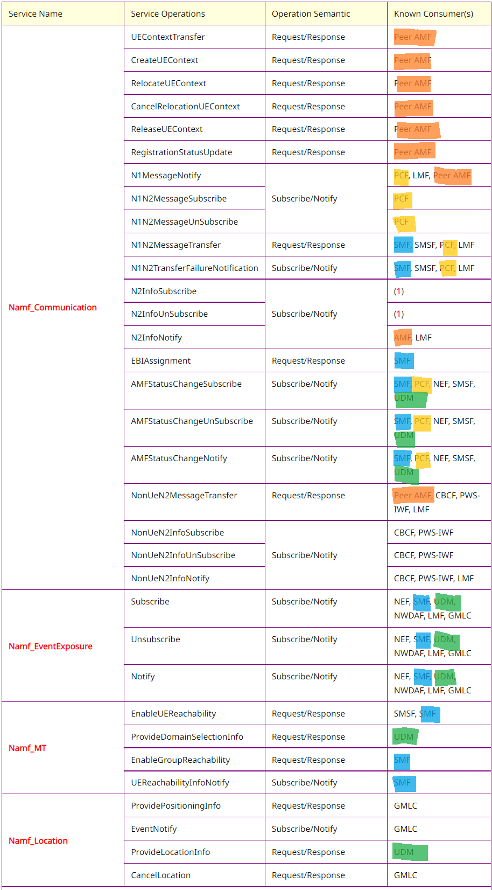

> *Wyjaśnienie nieznanych skrótow z tabeli po rozdziale `Service descriptions`

**Namf_CommunicationService**

Enables a consumer NF to communicate with UE through N1 NAS messages or with RAN through N2 NGAP messages. This service:

- Provide service operations for transporting N1 messages to the UE
- Provide service operations for initiating N2 messages towards the RAN
- Allow NFs to subscribe and unsubscribe for notifications of specific N1 messages from the UE
- Allow NFs to subscribe and unsubscribe for notifications about specific information from RAN
- UE information management and transfer (including its security context) //TODO chyba do HANDOVERA

**Namf_EventExposure**

This service enables an NF to subscribe and get notified about an Event ID.

 Following UE access and mobility information event are considered:

- Location Report (TAI, Cell ID, N3IWF/TNGF node, UE local IP address and optionally UDP source port number)
- UE moving in or out of a subscribed "Area Of Interest"
- Registration state changes (Registered or Deregistered)
- Connectivity state changes (IDLE or CONNECTED)
- UE loss of communication
- UE reachability status
- UE indication of switching off SMS over NAS service
- ....etc...

**Namf_MT**

//TODO MT - Mobile Telephony?

It provides a NF the service to request information related to capabilities that make sure UE is reachable to send MT signalling or data to a target UE. 

The following are the key functionalities of this NF service

- paging UE if UE is in IDLE state and respond other NF after the UE enters CM-CONNECTED state.
- response to the requester NF if UE is in CONNECTED state.
- providing the terminating domain selection information for IMS voice to the consumer NF.
- requesting paging towards a group of UEs as defined in [TS 23.247](https://www.tech-invite.com/3m23/tinv-3gpp-23-247.html).

**Namf_Location**

This service enables an NF to request location information for a target UE.

The following are the key functionalities of this service:

- Allow NFs to request the current or last known geodetic and optionally local and/or civic location of a target UE.
- Allow NFs to be notified of event information related to emergency sessions or deferred UE location.
- Allow NFs to request Network Provided Location Information (NPLI) and/or local time zone corresponding to the location of a target UE.
- Allow NFs to request a deferred geodetic and optionally local and/or civic location of a target UE for Periodic, Triggered and UE Available Location Events.
- Allow NFs to cancel an ongoing session for periodic or triggered location of a target UE.

> *Teraz obiecane skróty z tabelki.
>
> **LMF** - Location Management Function https://www.ericsson.com/en/blog/2020/12/5g-positioning--what-you-need-to-know
>
> **SMSF** - In 5G networks, the SMSF supports the transfer of SMS over NAS. In this capacity, the SMSF will conduct subscription checking and perform a relay function between the device and the SMSC (Short Message Service Centre), through interaction with the AMF (Core Access and Mobility Management Function).
>
> **CBCF** - Cell Broadcast Service Function. Other name for CBS is Public Warning System. The CBS service is analogous to the Teletex service offered on television, in that like Teletex, it permits a number of unacknowledged general CBS messages to be broadcast to all receivers within a particular region. https://www.etsi.org/deliver/etsi_ts/123000_123099/123041/15.02.00_60/ts_123041v150200p.pdf
>
> **IWF** - Interworking Function. 5G Interworking Function (5G IWF) secures a smooth and seamless transition until full 5G upgrade because it acts as a translator between different telecom signaling protocols, typically HTTP/2-based network functions (5G) and Diameter-based network elements (4G).
>
> **NWDAF** - Network Data Analysis Function. 
>
> **GMLC** - Gateway Mobile Location Centre (4G).  Contains functionality required to support [location-based service](https://en.wikipedia.org/wiki/Location-based_service) (LBS). In one [public land mobile network](https://en.wikipedia.org/wiki/Public_land_mobile_network) (PLMN), there may be more than one GMLC. The GMLC is the first node an external LBS client accesses in a GSM, UMTS or LTE network.

## Session Management Function

All of the PDU session management and things coupled with it are done by SMF.

Key roles of SMF:

- SMF is responsible for session establishment, modification,  and termination of PDU session.
  So when a PDU session establishment request comes form AMF to SMF, then SFM allocates it an IP address and selects appropriate UPF for it. The UPF selection can be based on DNN, geo-location and so on.
- After UPF selection SMF reaches to the PCF and receives various traffic steering rules, which passes to the UPF. SMF serves as a manager of UPF serving as the controller of policies and QoS. Any update or modification of QoS params request by PCF is sent to UPF via SMF.
- SMF terminates NAS signalling related to session management.
- SMF is responsible for handling **Downlink Data Notification (DDN)**. The DDN is received by the UPF and sent to the SMF via N4. The DDN is for any traffic coming to UE in idle mode. The SMF sends the DDN to AMF, which then starts the paging procedure.
- SMF supports **LI (Lawful Intercept)**. LI tap is configured on the SMF, and the SMF then starts tap on UPF by asking the UPF to start duplicating the packets toward X3 (https://www.lawfulinterception.com/explains/etsi-ts-103-221/). So the event details for a particaul SUP, when configured to be tapped on SMF is sent via X2. And SMF configures UPF to be tappet via sending duplication flag over Forwarding Action Rule in PFCP messages on N4.
- SMF is reposponsible for charging data collection and support of charging interfaces. The data usage information is actually collected by the UPF and sent to the SMF over the session report PFCP messages. The SMF the uses the usage reported by UPF to send the information to CHF.
- SMF is responsible for determination of **Session and Service Continuity (SSC)** mode of a session. 

### Services

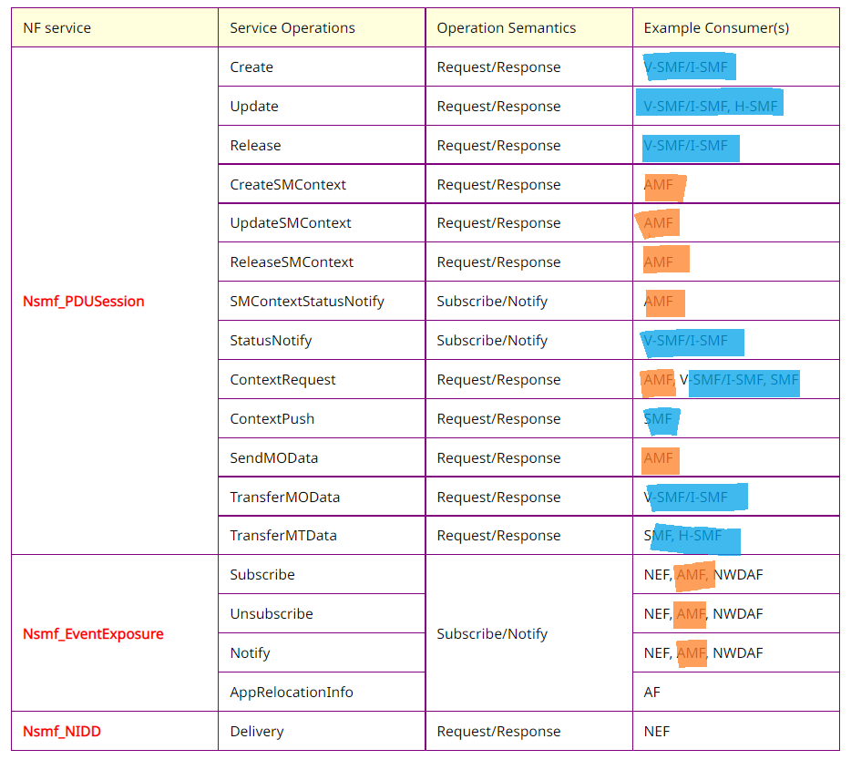

https://www.tech-invite.com/3m23/toc/tinv-3gpp-23-502_zzm.html#e-5-2-8

> V- visited, H - home, 

These are services that SMF provides on its SBI over HTTP2 protocol for other NFs in the control plane. But remember that UPF and SMF talks with reach other using PFCP.

**Nsmf_PDUSession**

This service operates on the PDU Sessions. 

**Nsmf_EventExposure**

This service provides events related to PDU Sessions towards consumer NF.  Allow other NFs to subscribe and get notified of events happening on PDU Sessions. The following are key functionalities:

- Allow consumer NFs to Subscribe and unsubscribe for an Event ID on PDU Session(s)
- Allow the NWDAF to collect data for network data analytics 
- Notifying events on the PDU Session to the subscribed NFs; and
- Allow consumer NFs to acknowledge or respond to an event notification.

The following events can be subscribed by a NF consumer:

- UE IP address / Prefix allocation/change: The event notification may contain a new UE IP address / Prefix or an indication of which UE IP address / Prefix has been released.
- PDU Session Establishment and/or PDU Session Release. Event Notification may contain (PDU Session Type, DNN, UE IP address/Prefix.)
- QoS Monitoring for URLLC: the event notification may contain the QoS.
- PLMN change; The event notification contains the new PLMN Identifier for the PDU Session.
- UE session behaviour trends

**Nsmf_NIDD**

This service is used for NIDD transfer between SMF and another NF.

> NIDD - Non IP Data Delivery.  Non-IP Data Delivery (NIDD) offers efficient communication between IoT devices and enterprise applications. This data delivery method can help applications that transact small amounts of infrequent data. NIDD is capable of transporting up to 1500 bytes in a single transmission without the tens of bytes of overhead required by IP, and higher layer protocols such as TCP or UDP. NIDD helps to reduce management overhead by eliminating the need for maintaining pools of Static IP for devices.   https://www.youtube.com/watch?v=oV4dfuowhF0 https://blog.3g4g.co.uk/2020/11/5g-non-ip-data-delivery-and-lightweight.html https://thingspace.verizon.com/documentation/apis/connectivity-management/working-with-verizon/about-non-ip-data-delivery.html

## User Plane Function

UPF is anchor for mobility (all nodes like gNodeB, AMF that servers UE can be switched along with UE mobility, but UPF is anchored, the closest it can be to the Data Network, not UE).

UPF as well as gNodeB are the only Data Plane nodes in 5G system. All nodes apart from these are control plane nodes.

Responsibilites:

- UPF is anchoring points for intra- and inter-RAT mobility as applicable. RAT - Radio Access Technology (e.g. NR is RAT for 5G, UMTS is RAT for 3G).
- UPF is responsible for allocating UE IP addresses or prefixes in reponse to a request by the SMF
- UPF perorms the role of the external PDU session point of connection to the external DN
- UPF is reponsible for routing of packets ad forwarding
- UPF is responsible for Deep Packet Inspection, including detection of applications based on a **Service Data Flow (SDF)** template and the optional Packet Detection Rule received from the SMF.
- UPF is responsible for the user plane part of policy rule enforcement (e.g. gating, redirection, traffic steering)
- UPF is responsible for Lawful Intercept
- UPF is responsible for traffic usage reporting
- UPF is responsible for handling and enforcing QoS for the User Plane (e/g/ UL/DL rate enforcement, reflective QoS marking in DL)
- UPF is responsible for UL traffic verification (SDN to QoS flow mapping)
- UPF is responsible for transport level packet marking in UL and DL
- UPF is responsible  DL packet buffering and DL data notification triggering
- UPF sends and forwards one or more end-markers to the source NG-RAN node
- UPF is responsible for functionality that responds to ARP requests as well as the IPv6 neighbr solicitation requests based on information available in the local cache for the ehternet-type of PDUs. UPF responsds to ARP and IPv6 neighbor solicitation request by providing the MA address that corresponds to the IP address sent in the request

### Services

**The UPF is not Service-Based-Interface**. It supports PFCP in control plane, and GTPU in the user plane.

But somehow there is one service UPF provides

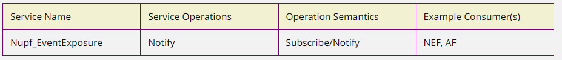

This service can expose UPF related information to other NFs. In this case Network Exposure Function and Application Function.

UPF interacts with SMF via PFCP messages.

#### PFCP 

Here are the main concepts used, organized in their logical association model:

- PDRs - Packet Detection Rules - contain information for matching data packets to certain processing rules. Both outer encapsulation and inner user-plane headers can be matched. The following rules can be applied on positive matching:
  - FARs - Forwarding Action Rules - whether and how the packets matching PDRs should be dropped, forwarded, buffered or duplicated, including a trigger for first packet notification; it includes packet encapsulation or header enrichment rules. In case of buffering, the following rules can be applied:
    - BARs - Buffering Action Rules - how much data to buffer and how to notify the Control-Plane.
  - QERs - [QoS](https://en.wikipedia.org/wiki/Quality_of_service) Enforcement Rules - rules for providing Gating and QoS Control, flow and service level marking.
  - URRs - Usage Reporting Rules - contain rules for counting and reporting traffic handled by the User-Plane function, generating reports to enable charging functionality in the Control-Plane functions.

## Policy Control Function

> Communication in 5G is based on HTTP, and in 4G it was diameter-based

The PCF plays a key role in implementing **VoNR (Voide over New Radio)**. It is not possible to support VoNR withouth PCF, as it communicates with the IMS core to receive rules to create voice PDU session.

Responsibilities:

- PCF supports an unified policy framework that governs network behavior
- PCF supplies policy rules to the control plane function to be enforced by them
- PCF accesses the subscription-related information for the user, which is relevant for policy decisions in a UDR
- These dynamic rules sent to the SMF as a part of update notify messages, on the receipt of the same SMF, creates flows for traffic steering and sends it to the UPF for enforcement

PCF needs to be configured with all the policy rules and logic guiding the QoS for both voice and data.

### Services

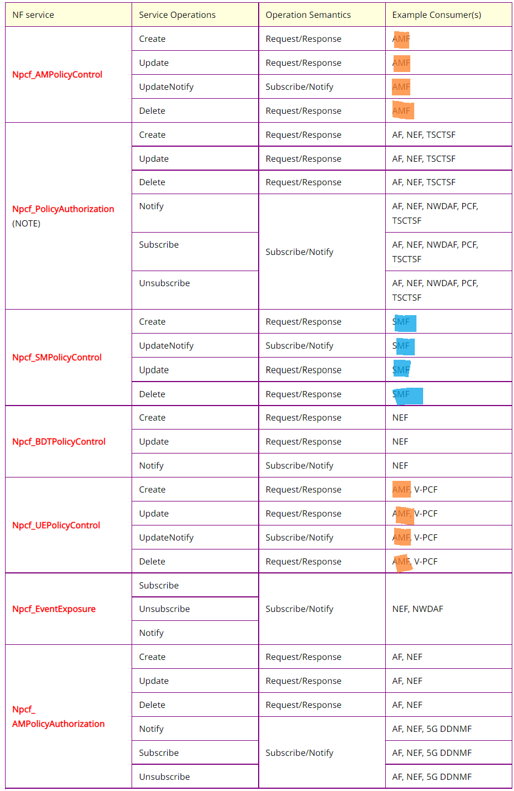

> TSCTF -  Time Sensitive communication Time Synchronization Function (for IoT systems)
>
> 5G DDNMF - 5G Direct Discovery Name Management Services

## Charging Function

The CHF in the 5G world has changed dramatically. In 4g there used to be separate nodes for online and offline charging services. In the 5G, charging has changed significantly. Let us go through the details

- In the 5G, CHF does converged charging, which means that it covers all of:

  - online charging
  - offline charging
  - creation of **charging data records (CDRs)**

  Hence CHF supports both on- and off-line charging

- In 4G PGW and SGW (roaming/VMNO) used to generate CDRs. 
  In 5G only SMF is responsible for reporting the usage and requesting quota to the CHF. 
  CHF in turn, uses this info to generate CDRs.

- Therefore SMF doesn't interact with the billing system (like PGW used to interact with CGF in 4G). 
  All interactions with the billing system occur via CHF.

- CHF is HTTP based SBI, and no longer a diameter/GTP-based

- CHF converges online and offline systems.  and
  CHF contains: 

  - an  Rating Function (**RF**) that determines the value of the network resource usage
  - Account Balance Management Function (**ABMF**) that is the location of the subscriber account balance
  -  Charging Gateway Function (**CGF**) acting as a gateway between the 3GPP network (5G system) and billing domain

- Slice info in the report sent by SMF to CHF can be used to charge different slices differently

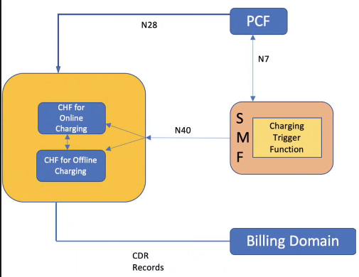

Charging Trigger Function (CTF) is located in SMF.

### Services

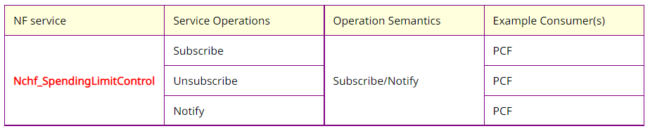

PCF can subscribe to notification of changes in the status of the policy counters available at the CHF and retrieval of the status of the policy counters for which subscription is accepted by CHF.

## Authentication Server Function

AUSF is similar to HSS in 4G. AUSF is connected to the UDM. AUSF is used by AMF.

AUSF is responsible for:

- implements the **EAP (Extensible Authentication Protocol)** authentication server for security procedures with AMF
- stores keys that are retrieved by AMF for security and integrity protection

### Services

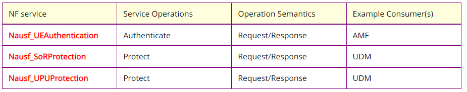

**Nausf_UEAuthentication**

AUSF provides UE authentication service to the requester NF. For AKA based authentication, this operation can be also used to recover from synchronization failure situations.

**Nausf_SoRProtection**

AUSF provides the Steering of Roaming information protection service to the requester NF.

**Nausf_UPUProtection**

AUSF provides the UE Parameters Update protection service to the requester NF.

## Unified Data Management

UDM is reponsible for:

- key management
- user identification handling
- access authorization
- and so forth

UDM uses subscriber subscription data (which includes authentication data for example), which is stored in UDR.

Responsibilities:

- generation of 3GPP AKA authentication credentials
- user identification handling (e.g. storing SUPI of each subscriber in the 5G network)
- deconcealing (odukryć) the privacy protected subscriber identifier - SUCI
- access authorization based on subscription data (e.g. in roaming restrictions)
- storing UE's serving NFs (e.g. serving AMF for UE. serving SMF for UE's session)
- support of **Session and Service Continuity (SSC)** by storing SMF/DNN assignment of current UEs PDU session
- support of [MT-SMS](https://www.bandwidth.com/glossary/mt-sms-mobile-terminated-messages/) delivery 
- Lawful Interception functionality - especially in outbound roaming cases where UDM is the only point of contact for LI.
- subscription management
- SMS management
- support of external parameter provisioning, which includes the expected UE behavior parameters or network configuration parameters.
  - It means that external apps (via NEF) can put some of their params in the UDM

### Services

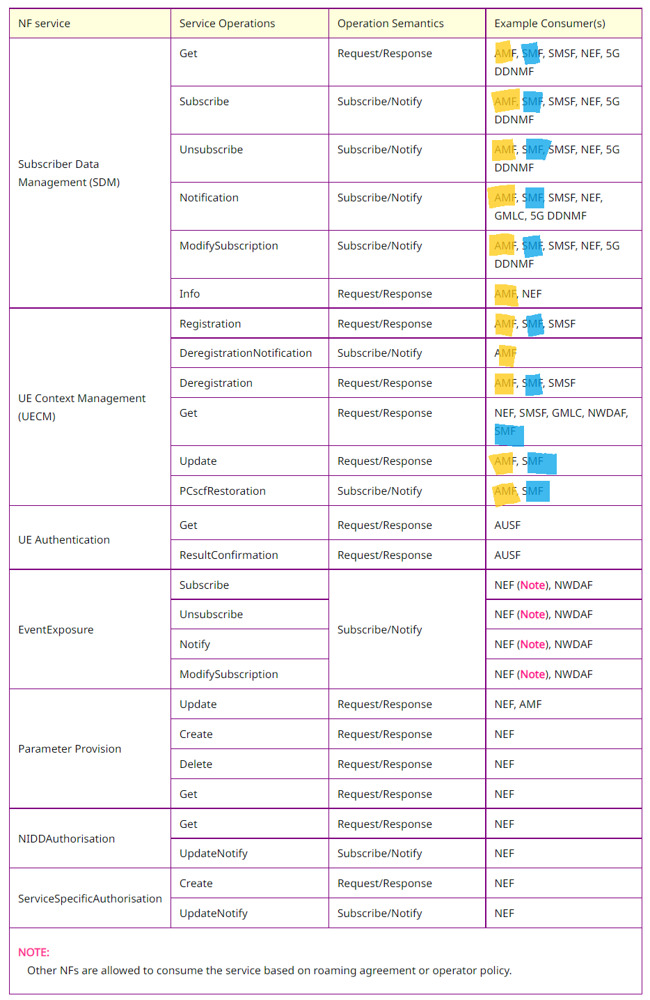

**Subscriber Data Management**

Fields stored in UDM are present [here](https://www.tech-invite.com/3m23/toc/tinv-3gpp-23-502_zzi.html#e-5-2-3-3). They are grouped by type (area of usage) and have detailed description.

**UE Context Management**

**UE Authentication**

**Event Exposure**

[Network Exposure](https://www.tech-invite.com/3m23/toc/tinv-3gpp-23-502_zn.html#e-4-15-3-1)

> The Monitoring Events feature is intended for monitoring of specific events in 3GPP system and making such monitoring events information reported via the NEF. It is comprised of means that allow NFs in 5GS for configuring the specific events, the event detection and the event reporting to the requested party.

**Parameter Provision**

This service is for allowing NEF to provision of information which can be used for the UE in 5GS.

**NIDD Authorization**

Non-IP Data Delivery (NIDD) it is a means for delivering data via a PDU Sessions of type **"Unstructured"**. The subsequent clauses describe the procedures necessary to support NEF based NIDD.

**Service Specific Authorization**

This service is for authorization of a specific service configuration.

## Unified Data Repository

UDR is contacted by UDM for retrieval of subscription data. This is where user details are actually stored. It also stores policy data and is connected to the PCF.

Reponsibilites:

- storage of subscription data (used by UDM)
- storage of policy data (used by PCF)
- storage of structured data for exposure (used by NEF)
- storage of application data, which includes **Packet Flows Descriptions (PFDs)** for application detection
- storage of NF group ID corresponding to SUPI

### Services

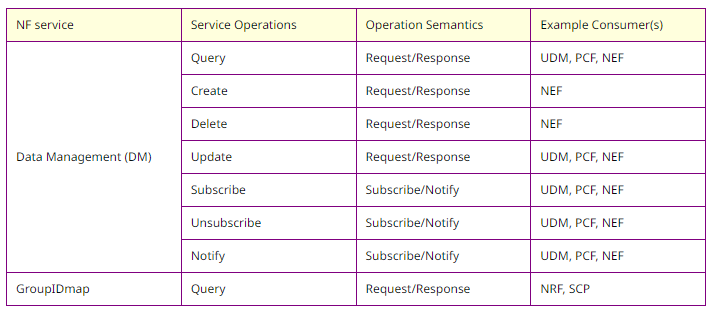

The following Table shows the Exposure data that may be stored in the UDR along with a time stamp using Data Management (DM) Service

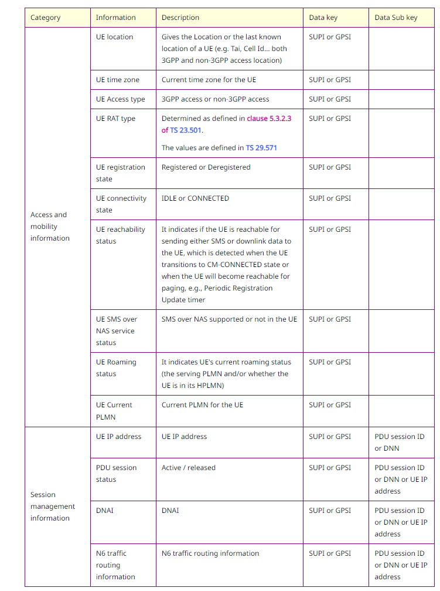

## Network Slice Selection Function

Network slicing is one of the key aspects newly introduced in 5G. 

This will allow the service providers to provide specific portions of their network for specific use-cases.

This ensures that the required resources are always available to cater for a specific use case (type of traffic)

The network topology in the IP core for these slices can also be tweaked (dostrajać).

In a nutshell, slicing is the partitioning of the network architecture into virtual elements. It allows creation of multiple virtual networks over the same physical infrastructure. 

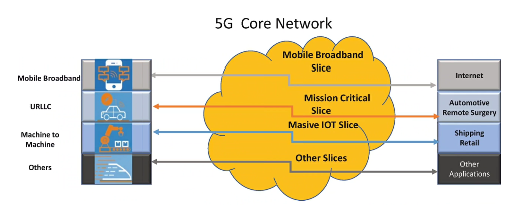

Slicing would result in savings for the operator, as they would need to be quickly able to deploy NFs that would cater to a specific use-case rather than deploying a full 5G Core.

NSSF is the function that is used by AMF to select a particular slice for a particular use-case.

NSSF is the node responsible for the slice selection. Its key responsibilities include:

- selection of the set of network slice instances serving a UE
- determination of the allowed NSSAI (Network Slice Selection Assistance Information) and when needed, mapping to the subscribed S-NSSAIs (Single NSSAI).
- determination of the configured NSSAI and when allowed, mapping to the subscribed S-NSSAIs (Single NSSAI)
- determining the AMF set that is to be used to server the UE based on its subscription and location

### Services

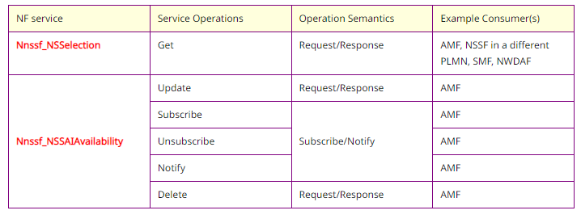

**Nnssf_NSSelection**

Enable Network Slice selection in both: the serving PLMN and HPLMN (H-Home, V-Visited).

It also enables the NSSF to provide to the AMF the Allowed NSSAI and the Configured NSSAI for the Serving PLMN.

It may be invoked during Registration procedure, during inter-PLMN mobility procedure, during PDU Session Establishment procedure or during UE Configuration Update procedure. When invoked during Registration procedure it may possibly trigger AMF re-allocation. When invoked during PDU Session Establishment procedure it may be invoked in the VPLMN or in the HPLMN; if invoked in the VPLMN it returns the hNRF selected by the hNSSF and, if applicable, the value of the HPLMN NSI ID. When invoked during UE Configuration Update procedure or inter-PLMN mobility procedure it may be invoked in the Serving PLMN.

**Nnssf_NSSAIAvailability**

This service enables to update the AMFs and the NSSF on the availability of S-NSSAIs on a per TA basis.

## Network Exposure Function

NEF is another new Network Functionality introduced in 5G.

It helps to secure the exposure of network services over APIs for data, voice, subscriber data, and so forth to third-party applications.

NEF will receive information from other NFs based on capabilities exposed by other NFs.  The NEF will then store the received information as "structured data" using standardized interface to UDR. The stored information can be accessed and exposed by NEF to other network functions and application functions.

Responsibilities:

- With NEF, the NF capabilities and events can be secure exposed (e.g. 3-rd party apps, AFs, edge computing)
- NEF will store "structured data" in UDR
- NEF securely provisions info from external applications to a 3GPP network
- NEF provides means for the AFs to provide any information securely to the 3GPP network - for example expected UE behavior (so the external app will not crash 3GPP network). NEF can authenticate/authorize and assist in throttling the AFs in such cases.
- NEF translates "internal external" information
- It translates between info exchanged with the AF and info exchanged between core-internal NFs (e.g. translates AF service idenitfier and internal 5G core info such as DNN, S-NSSAI etc.)
- NEF handles masking of network-sensitive or user-sensitive info to any external app according to configured network policy
