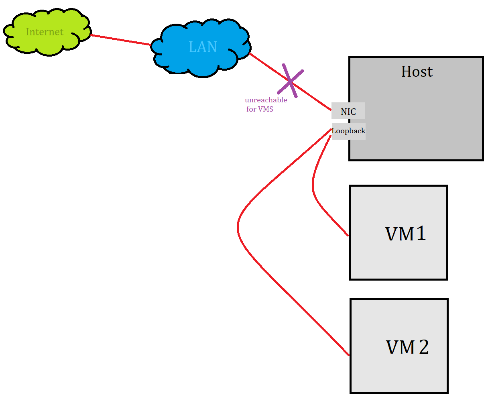

# Virtual Networking - Networking Modes

In VirtualBox you can add a Network Adapter for a VM. It will result in a NIC created for that VM. But while creating adapter, you need to specify **Networking Mode**. 

> Note that VM can have multiple interfaces added, and it is not required for them to have the same network mode

## Overview

Networking modes:

- **Not attached** - VM has a NIC, but there is no link present. This is as if no cable was plugged in the card. Use this mode if you want your VM to be isolated from any networking concepts.
- **NAT** - Use this mode if you want your VM to have Internet connection and you don't care about nothing more. Because of its ease this is the default configuration.
- **Bridged Networking** - Use this mode if you want your VM to act as a separate PC connected your you LAN network.
- **Internal Networking** - Use this mode if you want to create a software-based network which is visible to selected VMs, but not to the Host or to the outside world.
- **NAT Networking** - Special type of Internal Networking, which allows connection to the outside world.
- **Host-Only Networking**- Use this mode if you want to create a network containing set of selected VMs and the host.

## Specification

### Introduction

In general the PC on which you have the VirtualBox installed (the **host** machine) is connected to some Local Area Network (**LAN**). 

*LAN* apart from your PC can contain other users PCs, laptops, WI-FI hotspots by which users can connect mobile phones to the LAN, switch which connects all of the network nodes, and the router which is the gateway for the outside world.

### NAT

VM acts like a real PC connected to the Internet through a router. The router in this case is **VirtualBox Networking Engine**, which maps traffic from and to the VM. NAT means "Network Address Translation".

Packets sent from VM are received by *VirtualBox Nat Engine*, which extracts the TCP/IP data and resends it using Host operating system. To the outside world (an application on host, a pc in LAN, for Internet) it looks like the packet was sent by VirtualBox application on the *host* (using *host* machine IP address). VirtualBox listens for replies to the packets sent, repacks them and resends them to the VM.

> Note that your LAN network is invisible outside the router. Internet knows only your router (because it has assigned IP from your ISP). It makes your LAN a **private network**, it is invisible and unreachable from the Internet.

Much like a private network behind a router, the VM is invisible and unreachable from the Internet. You cannot run a server this way.

**Network from VM point of view**

From VM point of view it just has an Internet connection. 

///TODO can you ping VM from LAN????

**Security**

VirtualBox places a "router" between each VM with NAT adapter, so every VM is isolated.

### Bridged Networking

VirtualBox uses a device driver on your host OS that filters data from your physical NIC. This driver is called **Net Filter** driver. This way VirtualBox can intercept packets from physical NIC and inject data into it, effectively creating a new NIC in software. When VM uses this new NIC, it looks to the host system (and others devices in LAN) as thought the VM is physically connected to the host NIC using network cable. 

The term "Attached to Bridged Adapter" really fits here. Under `Name` you select to which of your PC's adapters/NIC you want to add *Net filter* for your VM.

**Network from VM point of view**

For VM it appears that it is connected to the same LAN as host machine.

**Security**

All traffic goes through a physical interface on host system.  It is therefore possible to attach a packet sniffer such as Wireshark to the host interface and log all traffic that goes over it. 

### Internal Networking

If you create a single VM with adapter attached to "Internal Networking" this VM resulting state would be the same as if with *Not attached* adapter. But if you create second VM and attach its "Internal  Networking" adapter to the same Internal Network,  the **VirtualBox Support Driver** will automatically "wire" the adapters and act as a Ethernet Switch, hiding all the data from both LAN and even host OS.

Internal networks are created automatically as needed. There is no central configuration. Every internal network is simply identified by its name, and is created if there is more than one active VM NIC with the same `Internal Network Name`.

**Network from VM point of view**

> All 4 VMs have Internal Networking Adapter with the same `Internet Network Name` assigned.

As you can see VMs can only reach it selves. Because no physical interface is present, VMs cannot talk to the outside world.

**Security**

Even though technically, everything that can be done using internal networking can also be done using bridged networking, there are security advantages with internal networking.

If for any reason, you want two or more VMs on the same machine to communicate privately, bridged networking is not an option, because of the traffic going through sniffable physical NIC.

With internal networking data being exchanged between the machines is hided from the PC user and even from the PC OS.

Network between VMs is completely isolated from everything.

### Host-Only Networking

VirtualBox creates a new software NIC on the host which appears next host's existing network interfaces. But this interface is a **loopback interface**.

As you know loopback interface is used for communication between processes "intra-OS". For that reason VMs with Host-Only interface can talk to other VM with such adapter, with the host OS, but cannot reach outside world.

>  This type of networking is useful for preconfigured virtual appliances, where multiple VMs are shipped together and designed to cooperate. For example one VM may be a web server, and a second one a database. We can create:
>
> - Host-Only Network for them two, so they can talk to each other and to host OS (for debugging, logs etc..)
> - Bridged Network for VM with web server, so it can expose its service for the world
>
> But the outside world won't be able to connect to the database

**Network from VM point of view**

So the VMs with Host-Only adapters are all connected to each other, but due to it all happening on the *loopback* interface, also Host has access to this network.

**Security**

All traffic between the VMs happens on the loopback interface, and whereas with internal networking, it cannot be seen, the traffic on the loopback interface can be intercepted by the host OS. But sometimes it is handy to have Host OS attached to this network.

### More specific specification

//TODO

Nice picture of  Host Only Network --> https://www.nakivo.com/blog/virtualbox-network-setting-guide/

