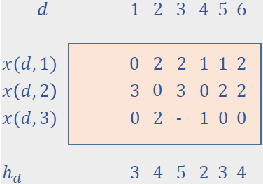

# oast-proj

Stages:
- DAP description
- Evolutionary Algorithm for DAP
- Simpleks for DAP
- Brute Force for DAP

## DAP Description

### core.model.Link
```kotlin
id: Int
srcNode: Int
dstNode: Int
capacity: Int
```

### core.model.Demand
```kotlin
id: Int
srcNode: Int
dstNode: Int
volume: Int // same unit as capacity
paths: core.model.Path
```

### core.model.Path
```kotlin
id: Int // local id intra demand (unique id = demandId+pathId)
linkList: List<Int>
```

### FlowAllocation
Jeden wpis w `FLowMatrix`
```kotlin
demand: Int // demand id
path: Int   // path id intra demand
volume: Int // same unit as capacity
```

### core.model.FlowMatrix


Macierz przepływu, jeden wpis w niej to jedno `FlowAllocation`.
Reprezentowana w RAM jako tablica dwuwymiarowa i implementacja na dwóch forach.
liczba kolumn - liczba demandów (demands.size())
liczba wierszy - liczba ścieżek w demandzie o max liczbie ścieżek. Tam gdzie '-' to dajemy INT_MAX


```kotlin
body: 2Darray<FlowAllocation>
```

## Pseudocode
Cel: Obliczyć F(x) -> Obliczyć l(e,x) dla danego x (hardcodowane) i dla danej sieci (zparsowane)

Klasy:
- core.model.Link
- core.model.Path
- core.model.Demand
- Taka co liczy l, Y, F

- Wczytać `links`
- Wczytać `demands`
- Wygenerować zerową `core.model.FlowMatrix`, potem wypłenić (napoczątek hardcode)
- Obliczyć l(e,x)  
- Obliczyć Y(e,x)
- Obliczyć F(e,x)