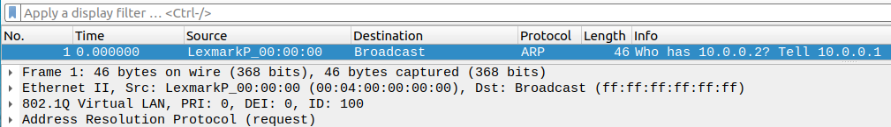

# Lab 3
Autor: Andrzej Gawor
## Poczynione kroki
### 1. Przygotowanie
- Instalacja kompilatora P4
- Instalacja swticha bmv2
- Instalcja Mininet

- zapoznanie się z plikiem [1sw_demo.py](1sw_demo.py)
- kompilacja [template.p4](template.p4) (aby otrzymac plik json)
```sh
p4c --target bmv2 --arch v1model template.p4
```
- odnalezienie pliku binarnego switcha bmv2 `/usr/bin/simple_switch`
- uruchomienie `1sw_demo.md` z odpowiednimi argumentami
```sh
sudo python3 1sw_demo.py --behavioral-exe=/usr/bin/simple_switch --json template.json
```
Skrypt ten uruchomia Mininet CLI i w nim mozna wykonać debugging. Ping test między hostami nie działa, tak jak oczekiwano.

Note: Po wyłączeniu mininet na wszelki wypadek warto wykonać.
```sh
sudo mn -c
```
### 2. Development programu P4
Zadania z instrukcji podzieliłem następująco:
- Przekazywanie pakietów między interfejsami -->    **Zad1**
- Dodawanie lub usuwanie tagu VLAN           -->    **Zad2**
#### Zad 1

W topologii są jedynie dwa hosty, switch ma tylko dwa interfejsy dlatego najprostszym rozwiązaniem bedzie zaprogramowanie tak switcha, aby pakiety z `eth1` były przekazywane na `eth2` i na odwrót.

```p4
/*************************************************************************
**************  I N G R E S S   P R O C E S S I N G   *******************
*************************************************************************/

control MyIngress(inout headers hdr,
                  inout metadata meta,
                  inout standard_metadata_t standard_metadata) 
{
	apply 
	{
		if (standard_metadata.ingress_port == 1) {
            standard_metadata.egress_spec = 2; // Forward from eth1 to eth2
        } else if (standard_metadata.ingress_port == 2) {
            standard_metadata.egress_spec = 1; // Forward from eth2 to eth1
        }
	}
}
```

Jednakże to proste rozwiązanie nie jest w żaden sposób skalowane, posłużyło jedynie jako test środowiska developerskiego*
> *Taki test przed rozpoczęciem programowania okazał się bardzo przydatny, wykryto, że plik [1sw_demo.py](1sw_demo.py) definiuje taką topologię sieci, w której pingi między hostami nie działają, gdyż są one w innych podsieciach.
```sh
p4c --target bmv2 --arch v1model zad1.p4
```

```sh
sudo python3 1sw_demo.py --behavioral-exe=/usr/bin/simple_switch --json zad1.json
```

Bardziej ogólne rozwiązanie tzn. takie, które pozwala, aby w topologii sieci było więcej niż dwa hosty korzysta z tablic.

Tablice pozwolą na to, aby zapisywać w nich mapowania, mówiące o tym, na który interfejs wyjściowy kierować pakiet, gdy wejdzie na dany port wejściowy. 


Względem [template.p4](template.p4) należy zmodyfikować jedynie blok `MyIngress`.
```p4
control MyIngress(inout headers hdr,
                  inout metadata meta,
                  inout standard_metadata_t standard_metadata) 
{
	// zdefiniowanie akcji, ktora ustawia port wyjsciowy na taki jaki jest na wejsciu akcji
	action set_output_interface(bit<9> out_port) {
 		standard_metadata.egress_spec = out_port;
	}
	// ta tablea "mapuje interfejsy/porty" - stąd jej nazwa
	// kluczem do przeszukiwania wpisów jest port wejściowy, dopasowanie ma byc typu 'exact'(identyczne)
	// akcje to albo set_output_interface zdefiniowane wyzej, albo brak akcji w przypadku braku dopasowania
	// rozmiar to 256 wspisów, tyle ile 1 bajt pozwala
	table interface_mapper {
		key = {
			standard_metadata.ingress_port: exact;
		}
		actions = {
			set_output_interface;
			NoAction;
		}
		size = 256; // Correctly specify the size outside of the actions block
	}

	apply 
	{	
		interface_mapper.apply();
	}
}
```

Nasŧepnie uruchomic CLI do control plane switcha i dodac odpowiedni wpisy do tabeli:
```sh
python3 runtime_CLI.py --thrift-port 9090
RuntimeCmd> table_add interface_mapper set_output_interface 1 => 2
RuntimeCmd> table_add interface_mapper set_output_interface 2 => 1
```

W Mininet ping juz wtedy działa:

#### Zad 2
```sh
p4c --target bmv2 --arch v1model zad2.p4
```
```sh
sudo python3 1sw_demo.py --behavioral-exe=/usr/bin/simple_switch --json zad2.json
```
```sh
python3 runtime_CLI.py --thrift-port 9090
RuntimeCmd> table_add interface_mapper set_output_interface 1 => 2
RuntimeCmd> table_add interface_mapper set_output_interface 2 => 1
RuntimeCLI > table_add port_to_vlan set_vlan_tag 1 => 100
```

W tym zadaniu jako podstawę wykorzystano plik [zad1.p4]. Dodaną funkcjonalnością będzie dodawanie vlan tag'u na podstawie tablicy.

W tym celu dodano kod do sekcji `headers`:
```p4
header ethernet_t {
    bit<48> dstAddr;
    bit<48> srcAddr;
    bit<16> etherType;
}

header vlan_t {
    bit<3>  priority;
    bit<1>  cfi;
    bit<12> vid; 
	bit<16> etherType; // To store the original EtherType from the Ethernet header
}

struct headers {
    ethernet_t ethernet;
    vlan_t     vlan;
}
```

Zmodyfikowano również parser (i deparser) oraz dodany następujący kod do bloku Ingress:

```p4
	hdr.vlan.setValid();
		hdr.vlan.vid = vlan_id;
		hdr.vlan.priority = 0;
		hdr.vlan.cfi = 0;
		hdr.vlan.etherType = hdr.ethernet.etherType; // Save the original EtherType
		hdr.ethernet.etherType = 0x8100; // Indicate the presence of a VLAN tag
	}


	table port_to_vlan {
		key = {
			standard_metadata.ingress_port: exact; // Match on ingress port
		}
		actions = {
			set_vlan_tag;  // Action to set the VLAN ID
		}
		size = 256; // Adjust size as necessary
 	}	
```

Test wygląda tak samo jak w zadaniu 1 z tymże dodatkowo uruchamiamy `tcpdump`, aby potem obejrzec pakiety w Wireshark:
```sh
sudo tcpdump -i s1-eth2 -w capture.pcap -v
wireshark capture.pcap
```

W Wireshark widac pierwszy złapany pakiet (akurat ARP) a wnim obecny między innymi VLAN TAG ID.

