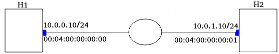

<h1 align="center">PRINtler</h1>

<p align="center">
  
  <br>
  <i>PRINtler a simple IP router for PRIN course on WUT</i>
  <br>
</p>

## 1 Business reqs
### 1.1 IP Router
#### 1.1.1 Opis
**Routing**
User wpisuje do tabeli wpis:
- docelowy adres IP (adres hosta) (to jest kluczem przeszukiwania tabeli)
- na jaki port kierowac ten pakiet (czyli za pomoca, ktorego portu mamy osiagnac dany host docelowy) (to jest parametr akcji)
- adres MAC next-hopa, ktory ma zostac wpisany w pakiet w warstwie ETH (zeby next-hop go nie odrzucil na L2)

**TTL**

Dodatkowo pakiet IP ma mieć odczytywane pole TTL i odrzucane jesli jest ono mniejsze niz 2. 

**Checksum**

Dodatkowo aktualizowac ma sie suma kontrolna.
#### 1.1.2
- [ ] Routing
- [ ] TTL
- [ ] checksum
#### 1.1.3 Co to implikuje
Sieć złożona z dwóch hostów oraz switcha. Wszystkie urządzenia mają mieć przypisane statyczne adresy IP oraz MAC. Trzeba to zdefiniować w [1sw_demo.py](1sw_demo.py).

**checksum**
Na poprzednich zajeciach nie musielismy tego robic bo nic nie zmienialismy w protokole IP. Hosty bedą odrzucać pakiety ze zła sumą kontrolną, więc od tego nalezy zacząć implementację.
#### 1.1.4 Testy
**Routing**

Mozna wymyslec topologie oraz jakie wpisy dodac do tabeli zeby przetestowac ruting.
**TTL**

Po odpaleniu Mininet mozesz wejsc w jego iptables i dodac zeby wszystkie pakiety IP wysylal z TTL 1.
```sh
Mininet CLI> h1 iptables -t mangle -A POSTROUTING -j TTL --ttl-set 2
```
**checksum**

Jesli bedzie bledna to host odrzuci. 

### 1.2 IP Filter
#### 1.2.1 Opis
Use wpisuje do tabeli wpis, który reprezentuje trójkę, która identyfikuje pakiety jakie należy odrzucać. Ta trójka to:
- docelowy adres IP
- protokół warstwy transportowej
- port

np. `{10.0.0.1, TCP. 80}`

ale moze też być wildcard czyli np. `{10.0.0.1, TCP, *}`, do tego będzie Ci potrzebny ten ternary operator.
#### 1.2.2 Reqs
- [ ] Basic filter
- [ ] Wildcards
#### 1.2.3 Co to implikuje 
Nic.
#### 1.2.4 Testy
Przez mininet mozna wejsc na hosty przez xterm do ich shell'a i uzyc scapy. Na jednym uruchamia sie klient a na drugim serwer i mozna testowac connections TCP lub UDP.

> Note: scapy bedzie trzeba za kazdym razem instalowac podczas runtime. Albo mozesz zmodyfikowac skrypt [1sw_demo.py](1sw_demo.py)

Alternatywą dla scapy jest [nc](https://linux.die.net/man/1/nc).
**Basic filter**

Można wymyślec wpisy do tabeli i potem scapy'm generować ruch.
**Wildcards**

Po stronie Trift będzie to samo. Inne tylko testy na scapy.
### 1.3 IP Stats
#### 1.3.1 Opis
Router ma zbierac statystyki dotyczące ...(lista poniżej). User za pomocą Trift moze sobie je querować. Nie wiem jeszcze jakie komendy trift to robią.

**Jakie staty:**

- Dla każdego portu liczba pakietów
	- odebranych
	- przeslanych dalej
	- wysłanych
- Dla całego switcha
	- liczba pakietów odrzuconych

Każdy port na warstwie fizycznej najniższej ma Receiver oraz Transceiver. Więc jak mówimy o porcie, to on w danej sytuacji (procesowania single pakietu) pełni rolę albo Tx albo Rx.
Pojęcia odebrać/wysłać pakiet są w odeniesiu do swtich - external world. Więc odebrać może tylko Rx. Wysłać tylko Tx. Pojęcie przesłać dalej jest w obrębie switcha, więc może to zrobić jedynie Rx.


### 1.3.2 Topologia


Tak nalezy zmodyfikować plik [1sw_demo.py](1sw_demo.py).

Na tym rysunku dodaj maske podsieci /24 do adresów IP bo to sugeruje maske 32 jak nie ma jej.


## 2 Przebieg cwiczenia
### 2.1 Przygotowanie topologii
Najpierw nalezy przygotowac topologię według rysunku z sekcji 1.3.2. Polega to na modyfikacji pliku 1sw_demo.py. 

```sh
sudo python3 1sw_demo.py --behavioral-exe=/usr/bin/simple_switch --json template.json
```

Następnie za pomocą Mininet CLI przetestowano czy zaszły w topologii odpowiednie zmiany. Ale okazuje się, że [1sw_demo.py](1sw_demo.py) wcale nie ustala konfiguracji IP i MAC na s1. Tzn. nie ma tych informacji w mininet po uzyciu komendy `s1 ifconfig -a`. W lab 3 zresztą też nie ma. adres IP do interfejsu jest przypisywany dynamicznie więc najwyżej podczas runtime będzie on odczytywany. Adres IP najprawdopodobniej nie będzie potrzebny podczas realizacji ćwiczenia, dlatego postanowiono pozostawić topologię nieco różniącą się od tej z rysunku w sekcji 1.3.2.

Zakres funkcjonalny programu podzieliłem na 3 części/moduły:
- IP Router
- IP Filter
- IP Stats 
Ich opis znajduje się w sekcji 1.

### 2.2 IP Router
#### 2.2.1 Komendy potrzebne do debugowania
```sh
p4c --target bmv2 --arch v1model printler.p4
```

```sh
sudo python3 1sw_demo.py --behavioral-exe=/usr/bin/simple_switch --json printler.json
```
#### 2.2.2 Zmiany w kodzie
Opisane zmiany występują względem pliku referencyjnego jakim jest [template.p4](template.p4)

Po pierwsze zdefiniowano odpowiednie nagłówki:
```p4
header ethernet_t {
    bit<48> dstAddr;
    bit<48> srcAddr;
    bit<16> etherType;
}

header ipv4_t {
    bit<4>  version;
    bit<4>  ihl;
    bit<8>  diffserv;
    bit<16> totalLen;
    bit<16> identification;
    bit<3>  flags;
    bit<13> fragOffset;
    bit<8>  ttl;
    bit<8>  protocol;
    bit<16> hdrChecksum;
    bit<32> srcAddr;
    bit<32> dstAddr;
}

struct headers {
    ethernet_t ethernet;
    ipv4_t ipv4;
}
```
Adekwatnie zmieniono również parser.

W bloku `MyIngress` dodano:
- akcję `forward` kierującą dany pakiet na zadany port i podmieniającą docelowy adres MAC
- tabelę, której kluczem jest adres IP i korzysta ona z akcji `forward`

```p4
control MyIngress(inout headers hdr,
                  inout metadata meta,
                  inout standard_metadata_t standard_metadata) {

    action forward(bit<9> egress_port, bit<48> new_dst_mac) {
  	  	standard_metadata.egress_spec = egress_port;
    	hdr.ethernet.dstAddr = new_dst_mac;
	}


    table ip_routing {
        key = {
            hdr.ipv4.dstAddr : lpm;
        }
        actions = {
            forward;
            NoAction;
        }
        size = 1024;
        default_action = NoAction();
    }

    apply {
        ip_routing.apply();
    }
}
```

Dodatkowo aby odrzucać pakiety z TTL mniejszym niż 2 musimy dodać blok warunkowy w bloku `MyIngress.apply`:
```p4
apply {
        // Check if the packet is an IPv4 packet and if the TTL is less than 2
        if(hdr.ipv4.isValid() && hdr.ipv4.ttl < 2) {
            drop(); // Drop the packet
        } else {
            // Proceed with IP routing
            ip_routing.apply();
        }
    }
```


Na koniec należy również obliczyć na nową sumę kontrolną z racji modyfikacji w pakiecie:
```p4
control MyComputeChecksum(inout headers hdr, inout metadata meta) {
    apply {
        update_checksum(
            hdr.ipv4.isValid(),
            { hdr.ipv4.version, hdr.ipv4.ihl, hdr.ipv4.diffserv, hdr.ipv4.totalLen,
              hdr.ipv4.identification, hdr.ipv4.flags, hdr.ipv4.fragOffset, hdr.ipv4.ttl,
              hdr.ipv4.protocol, hdr.ipv4.srcAddr, hdr.ipv4.dstAddr },
            hdr.ipv4.hdrChecksum,
            HashAlgorithm.csum16
        );
    }
}
```


#### 2.2.3 Test
Aby przetestować routing za pomoca RuntimeCLI należy dodac nastepujace wpisy (wynikaja one z zalozonej topologii)
```sh
python3 runtime_CLI.py --thrift-port 9090
table_add ip_routing forward 10.0.1.10/32 => 2 0x000400000001
table_add ip_routing forward 10.0.0.10/32 => 1 0x000400000000
```
Aby wykonać test czy pakiety z TTL < 2 są odrzucane, należy ustawić na którymś z hostów odpowiednią regułę do iptables:
```sh
h1 sudo iptables -t mangle -A POSTROUTING -j TTL --ttl-set 1
```
Rzeczywiście, ping między h1 a h2 po wykonaniu tej komendy w Mininet CLI nie działa.

Kod powstały w tej części archiwizuje pod postacią pliku: [printler.post-iprouter.p4](printler.post-iprouter.p4).

### 2.3 IP Filter
#### 2.3.1 Komendy potrzebne do debugowania
```sh
p4c --target bmv2 --arch v1model printler.p4
```

```sh
sudo python3 1sw_demo.py --behavioral-exe=/usr/bin/simple_switch --json printler.json
```
#### 2.3.2 Zmiany w kodzie
Dodanie nowych nagłówków:
```p4

header tcp_t {
    bit<16> srcPort;
    bit<16> dstPort;
}

header udp_t {
    bit<16> srcPort;
    bit<16> dstPort;
}


struct headers {
    ethernet_t ethernet;
    ipv4_t ipv4;
	tcp_t tcp;
    udp_t udp;
}
```
oraz uwzględnienie ich w parserze (brak zamieszczonego kodu).

Zdefiniownie nowej tabeli w bloku MyIngress:
```p4
table ip_filter {
		key = {
			hdr.ipv4.dstAddr: exact;
			hdr.tcp.dstPort: exact; // or hdr.udp.dstPort depending on the protocol
		}
		actions = {
			NoAction;
		}
		size = 256; // Adjust size based on your needs
		default_action = NoAction(); // Default action is to do nothing (allow packet)
	}
```

Oraz zastosowanie tej tabeli w bloku `apply`. Tu kluczowe jest aby odpowiednio ustawic logikę wyrazeń warunkowych, ponieważ w P4 nie ma czegoś takiego jak explicite dropping pakietów tylko po prostu nie podanie im informacji o rutingu. Należy zadbać, więc aby obsługa każdego przypadku była rozłączna.

Na koniec również zaktualizowano odpowiednio Deparser.


#### 2.3.3 Testy
Dodanie wpisu do tabeli (nalezy pamietac ze wpisy z IP Router nadal obowiązują)
```sh
python3 runtime_CLI.py --thrift-port 9090
table_add ip_routing forward 10.0.1.10/32 => 2 0x000400000001
table_add ip_routing forward 10.0.0.10/32 => 1 0x000400000000
table_add ip_filter NoAction 10.0.1.10 80 =>
```

Aby wygenerować pakiet z odpowiednim adresem i portem tcp używam programu `nc`:
```sh
MininetCLI> h1 echo "Hello" | nc 10.0.1.10 80
```
Powyższa komenda wyśle pakiet TCP na adres `10.0.1.10` i port `80`.

**Przebieg testu**
Należy otworzyc sobie 4 terminale.

Chronologiczny opis komend:

Uruchomienie sieci
```sh
Terminal 1> sudo python3 1sw_demo.py --behavioral-exe=/usr/bin/simple_switch --json printler.json
```

Dodanie wpisów IP routingu:
```sh
Terminal 2> python3 runtime_CLI.py --thrift-port 9090
Terminal 2> table_add ip_routing forward 10.0.1.10/32 => 2 0x000400000001
Terminal 2> table_add ip_routing forward 10.0.0.10/32 => 1 0x000400000000
```

Uruchomienie monitoringu na interfejsach switcha
```sh
Terminal 3> sudo tcpdump -i s1-eth1
Terminal 4> sudo tcpdump -i s1-eth2
```

Sprwadzenie komunikacji przed dodaniem wpisu Trift
```sh
Terminal 1> h1 echo "Hello" | nc 10.0.1.10 80
```
Teraz należy obserwować co się dzieję na terminalach 3 i 4.

Dodanie wpisu Trift
```sh
Terminal 2> table_add ip_filter NoAction 10.0.1.10 80 =>
```

Sprawdzenie komunikacji po dodaniu wpisu Trift:
```sh
Terminal 1> h1 echo "Hello" | nc 10.0.1.10 80
```
Teraz należy obserwować co się dzieję na terminalach 3 i 4.

Jak widać i jak się spodziewano po dodaniu wpisu ruch na terminalu 4 jest zerowy.


Funkcjonalność, którą w sekcji 1.2.2 nazwałem "Wildcards" celowo pomijam.

Kod powstały w tej części archiwizuje jako [printler.post-ipfilter.p4](printler.post-ipfilter.p4)

### 2.4 IP Stats
#### 2.4.1 Rozbicie problemu
- Dla każdego portu liczba pakietów
	- odebranych
	- przeslanych dalej
	- wysłanych
- Dla całego switcha
	- liczba pakietów odrzuconych

Należy zastanowić się, w którym miejscu w kodzie P4 należy zwiekszać countery. 

- Pakiety odebrane można zliczać na początku bloku Ingress. 
- Pakiety wyslane można zliczać na początku bloku Egress.
- Pakiety przesłane dalej można zliczać według dopasowań w tabeli `ip_routing`
- Liczba pakietów odrzuconych jest determinowana przez filter


#### 2.4.2 Zmiany w kodzie
**Pakiety odebrane**
Do bloku `MyIngress` na sam początek należy dodać deklarację countera:
```p4
counter(64, CounterType.packets) packets_received;
```
Następnie w tym samym bloku w `apply` na samym początku:
```p4
packets_received.count((bit<32>) standard_metadata.ingress_port);
```
**Pakiety wysłane**
Do bloku `MyEgress` na sam początek należy dodać deklarację countera:
```p4
counter(64, CounterType.packets) packets_sent;
```
Następnie w tym samym bloku w `apply` na samym początku:
```p4
packets_sent.count((bit<32>) standard_metadata.ingress_port);
```
**Pakiety przekazane dalej**
Tu już użyjemy Direct Counter.

Deklaracja w bloku Ingress:
```p4
direct_counter(CounterType.packets) packets_forwarded;
```
Następnie należy przypisać ten counter jako atrybut tablicy `ip_routing`.
```p4
table ip_routing {
        key = {
            hdr.ipv4.dstAddr : lpm;
        }
        actions = {
            forward;
            NoAction;
        }
        counters = packets_forwarded;
        size = 1024;
        default_action = NoAction();
    }
```
**Pakiety odrzucone**
Celowo pomijam.
#### 2.4.3 Testy
Aby odczytać wartości counter w RuntimeCmd należy użyć komend.
```sh
python3 runtime_CLI.py
RuntimeCmd: counter_read packets_received
RuntimeCmd: counter_read packets_sent
```
Nie udało mi się znależć info jak odczytać direct_counter.