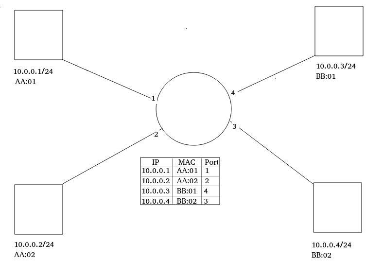

# Warsztat 5

## What is MAC Learning

MAC learning, often referred to in the context of network switches, involves the process by which a network switch dynamically records the MAC (Media Access Control) addresses of devices connected to its ports. This process is crucial for efficiently routing data packets within a local area network (LAN). Here's a breakdown of how MAC learning works:

1. **MAC Address Introduction**: A MAC address is a unique identifier assigned to the network interface of devices such as computers, smartphones, and servers. It's used by the network to identify devices and manage their interactions.

2. **Initial Connection**: When a device connects to a network switch, it typically begins communicating by sending data packets. Each packet includes the source MAC address, which is the MAC address of the device sending the packet.

3. **Switch's MAC Address Table**: Network switches maintain a MAC address table, also known as a CAM table (Content Addressable Memory). This table stores the MAC addresses of all devices on each of its ports.

4. **Learning Process**:
    - **Receiving a Packet**: When the switch receives a data packet from a device on a port, it examines the source MAC address in the packet.
    - **Updating the MAC Table**: If the source MAC address is not already in the MAC address table, the switch adds it along with the port number where the packet was received. This helps the switch remember which port to use to reach that specific device.

5. **Routing Data Packets**: Once the MAC address is stored, the switch uses this table to decide where to forward incoming packets. When it receives a packet destined for a specific MAC address:
    - It checks its MAC address table.
    - If it finds the destination MAC address, it forwards the packet only to the associated port.
    - If the destination MAC address is not in the table, or if the packet is a broadcast or multicast, it forwards the packet to all ports except the one it came from.

6. **Aging and Updating**: The MAC address table is dynamic. Entries in the table have a timeout period, and if a MAC address isn't seen within a certain time, it is removed from the table. This aging process helps manage changes in the network, like devices moving between ports or leaving the network.

By learning MAC addresses and managing a table, network switches efficiently direct traffic within a network, minimizing unnecessary data broadcast and improving overall network performance.

## Na czym ma polegać MAC Learning na labce

Na tym, że switch uczy się nie tylko odwzorowania MAC<->Port, ale MAC<->IP<->Port. Czyli też można zapisać jaki adres IP jest dostępny pod danym portem, a nie tylko jaki adres MAC. Nazwijmy tę tabelę **MAC Address Table**. 

Flow działania switcha.

Przychodzi pakiet IP do switcha. Najpierw switch patrzy czy w tablicy MAC Address ma wpis dotyczący danego adresu MAC. Jeśli tak, to pakiet przechodzi do dalszego procesowania. Jeśli nie, to switch prosi swój kontroler o dodanie wpisu do tabeli 'MAC Address'. (Dodanie tego wpisu jest na przyszłość. Gdy potem przyjdzie pakiet IP z danym `dest_ip`, to na podstawie tabeli MAC Address wiemy na jaki port go skierować, oraz na jaki adres MAC podmienić `eth::dest_mac`).

Data plane nie potrafi dodawać wpisów do tabeli. Gdy przyjdzie pakiet, którego MAC nie ma jeszcze w tabeli, to switch wysyła digest do control plane z info `{src_mac, src_ip, in_port}`, control plane na podstawie tego info dodaje do switch'a odpowiedni wpis w tabeli.

Tabela jest tylko jedna!!!

Czyli Ingress to jest tylko wyczajenie czy znamy ten host czy nie.

Potem w Egress, żeby przekazać odpowiednio pakiet (z dobrze podmienionym `dst_mac` (bo host odrzuca pakiety eht, których `dst_mac` nie jest równy ich `mac`)) to patrzy na tabelę MAC Address Table. Jeśli nie ma wpisu w tabeli, to nie robimy nic, po prostu switch zforwarduje pakiet ze złym `dst_mac` i on zostanie odrzucony. 	

## Róznice wzgledem porzpedniej labki

Teraz uzywamy nie `simple_switch` tylko `simple_switch_grpc`. On jest taki, że ma serwer P4. Z tym serwerem można komunikować się za pomocą protokołu P4 Runtime. I teraz jak się uruchamia sieć, to nie trzeba wgrywać od razu pliku json z programem, tylko runuje się taki totalnie pusty switch z samym serwerem P4, i za pomoca P4 Runtime można wgrać na switch program (na tym polega SDN w sumie). 

Dzieki temu nie trzeba za każdym razem po zmianach w programie uruchamiac na nowo sieci, tylko mozna wgrac po prostu nowy program. 

## Digest
Digest to wystarczy callnąć tę funkcję gdzieś w kodzie i ona przekaże to do P4 Runtime Server (serwer P4) i on już wie gdzie jest controller.

## Klient p4 runtime
Instaluj z gh jak na slajdzie, na repo pip jest stara wersja. 

## CPU_port
to jest wysłanie całego pakietu do control plane, nie będzie uzywane na tej labce. Olej ten slajd.

## Development flow
W pliku `p4_minient` trzeba zrobic zmiane jak na slajdzie 9.

Slajd 10:
Podczas uruchamiania sieci przez `1sw_demo.py` bedziesz musial i tak podac argument `--json` bo skrypt go wymaga, ale i tak nic sie nie wgra na switch.

Slajd 11:
Tak wywoluj kompilacje 

`--p4runtime-files` to plik, ktory stworzy sie po kompilacji, nie jest jej inoutem
w folderze `/out` bedzie json z programem

Slajd 12:

Potem jak sieć cały czas chodzi to uruchamiasz P4Runtime. Zeby wgrac na nowo program to musisz w tym skrypcie podac opcje `--config`, jak ją pominiesz to nic sie nie wgra nowego i tabele sie nie zresetuja, po prostu dostaniesz sie do CLI.

CZyli development flow wyglada tak, ze  uruchamiasz sieć (1sw_demo), potem jak zrobisz zmiany w kodzie, to zeby je wgrac na switch to uruchamiasz slajd 12.

## Wyknywanie labki.

Najpierw ogarnij sobie development flow. Ustal środowisko developerskie na jakimś starym kodzie. 

## Uruchomienie sterownika

Na switchu jest serwerP4, a zeby wlaczyc jakis klient tego serwera to slajd 12.

Teraz jak switch dostanie pakiet i bedzie chcial wyslac digest, to wysle go wlasnie do tego p4runtime_sh. 

Możesz napisac swój skrypt, który korzysta z p4runtime_sh.shell jako import. [https://github.com/p4lang/p4runtime-shell/blob/main/p4runtime_sh/test.py](tutaj są przykladowe jak zrobic table entry).

A w tym PR slajd 13 chlop zrobil jak odczytac digest.
