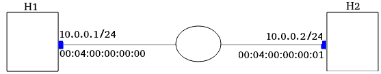
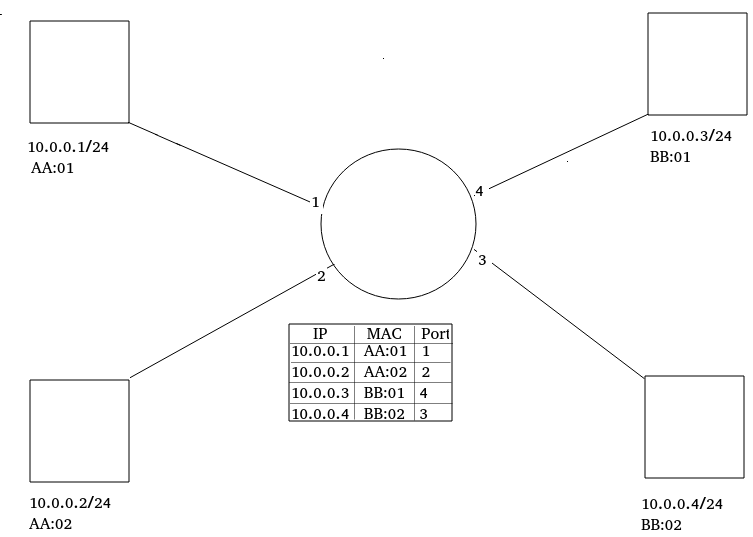
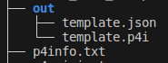

# Lab 5 - P4 Runtime
## 1. Wstęp
Podczas tego laboratorium wykorzystamy po raz pierwszy P4 Runtime. Jest to protokół do komunikacji między data plane a control plane. Protokół jest w architekturze klient/serwer.

Serwer znajduje się na switchu, a klientem jest sterownik SDN.

Po pierwsze będziemy musieli użyć switcha, króry takowy serwer posiada.

```sh
sudo python3 1sw_demo.py --behavioral-exe /usr/bin/simple_switch_grpc --json out/main.json
```
Czyli korzystamy z innej binarki niż dotychczas, uruchamia ona serwer P4 na porcie 9559.

Jak teraz do tego serwera się połączyć?

Potrzebujemy jakiegoś klienta, zainstalujemy go tym poleceniem.
```sh
pip3 install --upgrade \
git+https://github.com/p4lang/p4runtime-shell.git#egg=p4runtime-shell
```

a uruchamiać będziemy tym:
```sh
sudo python3 -m p4runtime_sh --grpc-addr localhost:9559 --device-id 0 --election-id 0,1 --config p4info.txt,out/main.json
```

Ok, ale co to za opcja `config`?
Otóż w switch `simple_switch_grpc` jest nieco inny. Jemu nie podaje się programu P4 podczas uruchamiania binarki. On uruchamia się pusty (mimo, że jest tam podawany argument `--json` -> ale to zaszlość historyczno-skryptowa). Jemu program można wgrać z warstwy sterowania i właśnie do tego służy opcja `--config`. Gdy jej użyjesz to wgrasz nowy program. 

No dobra, ale co to za pliki `p4info.txt` i `out/main.json`. Wcześniej samemu nazywalo się plik p4. Skąd je wziąć?

Otóż kompilacja programu p4 przez p4-compiler wygląda teraz tak:

```sh
p4c --target bmv2 --arch v1model --p4runtime-files p4info.txt -o out/ plik.p4
```

## 2. Wymagania na produkt
Topologia:



Trzeba zaimplementować MAC Learning.
- Tabela
- Ingress
- Control plane
- Egress
### 2.1 Tabela MAC_Address_Table
Będzie ona wyglądać jak na tym obrazku.


W punkcie zbieżności przetrzmuje ona informacje jaki host (ip, mac) ma switch na jakim porcie (numer). Dzięki temu gdy przychodzi pakiet o danym `dst_ip`, to switch wie na który port wyjściowy go skierować, oraz na jakie `eth.dst_mac` podmienić, aby pakiet nie został odrzucony przez host (warstwa Ehternet odrzuca pakiet których `dst_mac` nie jest równy `mac` jej NIC). 

Musimy więc w P4 mieć takową tabelę.

### 2.2 Ingress
Aby zpopulować tabelę (kalka z "in order to populate the table") blok `Ingress` gdy przychodzi nowy pakiet musi sprawdzić czy w tabeli jest zapis dla danego adresu IP (kluczem przeszukania tabeli jest adres IP). Jeśli wpis jeszcze nie istnieje, switch informuje warstwę sterowania o pojawieniu się komunikacji z nieznajomym hostem i wysyła mu jego dane {ip, mac, port}. Jeśli wpis istnieje, Ingress przekazuje pakiet na odpowiedni, odczytany z tabeli port.

### 2.3 Egress
W tym bloku , gdy pakiet jest już na porcie wyjściowym. Musimy podmienić jego `dst_mac` na MAC hosta, do którego jest on wysyłany. Przeszukujemy w tym calu tabelę `MAC_Address_Table`. 

### 2.4 Control Plane
Control plane gdy otrzyma Digest od serwera P4, to musi dodać odpowiedni wpis do tabeli.

## 2. Wykonane czynności
### 2.1 Czynności wstępne
Instalacja p4runtime-shell. Tu odkryto błąd w komendzie z lab.
```sh
pip3 install --upgrade \
git+https://github.com/p4lang/p4runtime-shell.git#egg=p4runtime-shell
```
Modyfikacja pliku p4_mininet.py
```python
- args.append(self.json_path)
+ args.append("--no-p4")
```

Kompilacja programu P4, użyto programu template z pierwszego warsztatu.
```sh
p4c --target bmv2 --arch v1model --p4runtime-files p4info.txt -o out/ template.p4
```
Poskutkował to powstaniem takich pilków:



Uruchomienie sieci:
```sh
sudo python3 1sw_demo.py --behavioral-exe /usr/bin/simple_switch_grpc --json out/template.json
```

Uruchomienie sterownika:
```sh
python3 -m p4runtime_sh --grpc-addr localhost:9559 --device-id 0 --election-id 0,1 --config p4info.txt,out/template.json
```

### 2.2 MAC_Address_Table

Zdefiniowano w Ingress. v1model nie wspiera czegoś takiego jak odczytywanie tabeli zarówno przez blok Ingress jak i Egress. Narazie tym się nie martwię, workaround'em może byc użycie metadanych. 

```p4
table mac_address_table {
        key = {
            hdr.ipv4.srcAddr : exact;
        }
        actions = {
            NoAction;
            LearnHost;
        }
        size = 1024;
        default_action = LearnHost();
    }
```

Domyślna akcja to LearnHost() - domyślna czyli gdy nie znajdziemy pasującego wpisu.

### 2.3 Ingress
Podczas akcji LearnHost() musimy wysłać digest do warstwy sterowania:

Zdefiniowanie jego struktury.

```p4
struct learn_digest_t {
    bit<32> ip_address;
    bit<48> mac_address;
    bit<9>  port; // Port number size can vary based on the switch specifications
}
```

Wywołanie w bloku Ingress:

```p4
control MyIngress(inout headers hdr,
                  inout metadata meta,
                  inout standard_metadata_t standard_metadata) 
{
    
    action LearnHost() {
    	bit<32> receiver_id = 0;  // This should be a unique identifier for your digest
    	learn_digest_t data;
    	data.ip_address = hdr.ipv4.srcAddr;
    	data.mac_address = hdr.ethernet.srcAddr;
    	data.port = standard_metadata.ingress_port;

    	digest(receiver_id, data);
	}


	table mac_address_table {
        key = {
            hdr.ipv4.srcAddr : exact;
        }
        actions = {
            NoAction;
            LearnHost;
        }
        size = 1024;
        default_action = LearnHost();
    }

    apply {
        mac_address_table.apply();
    }
}
```

Kod z tego kroku zarchiwizowano w [template.post-ingress.p4](template.post-ingress.p4)

### 2.4 Egress
Niestety nie uda się skorzystać już z tablicy `MAC_Address_Table` jako, że jej scope to tylko blok Ingress. W tym celu odczytamy już w bloku Ingress adres `mac` na jaki będzie trzeba podmienić `eth.dst_mac` i prześlemy tę informacje razem z pakietem do bloku Egress w matedanych. Następnie aktualną podmianę wykona blok Egress.

Najpierw zdefiniowanie nowego pola w metadata:

```p4
struct metadata {
    bit<48> dst_mac; // Field to store destination MAC address
}
```

Nowa akcja:

```p4
// when a host is known
	action forward(bit<48> mac_addr, bit<9> egress_port) {
    standard_metadata.egress_spec = egress_port;
    meta.dst_mac = mac_addr;
	}
```

Zmodyfikowanie tabeli aby używała tej nowej akcji:

```p4
table mac_address_table {
    key = {
        hdr.ipv4.srcAddr : exact;
    }
    actions = {
        forward; // This is action for known hosts
        LearnHost; // This action is for unknown hosts
    }
    size = 1024;
    default_action = LearnHost(); // Continue to use LearnHost for no match
}
```

W bloku Egress należy skorzystać z metadaty otrzymanej od bloku ingress i podmienić `ethernet.dst_mac`.

```p4
control MyEgress(inout headers hdr,
                 inout metadata meta,
                 inout standard_metadata_t standard_metadata)
{
	apply
	{
		 hdr.ethernet.dstAddr = meta.dst_mac;
	}
}
```

### 2.5 
Control plane gdy otrzyma Digest od serwera P4, to musi dodać odpowiedni wpis do tabeli. Zadanie to okazuje się zbyt trudne na tym etapie. Lepiej będzie zapoznać się z p4runtime od innej strony. Spróbujmy dodać wpisy ręcznie. 

Po uruchomieniu powłoki poleceniem:
```sh
 python3 -m p4runtime_sh --grpc-addr localhost:9559 --device-id 0 --election-id 0,1 --config p4info.txt,out/template.json
```

Należy:

```sh
# Sprawdzić jakie mamy tabele
P4Runtime sh >>> tables
# stworzyć obiekt table entry dla tabeli "MyIngress.mac_address_table" dla akcji "forward"
P4Runtime sh >>> te = table_entry["MyIngress.mac_address_table"](action="forward")
# zdefiniowanie key dla table_entry (kolumna `ip address`)
P4Runtime sh >>> te.match["hdr.ipv4.srcAddr"] = "10.0.0.10"
# zdefiniowanie parametrów akcji:
# kolumna `mac_address`
P4Runtime sh >>> te.action["mac_addr"] = "00:04:00:00:00:00"
# kolumna `egress_port`
P4Runtime sh >>> te.action["egress_port"] = "1"
# insert gotowego table entry
P4Runtime sh >>> te.insert()
```

Do wklejenia na szybko:

```sh
te = table_entry["MyIngress.mac_address_table"](action="forward")
te.match["hdr.ipv4.srcAddr"] = "10.0.0.1"
te.action["mac_addr"] = "00:04:00:00:00:00"
te.action["egress_port"] = "1"
te.insert()

te1 = table_entry["MyIngress.mac_address_table"](action="forward")
te1.match["hdr.ipv4.srcAddr"] = "10.0.0.2"
te1.action["mac_addr"] = "00:04:00:00:00:01"
te1.action["egress_port"] = "2"
te1.insert()
```

To read table entries (execute in `P4Runtime sh >>>`):

```sh
for entry in table_entry["MyIngress.mac_address_table"].read():
    print(entry)
```
Po wykonaniu tych komend (dodaniu wpisów w tablicy) switch powinien forwardować pakiety z portu 1 na port 2 oraz podmieniać `dst_mac`. Jednakże podczas pingu wysyłane są jedynie pakiety ARP z wiadomością "Who has... tell ...". 

W ramach testu skompilowałem program z warsztatu 3 -> [lab3.zad1.p4](lab3.zad1.p4). Działa on tak jak należy w tym środowisku. W związku z tym błędu dopatruje się w populowaniu/odczycie tablicy `mac_address_table`.


