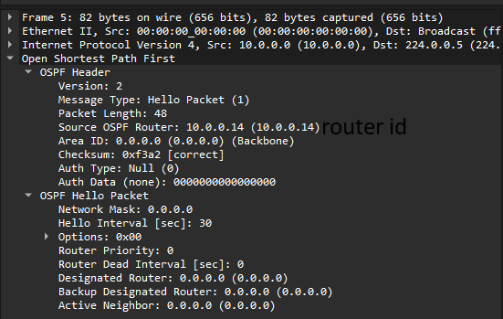

# OSPF Hello

```python
# Thread of this class sends OSPF Hello message every HELLO_INT seconds
class HelloSenderThread(threading.Thread):
    def run(self):
        while True:
            self.send_hello()
            time.sleep(2)

    def send_hello(self):
        p = sh.PacketOut(payload=b'AAAAAAAAAAAAAAAAAAAAAAAAAAAAAAAAAAAABBBBBBBBBBBBBBBBBBBBBBBBBBBBBBBBBBC', egress_port='2')
        p.send()
        print("HelloSenderThread: Message sent \n")
```

W tym miejscu w `send_hello` damy jako payload bajty przygotowane przez scapy jako pakiet OSPF.

Kod jest w [hello_sender.py](sebase/hello_sender.py).

## Test

### Uruchomienie sieci
```sh
sudo python3 1sw_demo.py --behavioral-exe /usr/bin/simple_switch_grpc --json out/struthio.json
```

### Uruchomienie controllera
```sh
python3 sebae.py
```

### Nasłuchiwanie na porcie 2 switcha
Sebae okresowo wysyła OSPF Hello, więc wystarczy tylko nasłuchiwanie włączyć i po jakimś czasie sobie wyłączyć i pooglądać.
```sh
sudo tcpdump -i s1-eth2 -w capture.pcap -v
```

No i Wireshark takie pakiety można obserwować:

