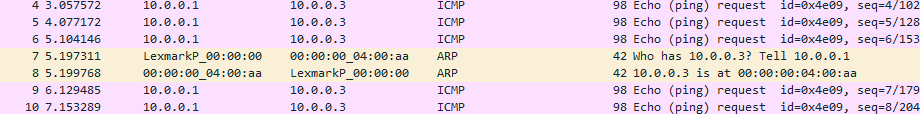

# ARP
## Intro
Sure! Let's explore the ARP (Address Resolution Protocol) in detail, including its protocol structure, message types, flow, a sample use case, and a practical example.

### What is ARP?

ARP is a network protocol used to map an IP address to a MAC address that is recognized in the local network. It operates between the network layer and the data link layer in the OSI model. ARP is essential for IPv4 networking, allowing devices to find each other on a local network segment. ARP packets are on top of Ethernet frames.

### ARP Message Types

There are primarily two types of ARP messages:

1. **ARP Request**: This is broadcast on the local network. It asks "Who has this IP address? Respond with your MAC address." The packet includes the sender's MAC and IP addresses and the target IP address, but the target MAC address is set to zero since it's unknown.

2. **ARP Reply**: This is a response to an ARP request and is sent directly to the requester. It contains the sender's MAC and IP addresses (the original target), confirming the ownership of the IP address.

### ARP Packet Structure

An ARP packet consists of the following fields:

- **Hardware Type (htype)**: Specifies the type of hardware used in the network (e.g., Ethernet is 1).
- **Protocol Type (ptype)**: Specifies the type of protocol (e.g., IPv4 is 0x0800).
- **Hardware Address Length (hlen)**: Length of the hardware address (MAC address).
- **Protocol Address Length (plen)**: Length of the protocol address (IP address).
- **Operation (oper)**: Specifies the operation (1 for request, 2 for reply).
- **Sender Hardware Address (sha)**: MAC address of the sender.
- **Sender Protocol Address (spa)**: IP address of the sender.
- **Target Hardware Address (tha)**: MAC address of the target (zero in ARP request).
- **Target Protocol Address (tpa)**: IP address of the target.

### ARP Flow

Here’s how ARP typically operates in a local network:

1. **Discovery**: A device (say, Device A) wants to communicate with another device (Device B) but only knows B's IP address.
2. **Broadcast ARP Request**: Device A sends an ARP request broadcast to all devices on the local network, asking who owns B's IP address.
3. **ARP Reply**: Device B recognizes its IP address in the request and sends back an ARP reply directly to A with its MAC address.
4. **Cache Update**: Device A receives the reply, updates its ARP cache with the new IP-to-MAC mapping, and can now frame packets to Device B using B's MAC address.

### Practical Example

Here's a simple illustration of an ARP request and reply:

- **Device A (Laptop)**:
  - IP: 192.168.1.10
  - MAC: AA:BB:CC:DD:EE:FF

- **Device B (Smart TV)**:
  - IP: 192.168.1.20
  - MAC: 11:22:33:44:55:66

**ARP Request from A to B**:
- Who has 192.168.1.20? Tell 192.168.1.10 (broadcast)

**ARP Reply from B to A**:
- 192.168.1.20 is at 11:22:33:44:55:66 (unicast to AA:BB:CC:DD:EE:FF)

### How router responds to ARP packets
1. Responding to ARP Requests for Its Own Interface
When a router receives an ARP request querying the MAC address of one of its configured IP addresses, it responds with its MAC address. This situation occurs when the router is the destination for traffic, such as when a PC in a local network is trying to access the internet and needs the gateway (router) MAC address.

Example: If a router's interface is assigned the IP address 192.168.1.1 and a device on the same network segment sends an ARP request asking "Who has 192.168.1.1?", the router will reply with the MAC address of its interface connected to that network.

2. Not Responding to ARP Requests Not Meant for It
If the router receives an ARP request for an IP address that is not assigned to any of its interfaces, it will not respond. This is because the ARP request is not intended for it but for another device on the local network.

### P4 ARP header struct
```p4
header arp_t {
    bit<16> htype;  // Hardware type
    bit<16> ptype;  // Protocol type
    bit<8>  hlen;   // Hardware address length
    bit<8>  plen;   // Protocol address length
    bit<16> oper;   // Operation (1 for request, 2 for reply)
    bit<48> sha;    // Sender hardware address
    bit<32> spa;    // Sender protocol address
    bit<48> tha;    // Target hardware address   //This is empty in request
    bit<32> tpa;    // Target protocol address
}
```

## Wymagania


### Router powinien odpowiadac na ARP request o adresy IP na swoich interfejsach
Tabela z kluczem 'target ip address` oraz nr portu.

> No dobrze, ale przecież, żeby wygenerować ARP Reply to trzeba mieć MAC adres tego interfejsu... Skąd go mamy wziąć? Po co nam ten numer portu w tabeli?
> 

Czyli musimy zrobić tabelę, która mapuje adres IP na numer portu oraz jego adres MAC.

//TODO

TODO zrobić POC komunikacji z control plane oraz wychwytywaniu pakietu ARP.
Czyli takie PoC, że jak przyjdzie pakiet ARP do switch'a to ona wysła jakieś info o tym do control plane.

## Implementation
### ARP Header
```p4
header ethernet_t {
    bit<48> dstAddr;
    bit<48> srcAddr;
    bit<16> etherType;
}

header arp_t {
    bit<16> htype;  // Hardware type
    bit<16> ptype;  // Protocol type
    bit<8>  hlen;   // Hardware address length
    bit<8>  plen;   // Protocol address length
    bit<16> oper;   // Operation (1 for request, 2 for reply)
    bit<48> sha;    // Sender hardware address
    bit<32> spa;    // Sender protocol address
    bit<48> tha;    // Target hardware address
    bit<32> tpa;    // Target protocol address
}
```
### ARP Parser
```p4
parser MyParser(packet_in packet, out headers hdr, inout metadata meta, inout standard_metadata_t standard_metadata) {
    state start {
        transition parse_ethernet;
    }

    state parse_ethernet {
        packet.extract(hdr.ethernet);
        transition select(hdr.ethernet.etherType) {
            0x0806: parse_arp;  // ARP EtherType
            default: accept;
        }
    }

    state parse_arp {
        packet.extract(hdr.arp);
        transition accept;
    }
}
```
