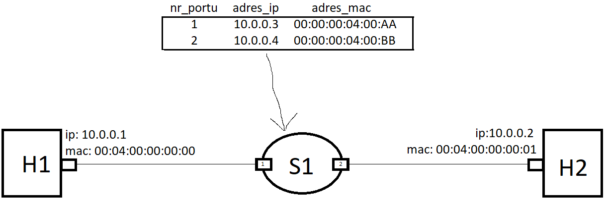
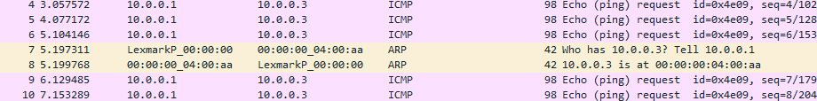

# arp-poc
Ten folder posłużył do zrobienia proof-of-concept na temat funkcjonalności ARP w projekcie.
## Wymagania
Switch odpowiada na wiadomości ARP Request dotyczące adresu IP należącego do interfejsu switcha, na które przyszło żądanie.

Tzn. Jeśli switch do interfejsu nr 1 ma przypisany adres IP `10.0.0.3` to gdy na ten interfejs przyjdzie ARP Request "Who has 10.0.0.3?", to switch wygeneruje ARP Reply z adresem MAC tego interfejsu w odpowiedzi. 

Jak wygląda przypisanie adresu IP oraz MAC do portu? Tym zajmuje się control plane. Switch ma taką tabelę [nr_portu, adres_ip, adres_mac], gdzie kluczem jest para [nr_portu, adres_ip].

Switch opdowiada na pakiety ARP tylko gdy na port przyjdzie zapytanie akurat o jego adres MAC, wszystkie inne są odrzucane.


## Kod
Jest w pliku [arp-responser.p4](arp-responser.p4).

Co trzeba po kolei zrobić, żeby dodać do swojego switcha taką funkcjonalność:

### Definicja nagłówka ARP
```p4
header arp_t {
    bit<16> htype;
    bit<16> ptype;
    bit<8> hlen;
    bit<8> plen;
    bit<16> oper;
    bit<48> sha;  // Sender hardware address
    bit<32> spa;  // Sender protocol address
    bit<48> tha;  // Target hardware address
    bit<32> tpa;  // Target protocol address
}

struct headers_t {
    ethernet_t ethernet;
    arp_t arp;
}
```

### Parser ARP
```p4
parser MyParser(packet_in packet,
                out headers_t hdr,
                inout metadata_t meta,
                inout standard_metadata_t standard_metadata)
{
    state start {
        packet.extract(hdr.ethernet);
        transition select(hdr.ethernet.etherType) {
            0x0806: parse_arp;
            default: accept;
        }
    }

    state parse_arp {
        packet.extract(hdr.arp);
        transition accept;
    }
}
```

### Zdefiniowanie tabeli
```p4
 table arp_lookup {
        key = {
            hdr.arp.tpa: exact;
            standard_metadata.ingress_port: exact;
        }
        actions = {
            send_arp_reply;
            NoAction;
        }
        size = 1024;
        default_action = NoAction;
    }
```

Kluczem tu są dwa pola: Adres IP, który przyszedł w pakiecie ARP oraz port, na który ten pakiet przyszedł. Tylko gdy jest match w tabeli to przechodzimy do akcji `send_arp_reply`.

### Zdefiniowanie akcji generowania odpowiedzi ARP
```p4
action send_arp_reply(bit<48> target_mac) {
        // Swap Ethernet addresses
        bit<48> temp_mac = hdr.ethernet.dstAddr;
        hdr.ethernet.dstAddr = hdr.ethernet.srcAddr;
        hdr.ethernet.srcAddr = target_mac;

        // Set ARP reply fields
        hdr.arp.oper = 0x0002;  // ARP Reply
        hdr.arp.tha = hdr.arp.sha;  // Target hardware address = Sender hardware address
        hdr.arp.sha = target_mac;  // Sender hardware address = MAC address from table
        // Swap IP address
        bit<32> temp_ip = hdr.arp.spa;
        hdr.arp.spa = hdr.arp.tpa;  // Sender protocol address = Target protocol address
        hdr.arp.tpa = temp_ip;  // Target protocol address = Sender protocol address

        // Send ARP reply via the ingress port
        standard_metadata.egress_spec = standard_metadata.ingress_port;
    }
```

Parametrem tej akcji jest adres MAC portu wzięty z tabeli. 

Musimy swapnąć adresy nadawcy i odbiorcy w nagłówku ETH.
To samo w warstwie Hardware (MAC) oraz Protocol (IP) w nagłówku ARP.

Z tym, że w hardware adress nadawcy umieszczamy parametr akcji, czyli "our actual response".

### Flow w Ingress
```p4
apply {
        if (hdr.ethernet.etherType == 0x0806 && hdr.arp.oper == 0x0001) {  // ARP Request
            arp_lookup.apply();
        }
    }
```
Jeśli pakiet ETH ma typ `0x0806` to jest to pakiet ARP. Dodatkowo interesują nas tylko pakiety typu "Request", więc `oper` musi być 1.

## Test
Topologia sieci testowej:



Test będzie polegał na tym, że uruchomimy sieć i z hosta H1 wyślemy ping na adres 10.0.0.3. Host H1 jako, że nie zna tego adresu i nie wie jaki wpisać do pakietu Ethernet dst_mac, to wyśle pakiet ARP Request "Who has 10.0.0.3". Jeśli kod działa, to switch odeśle ARP Reply na to zapytanie.

### Kompilacja
```sh
p4c --target bmv2 --arch v1model --p4runtime-files p4info.txt -o out/ arp-responser.p4
```

### 1 terminal - uruchomienie sieci
```sh
sudo python3 1sw_demo.py --behavioral-exe /usr/bin/simple_switch_grpc --json out/arp-responser.json
```
### 2 terminal - uruchomienie control plane
```sh
python3 -m p4runtime_sh --grpc-addr localhost:9559 --device-id 0 --election-id 0,1 --config p4info.txt,out/arp-responser.json
```

Tu należy dodać wpisy do tabeli:

```sh
te = table_entry["MyIngress.arp_lookup"](action="send_arp_reply")
te.match['standard_metadata.ingress_port'] = '1'
te.match['hdr.arp.tpa'] = '10.0.0.3'
te.action['target_mac'] = '00:00:00:04:00:AA'
te.insert()

te = table_entry["MyIngress.arp_lookup"](action="send_arp_reply")
te.match['standard_metadata.ingress_port'] = '2'
te.match['hdr.arp.tpa'] = '10.0.0.4'
te.action['target_mac'] = '00:00:00:04:00:BB'
te.insert()

for entry in table_entry["MyIngress.arp_lookup"].read():
    print(entry)
```

### 3 terminal - przechwytywanie pakietów z eth1 switcha
```sh
sudo tcpdump -i s1-eth1 -w capture.pcap -v
```

### Akcja

Opdal tcpdump na terminalu 3, a następnie na terminalu 1 puść:
```
h1 ping 10.0.0.3
```

Odczekaj kilka pakietów (verbosena tcpdump pozwala widziec jak lecom).

Na terminalu 3 zatrzymaj `ctrl+c` i masz gotowy plik `capture.pcap`, który powinien mieć taki output np:


