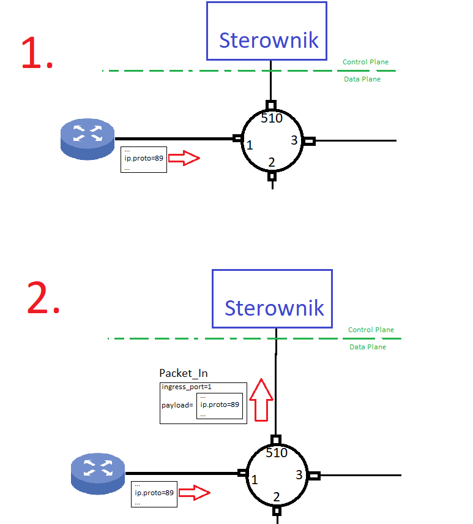

# CPU Port

## Intro / Wyjaśnienie

W sieciach SDN switch P4 oraz sterownik komunikują się za pomocą protkołu warstwy sterowania. Pierwotnym jest Openflow. My w Projekcie używamy P4Runtime.

Podstawowymi wiadomościami w tymże protokole są Packet_In oraz Packet_Out. Postfixy In/Out są z punktu widzenia sterownika.

Switch do sterownika wysyła wiadomość **Packet_In** mówiąc mu "Zobacz, przyszedł do mnie taki pakiet, (co z nim zrobić?)"*

Sterownik do swtich'a wysyła wiadomość **Packet_Out** mówiąc mu "Masz, niech takowy pakiet opuści jeden z Twoich portów".


>*Sterwonik nie odpowiada na to pytanie w bezpośredniej odpowiedzi - nie ma żadnego Packet_In_Reply, to logika/kod sterownika musi assure że potem sterownik pokieruje odpowiednio switch'em.

## Wymagania

Mamy więc dwa scenariusze:

### Switch wysyła Packet_In

Do switcha przychodzi jakiś pakiet, który wedle jakiejś reguły switch decyduje wysłać do sterownika. U nas tą regułą jest, to że "oddajemy" sterownikowi pakiety OSPF. No, bo OSPF to protokół watstwy sterowania. Zobaczmy flow na rysunku.


Czyli swtich mówi do sterownika "Zobacz, przyszedł do mnie taki pakiet na taki port".

Jak powiedzieć switchowi że TEN pakiet ma wysłać do sterownika? To jest proste w P4. Wystarczy ustawić mu `egress_spec` na specjalny numer portu. My w projekcie używamy 510. To nie jest ogólna konwencja i to się ustawia uruchamiając switch.

### Sterownika wysyła Packet_Out

Sterownik sobie wymyśla jakiś pakiet X i mówi do switch'a "Wyślij to portem y". 


## Kod
### Packet_In
Trzeba wykryć że pakiet ma iść do control plane.

Ale najpierw defka headerów pakietów protokołu P4 Runtime:

```p4
@controller_header("packet_out")
header packet_out_header_t {
    bit<16> egress_port;
}

@controller_header("packet_in")
header packet_in_header_t {
    bit<16> ingress_port;
}
```

Teraz zdefiniowanie akcji wysyłania PacketIn do controllera.
```p4
 action send_Packet_In_to_controller() {
        standard_metadata.egress_spec = CPU_PORT;
        hdr.packet_in.ingress_port = (bit<16>)standard_metadata.ingress_port;
        hdr.packet_in.isValid();
    }
```

No i dodanie jej wywołania w logice Ingressu.
```p4
/   / Is this IP packet?
        if (hdr.ethernet.etherType == 0x0800) {
            // Check if ttl is less than 2
            if (hdr.ip.ttl < 2) {
                NoAction();
            }
            else {
                // Check if this packet belongs to some multicast group 
                // (if it does, copy and forward it to specific ports and go directly to egress block)
                tbl_mcast_group.apply();
                // Check if this packet is an OSPF packet
                if (hdr.ip.protocol == OSPF_NUM) {
                    // If it does, send it in Packet_In message to controller
                    send_Packet_In_to_controller();
                }
                // Check the next hop ip address for this packet (based on its ip.dst_addr)
                tbl_ip_routing.apply();
                // Set egress_port for this packet (based on next hop from previous step)
                tbl_ip_forwarding.apply();
            }
        }
```

### Packet_Out
Opis dotyczy kodu switch'a
Najpierw trzeba rozpoznać, że pakiet przyszedł od sterownika. Zrobimy to za pomocą sprawdzenia czy ma nagłówek Packet_Out.

```p4
        // Check if it is PacketOut P4Runtime message from controller
        if (hdr.packet_out.isValid()) {
            // we support only the case when egress port is specified by controller
            // we simply set the egress port to the one specified by controller and then processing of this packet goes to MyEgress
            standard_metadata.egress_spec = (bit<9>) hdr.packet_out.egress_port;
        } 
        // the other case is that it is simply the Ethertnet Packet
        else {
            // the standard processing
        }
```

No i jeśli tak to ustawiamy mu egress port na taki jaki przyszedł w sterowniku.

Uwaga sterownik musi ustawić egress port bo inaczej będzie tam default value czyli 0 i pakiet "wyjdzie" portem 0.

A no i jeszcze zmiany w Parserze:
```p4
    state start {
        transition select(standard_metadata.ingress_port) {
            CPU_PORT: parse_packet_out;
            default: parse_ethernet;
        }
    }

    state parse_packet_out {
        packet.extract(hdr.packet_out);
        transition parse_ethernet;
    }

    state parse_ethernet {
        packet.extract(hdr.ethernet);
        transition select(hdr.ethernet.etherType) {
            0x0800: parse_ip;
            0x0806: parse_arp;
            default: accept;
        }
    }
```

## Test
### Packet In
Test będzie polegał na tym, że wyślemy z hosta pakiet OSPF i zaobserwujemy go w sterowniku.

#### Terminal 1 - Sieć
```sh
sudo python3 1sw_demo.py --behavioral-exe /usr/bin/simple_switch_grpc --json out/struthio.json
```
#### Terminal 2 - włącz nasłuchiwanie w sterowniku
```sh
python3 -m p4runtime_sh --grpc-addr localhost:9559 --device-id 0 --election-id 0,1 --config p4info.txt,out/struthio.json

for msg in packet_in.sniff(timeout=5):
  print(msg)

packet_in.sniff(lambda m: print(m), timeout=5)
```
#### Terminal 1 - wysłanie z H1 pakietu OSPF
```sh
h1 python3 test_packet_in.py
```

No i w tym momencie w Terminal 2 powininen być zaobserwowany ten pakiet.

### Packet Out
Test będzie polegał na tym, że wyślemy pakiet ze sterownika, i on pojawi się za chwilę na porcie wyjściowym switcha

Przed testem należy w `controller.py` dodać takie dwie linijki (dać je zamiast `digest_init`)
```py
    tbl_mac_update(egress_port=1, src=port_config[1]["mac"], dst="04:04:00:00:00:00")
    tbl_mac_update(egress_port=2, src=port_config[2]["mac"], dst="04:04:00:00:00:01")
```
Żeby nie bawić się w pingowanie i mac learning.

### Terminal 1 - Sieć

```sh
sudo python3 1sw_demo.py --behavioral-exe /usr/bin/simple_switch_grpc --json out/struthio.json
```

### Terminal 2 - Nasłuchiwanie na porcie nr 2 switcha
```sh
sudo tcpdump -i s1-eth2 -w capture.pcap -v
```

### Terminal 3 - Control Plane
```sh
# to wgra wpisy mac
python3 controller.py 
# dlatego tu juz nie podajemy --config (zeby nie nadpisać programu w switchu i nie skasowac sobie zawartości tbl_mac_update)
python3 -m p4runtime_sh --grpc-addr localhost:9559 --device-id 0 --election-id 0,1 

p = packet_out(payload=b'AAAAAAAAAAAAAAAAAAAAAAAAAAAAAAAAAAAABBBBBBBBBBBBBBBBBBBBBBBBBBBBBBBBBBC', egress_port='2')
p.send
```