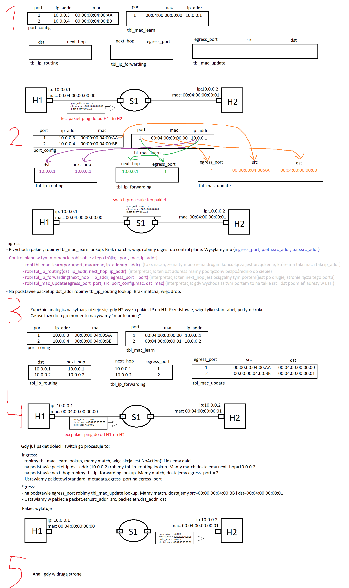
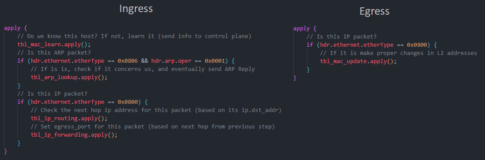
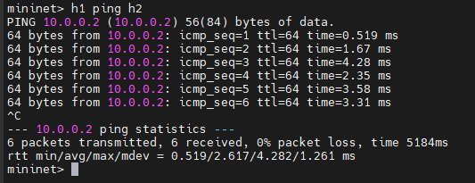
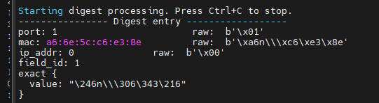
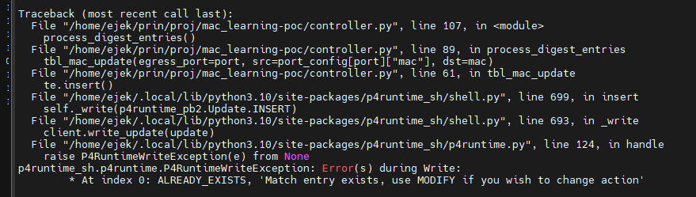

<h1 align="center">Struthio</h1>

<p align="center">
  
  <br>
  <i>Simple P4 switch with OSPF support</i>
  <br>
</p>

## Baza
Bazą jest projekt stworzony w [arp-poc](../arp-poc/).


## Wymagania

Switch na swoich interfejsach ma podłączone hosty. Mac Learning polega na tym, aby switch był świadom jaki host (jego adres IP oraz adres MAC) znajduje się po drugiej stronie łącza na danym interfejsie. Chcemy, aby działo się tak, że gdy do switcha przyjdzie pakiet od hosta, to ten sprawdza czy już zna tego nadawcę. Jeśli nie, uzupełnia tę wiedzę. Dzięki temu jesteśmy w stanie:
- odpowiednio podmieniać ethernet.dst_mac w warstwie L2
- zrobić routing do bezpośrednio podłączonych hostów

## Flow działania switcha

### Ogólnie
Gdy przychodzi pakiet na Ingress to:
- najpierw patrzymy, czy znamy host nadawcy (mac learning), jeśli tak to idziemy dalej, jeśli nie to digest do control plane leci.
- patrzymy w tablice routingu i szukamy jaki jest next-hop dla pakietu tego, jeśli brak to dropujemy pakiet
- Na podstawie next-hop ustawiamy pakietowi egress_port

Pakiet leci na Eggress:
- Tutaj podmiana eth.src_mac i eth.dst_mac na podstawie egress_port

### Ogólnie, ale z z nazwami tablic

Ingress:
- Przychodzi pakiet, szukamy czy mamy w `tbl_mac_learn` jego eth.src_addr. Jeśli nie to wysyłamy digestem trójkę `{ingress_port, packet.eth.src_addr, packet.ip.src_addr}`.
    - Controller w tym momencie może do `tbl_mac_learn` dodać tę trójkę. 
    - Controller w tym momencie może do `tbl_ip_routing` dodać wpis, że gdy dst_addr jest taki (packet.ip.src_addr), to next-hop ustawić należy taki (packet.ip.src_addr)
    - Controller w tym momencie może do `tbl_forwarding` dodać wpis, że gdy next-hop jest taki, to mamy go na tym porcie (ingress_port)
    - Controller w tym momencie może do `tbl_mac_update` dodać wpis, że na tym egress_port (ingress_port) w egress (przy wychodzeniu pakietu) trzeba podmieniać na:
    -  eth.src_mac - to z configu
    -  eth.dst_mac - to z trojki (packet.eth.src_addr)
- Patrzymy w `tbl_routng`, kluczem jest packet.ip.dst_addr, a dostajemy next-hop
- Patrzymy w `tbl_ip_forwarding` kluczem jest next-hop, a dostajemy egress_port
- Ustawiamy pakietowi egress_port

Egress:
- Patrzymy `tbl_mac_update`, kluczem jest egress_port (port którym wyjdzie pakiet) a parametrem akcji updated_src_mac, updated_dst_mac, które zostaną odpwiednio wpisane do packet.eth.src_mac i packet.eth.dst_mac

### Tablice i ich akcje

Więc mamy tabele takie:
- `port_config` ona mówi o tym jakie porty mają przypisane ip_addr i mac_addr. Ona jest tylko w Control Plane, to jest pseudo tabela. Nie mam jej w P4. Nie jest querowana.
- `tbl_mac_learn` ona mowi o tym jakie znamy (my - switch) hosty. Host to trójka {port, eth_addr, ip_addr}, ale implementacyjnie będzie to tylko adres mac.
- `tbl_ip_routing` ona mowi o tym jaki jest next-hop na podstawie ip.dst_addr. Wpisy tutaj można dodawać też ręcznie z control plane (w przypadku sieci odległych).<br>
`key{dst: ip_addr}, match{next_hop: ip_addr}`
- `tbl_ip_forwarding` ona mówi o tym na jakim porcie wyjściowym mamy dany ip_addr hosta po drugiej stronie łącza <br>
`key{next_hop: ip_addr} match{egress_port: int}`
- `tbl_mac_update` ona mówi jak zupdateować adresy MAC w nagłówku eth, gdy pakiet wychodzi danym portem <br>
`key{egress_port: int} match{src_mac: eth_addr, dst_mac: eth_addr}`

### Opis na przykładzie



## Kod

Flow ingress i egress dobrze oddaje to co się dzieje. Reszta to analiza poszczególnych akcji - zapraszam do kodu - [struthio.p4](struthio.p4)



Dobrze też wiedzieć co się dzieje w sterowniku - [controller.py](controller.py).

## Test
### Kompilacja

```sh
p4c --target bmv2 --arch v1model --p4runtime-files p4info.txt -o out/ struthio.p4
```

### Terminal 1 uruchomienie sieci
```sh
sudo python3 1sw_demo.py --behavioral-exe /usr/bin/simple_switch_grpc --json out/struthio.json
```

### Terminal 2 sterownik
```sh
python3 controller.py
```
### Akcja

Uruchom sieć na terminalu 1

Trzeba dodać wpisy arp, że hosty wiedziały jakie ustawiać eth.src_addr w pakietach ip:
```sh
h1 arp -s 10.0.0.2 04:04:00:00:00:01
h2 arp -s 10.0.0.1 04:04:00:00:00:00
```

W tym momencie switch nie zna hostów, więc `h1 ping h2` nie zadziała.

Zacznij pingować (tu akurat interfejs switcha, ale chodzi po prostu o to, aby dostarczyć jakikolwiek pakiet od hosta do switcha)
```sh
h1 ping 10.0.0.3
```
Uruchom sterownik na terminalu 2.

Po 10s w sterowniku powinno pojawić się info o odebranych digest. Sterownik nauczył się o hoście H1 i dodał odpowiedni wpisy do switch'a.

Przerwij ping na terminalu 1 i zacznij pingować z h2:
```sh
h2 ping 10.0.0.4
```
Analogicznie powinien pojawic się digest.

> Mam wrażenie że im dłużej controller.py jest uruchomiony tym gorzej działa, dlatego trzeba to wykonać w krótkim czasie. Potem już może nie przyjmować digest'ów.

W tym momencie switch zna oba host, więc powinien sporządzić też dla nich routing. Sprawdźmy to:

Na terminalu 1 w Mininet:
```sh
h1 ping h2
```



## Uwaga do runtime
Czasem digest może złapać jakieś totalne śmieci


Co skutkuje tym, że pomyśli, że ma na porcie 1 host jakiś, więc doda wpisy dla takiego hosta.

No i problem pojawia się w tabeli `tbl_mac_update`, bo tam kluczem jest nr portu, a już na port 1 został dodany nieprawdziwy host.
