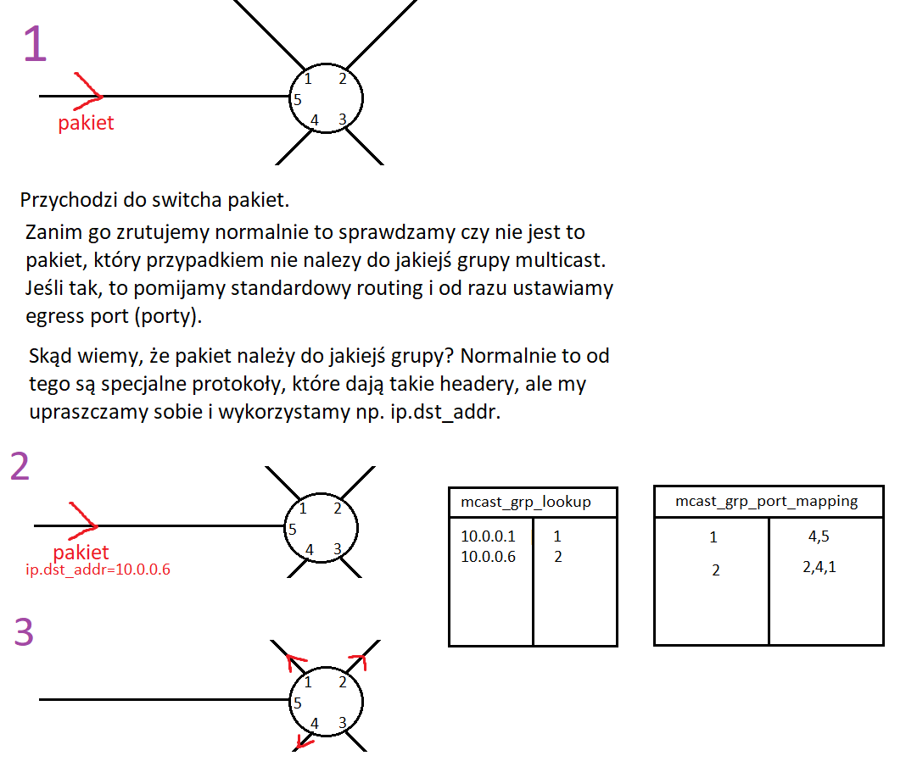
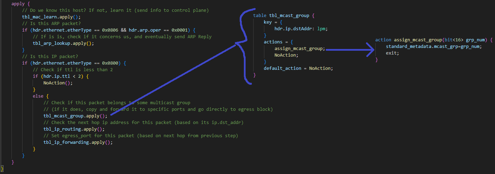

# Multicast POC
## Baza
Kod będzie się opierał na tym z [mac-learning-poc](../mac_learning-poc/).

## Wymagania

### Use case

### Specyfikacja wymagań
Dodać tabelę: tbl_mcast_group. Jej key to packet.ip.dst_addr, a action param to mcast_grp_num (numer grupy multicast).

zrobić lookup tej tabeli na samym początku sekcji IP, jeśli jest match, to (rzekomo) wystarczy jedynie w standard_metadata wpisać mcst_grp według parametru akcji. Na końcu akcji trzeba przerwać procesowanie bloku Ingress, tak aby nie wpadł on potem w standardowy routing.

## Kod
### Data Plane

### Control Plane
//TODO Data Plane do potwierdzenia i dopiero jazda tutaj.

