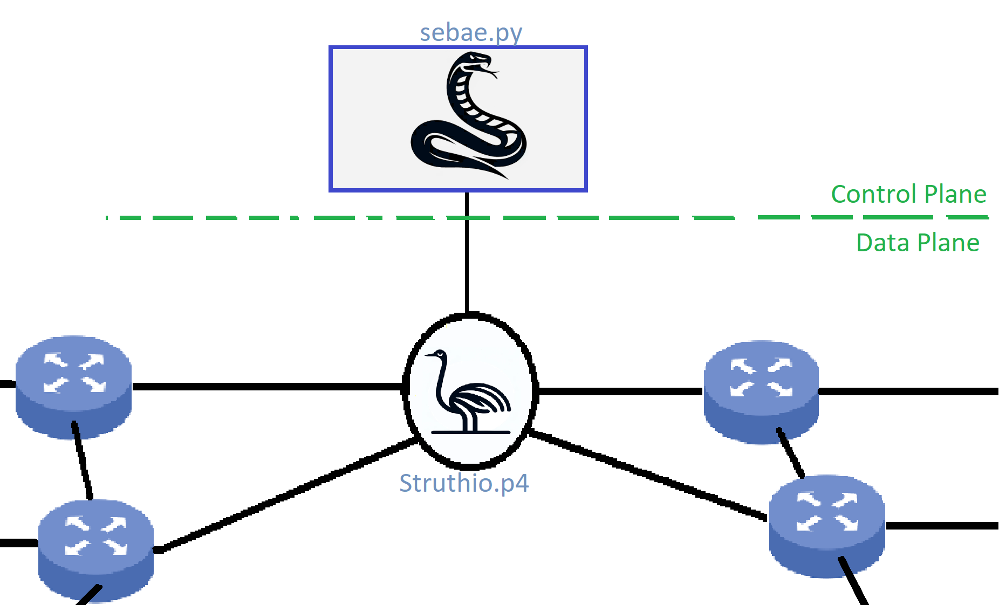

<h1 align="center">Struthio</h1>

  
   
  <i>Simple P4 switch with OSPF support</i>
   

Tematem projektu jest zrobienie switcha P4, który obsługuje uproszczoną na potrzeby zajęć wersję OSPF. Switch ten nazwany został *Struthio*, a kompatybilny z nim sterownik to *Python Sebae*.

Struthio to naukowa, łacińska nazwa na strusie (upraszczam), a jedyny wąż jaki jest w stanie je zjeść to African Rock Python, którego łacińska/naukowa nazwa to Python sebae.

## Struktura tego katalogu

Projekt można podzielić na dwie części:
- [data plane, implementacja switcha, kod P4](data-plane)
- [control plane, implementacja sterownika, kod python](control-plane)
