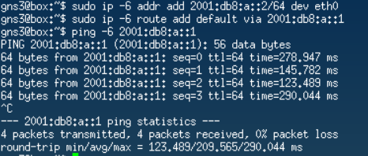
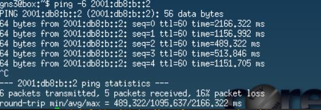

# Projekt SIP - "Konfiguracja sieci IPv6"

Spis treści:

- [1 Statyczna konfiguracja sieci](#1-statyczna-konfiguracja-sieci)
  - [1.1 Sprawdzenie adresów mac switch'ów](#11-sprawdzenie-adresów-mac-switchów)
  - [1.2 Wyłączenie auto-konfiguracji IPv6 na hostach](#12-wyłączenie-auto-konfiguracji-ipv6-na-hostach)
  - [1.3 Konfiguracja domeny A](#13-konfiguracja-domeny-a)
  - [1.4 Konfiguracja domeny B](#14-konfiguracja-domeny-b)
  - [1.5 Konfiguracja domeny C](#15-konfiguracja-domeny-c)
  - [1.6 Konfiguracja najkrótszej ścieżki](#16-konfiguracja-najkrótszej-ścieżki)
  - [1.7 Konfiguracja najdłuższej ścieżki](#17-konfiguracja-najdłuższej-ścieżki)
- [2 Dynamiczna konfiguracja sieci](#2-dynamiczna-konfiguracja-sieci)
  - [2.1 Wyłączenie auto-konfiguracji na IPv6 na hostach](#21-wyłączenie-auto-konfiguracji-ipv6-na-hostach)
  - [2.2 Wygenerowanie adresów interfejsów](#22-wygenerowanie-adresów-interfejsów)
  - [2.3 Rozgłoszenie wiadomości RA](#23-rozgłoszenie-wiadomości-ra)
  - [2.4 Konfiguracja OSPFv3 na routerach](#24-konfiguracja-ospfv3-na-routerach)
  - [2.5 Zmiana konfiguracji sieci](#25-zmiana-konfiguracji-sieci)

# 1 Statyczna konfiguracja sieci


## 1.1 Sprawdzenie adresów mac switch'ów

### EthernetSwitch-1

```sh
Ethernetswitch-1> mac
Port       Mac                VLAN
Ethernet1  0c:4f:a4:71:67:00  1
Ethernet0  0c:4f:a4:06:57:00  1
```

### EthernetSwitch-2

```sh
Ethernetswitch-2> mac
Port       Mac                VLAN
Ethernet0  0c:4f:a4:64:23:02  1
Ethernet1  0c:4f:a4:be:16:00  1
```

## 1.2 Wyłączenie auto-konfiguracji IPv6 na hostach

Komenda wpisana w obu hostach:

```sh
sudo sysctl -w net.ipv6.conf.all.forwarding=0
```

## 1.3 Konfiguracja domeny A

### Router-A

```sh
vyos@vyos# set interfaces ethernet eth0 address 2001:db8:a::1/64
vyos@vyos# commit
```

### Host-1

```sh
gns3@box:~$ sudo ip -6 addr add 2001:db8:a::2/64 dev eth0
gns3@box:~$ sudo ip -6 route add default via 2001:db8:a::1
```

### 1.3R Rezultat - komunikacja między Host-1 a Router-A



## 1.4 Konfiguracja domeny B

### Router-B

```sh
vyos@vyos# set interfaces ethernet eth2 address 2001:db8:b::1/64
vyos@vyos# commit
```

### Host-2

```sh
gns3@box:~$ sudo ip -6 addr add 2001:db8:b::2/64 dev eth0
gns3@box:~$ sudo ip -6 route add default via 2001:db8:b::1
```

### 1.4R Rezultat - komunikacja między Host-1 a Router-A


## 1.5 Konfiguracja domeny C

### Adresy

Domenie C został przydzielony adres podsieci o masce `/48`. My musimy tę podsieć podzielić na kolejne, ponieważ potrzebujemy podsieci dla każdego z 7 łączy. Dlatego też zwiększamy maskę do `/64`, a każdemu łączu dajemy podsieć o adresie `2001:0DB8:000C:000<x>:0000:0000:0000:0000` (stosując skrócony zapis: `2001:db8:c:<x>::/64`). Gdzie `x` to numer łącza.

Następnie numerujemy łącza i nadajemy im adresy podsieci, a potem przypisujemy adresy interfejsom należącym to tych podsieci jako kolejne identyfikatory w podsieciach "łączowych".

#### Router-A

```sh
vyos@vyos# configure
vyos@vyos# set interfaces ethernet eth0 address 2001:db8:c:1::1/64
vyos@vyos# set interfaces ethernet eth2 address 2001:db8:c:4::1/64
vyos@vyos# commit
```

#### Router-B

```sh
vyos@vyos# configure
vyos@vyos# set interfaces ethernet eth0 address 2001:db8:c:3::2/64
vyos@vyos# set interfaces ethernet eth1 address 2001:db8:c:7::2/64
vyos@vyos# commit
```

#### Router-C

```sh
vyos@vyos# configure
vyos@vyos# set interfaces ethernet eth0 address 2001:db8:c:1::2/64
vyos@vyos# set interfaces ethernet eth1 address 2001:db8:c:5::2/64
vyos@vyos# set interfaces ethernet eth2 address 2001:db8:c:2::1/64
vyos@vyos# commit
```

#### Router-D

```sh
vyos@vyos# configure
vyos@vyos# set interfaces ethernet eth0 address 2001:db8:c:2::2/64
vyos@vyos# set interfaces ethernet eth1 address 2001:db8:c:3::1/64
vyos@vyos# set interfaces ethernet eth2 address 2001:db8:c:6::1/64
vyos@vyos# commit
```

#### Router-E

```sh
vyos@vyos# configure
vyos@vyos# set interfaces ethernet eth0 address 2001:db8:c:4::2/64
vyos@vyos# set interfaces ethernet eth1 address 2001:db8:c:5::1/64
vyos@vyos# commit
```

#### Router-F

```sh
vyos@vyos# configure
vyos@vyos# set interfaces ethernet eth0 address 2001:db8:c:6::2/64
vyos@vyos# set interfaces ethernet eth1 address 2001:db8:c:7::1/64
vyos@vyos# commit
```

## 1.6 Konfiguracja najkrótszej ścieżki

### Router-A

```sh
vyos@vyos# set protocols static route6 2001:db8:b::/64 next-hop 2001:db8:c:1::2
vyos@vyos# commit
```

### Router-B

```sh
vyos@vyos# set protocols static route6 2001:db8:a::/64 next-hop 2001:db8:c:3::1
vyos@vyos# commit
```

### Router-C

```sh
vyos@vyos# set protocols static route6 2001:db8:a::/64 next-hop 2001:db8:c:1::1
vyos@vyos# set protocols static route6 2001:db8:b::/64 next-hop 2001:db8:c:2::2
vyos@vyos# commit
```

### Router-D

```sh
vyos@vyos# set protocols static route6 2001:db8:a::/64 next-hop 2001:db8:c:2::1
vyos@vyos# set protocols static route6 2001:db8:b::/64 next-hop 2001:db8:c:3::2
vyos@vyos# commit
```

### 1.6R Rezultaty

#### 1.6R.1 Tablice routingu

##### Router-A


##### Router-B


##### Router-C


##### Router-D


#### 1.6R.2 Komunikacja między Hostami

###### Host-1 --> Host-2



###### Host-1 --> Host-2


## 1.7 Konfiguracja najdłuższej ścieżki

### 1.7.1 Usunięcie poprzedniej ścieżki

#### Router-A

```sh
vyos@vyos# delete protocols static route6 2001:db8:b::/64
vyos@vyos# commit
```

#### Router-B

```sh
vyos@vyos# delete protocols static route6 2001:db8:a::/64
vyos@vyos# commit
```

#### Router-C

Usunęliśmy tylko ruch w stronę domeny A, ponieważ ruch w stronę domeny B, będzie taki sam dla obu ścieżek.

```sh
vyos@vyos# delete protocols static route6 2001:db8:a::/64
vyos@vyos# commit
```

#### Router-D

Usunęliśmy tylko ruch w stronę domeny B, ponieważ ruch w stronę domeny A, będzie taki sam dla obu ścieżek.

```sh
vyos@vyos# delete protocols static route6 2001:db8:b::/64
vyos@vyos# commit
```

### 1.7.2 Konfiguracja najdłuższej ścieżki

#### Router-A

```sh
vyos@vyos# set protocols static route6 2001:db8:b::/64 next-hop 2001:db8:c:4::2
vyos@vyos# commit
```

#### Router-B

```sh
vyos@vyos# set protocols static route6 2001:db8:a::/64 next-hop 2001:db8:c:7::1
vyos@vyos# commit
```

#### Router-C

```sh
vyos@vyos# set protocols static route6 2001:db8:a::/64 next-hop 2001:db8:c:5::1
vyos@vyos# commit
```

#### Router-D

```sh
vyos@vyos# set protocols static route6 2001:db8:b::/64 next-hop 2001:db8:c:6::2
vyos@vyos# commit
```

#### Router-E

```sh
vyos@vyos# configure
vyos@vyos# set protocols static route6 2001:db8:a::/64 next-hop 2001:db8:c:4::1
vyos@vyos# set protocols static route6 2001:db8:b::/64 next-hop 2001:db8:c:5::2
vyos@vyos# commit
```

#### Router-F

```sh
vyos@vyos# configure
vyos@vyos# set protocols static route6 2001:db8:a::/64 next-hop 2001:db8:c:6::1
vyos@vyos# set protocols static route6 2001:db8:b::/64 next-hop 2001:db8:c:7::2
vyos@vyos# commit
```

#### 1.7R Rezultaty

##### 1.7R.1 Tablice routingu

###### Router-A


###### Router-B


###### Router-C


###### Router-D


###### Router-E


###### Router-F


##### 1.7R.2 Komunikacja między Hostami

###### Host-1 --> Host-2


###### Host-2 --> Host-1


# 2 Dynamiczna konfiguracja sieci

## 2.1 Wyłączenie auto-konfiguracji IPv6 na hostach

Komenda wpisana w obu hostach:

```sh
sudo sysctl -w net.ipv6.conf.all.forwarding=0
```

## 2.2 Wygenerowanie adresów interfejsów 

Tym razem zamiast manualnie przypisać wymyślone przez nas adresy interfejsom routerów użyjemy techniki wprowadzonej dla IPv6 o nazwie SLAAC (Stateless Address Auto Configuration).

**Jak działa SLAAC?**

Służy on do automatycznej konfiguracji adresów IPv6. Nie wymaga żadnej konfiguracji po stronie hostów, jedyni  minimalna konfiguracja routerów. SLAAC nie wymaga żadnych dodatkowych serwerów. 

Kroki:

- Najpierw na interfejsach routerach uruchamiamy EUI64 (omówione poniżej), co generuje nam 64-bitowy id interfejsu. Łączymy id interfejsu z 64-bitowym prefixem podsieci, co daje w efekcie globalny 128-bitowy adres IPv6.
- Następnie routery rozgłaszają wiadomości RA (Router Advertisment) informując o prefixach podsieci.
- Host otrzymuje 64-bitowy prefix podsieci, a następnie używa eui64 do wygenerowania 64-bitowego id interfejsu. Połączenie tych elementów daje w efekcie globalny 128-bitowy adres IPv6.

**Jak działa eui64?**

Odczytuje on adres MAC interfejsu, który tak naprawdę dzieli się na dwie części:

- OUI (Organizationally Unique Identifier)
- NIC specific (specyficzny dla danej kart sieciowej (Network Interface Card))

Obie te części mają po 24 bity.

eui64 pomiędzy obie te częsci dodaje `0xFFFE` (16 bitów, co łącznie daje 64)

Na koniec odwracamy siódmy bit od lewej.


Gdy połączymy prefix podsieci oraz eui64 identifier, teoretycznie powstaje nam globalnie unikalny adres IPv6.

### Router-A

```sh
vyos@vyos# configure
vyos@vyos# set interfaces ethernet eth0 ipv6 address eui64 2001:db8:a::/64
vyos@vyos# set interfaces ethernet eth1 ipv6 address eui64 2001:db8:c:1::/64
vyos@vyos# set interfaces ethernet eth2 ipv6 address eui64 2001:db8:c:4::/64
vyos@vyos# commit
```

### Router-B

```sh
vyos@vyos# configure
vyos@vyos# set interfaces ethernet eth2 ipv6 address eui64 2001:db8:b::/64
vyos@vyos# set interfaces ethernet eth0 ipv6 address eui64 2001:db8:c:3::/64
vyos@vyos# set interfaces ethernet eth1 ipv6 address eui64 2001:db8:c:7::/64
vyos@vyos# commit
```

### Router-C
```sh
vyos@vyos# configure
vyos@vyos# set interfaces ethernet eth0 ipv6 address eui64 2001:db8:c:1::/64
vyos@vyos# set interfaces ethernet eth1 ipv6 address eui64 2001:db8:c:5::/64
vyos@vyos# set interfaces ethernet eth2 ipv6 address eui64 2001:db8:c:2::/64
vyos@vyos# commit
```

### Router-D
```sh
vyos@vyos# configure
vyos@vyos# set interfaces ethernet eth0 ipv6 address eui64 2001:db8:c:2::/64
vyos@vyos# set interfaces ethernet eth1 ipv6 address eui64 2001:db8:c:3::/64
vyos@vyos# set interfaces ethernet eth2 ipv6 address eui64 2001:db8:c:6::/64
vyos@vyos# commit
```

### Router-E
```sh
vyos@vyos# configure
vyos@vyos# set interfaces ethernet eth0 ipv6 address eui64 2001:db8:c:4::/64
vyos@vyos# set interfaces ethernet eth1 ipv6 address eui64 2001:db8:c:5::/64
vyos@vyos# commit
```

### Router-F
```sh
vyos@vyos# configure
vyos@vyos# set interfaces ethernet eth0 ipv6 address eui64 2001:db8:c:6::/64
vyos@vyos# set interfaces ethernet eth1 ipv6 address eui64 2001:db8:c:7::/64
vyos@vyos# commit
```

### 2.2R Rezultaty

#### 2.2R.1 Globalne adresy IPv6 routerów

##### Router-A

###### `show interfaces ethernet eth<x>`


##### Router-B

###### `show interfaces ethernet eth<x>`


##### Router-C

###### `show interfaces ethernet eth<x>`


##### Router-D

###### `show interfaces ethernet eth<x>`


##### Router-E

###### `show interfaces ethernet eth<x>`


##### Router-F

###### `show interfaces ethernet eth<x>`


## 2.3 Rozgłoszenie wiadomości RA

### Router-A

```sh
vyos@vyos# set interfaces ethernet eth0 ipv6 router-advert send-advert true
vyos@vyos# set interfaces ethernet eth0 ipv6 router-advert min-interval 8
vyos@vyos# set interfaces ethernet eth0 ipv6 router-advert max-interval 12
vyos@vyos# set interfaces ethernet eth0 ipv6 router-advert prefix 2001:db8:a::/64
vyos@vyos# commit
```

Chcieliśmy dać 9-11, ale `MinRtrAdvInterval must be no greater than 3/4 MaxRtrAdvInterval`

### Router-B

```sh
vyos@vyos# set interfaces ethernet eth0 ipv6 router-advert send-advert true
vyos@vyos# set interfaces ethernet eth0 ipv6 router-advert min-interval 8
vyos@vyos# set interfaces ethernet eth0 ipv6 router-advert max-interval 12
vyos@vyos# set interfaces ethernet eth0 ipv6 router-advert prefix 2001:db8:b::/64
vyos@vyos# commit
```

### 2.3R Rezultaty

#### 2.3R.1 Wygenerowanie globalnych adresów IPv6 hostów

##### Host-1: `gns3@bpx:~$ ip -6 addr show dev eth0`


##### Host-2: `gns3@box:~$ ip -6 addr show dev eth0`


#### 2.3R.2 Możliwość zpingowania z hosta interfejsów routerów w ich domenie

##### Host-1


##### Host-2


## 2.4 Konfiguracja OSPFv3 na routerach

### 2.4.1 Wyłączenie przekazywania IPv6 

Na wszelki wypadek na każdym routerze wykonujemy komendę:

```sh
vyos@vyos# delete system ipv6 disable-forwarding
```

Lecz okazało nie być to konieczne, ponieważ na każdym routerze dostaliśmy komunikat `Nothing to delete (the specified node does not exist)`.

### 2.4.2 Nadanie router-id routerom OSPFv3

Użyjemy do tego adresów loopback, które zdefiniujemy według schematu `Router-A ==> 1.1.1.1`, `Router-B ==> 2.2.2.2` itd.

#### Router-A

```sh
vyos@vyos# set interfaces loopback lo address 1.1.1.1/32
vyos@vyos# set protocols ospfv3 parameters router-id 1.1.1.1
vyos@vyos# commit
```
#### Router-B

```sh
vyos@vyos# set interfaces loopback lo address 2.2.2.2/32
vyos@vyos# set protocols ospfv3 parameters router-id 2.2.2.2
vyos@vyos# commit
```

#### Router-C

```sh
vyos@vyos# set interfaces loopback lo address 3.3.3.3/32
vyos@vyos# set protocols ospfv3 parameters router-id 3.3.3.3
vyos@vyos# commit
```

#### Router-D

```sh
vyos@vyos# set interfaces loopback lo address 4.4.4.4/32
vyos@vyos# set protocols ospfv3 parameters router-id 4.4.4.4
vyos@vyos# commit
```

#### Router-E

```sh
vyos@vyos# set interfaces loopback lo address 5.5.5.5/32
vyos@vyos# set protocols ospfv3 parameters router-id 5.5.5.5
vyos@vyos# commit
```

#### Router-F

```sh
vyos@vyos# set interfaces loopback lo address 6.6.6.6/32
vyos@vyos# set protocols ospfv3 parameters router-id 6.6.6.6
vyos@vyos# commit
```

### 2.4.3 Dodanie wszystkich interfejsów do `Area 0`

#### Router-A

```sh
vyos@vyos# set protocols ospfv3 area 0.0.0.0 interface eth0
vyos@vyos# set protocols ospfv3 area 0.0.0.0 interface eth1
vyos@vyos# set protocols ospfv3 area 0.0.0.0 interface eth2
vyos@vyos# commit
```

#### Router-B

```sh
vyos@vyos# set protocols ospfv3 area 0.0.0.0 interface eth0
vyos@vyos# set protocols ospfv3 area 0.0.0.0 interface eth1
vyos@vyos# set protocols ospfv3 area 0.0.0.0 interface eth2
vyos@vyos# commit
```

#### Router-C

```sh
vyos@vyos# set protocols ospfv3 area 0.0.0.0 interface eth0
vyos@vyos# set protocols ospfv3 area 0.0.0.0 interface eth1
vyos@vyos# set protocols ospfv3 area 0.0.0.0 interface eth2
vyos@vyos# commit
```

#### Router-D

```sh
vyos@vyos# set protocols ospfv3 area 0.0.0.0 interface eth0
vyos@vyos# set protocols ospfv3 area 0.0.0.0 interface eth1
vyos@vyos# set protocols ospfv3 area 0.0.0.0 interface eth2
vyos@vyos# commit
```

#### Router-E

```sh
vyos@vyos# set protocols ospfv3 area 0.0.0.0 interface eth0
vyos@vyos# set protocols ospfv3 area 0.0.0.0 interface eth1
vyos@vyos# commit
```

#### Router-F

```sh
vyos@vyos# set protocols ospfv3 area 0.0.0.0 interface eth0
vyos@vyos# set protocols ospfv3 area 0.0.0.0 interface eth1
vyos@vyos# commit
```

### 2.4.4 Ustalenie prefiksów rozgłaszanych podsieci IPv6

#### Router-A

```sh
vyos@vyos# set protocols ospfv3 area 0.0.0.0 range 2001:db8:a::/64
vyos@vyos# set protocols ospfv3 area 0.0.0.0 range 2001:db8:c:1::/64
vyos@vyos# set protocols ospfv3 area 0.0.0.0 range 2001:db8:c:4::/64
vyos@vyos# commit
```

#### Router-B

```sh
vyos@vyos# set protocols ospfv3 area 0.0.0.0 range 2001:db8:b::/64
vyos@vyos# set protocols ospfv3 area 0.0.0.0 range 2001:db8:c:3::/64
vyos@vyos# set protocols ospfv3 area 0.0.0.0 range 2001:db8:c:7::/64
vyos@vyos# commit
```

#### Router-C

```sh
vyos@vyos# set protocols ospfv3 area 0.0.0.0 range 2001:db8:c:1::/64
vyos@vyos# set protocols ospfv3 area 0.0.0.0 range 2001:db8:c:2::/64
vyos@vyos# set protocols ospfv3 area 0.0.0.0 range 2001:db8:c:5::/64
vyos@vyos# commit
```

#### Router-D

```sh
vyos@vyos# set protocols ospfv3 area 0.0.0.0 range 2001:db8:c:2::/64
vyos@vyos# set protocols ospfv3 area 0.0.0.0 range 2001:db8:c:3::/64
vyos@vyos# set protocols ospfv3 area 0.0.0.0 range 2001:db8:c:6::/64
vyos@vyos# commit
```

#### Router-E

```sh
vyos@vyos# set protocols ospfv3 area 0.0.0.0 range 2001:db8:c:4::/64
vyos@vyos# set protocols ospfv3 area 0.0.0.0 range 2001:db8:c:5::/64
vyos@vyos# commit
```

#### Router-F

```sh
vyos@vyos# set protocols ospfv3 area 0.0.0.0 range 2001:db8:c:6::/64
vyos@vyos# set protocols ospfv3 area 0.0.0.0 range 2001:db8:c:7::/64
vyos@vyos# commit
```

### 2.4.5 Rozgłoszenie prefiksów

Na każdym routerze używamy komendy:

```sh
vyos@vyos# set protocols ospfv3 redistribute connected
vyos@vyos# commit
```

### 2.4R Rezultaty

#### 2.4R.1 Komunikacja między hostami

##### Host-1 --> Host-2


##### Host-2 --> Host-1


##### Router-A --> Host-2

Na hostach nie ma polecenie `traceroute6` dla IPv6, dlatego użyjemy go z routerów bezpośrednio połączonych do hostów.


#### Router-B --> Host-1


Po rozgłoszeniu przez routery wszystkich połączeń OSPF podczas transmisji danych pomiędzy hostami zostają wybrane następujące ścieżki. <br>
Ścieżka z routera A do hosta drugiego:<br>
```sh
A -> C -> D -> B -> h2
```
Ścieżka z routera B do hosta pierwszego:<br>
```sh
B -> D -> C -> A -> h1
```

## 2.5 Zmiana konfiguracji sieci

> Czy jest możliwa taka konfiguracja protokołu/sieci, żeby używana była ścieżka odmienna od zestawionej za pierwszym razem?

Tak, odmienną ściężkę podczas dynamicznej konfiguracji można uzyskać na kilka sposobów:

- Modyfikacja kosztów łączy (My skorzystamy z tej opcji)
- Wyłącznie (lub wyłącznie OSPF) jednego z routerów (Nasza topologia nie pozwala nam na skorzystanie z tej opcji)
- Ustawienie ścieżki statycznej (ponieważ mają one pierwszeństwo nad dynamicznymi)


Zmienimy ścieżkę między hostami z `A-C-D-B` na `A-E-C-D-B`

W tym celu zmienimy koszty portów na łączu `A-C` na `3` za pomocą komend:

```sh
Router-A: vyos@vyos# set interfaces ethernet eth1 ipv6 ospfv3 cost 3
Router-A: vyos@vyos# commit
```

```sh
Router-C: vyos@vyos# set interfaces ethernet eth0 ipv6 ospfv3 cost 3
Router-C: vyos@vyos# commit
```

Wystarczy wartość `3` ponieważ domyślnie łącza mają ustawione metryki równe `1`. Co do wartości `2` nie możemy być pewni, ponieważ wtedy powstał by nam remis: 2 łącza z metrykami `1` lub jedno łącze z metryką `2`.

### 2.5R Rezultaty

#### 2.5R.1 Nowa ścieżka zaobserwowana `traceroute`'em

##### Router-A --> Host-2


##### Router-B --> Host-1


Po zmianie kosztów OSPF na portach przy łączu pomiędzy routerami A i C zostaje wybrana nowa ścieżka podczas transmisji danych z hosta pierwszego do drugiego i analogicznie w drugą stronę.<br>
Nowa ścieżka z routera A do hosta drugiego:<br>
```sh
A -> E -> C -> D -> B -> h2
```
Ta zmiana następuje po ustawieniu kosztu OSPF równego 3 na interfejsie eth1 routera A<br>

Nowa ścieżka z routera B do hosta pierwszego:<br>
```sh
B -> D -> C -> E -> A -> h1
```
Ta zmiana następuje po ustawieniu kosztu OSPF równego 3 na interfejsie eth0 routera C

Ścieżki te różnią się od tych poprzednich tym, że nie korzystają bezpośrednio z łącza RA-RC, tylko je omijają za pośrednictwem routera E
