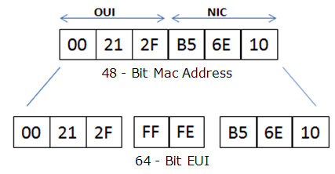

# To Learn

- IPv6 podstawy
- OSPFv3 podstawy
- SLAAC
- Komendy
  - Router
  - Host

## IPv6

Protokół IPv6 to nowa wersja protokołu IP (ang. Internet Protocol) mająca zastąpić protokół IPv4.
Oprócz rozszerzonej przestrzeni adresowej, protokół IPv6 wprowadza szereg innych rozwiązań, jak np.
autokonfiguracja bezstanowa SLAAC (ang. Stateless Address Autoconfiguration).

## OSPFv3

OSPF zakłada wprowadzenie obszarów (Area), gdzie obszar oznacza sieć w której wiadomości LSA (Link-
State-Advertisements) są dystrybuowane do każdego z routerów należących do tej sieci. Obszar
identyfikowany jest przez 4-bajtową liczbę całkowitą, zaś powszechnie przyjętą konwencją jest
prezentacja identyfikatora obszaru w konwencji zapisu adresu IPv4 (np. 1.2.3.4). OSPF wymaga
istnienia centralnego obszaru (tzw. backbone area) oznaczonego identyfikatorem 0 (tj. 0.0.0.0).
Ponadto, każdy router OSPF posiada swój 4-bajtowy identyfikator, który również zazwyczaj jest
zapisywany w notacji IPv4 (np. 192.168.1.1), również w przypadku dedykowanego dla IPv6 OSPFv3.

## SLAAC

> W tym drugim przypadku wykorzystywane są mechanizmy automatycznej konfiguracji adresów
> IPv6, oraz protokół dynamicznego routingu pomiędzy węzłami sieci.
> Mechanizm SLAAC bezstanowej autokonfiguracji IPv6 nie wymaga manualnych działań
> konfiguracyjnych po stronie hosta, minimalną (wstępną) konfigurację po stronie routerów, oraz może
> być przeprowadzony bez konieczności stosowania dodatkowych serwerów. SLAAC umożliwia hostowi
> wygenerowanie własnego globalnego adresu IPv6 poprzez użycie kombinacji informacji dostępnych
> lokalnie (np. adres MAC jego karty sieciowej) oraz informacji rozgłaszanych przez router za pomocą
> wiadomości Router Advertisements (RA). Router w wiadomości RA rozgłasza 64-bitowy prefix
> identyfikujący daną podsieć, z kolei host generuje 64-bitowy identyfikator interfejsu, który w sposób
> jednoznaczny identyfikuje dany interfejs w ramach tej podsieci. Połączenie tych dwóch powyższych
> elementów, tj. rozgłaszanego prefixu i identyfikatora interfejsu, tworzy w efekcie globalny, 128-bitowy
> adres IPv6.
> W przypadku braku routera z uruchomionym mechanizmem RA w danej podsieci, możliwe jest jedynie
> wygenerowanie unikalnych adresów o lokalnym zasięgu (tj. typu link-local). Należy jednakże pamiętać,
> że adresy te są wystarczające do wewnętrznej komunikacji w ramach danej podsieci.

***

SLAAC służy do automatycznej konfiguracji adresów IPv6.

- Nie wymaga w ogóle konfiguracji po stronie hosta
- Wymaga minimalną wstępną konfigurację po stronie routerów
- Nie wymaga żadnych dodatkowych serwerów

**Kroki**:

- Najpierw na routerach uruchamiamy EUI64 i dodajemy do tego z przodu prefix'y podsieci, co nam da adresy IPv6 dla interfejsów.

- Następnie routery rozgłaszają wiadomości RA (Router Advertisment) informując o prefixach podsieci oraz o tym jakie wygenerowane eui64 są zajęte.

  - >  Router w wiadomości RA rozgłasza 64-bitowy prefix identyfikujący daną podsieć

- Host otrzymuje 64-bitowy prefix od router'a, a następnie używa eui64 do wygenerowania 64-bitowego id interfejsu. Połączenie tych elementów daje w efekcie globalny 128-bitowy adres IPv6.

Nazywa się to **S**tate**L**ess **A**ddress **A**uto **C**onfiguration.

- Stateless, bo host konfiguruje się dzięki informacjom, zamiast dostawać przydzielony adres.
- Auto, bo host sam generuje eui64.

**Wykrywanie duplikatu**

## Komendy

### Router

Routery korzystają z oprogramowania o nazwie **VyOs**.

Są dwa tryby:

- operacyjny
  - działanie routera, przeglądanie ustawień. znak zachęty `$`
- konfiguracyjny
  - zmiana konfiguracji, znak zachęty `#`

| TRYBY                                                        |                                                              |
| :----------------------------------------------------------- | :----------------------------------------------------------: |
| `# configure`                                                |              wejście do trybu konfiguracyjnego               |
| `# commit`                                                   |   zatwierdzenie zmian wprowadzonych w trybie konfiguracji    |
| `# exit`                                                     |                wyjście z trybu konfuracyjnego                |
| **PING**                                                     |                                                              |
| `$ ping6 ::1`                                                | zpingowanie adresu loopback (używane np. do weryfikacji czy IPv6 jest skonfigurowane) |
| `$ ping6 <IPv6_address>`                                     | zpingowanie interfejsu indetyfikowanego przez <IPv6_address> |
| `$ ping6 -I <interface_name> <IPv6_address>`                 | zdefiniowanie interfejsu routera (np. eth0), przez który zostaną wysłane pakiety do <IPv6_address> |
| **Adresy**                                                   |                                                              |
| `# set interfaces ethernet <interface_name> address <IPv6_address>/<prefix_length>` |         przypisane adresu IP do interfejsu router'a          |
| `# set interfaces ethernet <interface_name> ipv6 address eui64 <IPv6_prefix>/<64>` | automatyczne wygenerowanie adresu IPv6 w oparciu o prefix /64 i adres MAC danego interfejsu |
| `# delete interfaces ethernet <interface_name> address`      |      usunięcie adresu przypisanego do danego interfejsu      |
| `$ show interfaces ethernet <interface_name>`                |    sprawdzenie adresów przypisanych do danego interfejsu     |
| **ROUTING**                                                  |                                                              |
| `# set protocols static route6 <IPv6_prefix/prefix_length> next-hop<IPv6_address>` | konfigurowanie manualnie routingu, opcja `next-hop` określa adres IPv6 urządzenia, do którego ma być przesyłany ruch z zakresu podsieci definiowanej przez <IPv6_prefix> |
| `$ show ipv6 route`                                          |  Wyświetlenie wpisów w tabeli routingu IPv6 danego routera   |
| **SLAAC**                                                    |                                                              |
| `# set interfaces <interface> ipv6 router-advert send-advert <true or false>` | Włączenie lub wyłączenie mechanizmu RA na danym interfejsie wykonywane jest za pomocą komendy: |
| Opcje:                                                       |                                                              |
| `min-internal (max-interval)`                                | minimalny (maksymalny) odstęp, w sekundach, pomiędzy wysłaniem kolejnych wiadomości RA przez ruter |
| `managed-flag`                                               | `true` oznacza, że adres IPv6 terminal musi pozyskać za pomocą mechanizmu DHCPv6. Domyślnie: `false` |
| `other-config-flag`                                          | `true` oznacza, że inne parametry konfiguracyjne są dostępne poprzez DHCPv6 |
| `prefix`                                                     | definiuje prefiks IPv6, w formacie: `ipv6-prefix/prefix_length` , który będzie rozgłaszany przez router |
| **OSPF**                                                     |                                                              |
| `# set protocols ospfv3 area <area_id> interface <interface_name>` | uruchomienie ospf, na interfejsie `<interface_name>` w obszarze `<area_id>` |
| `# set protocols osfpv3 area <area_id> range <IPv6_prefix>/<prefix_lenght>` |     ustalenie prefixu rozgłaszanej podsieci przez router     |
| `# set protocols parameters router-id <router_id>`           |              ustawienie identyfikatora routera               |
| `# set protocols redistribute connected`                     |                   rozgłoszenie informacji                    |
|                                                              |                                                              |

### Host

|                                                              |                                                              |
| ------------------------------------------------------------ | :----------------------------------------------------------: |
| `ip -6 addr add <ipv6address>/<prefixlength> dev <interface_name>` |         przypisanie adresu IPv6 do danego interfejsu         |
| `ip -6 addr show dev <interface_name>`                       |    wyświetlenie adresów przypisanych do danego interfejsu    |
| `ip -6 route add <ipv6network>/<prefixlength> via <ipv6address> [dev <interface_name>]` | dodanie do tablicy rutingu ścieżki do określonej sieci. Opcja `dev` pozwala dodatkowo ustalić wyjściowy interfejs. |
| `ip -6 route add default via <ipv6address>`                  |        dodanie do tablicy routingu ściezki domyślnej         |
| `ip -6 route show [dev <interface_name>]`                    |              wyświetla wpisy w tablicy routingu              |
| `sudo sysctl -w net.ipv6.conf.all.forwarding=0`              | Uwaga: autokonfiguracja IPv6 w hoście jest nieaktywna, jeżeli pełni on funkcję rutera; taka opcja jest domyślnie ustawiona w wykorzystywanych w projekcie systemach Tiny Core Linux. Trzeba ją wyłączyć. |

## Pytania z dysku

### IPv4 vs. IPv6

- IPv4 to pow(2, 32) adresów 32-bitowych, zapisywanych jako cztery oktety.

- IPv6 to pow(2, 128) adresów 128-bitowych, zapisywanych jako osiem kwartetów w kodzie szesnastkowym.

Nowe rzeczy w IPv6:

- duża powierzchnia adresowa, odpowiadająca współczesnym potrzenbom
- uproszczony nagłówek 
- wsparcie dla QoS
- autokonfiguracja (np. SLAAC)
- większa otwartość na współpracę z innymi rzeczami

https://www.youtube.com/watch?v=U-22FneZhd0

https://www.youtube.com/watch?v=aor29pGhlFE

### Jak EUI64 generuje adresy?

> Extended Unique Identifier (EUI), as per RFC2373, allows a **host** to assign iteslf a unique 64-Bit IP Version 6 interface identifier (EUI-64). This feature is a key benefit over IPv4 as it eliminates the need of manual configuration or DHCP as in the world of IPv4.

Aby wygenerować unikalny globalnie adres IPv6 możemy połączyć adres podsieci w jakiej znajduje się urządzenie z wynikiem działania algorytmu eui64.

> Czyli pierwsze 64 bity (4 kwarterty 16-stkowe) to prefix podsieci, a następne 4 kwartety to wyniki działania eui64

eui64 odczytuje adres MAC urządzenia, który tak naprawdę dzieli się na dwie części:

- OUI (Organizationally Unique Identifier) 
- NIC specific (specyficzny dla danej kart sieciowej (Network Interface Card))

Obie te części mają po 3 duety 16-stkowe (24 bity). 

I między obie te części wsadzamy 0xFFFE czyli jeden kwartet szesnastkowy. Jest to stała wartość.



Na sam koniec invertujemy siódmy bit od lewej.


No więc łączymy <prefix_podsieci> + <eui64_identifier> i mamy teoretycznie globalnie unikalny adres IPv6 danego urządzenia.

### Na czym polega stateless autoconfig?

SLAAC ładnie wyjaśniony [wyżej](#slaac)

### Czy da się zmienić adres MAC? Czy mogą istnieć dwa takie same adresy?

Da się (ale nie na stałe) MAC jest hardcoded.

Na linuxie poniższa komenda zmienia (tymczasowo) adres MAC interfejsu, do następnego rebootu systemu:
`sudo ifconfig en0 xx:xx:xx:xx:xx:xx`

Dwa takie same adresy istnieją, ale o ile nie są w tej samej podsieci, to nie jest to problem - w przeciwnym wypadku będą następować kolizje.

Jeśli są rozdzielone przez co najmniej jeden router, to nie widzą się nawzajem, a jedynie właśnie ten router.

https://www.howtogeek.com/228286/how-is-the-uniqueness-of-mac-addresses-enforced/

## Opis krok po kroku co my właściwie zrobiliśmy w tym projekcie

### 1 Konfiguracja statyczna

Konfiguracja statyczna polega na:

- [x] manualnym przypisaniu adresu IPv6 do hosta (do odpowiedniego interfejsu, z podanej puli adresowej)
- [x] ustawieniu routingu w hoście na odpowiednią bramę domyślną
- [x] mnaualnym przypisaniu adresów IPv6 do interfejsów routerów
- [x] konfiguracji routingu statycznego między routerami (za pomocą next-hop)

#### 1 Sprawdzenie adresów mac switchów

Sprawdzenie czy porty switchów mają ustawiony VLAN 1, jeśli tak, nie musimy nic tam konfigurować.

Adres `mac` switch sprawdza się za pomocą komendy `mac`.

Wyszło nam, że wszystko jest ustawione git.

#### 2 Wyłączenie autokonfiguracji IPv6 na hostach

autokonfiguracja IPv6 w hoście jest nieaktywna, jeżeli pełni on funkcję rutera, dlatego przed realizacją projektu musimy ją manualnie wyłączyć (bo domyślnie jest włączona ta funkcja)

`sudo sysctl -w net.ipv6.conf.all.forwarding=0`

#### 3 Konfigruacja domeny A

W tym kroku najpierw do urządzeń domeny A przypisujemy manualnie adresy IPv6.

- Najpierw do interfejsu router'a połączonego z hostem:
  - `set interfaces ethernet eth0 address 2001:db8:a::1/64`

- Potem do interfejsu hosta połączonego z routerem
  - `sudo ip -6 addr add 2001:db8:a::2/64 dev eth0`

Następnie ustawiamy router A jako brama domyślna hosta-1

`sudo ip -6 route add default via 2001:db8:a::1`

**Rezultatem** tego kroku jest komunikachja pomiędzy routerem A a hostem-1.

#### 4 Konfiguracja domeny B

Analogicznie jak w pkt.3

#### 5 Konfiguracja domeny C

Tutaj mamy do czynienia z domeną tranzytową (brak hostów).

Domenie C został przydzielony adres podsieci o masce `/48`. My musimy tę podsieć podzielić na kolejne, ponieważ potrzebujemy podsieci dla każdego z 7 łączy. Dlatego też zwiększamy maskę do `/64`, a każdemu łączu dajemy podsieć o adresie `2001:0DB8:000C:000<x>:0000:0000:0000:0000` (stosując skrócony zapis: `2001:db8:c:<x>::/64`). Gdzie `x` to numer łącza.

Następnie numerujemy łącza i nadajemy im adresy podsieci, a potem przypisujemy adresy interfejsom należącym to tych podsieci jako kolejne identyfikatory w podsieciach "łączowych".

np. dla routera C

```sh
vyos@vyos# set interfaces ethernet eth0 address 2001:db8:c:1::2/64
vyos@vyos# set interfaces ethernet eth1 address 2001:db8:c:5::2/64
vyos@vyos# set interfaces ethernet eth2 address 2001:db8:c:2::1/64
```

**Rezultatem**  jest to, że  każdy interfejs należący do domeny C ma manualnie przypisany adres IPv6.

Następnie za pomocą `next-hop` robimy routingu statyczny

#### 6 Konfiguracja najkrótszej ścieżki

W najkrótszej ścieżce routery E i F nie biorą udziału. Pozostałym routerom za pomocą `next-hop` robimy routing statyczny.

```sh
Router C: vyos@vyos# set protocols static route6 2001:db8:a::/64 next-hop 2001:db8:c:1::1
Router C: vyos@vyos# set protocols static route6 2001:db8:b::/64 next-hop 2001:db8:c:2::2
```

**Rezultatem** są:

- wpisy w tablicy routingu
- komunikacja między hostami

#### 7 Konfiguracja najdłuższej ścieżki

Najpierw musimy usunąć poprzednią konfugurację:

`vyos@vyos# delete protocols static route6 2001:db8:b::/64`

Następnie wymyślamy najdłuższą ścieżkę i według niej robimy jak w pkt.6

#### Wnioski

Konfiguracja statyczna dla małych sieci jest spoko. Mamy nad wszystkimi totalną kontrolę. Sama konfiguracja jest prosta ideologicznie, łatwa do zrozumienia i prosta do zrobienia. Wprowadzenie zmian np. w routingu byłoby już nieco kłopotliwe. Oraz dla dużych sieci wklepanie konfiguracji zajęło, by dużo czasu. 

### 2 Konfiguracja dynamiczna

#### 1 Wyłączenie autokonfiguracji IPv6 na hostach

Z racji, że skasowaliśmy poprzednią konfigurację, to musimy jeszcze raz wyłączyć autokonfigurację IPv6 na hostach.

`sudo sysctl -w net.ipv6.conf.all.forwarding=0`

#### 2 Wygenerowanie adresów interfejsów

Tym razem zamiast manualnie przypisać wymyślone przez nas adresy interfejsom routerów, korzystamy z algorytmu eui64. 

Generujemy routerom adresy.

```sh
vyos@vyos# set interfaces ethernet eth2 ipv6 address eui64 2001:db8:b::/64
vyos@vyos# set interfaces ethernet eth0 ipv6 address eui64 2001:db8:c:3::/64
vyos@vyos# set interfaces ethernet eth1 ipv6 address eui64 2001:db8:c:7::/64
```

**Rezultatem** są adresy IPv6 interfejsów routerów.

#### 3 Rozgłoszenie wiadomości RA

Skoro routery mają już adresy, to teraz rozgłaszamy je wiadomościami RA i hosty również otrzymują adresy. SLAAC zadziałał.

```sh
vyos@vyos# set interfaces ethernet eth0 ipv6 router-advert send-advert true
vyos@vyos# set interfaces ethernet eth0 ipv6 router-advert min-interval 8
vyos@vyos# set interfaces ethernet eth0 ipv6 router-advert max-interval 12
vyos@vyos# set interfaces ethernet eth0 ipv6 router-advert prefix 2001:db8:a::/64
```

Ten krok wykonujemy tylko na routerach domen A i B, bo tylko one "gadają" z hostami.

**Rezultatem** są adresy IPv6 hostów.

#### 4 Konfiguracja OSPFv3

Musimy nadać każdemu routerowi router-id. W tym celu najpierw definiujemy adresy loopback dla każdego routera, a następnie takie same wartości przypisujemy jako `router-id` w ospf. Dlaczego? Taka konwencja.

```sh
vyos@vyos# set interfaces loopback lo address 3.3.3.3/32
vyos@vyos# set protocols ospfv3 parameters router-id 3.3.3.3
```

OSPF wymaga istnienia tzw. backbone area. Dodajemy więc wszystkie routery do tego obszaru OSPF.

Obszar 0 w OSPF, to tzw **backbone area**. Jest to obszar, do którego podłączone są wszystkie inne, służy do tranzytu ruchu między nimi.

```sh
vyos@vyos# set protocols ospfv3 area 0.0.0.0 interface eth0
vyos@vyos# set protocols ospfv3 area 0.0.0.0 interface eth1
vyos@vyos# set protocols ospfv3 area 0.0.0.0 interface eth2
vyos@vyos# commit
```

Następnie uruchamiamy rozgłaszanie **wiadomości LSA** przez OSPF

```sh
vyos@vyos# set protocols ospfv3 redistribute connected
```

**Rezultatem ** jest komunikacja między hostami.
