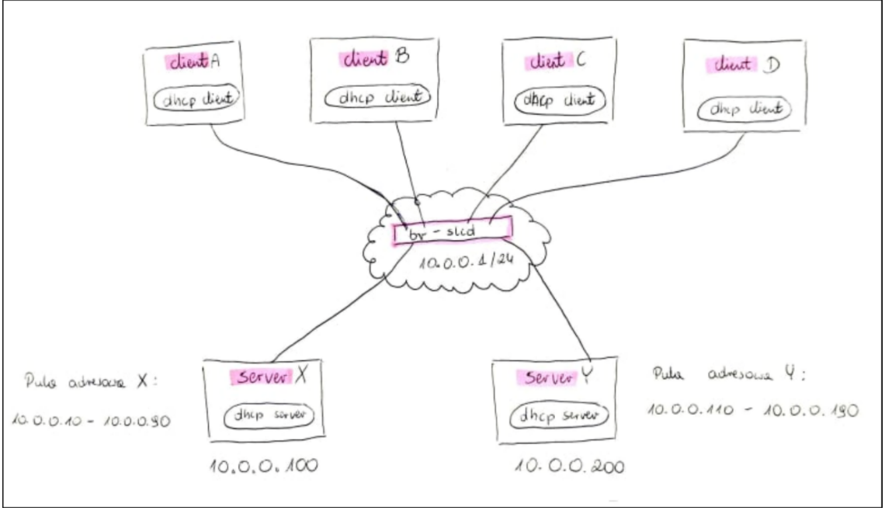
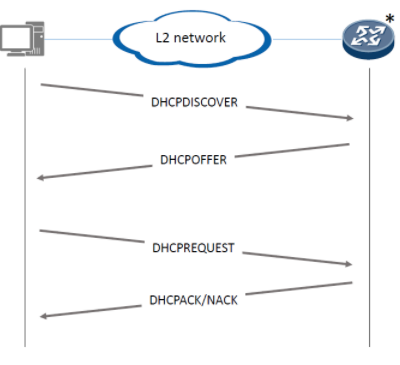
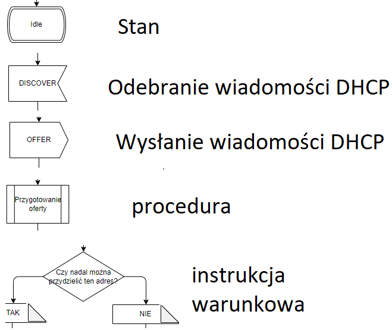
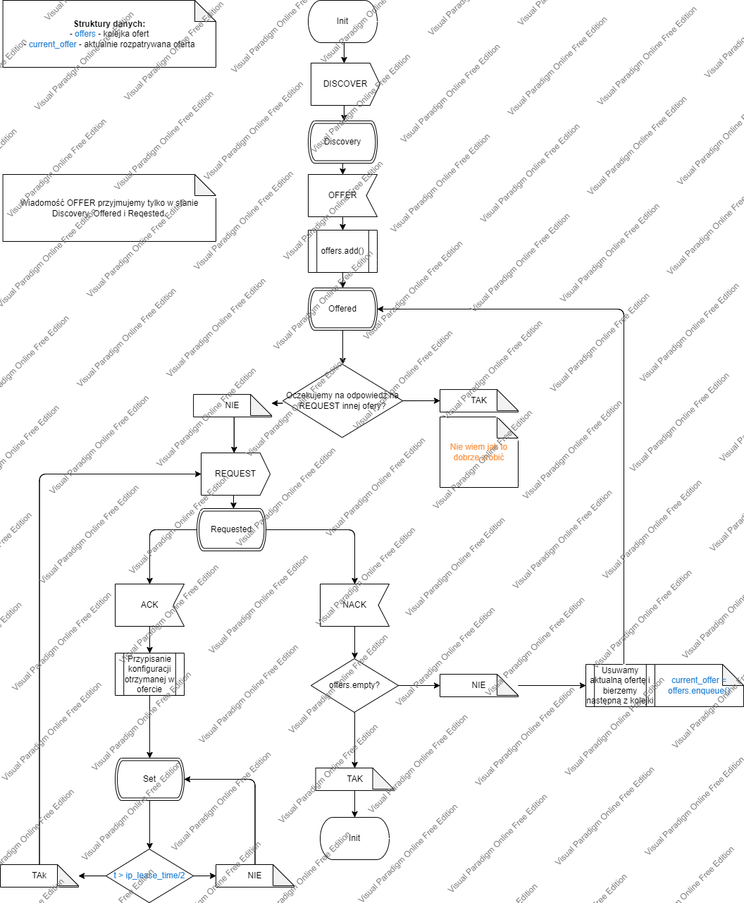
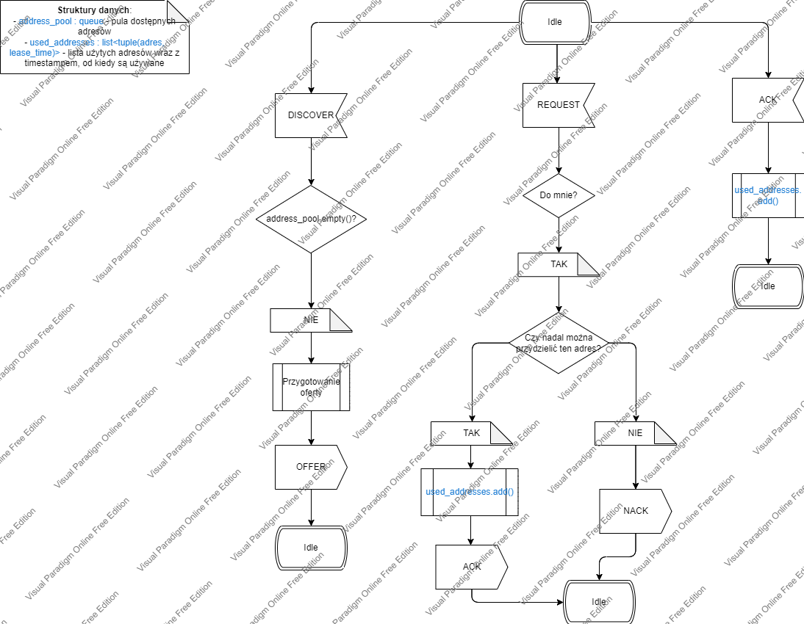

# SLCD Projekt-Mycek

## Wymagania

System przydzielający adresy z wykorzystaniem DHCP.

Implementacja klienta i serwera.

- Dokumentacja systemu
- 2-3 scenariusze

System:

- `>=2` serwery DHCP, które sobie nawzajem nie przeszkadzają
- `>=2` klientów korzystających z serwerów
- serwer ma skończona pulę adresów i parametrów (leaseTime itp.)
- pule adresów serwerów są rozłączne

## Nasza sieć



# DHCP

## Jaki problem rozwiązuje?

Proces skonfigurowania hostowi jego 

- adres, 
- adres podsieci i jej maskę
- bramę domyślną

Nazywamy konfiguracją hosta (**Host Configuration**).

Wklepywanie tego ręcznie jest bardzo czasochłonne dlatego stworzono protokół DHCP.

**DHCP - Dynamic Host Configuration Protocol**

## Jak działa?

Protokół DHCP działa na zasadzie klient-serwer. 

- Mamy serwer, który nasłuchuje na żądania. Kiedy żądanie przyjdzie, procesuje je i wysyła odpowiedź. 
- Mamy klientów, którzy są w stanie wysyłać żądania i nasłuchiwać na odpowiedzi.

W uproszczeniu:

- Serwery mają przypisaną dostępną pulę adresów oraz konfigurację hosta
- Hosty proszą serwery o przydzielenie adresu IP i konfiguracji

### Wiadomości

Typowa wymiana wiadomości wygląda następująco



*serwer DHCP zazwyczaj implementowany jest na ruterze

Protokół DHCP składa się z 4 wiadomości, pierwsze przybliżenie poniżej:

- DHCP_DISCOVER
  - Wysyłane przez klienta, który dopiero co został uruchomiony i nie ma jeszcze przypisanego adresu IP.
  - Wysyłany jest ramką broadcast'ową, aby każdy w sieci (w szczególności każdy serwer) dostał tę wiadomość
  - Wiadomość służy do odkrycia serwerów DHCP
- DHCP_OFFER
  - Wysyłane przez serwer w odpowiedzi na DHCP_DISCOVER
  - Serwer powiadamia host o swoim istnieniu, jednocześnie od razu oferując mu adres IP (i resztę konfiguracji) ze swojej puli
  - Host po otrzymaniu DHCP_OFFER zapisuje je na później
- DHCP_REQUEST
  - Host, gdy dostanie ofertę od serwera (lub oferty od serwerów - wtedy wybiera jedną z nich), akceptuje ją i wysyła DHCP_REQUEST w celu zarezerwowania oferowanego adresu IP dla niego.
    - Zarezerwowanie polega na tym, że żaden inny host nie dostanie tego adresu
- DHCP_ACK
  - Serwer po otrzymaniu DHCP_REQUEST sprawdza czy adres nadal jest dostępny (czy w międzyczasie nie przydzielił już go komuś), jeśli tak to wysyła DHCP_ACK
  - Ta wiadomość (tak jak wszystkie inne) jest broadcast'owa, co pozwala innym serwerom śledzić przyznane już adresy IP
- DHCP_NACK
  - Jeśli serwer, po otrzymaniu DHCP_REQUEST zauważy, że żądany adres nie jest już dostępny, wyśle DHCP_NACK, co oznacza odpowiedź negatywną

Co robi host po otrzymaniu DHCP_NACK?

Z racji, że host zapisuje wszystkie DHCP_OFFER, wysyła DHCP_OFFER do drugiego z kolei serwera, aż dostanie DHCP_ACK. Jeśli lista ofert mu się skończy, a nie dostał adresu IP wysyła DHCP_DISCOVER i akcja ma się od nowa.

# Diagramy stanów - 1 przybliżenie

Quick Review jak czytać diagramy SDL:



## Klient



## Serwer



# Protokół

Każda wiadomość składa się z trzech części:

- ETH header
- IP header
- DHCP payload

W przypadku każdej wiadomości ETH header i IP header wyglądają tak samo.

ETH header

```json
{
    dstMAC=ff:ff:ff:ff:ff:ff,
    srcMAC=<adres_MAC_urządzenia_które_wysyła_wiadomość>
}
```

IP header

```json
{
    dstIP=255.255.255.255,
    srcIP=<adres_IP_urządzenia_które_wysyła_wiadomość>*
}
```

*W przypadku hosta `srcIP` jest ustawione na `0.0.0.0`

Różnice między wiadomościami pojawiają się dopiero przy DHCP payload, dlatego tylko on zostanie omówiony w następnych rozdziałach.

## DHCP_DISCOVER

DHCP payload:

```json
{
    clientMAC=<adres_mac_klienta_który_wysyła_wiadomość>
}
```

### Przykład

```jso
{
    clientMAC=21:37:69:42:00:69
}
```

## DHCP_OFFER

DHCP payload:

```json
{
    yourIP=<ip_który_serwer_oferuje_klientowi>
    clientMAC=<adres_mac_klienta_na_którego_DISCOVER_serwer_odpowiada>
    subnetMask=<maska_podsieci> // skonfigurowana przez admina serwera
    router=<adres_bramy_domyślnej> // skonfigurowany przez admina serwera
    DNS=<lista_adresów_ip_serwerów_DNS> //konkatenacja za pomocą "&" // skonfigurowana przez admina serwera
    IPLeaseTime=<czas_na_jaki_przydzielany_jest_adres_IP> // [s] // skonfigurowany przez admina serwera
    DHCPServerIdentifier=<adres_IP_serwera_który_wysyła_wiadomość>
}
```

### Przykład

```json
{
    yourIP=10.0.0.10
    clientMAC=21:37:69:42:00:69
    subnetMask=255.255.255.0
    router=10.0.0.1
    DNS=10.0.0.200&8.8.8.8
    IPLeaseTime=3600
    DHCPServerIdentifier=10.0.0.253
}
```

## DHCP_REQUEST

DHCP payload:

```json
{
    clientMAC=<adres_mac_klienta_który_wysyła_wiadomość>
    requestedIPAddress=<adres_IP_otrzymany_jako_`yourIP`_w_OFFER>
    DHCPServerIdentifier=<adres_IP_serwera_który_wysyłał_OFFER>
}
```

### Przykład

```json
{
    clientMAC=21:37:69:42:00:69
    requestedIPAddress=10.0.0.10
    DHCPServerIdentifier=10.0.0.253
}
```

## DHCP_ACK / DHCP_NACK

DHCP payload:

```json
{
    yourIP=<ip_który_zostanie_przypisany_klientowi>
    clientMAC=<adres_mac_klienta_na_którego_REQUEST_serwer_odpowiada>
    subnetMask=<maska_podsieci> // skonfigurowana przez admina serwera
    router=<adres_bramy_domyślnej> // skonfigurowany przez admina serwera
    DNS=<lista_adresów_ip_serwerów_DNS> //konkatenacja za pomocą "&" // skonfigurowana przez admina serwera
    IPLeaseTime=<czas_na_jaki_przydzielany_jest_adres_IP> // [s] // skonfigurowany przez admina serwera
    DHCPServerIdentifier=<adres_IP_serwera_który_wysyła_wiadomość>
}
```

