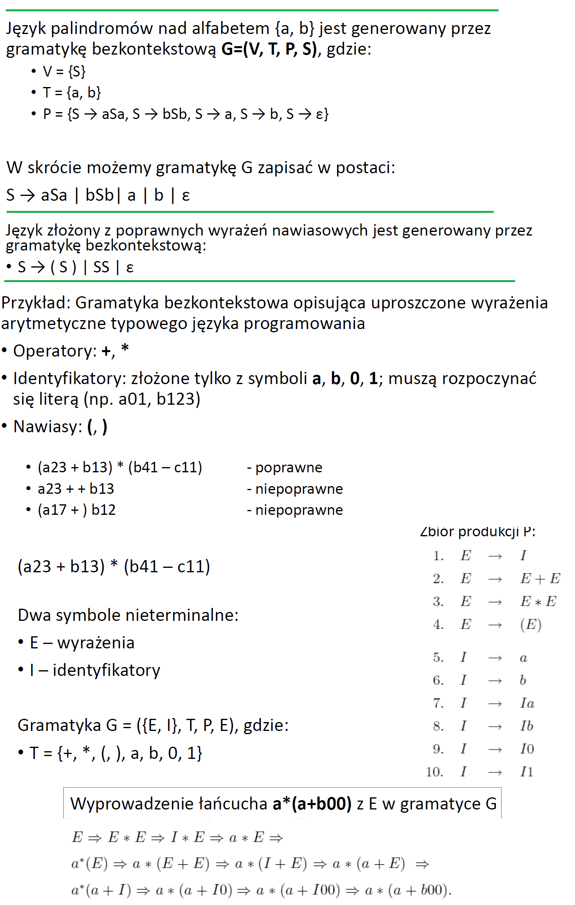

# W1 Podstawowe pojęcia

## Alfabet

**Alfabet** - skończony, niepusty zbiór **symboli**. Oznaczany `Σ`

> alfabet binarny: Σ = {0,1}
>
> alfabet małych liter łacińskich: Σ = {a,b,c,...z}

## Słowo

**Słowo (łańuch) nad alfabetem** - skończony ciąg *symboli* wybranych z alfabetu

> 0011011, 1111 to słowa nad alfabetem Σ = {0,1}

**Długość słowa** `|w|`

> |0101| = 4

**Słowo puste** - oznaczamy `ε`. `|ε|=0`

## Słownik

**Słownik nad alfabetem** - zbiór wszystkich skończonych słów nad alfabetem.

## Potęgi alfabetu

`Σ^k` - zbiór słów o długości `k`, których wszystkie symbole należą do `Σ`

`Σ^*` - słownik nad alfabetem: `Σ^* = Σ^0 + Σ^1 + Σ^2 + Σ^3 + ...` 

`Σ^+` - niepuste słowa nad alfabetem :`Σ^* = Σ^1 + Σ^2 + Σ^3 + ...` 


Konwencja

- Symbole oznaczany przez cyfry i małe litery z początku alfabetu
- Słowa przez litery z końca alfabetu

**Konkatencja słów**

Jeśli `x` i `y` to słowa, to `xy` onacza ich konkatenacje:


`ε` jest **elementem neutralnym** konkatenacji ==> `εw = wε = w`

> x = 010, y= 111 ==> xy = 010111

prefix słowa - dowolna liczba symboli rozpoczynająca to słowo

postfix słowa -                                             kończąca

> słowo: 0101
>
> prefix: ε, 0, 01, 010, 0101,
>
> postfix: ε,1, 01, 101, 0101

## Potęga słowa


> w = kot
>
> w^0 = ε
>
> w^3 = kotkotkot

## Języki

**Język `L`** nad alfabetem `Σ`, to zbiór słów złożonych z symboli alfabetu `Σ`. Ale już nie wszystkich (tak jak słownik), tylko jakiś konkretnych.

`L ⊆ Σ^*` - `L` to podzbiór słownika nad alfabetem `Σ`

> 

### 3 sposoby definiowania języków


## Konkatenacja języków


> 

### Właściwości


## Potęga języka


## Iloraz słowa


## Iloraz języka


# W2 DAS

**Deterministyczny Automat Skończony** składa się z:

- skończonego zbioru **stanów**
- zbioru **przejść** między stanami, przy różnych symbolach wejściowych z pewnego Σ.

Właściwości:

- Dla każdego symbolu wejściowego w danym staniem istnieje DOKŁADNIE JEDNO przejście do innego stanu.
- Jeden ze stanów (oznaczany `q0`) jest **stanem początkowym**
- Niektóre ze stanów są **akceptujące**

<u>DAS definiuje *język*</u> będący zbiorem wszystkich *słów*, które dają sekwencję przejść od <u>stanu początkowego</u> do jakiegoś <u>stanu akceptującego</u>.


## Formalna definicja

DAS to piątka `M = (Q, Σ, δ, q0, F)`

`Q` - skończony zbiór stanów

`Σ` - alfabet wejściowy

`δ: QxΣ -> Q` - funkcja przejścia: Dziedzina to przestrzeń stanów razy przestrzeń alfabetu. Dla każdego stanu a w nim dla każdego symbolu wejściowego zwraca stan.

`q0` - należy do `Q`. stan początkowy. Tu DAS startuje odczytywanie symboli

`F` - podzbiór `Q`. Stany końcowe. Jeśli DAS nie ma więcej symboli wejściowych do wczytania i znajduje się w stanie końcowym, to znaczy. że akceptuje on dany ciąg symboli wejściowych (dane słowo)

Uwaga: Funkcja `δ` może być tylko częściowo określona, mogą istnieć takie pary `(q,a)`, dla których nie jest określony nowy stan.

## Sposoby specyfikacji


## Język regularny

**Słowo `w` jest akceptowane przez deterministyczny automat skończony**  `M = (Q, Σ, δ, q0, F)`, jeżeli `δ(q0,w) = p, gdzie p∈F` 
==> Rozpoczynając w stanie `q0` po wczytaniu wszystkich symboli słowa `w` znajdziemy się w jednym ze stanów akceptujących.

**Język `L` jest akceptowany przez DAS `M`**, co oznaczamy jako L(M), gdy `{x|δ(q0,w) ∈ F}`
==> Wszystkie słowa języka są akceptowane przez DAS


Język nazywamy **regularnym**, jeżeli jest on językiem akceptowanym przez jakiś DAS.

# W3 NDAS

## Formalna definicja

DAS to piątka `M = (Q, Σ, δ, q0, F)`

`Q` - skończony zbiór stanów

`Σ` - alfabet wejściowy

`δ: QxΣ -> 2^Q` - funkcja przejścia: Dziedzina to przestrzeń stanów razy przestrzeń alfabetu. Dla każdego stanu a w nim dla każdego symbolu wejściowego zwraca stany w jakich może się znaleźć NDAS teraz.

`q0` - należy do `Q`. stan początkowy. 

`F` - podzbiór `Q`. Stany końcowe.

## NDAS vs DAS

- W DAS funkcja przejścia `δ` zwraca JEDEN stan (lub jest nieokreślona dla danej pary `(q,a)`)
- W NDAS funkcja przejścia  `δ` zwraca PODZBIÓR stanów z `Q`, czyli (zero, jeden lub więcej stanów)
- Nieformalnie ==> NDAS może znajdować się w kilku stanach na raz. DAS tylko w jednym.

## Przykład


## Rozszerzenie funkcji przejścia

**`𝛿:𝑄×Σ*→2𝑄`**

- `Σ*=Σ0∪Σ1∪Σ2`
- `𝛿(q,w)` - określa zbiór stanów w jakich może znaleźć się automat po odczytaniu słowa `w` , jeśli rozpoczął odczytywanie w stanie `q`


## Akceptacja

Słowo `w` jest akceptowane przez NDAS `M = (Q, Σ, δ, q0, F)`, jeżeli `𝛿(q0,w) ∩ F != ∅`

- Rozpoczynając od stanu `q0`, po wczytaniu słowa `w`, <u>co najmniej jeden</u> ze stanów w którym NDAS się znajduje jest akceptujący

Język `L` jest akceptowany przez NDAS `M`, co oznaczamy `L(M)`, gdy `{w | 𝛿(q0,w)  ∩ 𝐹 != ∅}`

- Czyli wszystkie słowa tego języka są akceptowane przez NDAS


Uwagi:

- NDAS akceptuje słowo, jeżeli przy czytaniu jego symboli można dokonać takiego ciągu stanów, że przechodzi się z q0 do jakiegoś stanu akceptującego
- Fakt, że inne możliwe wybory stanów nie prowadzą do stanu akceptującego nie przeszkadza w akceptacji `w`
- Trzeba znaleźć przynajmniej jeden taki ciąg wyboru stanów, który doprowadzi do akceptującego

## Fakty

- Dla wielu języków łątwiej zrobić NDAS niż DAS
- NDAS ma nie więcej stanów niż DAS
  - W najgorszym przypadku najmniejszy NDAS może mieć `N` stanów, a DAS `2^N`, do rozpoznawania danego języka.

## Twierdzenie

Niech `L` będzie językiem akceptowanym przez NDAS. Wówczas istnieje DAS, który też akceptuje L.

Dowodem jest tu konstrukcja DAS, którego stany odpowiadają podzbiorom stanów NDAS. Robi się to tzw. **algorytmem potęgowym**.

## Algorytm potęgowy

1. Dany jest NDAS: `N = (Qn, Σ, δn, q0, Fn)`

2. Konstruujemy DAS `D = (Qd, Σ, δd, {q0}, Fd)` takie, że L(D) = L(N)
3. DAS ma ten sam alfabet wejściowy `Σ`, a stan początkowy to zbiór `{q0}`
4. `Qd` jest zbiorem podzbiorów `Qn` (zbiorem potęgowym)
   1.  Jeżeli `Qn` ma `n` stanów, to `Qd` ma `2^n` stanów (w praktyce część stanów będzie nieosiągalna)
   2. `Fd` jest zbiorem podzbiorów S zbioru `Qn` takich, że `S ∩ Fn != ∅` (podzbiory zbioru `Qn`, zawierające co najmniej jeden stan akceptujący automatu N)
   3. Dla każdego zbioru `S ⊆ Qn` i symbolu wejściowego `a ∈ Σ`
      

## NAS z ε przejściami (ε-NAS)

- Dopuszczalne przejścia na pustym symbolu
- Dopuszczalne przejścia "spontaniczne" - bez otrzymania symbolu wejściowego


### ε-DOMKN(q)


### Twierdzenie


# W4 - Regexy

## Przypominka


## Definicja

**Wyrażenia regularne** - algebraiczny opis języków akceptowanych przez AS (Automaty Skończone).


# W5 - Równoważność AS i regex'ów

Wiemy, że zarówno:

- DAS
- NDAS
- ε-NAS
  Jeśli rozpoznają jakiś język to taki język nazywamy **regularnym**

Regexy to algebraiczny opis języków akceptowanych przez AS.

Na tym wykładzie pokażemy, że:

- Każdy język rozpoznawany przez *DAS* jest generowany przez pewien*regex*
- Każdy język generowany przez *regex*, jest rozpoznawalny przez *ε-NAS*

## AS -> Regex

### Twierdzenie

Jeśli język `L` jest akceptowany przez DAS, to `L` jest generowany przez pewien regex.

### Dowód


### Przykład


## Regex -> AS

### Twierdzenie

Niech `r` będzie regexem. Istnieje ε-NAS, który akceptuje `L(r)` - język generowany przez `r`.

### Dowód

Dowód jest przez indukcję i zamienia zbiory z tej* definicji

*

na stany i etykiety


## Przykład


# W6 - Własności regex'ów


## Minimalizacja DAS


### Stan równoważne


#### Przykład


### Algorytm wypełniania tablic


## Algorytm minimalizacji DAS


# W8 - Gramatyki bezkontekstowe

## Definicja

**Gramatyka bezkontekstowa** G to uporządkowana czwórka G = (V , T , P ,S), gdzie

- `V` jest skończonym zbiorem **zmiennych** (tzw. symboli nieterminalnych lub pomocniczych)

- `T` jest skończonym zbiorem **symboli** końcowym (**terminalnych**);

  - > V i T są rozłączne

- `P` jest skończonym zbiorem **produkcji** postaci A→ α , gdzie A jest zmienną, a α skończonym łańcuchem symboli z  `V ∪ T`

- `S` jest specjalną **zmienną**, zwaną **symbolem początkowym**

## Przykład

Mamy taką gramatykę bezkontekstową:

```
V = {S}                   // zmienną jest tylko ta standardowa S
T = {a, b}                // symbole terminalne to  `a` i `b`
P = {S → aSb , S → ε}     // produkcja mówi co może być włożone w zmienną S
```

Jakie słowa może ona generować?

```
ab // powstało tak, że najpierw użyliśmy produkcji S → aSb a potem S → ε
aabb // S → aSb, potem znowu za S wsadziliśmy `aSb` a na koniec za S poszło ε: czyli S → aSb, S → aSb, S → ε
aaabbb // S → aSb, S → aSb, S → aSb, S → ε
```

Zauważ, że to generuje język `Język L = {a^nb^n | n ≥ 0}` no i mówimy że jest on **bezkontekstowy** (a reguralny już nie jest akurat ten)

W skrócię możemy tę gramatykę zapisać.

`S → aSb | ε` bo wiadomo, że zmienna specjalna S ma taką lub (|) inna produkcję, a po nich można się domyśleć symbole terminalne

## Wyprowadzenie łańcucha

Tam w przykładzie pisałem jak doszło do powstania pewnych słów


Formalne definicje:


## Język generowany przez gramatykę

Język generowany przez gramatykę G to

```
L(G) = {w : w ∈ T* and S -*G-> W}
```

Czyli to słowa, którę są wyprowadzalne z gramatyki G.

Łańcuch `𝛼 ∈ ( V ∪ T)*` jest nazywany **formą zdaniową**, jeśli `S-*G->𝛼`, czyli jeśli jest wyprowadzalny z `S`, czyli jeśli jest słowem z jezyka generowanego przez gramatykę S.

Języki generowany przez gramatyki bezkontekstowe nazywany **bezkontekstowymi**.

Dwie gramatyki G1 i G2 są równoważne, gdy `L(G1) == L(G2)`

Wszystkie języki regularne są bezkontekstowe, ale nie wszystkie języki (w ogóle) są bezkontekstowe.

### Przykłady



## Konwencje

- Dużymi literami A , B , C oznaczamy zmienne (symbole nieterminalne, pomocnicze); `S` oznacza zwykle symbol początkowy
- Małe litery a, b, c, cyfry są symbolami końcowymi/terminalnymi
- Dużymi literami X, Y, Z oznaczamy symbole, które mogą być symbolami końcowymi lub zmiennymi
- Małymi literami u, v, w, x y oznaczamy łańcuchy symboli końcowych
- Małymi greckimi literami α , β , γ oznaczamy łańcuchy zmiennych i symboli końcowych

## Wyprowadzenie prawo- i lewo- stronne

**Wyprowadzenie lewostronne** w każdym kroku zastępujemy pierwszą zmienną od lewej jednym z ciał jej produkcji

**Wyprowadzenie prawostronne** w każdym kroku zastępujemy pierwszą zmienną od prawej jednym z ciał jej produkcji


## Drzewo wyprowadzenia

`G = (V, T, P, S)`. **Drzewo wyprowadzenia/rozkładu** dla G, to drzewo, gdzie:

- Każdy wierzchołek wewnętrzny etkietowany jest zmienną z `V`
- Każdy liść etykietowany jest zmienną, symbolem terminującym lub `ε`. Jeśli jednak liść etykietowany jest `ε` to musi być on jedynym dzieckiem swego rodzica
- Jeśli wierzchołek wewnętrzny etykietowany jest zmienną `A`, a jego dzieci etykietowane są odpowiednio, od lewej do prawej, symbolami `X1, X2,.....,Xk` to `A ----> X1X2...Xk` jest produkcją z `P`.

### Przykłady


### Plon drzewa

W liściach, czyli tam gdzie już dzieci nie ma. Plon jest złożony z samych symboli terminujących.


## Projektowanie gramatyk bezkontekstowych

1. Napisz produkcję generującą "the easiest case"
2. Napisz produkcję generującą łańcuchy bardziej złożone z prostszych
3. Sprawdź czy generowane są wszystkie słowa należące do języka (i tylko takie)


4. Rozbij słowa na kilka części, każda generowana przez inny symbol nieterminalny (zmienną)
5. Rozważ osobno proste przypadki - zapojektuj dla nich gramatyki a na koniec połącz je

## Gramatyki wieloznaczne

Zauważmy, że:


Gramatyka jest **wieloznaczna**, jeśli istnieje co najmniej jeden łańcuch, dla którego możemy znaleźć dwa różne drzewa wyprowadzenia o korzeniu ii etykiecie `S` i plonie `w`.

Jeśli każdy łańcuch ma co najwyżej jedno drzewo wyprowadzenia to gramatyka jest **jednoznaczna**

### Eliminowanie wieloznaczności

Nie ma algorytmu, który mógły rozstrzynać czy dana grama jest wieloznaczna czy nie

Istnieją języki bezkontekstowe, które mają wyłącznie wieloznaczne gramatyki (języki ściśle wieloznaczne

Ale w praktyce, dla konstrukcji występujących np. w językach programowania, istnieją znane **metody eliminowania wieloznaczności**


Dla tej gramatyki isniteją dwie przyczyny wieloznaczności

- nie jest przestrzegany priorytet operatorów
- sekwencje identycznych operatorów (np. 1 + 2 + 3) można pogrupować od prawej do lewej i od lewej do prawej
  - ten problem rozwiązujemy wymuszając grupowanie od lewej do prawej

Rozwiązaniem na wymuszenie priorytetu jest **wprowadzenie różnych zmiennych** - każda reprezentuje wyrażenia na tym samym **poziomie siły wiązania operatorów**

- czynik (factor)
- składnik (term)
- wyrażenie (expression)

Jednoznaczna gramatyka wyrażeń arytmetycznych


## Notki do zadania typ 2

Najpierw zapoznaj się z gramatyką, może tworzy ona słowa, które można jakoś sobie słownie opisać.

Wypisz sobie jakieś izi przykłady.

Potem rób od razu drzewo, bo wtedy łatwiej widać wyprowadzenia.

W drugim przykładzie gdzie masz pokazać, że słowo się nie wyprowadza - łatwo znaleźć zasadę. I np. jak jest, że same `0`, to z produkcji wykreśl sobie tam gdzie zera występują.

# W9 Automaty ze stosem

Gramatyki bezkontekstowe definiują języki bezkontekstowe, które są jeszcze większą grupą niż języki regularne. Czy istnieją zatem automaty, które takowe języki akceptują? 

## Definicja

Automat ze stosem to uporządkowana krotka `M = Q, Σ, Γ, 𝛿, q0, Z0, F`

- `Q` skończony zbiór stanów
- `Σ` alfabet wejściowy (słowa input mogą być z tego alfabetu)
- `Γ` alfabet stosowy, symbole na stosie są z tego alfabetu
- `𝛿` odwzorowanie `Q x (Σ ∪ ԑ) x  Γ` na skończone podzbiory z `Q x Γ*`
  - Czyli określa stan w jakim znajdzie się automat oraz na co podmieni symbol na stosie na podstawie:
  - Odczytania symbolu wejściowego w określonym stanie z określonym symbolem na wierzchołku stosu
- `q0` stan początkowy
- `Z0 ∈ Γ` przyjęło się że przez ten symbol na stosie oznaczamy jego początek (przydaje się to wiedzieć)
- `F ∈ Q` zbiór stanów akceptujących

Jak to teraz działa?


## Przykład

https://www.youtube.com/watch?v=eY7fwj5jvC4 stąd

Zaprojektuj automat, który akceptuje jeżyk `{0^n1^n : n>0}`. Czyli słowa takie jak `01, 0011, 000111, 11110000,...itd.`

Pomysł?

Musimy akceptować zera aż pojawi się jedynka. Musimy pamiętać ile było zer i zaakceptować tylko takie słowo, gdzie liczba jedynek będzie taka sama. Po to jest nam stos, żeby właśnie zaimplementować taką pamięć.


Teraz definiujemy funkcje przejścia:


## Diagram przejść (notacja graficzna)

- Wierzchołki odpowiadają stanom
- Strzałka z dupy wskazuje stan początkowy`q0`, stany double-kółko to akceptujące
- Domyślnie `Z0` jest symbolem na wierzchu stosu
- Łuki odpowiadają przejściom
  - Łuk o etykiecie `a,X/α` prowadzący ze stanu `q` do `p` oznacza, że `δ(q, a, X)` zawiera parę `(p,α)`


## Opis chwilowy - OC

**Opis chwilowy** to uporządkowana trójka `(q,w,γ)`, który opisuje konfigurację AZS w danym momencie:

- `q` stanem automatu
- `w` symbolu na wejściu
- `γ` symbolu na wierzchu stosu


Czyli to oznacza, że z danego opisu chwilowego możemy przejść do następnego opisu chwilowego.


## Język akceptowany przez automat

### Przez stan końcowy


Czyli, że startujemy automat ze konfiguracją początkową (stan=`q0`, stos=`Z0`) i na taśmie ma słowo `w`, po wczytaniu i przejściu przez wszystkie OC słowo ma się znaleźć w takim OC gdzie stan jest akceptujący (stos nevermind).

#### Przykład


### Przez pusty stos


#### Przykład

Brak :p

### Twierdzenie

Klasa języków akceptowanych przez stan końcowy, pokrywa się z klasą języków akceptowanych przez pusty stos

https://drive.google.com/drive/u/0/folders/1ugT4gByrOuF2jvTHG14m0g_yfQThjs0j

# W10 Rownoważność automatów ze stosem i gramatyk bezkontekstowych

## Twierdzenie 

Klasa języków akceptowanych przez automaty ze stosem pokrywa się z klasą języków generowanych przez gramatyki bezkontekstowe

+języki akceptowane przez AZS przez stos pusty są też akceptowane przez AZS przez stan akceptujący


Te 3 rzeczy akceptują te same języki

## Jak?

### Gramatyka ---> AZS

Dla danej gramatyki bezkontekstowej G = (V, T, P, S) skonstruujemy automat ze stosem M, który symuluje lewostronne wyprowadzenia słowa `w` w G. Automat akceptuje wczytane słowo przez pusty stos.


### AZS ---> Gramatyka


